# 深度学习：第一部分第一课

+   [课程论坛](http://forums.fast.ai/t/wiki-lesson-1/9398/1)

## 入门 [[0:00](https://youtu.be/IPBSB1HLNLo)]：

*   为了训练神经网络，你肯定需要图形处理单元（GPU） - 特别是 NVIDIA GPU，因为它是唯一支持 CUDA（几乎所有深度学习库和从业者都使用的语言和框架）的设备。
*   租用 GPU 有几种方法：Crestle [[04:06](https://youtu.be/IPBSB1HLNLo%3Ft%3D4m06s)] ，Paperspace  [[06:10](https://youtu.be/IPBSB1HLNLo%3Ft%3D6m10s)]

## [Jupyter 笔记本和猫狗识别的介绍](https://github.com/fastai/fastai/blob/master/courses/dl1/lesson1.ipynb) [[12:39](https://youtu.be/IPBSB1HLNLo%3Ft%3D12m39s)] 

*   你可以通过选择它并按下`shift+enter`来运行单元格（你可以按住`shift`并多次按`enter`键来继续下拉单元格），或者你可以单击顶部的“运行”按钮。单元格可以包含代码，文本，图片，视频等。
*   Fast.ai 需要 Python 3

```py
%reload_ext autoreload  
%autoreload 2  
%matplotlib inline 

# This file contains all the main external libs we'll use  
from fastai.imports import * 

from fastai.transforms import *  
from fastai.conv_learner import *  
from fastai.model import *  
from fastai.dataset import *  
from fastai.sgdr import *  
from fastai.plots import * 

PATH = "data/dogscats/"  
sz=224 
```

先看图片 [[15:39](https://youtu.be/IPBSB1HLNLo%3Ft%3D15m40s)]

```py
!ls {PATH} 

models sample test1 tmp train valid
```

*   `!`表明使用 bash（shell）而不是 python
*   如果你不熟悉训练集和验证集，请查看 Practical Machine Learning 课程（或阅读 [Rachel 的博客](http://www.fast.ai/2017/11/13/validation-sets/)）

```py
!ls {PATH}valid 

# cats dogs

files = !ls {PATH}valid/cats | head  files 

'''
['cat.10016.jpg',
 'cat.1001.jpg',
 'cat.10026.jpg',
 'cat.10048.jpg',
 'cat.10050.jpg',
 'cat.10064.jpg',
 'cat.10071.jpg',
 'cat.10091.jpg',
 'cat.10103.jpg',
 'cat.10104.jpg'] 
'''
```

*   此文件夹结构是共享和提供图像分类数据集的最常用方法。 每个文件夹都会告诉你标签（例如`dogs`或`cats`）。

```py
img = plt.imread(f' {PATH} valid/cats/ {files[0]} ')
plt.imshow(img); 
```

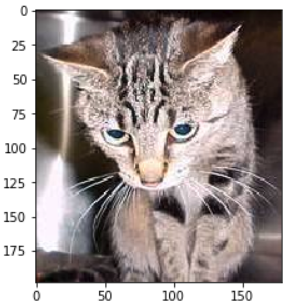

*   `f'{PATH}valid/cats/{files[0]}'` - 这是一个 Python 3.6 格式化字符串，可以方便地格式化字符串。

```py
img.shape

# (198, 179, 3)

img[:4,:4]

'''
array([[[ 29,  20,  23],
        [ 31,  22,  25],
        [ 34,  25,  28],
        [ 37,  28,  31]],
[[ 60,  51,  54],
        [ 58,  49,  52],
        [ 56,  47,  50],
        [ 55,  46,  49]],
[[ 93,  84,  87],
        [ 89,  80,  83],
        [ 85,  76,  79],
        [ 81,  72,  75]],
[[104,  95,  98],
        [103,  94,  97],
        [102,  93,  96],
        [102,  93,  96]]], dtype=uint8)
'''
```

*   `img`是一个三维数组（又名 3 维张量）
*   这三个维度（例如`[29, 20, 23]`）表示 0 到 255 之间的红绿蓝像素值
*   我们的想法是利用这些数字来预测这些数字是代表猫还是狗，基于查看猫和狗的大量图片。
*   这个数据集来自 [Kaggle 竞赛](https://www.kaggle.com/c/dogs-vs-cats)，当它发布时（早在 2013 年），最先进的技术准确率为 80%。

让我们训练一个模型 [[20:21](https://youtu.be/IPBSB1HLNLo%3Ft%3D20m21s)]

以下是训练模型所需的三行代码：

```py
data = ImageClassifierData.from_paths(PATH, tfms=tfms_from_model(resnet34, sz))  
learn = ConvLearner.pretrained(resnet34, data, precompute= True )  
learn.fit (0.01, 3) 

'''
[ 0.       0.04955  0.02605  0.98975]                         
[ 1.       0.03977  0.02916  0.99219]                         
[ 2.       0.03372  0.02929  0.98975]
'''
```

*   这将执行 3 个迭代，这意味着它将三次查看整个图像集。
*   输出中的三个数字中的最后一个是验证集上的准确度。
*   前两个是训练集和验证集的损失函数值（在这种情况下是交叉熵损失）。
*   开始（例如，`1.`）是迭代数。
*   我们通过 3 行代码在 17 秒内达到了 ~99% （这将在 2013 年赢得 Kaggle 比赛）！[[21:49](https://youtu.be/IPBSB1HLNLo%3Ft%3D21m49s)]
*   很多人都认为深度学习需要大量的时间，大量的资源和大量的数据 - 一般来说，这不是真的！

## Fast.ai 库[ [22:24](https://youtu.be/IPBSB1HLNLo%3Ft%3D22m24s) ]

*   该库采用了他们可以找到的所有最佳实践和方法 - 每次出现看起来很有趣的论文时，他们会对其进行测试，如果它适用于各种数据集，并且他们可以弄清楚如何调整它，它会在库中实现。
*   Fast.ai 将所有这些策略的最佳实践打包，并且大部分时间都会找出自动处理事物的最佳方法。
*   Fast.ai 位于名为 PyTorch 的库之上，这是一个由 Facebook 编写的非常灵活的深度学习，机器学习 GPU 计算库。
*   大多数人比 PyTorch 更熟悉 TensorFlow，但 Jeremy 现在知道的大多数顶级研究人员已经转向 PyTorch。
*   Fast.ai 非常灵活，您可以根据需要尽可能多地使用所有这些策略的最佳实践。 在任何时候都很容易使用并编写自己的数据增强，损失函数，网络架构等，我们将在本课程中学习所有内容。

## 分析结果 [[24:21](https://youtu.be/IPBSB1HLNLo%3Ft%3D24m12s)] 

这就是验证数据集的标签（将其视为正确答案）的样子：

```py
data.val_y 

# array([0, 0, 0, ..., 1, 1, 1]) 
```

这些 0 和 1 代表什么？

```py
data.classes 

# ['cats', 'dogs'] 
```

*   `data`包含验证和训练数据
*   `learn`包含模型

让我们对验证集进行预测（预测结果使用对数缩放）：

```py
log_preds = learn.predict()  
log_preds.shape 

# (2000, 2)

log_preds[:10] 

'''
array([[ -0.00002, -11.07446],
       [ -0.00138,  -6.58385],
       [ -0.00083,  -7.09025],
       [ -0.00029,  -8.13645],
       [ -0.00035,  -7.9663 ],
       [ -0.00029,  -8.15125],
       [ -0.00002, -10.82139],
       [ -0.00003, -10.33846],
       [ -0.00323,  -5.73731],
       [ -0.0001 ,  -9.21326]], dtype=float32)
```

*   输出表示猫的预测和狗的预测

```py
preds = np.argmax(logpreds, axis=1) 
# from log probabilities to 0 or 1  
probs = np.exp(logpreds[:,1]) 
# pr(dog) 
```

*   在 PyTorch 和 Fast.ai 中，大多数模型返回预测的对数而不是概率本身（我们将在后面的课程中了解原因）。 现在，只知道要获得概率，你必须执行`np.exp()`

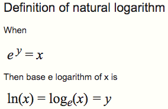

*   确保你熟悉 numpy（`np`）

```py
# 1. A few correct labels at random 
plo_tval_with_title(rand_by_correct( **True** ), "Correctly classified") 
```

*   图像上方的数字是成为狗的概率

```py
# 2. A few incorrect labels at random  
plot_val_with_title(rand_by_correct( **False** ), "Incorrectly classified") 
```

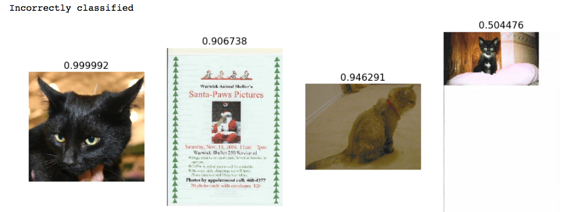

```py
plot_val_with_title(most_by_correct(0, True ), "Most correct cats") 
```

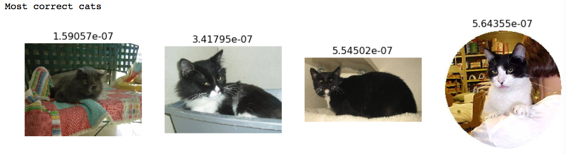

```py
plot_val_with_title(most_by_correct(1, True ), "Most correct dogs") 
```

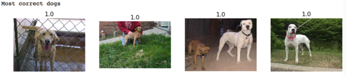

更有趣的是，这里的模型认为它绝对是一只狗，但结果却是一只猫，反之亦然：

```py
plot_val_with_title(most_by_correct(0, False ), "Most incorrect cats") 
```


```py
plot_val_with_title(most_by_correct(1, False ), "Most incorrect dogs") 
```

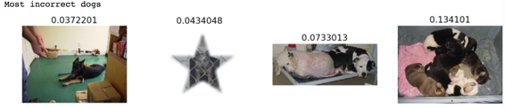

```py
most_uncertain = np.argsort(np.abs(probs -0.5))[:4]  
plot_val_with_title(most_uncertain, "Most uncertain predictions") 
```

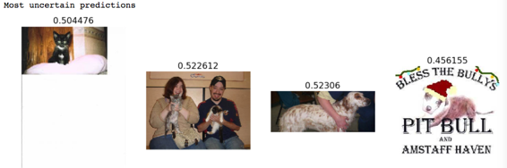

*   为什么查看这些图像很重要？ Jeremy 在构建模型后所做的第一件事，就是找到一种可视化其模型的方法。 因为如果他想让模型变得更好，那么他需要保持做得好的类别，降低那些做得很糟糕的类别。
*   在这种情况下，我们已经了解了有关数据集本身的一些信息，即这里有一些可能不应该存在的图像。 但同样清楚的是，这种模式还有改进的余地（例如数据增强 - 我们将在后面介绍）。
*   现在您已准备好构建自己的图像分类器（对于常规照片 - 除了 CT 扫描）！ 例如，[这是其中一个学生的作品](https://towardsdatascience.com/fun-with-small-image-data-sets-8c83d95d0159)。
*   查看[此论坛帖子](http://forums.fast.ai/t/understanding-softmax-probabilities-output-on-a-multi-class-classification-problem/8194) ，了解可视化结果的不同方式（例如，当有超过 2 个类别时等）


## 自上而下与自下而上 [[30:52](https://youtu.be/IPBSB1HLNLo%3Ft%3D30m52s)]

自下而上：了解你需要的每个积木，并最终将它们组合在一起

*   很难保持动力
*   很难知道“大局”
*   很难知道你真正需要的积木

fast.ai：让学生立即使用神经网络，尽快获得结果

*   逐层拨开，修改，最终看到核心

## 课程结构 [[33:53](https://youtu.be/IPBSB1HLNLo%3Ft%3D33m53s)] 

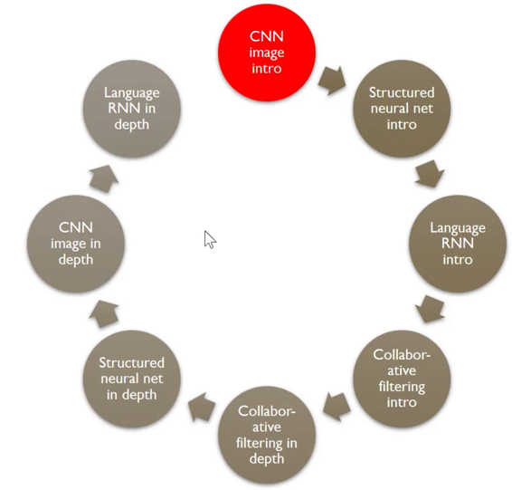

1.  深度学习的图像分类器（代码最少）
2.  多标签分类和不同类型的图像（例如卫星图像）
3.  结构化数据（例如销售预测） - 结构化数据来自数据库或电子表格
4.  语言：NLP 分类器（例如电影评论分类）
5.  协同过滤（例如推荐引擎）
6.  生成语言模型：如何从头开始逐字编写自己的尼采哲学
7.  回到计算机视觉 - 不仅识别猫照片，而是找到猫在照片中的位置（热力图），还学习如何从头开始编写我们自己的架构（ResNet）

## 图像分类器示例：

图像分类算法对很多东西很有用。

*   例如，AlphaGo [ [42:20](https://youtu.be/IPBSB1HLNLo%3Ft%3D42m20s) ] 看了成千上万的棋盘，每个都有一个标签，说明棋盘是否最终成为赢家。 因此，它学会了一种图像分类，能够看到一块棋盘，并弄清楚它是好还是坏 - 这是玩得好的最重要的一步：知道哪个动作更好。
*   另一个例子是早期的学生创建了[鼠标移动图像的图像分类器](https://www.splunk.com/blog/2017/04/18/deep-learning-with-splunk-and-tensorflow-for-security-catching-the-fraudster-in-neural-networks-with-behavioral-biometrics.html)，并检测欺诈性交易。

## 深度学习≠机器学习 [[44:26](https://youtu.be/IPBSB1HLNLo%3Ft%3D44m26s)] 

*   深度学习是一种机器学习
*   机器学习是由 Arthur Samuel 发明的。 在 50 年代后期，他通过发明机器学习，使用一台 IBM 大型机，可以更好地玩跳棋。 他让大型机多次与自己对抗，并弄清楚哪种东西能够取得胜利，并在某种程度上用它来编写自己的程序。 1962 年，Arthur Samuel 说，有一天，绝大多数计算机软件将使用这种机器学习方法，而不是手工编写。
*   C-Path（计算病理学家） [[45:42](https://youtu.be/IPBSB1HLNLo%3Ft%3D45m42s)] 是传统机器学习方法的一个例子。 他拍摄了乳腺癌活组织检查的病理学幻灯片，咨询了许多病理学家，哪些类型的模式或特征可能与长期存活相关。 然后他们编写专家算法来计算这些特征，通过逻辑回归进行运算，并预测存活率。 它的表现优于病理学家，但是需要花费领域专家和计算机专家多年的工作才能建立起来。

## 更好的方式 [[47:35](https://youtu.be/IPBSB1HLNLo%3Ft%3D47m35s)] 


*   具有这三个属性的一类算法是深度学习。

## 无限灵活的函数：神经网络 [[48:43](https://youtu.be/IPBSB1HLNLo%3Ft%3D48m43s)] 

深度学习使用的底层函数称为神经网络：

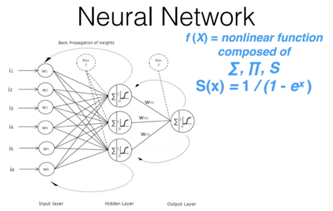

*   你现在需要知道的是，它由许多简单的线性层组成，其中散布着许多简单的非线性层。 当你散布这些层时，你会得到一种称为通用近似定理的东西。 通用近似定理所说的是，只要添加足够的参数，这种函数就可以以任意精度，解决任何给定的问题。

## 通用参数拟合：梯度下降 [[49:39](https://youtu.be/IPBSB1HLNLo%3Ft%3D49m39s)] 

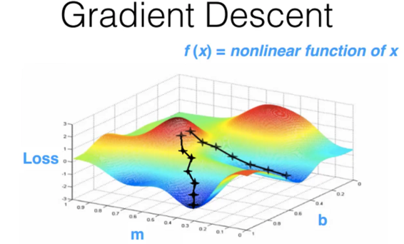

## 快速且可扩展：GPU [[51:05](https://youtu.be/IPBSB1HLNLo%3Ft%3D51m5s)] 

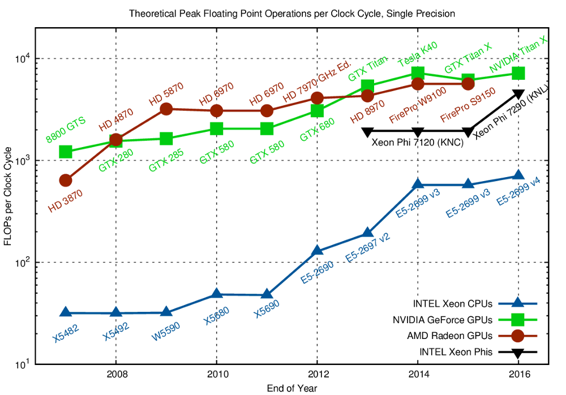

上面显示的神经网络示例具有一个隐藏层。 我们在过去几年中学到的东西是，这些神经网络不是快速或可扩展的，除非我们添加了多个隐藏层 - 因此称为“深度”学习。

## 全部放在一起 [[53:40](https://youtu.be/IPBSB1HLNLo%3Ft%3D53m40s)] 

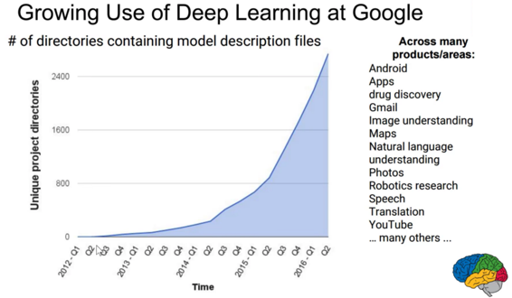

以下是一些示例：

*   [https://research.googleblog.com/2015/11/computer-respond-to-this-email.html](https://research.googleblog.com/2015/11/computer-respond-to-this-email.html)
*   [https://deepmind.com/blog/deepmind-ai-reduces-google-data-centre-cooling-bill-40/](https://deepmind.com/blog/deepmind-ai-reduces-google-data-centre-cooling-bill-40/)
*   [https://www.skype.com/en/features/skype-translator/](https://www.skype.com/en/features/skype-translator/)
*   [https://arxiv.org/abs/1603.01768](https://arxiv.org/abs/1603.01768)

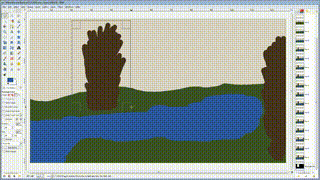

## 诊断肺癌 [[56:55](https://youtu.be/IPBSB1HLNLo%3Ft%3D56m55s)] 


其他目前的应用：

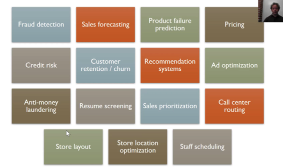

## 卷积神经网络 [[59:13](https://youtu.be/IPBSB1HLNLo%3Ft%3D59m13s)] 

## 线性层

[http://setosa.io/ev/image-kernels/](http://setosa.io/ev/image-kernels/)

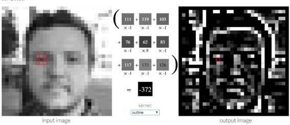

## 非线性层 [[01:02:12](https://youtu.be/IPBSB1HLNLo%3Ft%3D1h2m12s)] 

[**神经网络和深度学习**](http://neuralnetworksanddeeplearning.com/chap4.html)

[在本章中，我给出了普遍性定理的简单和几乎视觉上的解释。](http://neuralnetworksanddeeplearning.com/chap4.html) [我们将一步一步地进行... neuralnetworksanddeeplearning.com](http://neuralnetworksanddeeplearning.com/chap4.html)

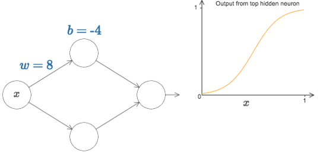

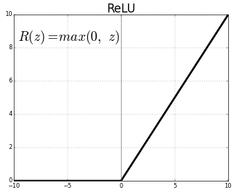

Sigmoid 和 ReLU

*   线性层和逐元素非线性函数的组合，允许我们创建任意复杂的形状 - 这是通用近似定理的本质。

## 如何设置这些参数来解决问题 [[01:04:25](https://youtu.be/IPBSB1HLNLo%3Ft%3D1h4m25s)] 

*   随机梯度下降 - 我们沿着山坡走小步。 步长称为**学习率**

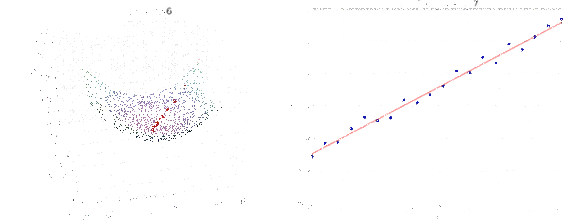

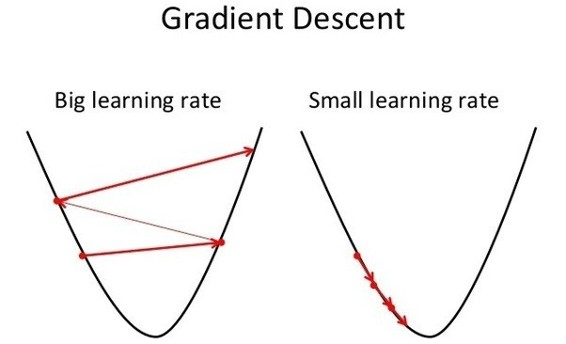

*   如果学习率太大，它将发散而不是收敛
*   如果学习率太小，则收敛过慢

## 可视化和理解卷积网络 [[01:08:27](https://youtu.be/IPBSB1HLNLo%3Ft%3D1h8m27s)] 

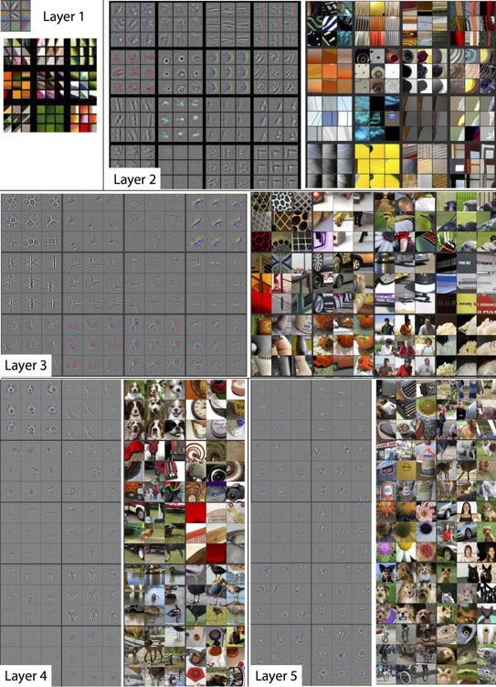

我们从一些非常简单的东西开始，但如果有足够大的规模，由于通用近似定理和在深度学习中使用多个隐藏层，我们实际上获得了非常丰富的功能。 这实际上是训练我们的猫狗识别器时，我们使用的东西。

## 猫狗识别的回顾 - 选择学习率 [[01:11:41](https://youtu.be/IPBSB1HLNLo%3Ft%3D1h11m41s)] 

```py
learn.fit(0.01, 3) 
```

*   第一个数字`0.01`是学习率。
*   **学习率**决定了您想要更新**权重**（或**参数**）的速度。 学习率是最难设置的参数之一，因为它会显着影响模型表现。
*   方法`learn.lr_find()`可帮助您找到最佳学习率。 它使用 2015 年论文 [“用于训练神经网络循环学习率”](http://arxiv.org/abs/1506.01186)中开发的技术，我们只需将学习率从非常小的值提高，直到损失停止下降。 我们可以绘制不同批次的学习率，看看它是什么样的。

```py
learn = ConvLearner.pretrained(arch, data, precompute=True)  
learn.lr_find() 
```

我们的`learn`对象包含属性`sched` ，其中包含我们的学习率调度器，并具有一些方便的绘图功能，包括以下内容：

```py
learn.sched.plot_lr() 
```

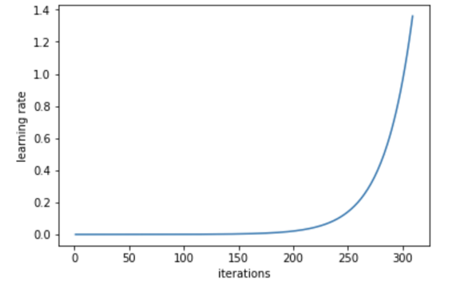

*   Jeremy 目前正在尝试以指数方式和线性方式提高学习率。

我们可以看到损失与学习率的关系，看看我们的损失在哪里停止下降：

```py
learn.sched.plot() 
```

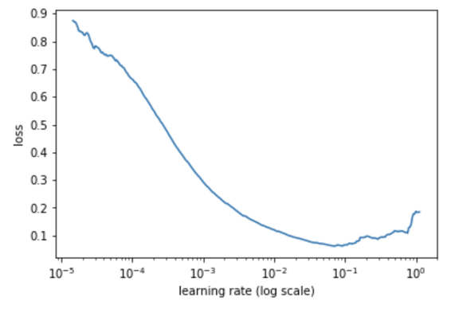

*   然后我们选择损失仍在明显改善的学习率，- 在这种情况下是`1e-2`（0.01）

## 选择迭代数量 [[1:18:49](https://youtu.be/IPBSB1HLNLo%3Ft%3D1h18m49s)] 

```py
[ 0.       0.04955  0.02605  0.98975]                         
[ 1.       0.03977  0.02916  0.99219]                         
[ 2.       0.03372  0.02929  0.98975]
```

*   按照你的希望尽可能多，但如果你运行太久，准确率可能会变得更糟。 它被称为“过拟合”，我们稍后会详细了解它。
*   另一个考虑因素是你可以使用的时间。

## 提示与技巧 [[1:21:40](https://youtu.be/IPBSB1HLNLo%3Ft%3D1h21m40s)] 

**1.** `Tab` - 当你忘记函数名称时，它将自动补全

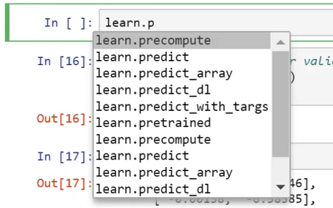

**2.** `Shift + Tab` - 它将显示函数的参数

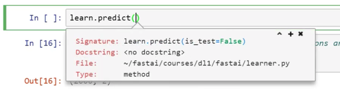

**3.** `Shift + Tab + Tab` - 它将显示一个文档（即文档字符串）

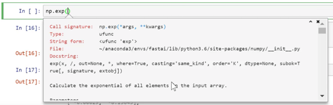

**4.** `Shift + Tab + Tab + Tab` - 它将打开一个具有相同信息的单独窗口。

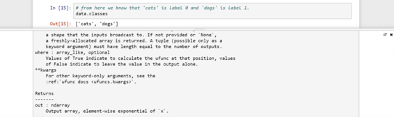

键入`?`后跟一个单元格中的函数名称并运行它，将和`shift + tab`（三次）执行相同操作

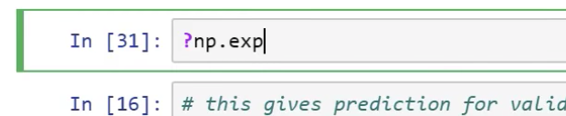

**5.** 键入两个问号将显示源代码

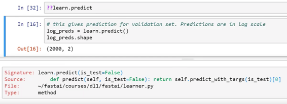

**6.** 在 Jupyter Notebook 中键入`H`将打开一个带有键盘快捷键的窗口。 尝试每天学习 4 或 5 个快捷方式

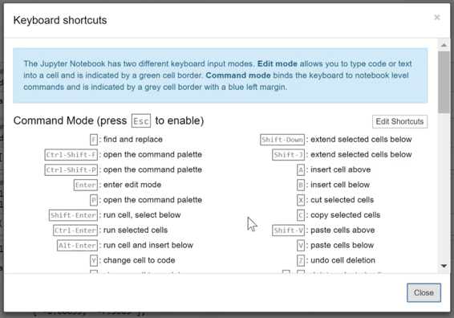

**7.** 停止 Paperspace，Crestle，AWS - 否则你将付巨额账单

**8.** 请记住[论坛](http://forums.fast.ai/)和[课程](http://course.fast.ai/)来获取最新信息。
