# 深度学习：第二部分第十一课

### 链接

[**论坛**](http://forums.fast.ai/t/part-2-lesson-11-in-class/14699/1) **/** [**视频**](https://youtu.be/tY0n9OT5_nA)

### 开始之前：

*   Sylvain Gugger的1循环[政策](https://sgugger.github.io/the-1cycle-policy.html) 。 基于Leslie Smith的新论文，该论文采用了前两篇关键论文（循环学习率和超级收敛），并在其基础上进行了大量实验，以展示如何实现超收敛。 超级收敛使你可以比以前的逐步方法快五倍地训练模型（并且比CLR快，尽管它不到五次）。 超级融合让你可以在1到3之间达到高学习率。超融合的有趣之处在于，你可以在相当大的一部分时期内以极高的学习率进行训练，在此期间，失去的不是真的非常好。 但诀窍在于它正在通过空间进行大量搜索，以找到看似真正具有普遍性的区域。 Sylvain通过刷新丢失的部分在fastai实施了它，然后确认他实际上在CIFAR10的训练上实现了超级融合。 它目前称为`use_clr_beta`但将来会重命名。 他还为fastai库增添了周期性的动力。
*   [如何使用](https://towardsdatascience.com/how-to-create-data-products-that-are-magical-using-sequence-to-sequence-models-703f86a231f8) Hamel Husain的[序列到序列模型创建神奇的数据产品](https://towardsdatascience.com/how-to-create-data-products-that-are-magical-using-sequence-to-sequence-models-703f86a231f8) 。 他在博客上写了关于训练模型以总结GitHub问题的文章。 以下是基于他的博客创建的Kubeflow团队[演示](http://gh-demo.kubeflow.org/) 。

### 神经机器翻译 [[5:36](https://youtu.be/tY0n9OT5_nA%3Ft%3D5m36s)] 

让我们构建一个序列到序列的模型！ 我们将致力于机器翻译。 机器翻译已经存在了很长时间，但是我们将研究一种使用神经网络进行翻译的神经翻译方法。 神经机器翻译出现在几年前，它不如使用经典特征工程和标准NLP方法的统计机器翻译方法一样好，如词干，摆弄单词频率，n-gram等。一年后，它比其他一切都好。 它基于一个名为BLEU的度量标准 - 我们不会讨论该度量标准，因为它不是一个非常好的度量标准，并且它不是很有趣，但每个人都使用它。

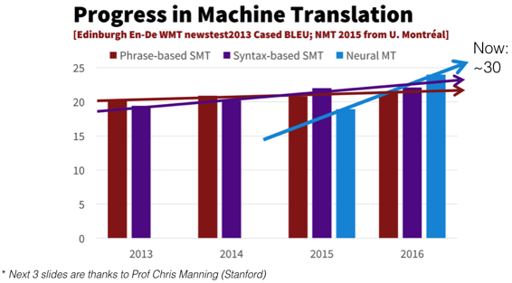

我们看到机器翻译开始沿着我们在2012年开始计算机视觉对象分类的路径开始，该路径刚刚超过了现有技术并且现在以极快的速度拉开了它。 任何观看此操作的人都不太可能真正构建机器翻译模型，因为[https://translate.google.com/](https://translate.google.com/)可以很好地运行。 那么我们为什么要学习机器翻译呢？ 我们学习机器翻译的原因在于，将法语中的某种输入作为句子并将其转换为任意长度的其他类型输出（例如英语句子）的一般想法是非常有用的。 例如，正如我们刚刚看到的那样，Hamel将GitHub问题转化为摘要。 另一个例子是拍摄视频并将其转换为描述，或者基本上是任何你正在输出任意大小的输出的东西，这通常是一个句子。 也许进行CT扫描并输出放射学报告 - 这是你可以使用序列来排序学习的地方。

#### 神经机器翻译的四大胜利 [[8:36](https://youtu.be/tY0n9OT5_nA%3Ft%3D8m36s)] 

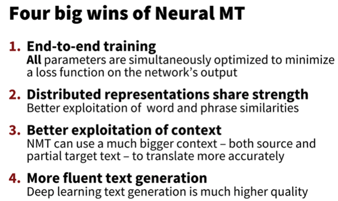

*   端到端训练：没有充分利用启发式和hacky功能工程。
*   我们能够构建这些分布式表示，这些表示由单个网络中的许多概念共享。
*   我们能够在RNN中使用长期状态，因此它比n-gram类型方法使用更多的上下文。
*   最后，我们生成的文本也使用RNN，因此我们可以构建更流畅的东西。

#### BiLSTMs（+ Attn）不仅适用于神经MT  [[9:20](https://youtu.be/tY0n9OT5_nA%3Ft%3D9m20s)] 

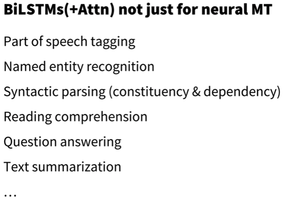

我们将注意使用双向GRU（基本上与LSTM相同） - 如上所述，这些一般性想法也可以用于许多其他事情。

#### 让我们跳进代码 [[9:47](https://youtu.be/tY0n9OT5_nA%3Ft%3D9m47s)] 

[笔记本](https://github.com/fastai/fastai/blob/master/courses/dl2/translate.ipynb)

我们将尝试按照标准的神经网络方法将法语翻译成英语：

1.  数据
2.  建筑
3.  损失函数

#### 1.数据

像往常一样，我们需要`(x, y)`对。 在这种情况下，x：法语句子，y：英语句子，你将比较你的预测。 我们需要大量的这些法语句子元组及其等效的英语句子 - 被称为“平行语料库”，并且比语言模型的语料库更难找到。 对于语言模型，我们只需要某种语言的文本。 对于任何生活语言，至少有几千兆字节的文字漂浮在互联网上供你抓取。 对于翻译，有一些非常好的平行语料库可用于欧洲语言。 欧洲议会在每种欧洲语言中都有一句话。 任何流向联合国的东西都被翻译成许多语言。 对于法语到英语，我们有特别好的东西，几乎任何半官方的加拿大网站都有法语版和英文版 [[12:13](https://youtu.be/tY0n9OT5_nA%3Ft%3D12m13s)] 。

#### 翻译文件

```
 **from** **fastai.text** **import** * 
```

来自[http://www.statmt.org/wmt15/translation-task.html的](http://www.statmt.org/wmt15/translation-task.html)法语/英语并行文本。 它由Chris Callison-Burch创建，他抓取了数百万个网页，然后使用_一套简单的启发法将法语网址转换为英文网址（即将“fr”替换为“en”和其他约40个其他手写规则），并假设这些文件是彼此的翻译_ 。

```
 PATH = Path('data/translate')  TMP_PATH = PATH/'tmp'  TMP_PATH.mkdir(exist_ok= **True** )  fname='giga-fren.release2.fixed'  en_fname = PATH/f' **{fname}** .en'  fr_fname = PATH/f' **{fname}** .fr' 
```

对于边框，所有有趣的东西都在损失函数中，但对于神经翻译，所有有趣的东西都将在他的体系结构中 [[13:01](https://youtu.be/tY0n9OT5_nA%3Ft%3D13m1s)] 。 让我们快速完成这一切，杰里米希望你特别考虑的事情之一就是我们正在做的任务以及我们如何在语言建模与神经翻译之间做到这一点的关系或相似之处。

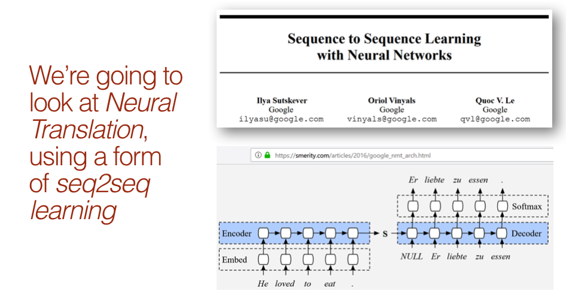

第一步是完成我们在语言模型中所做的完全相同的事情，这是一个句子，并通过RNN  [[13:35](https://youtu.be/tY0n9OT5_nA%3Ft%3D13m35s)] 。

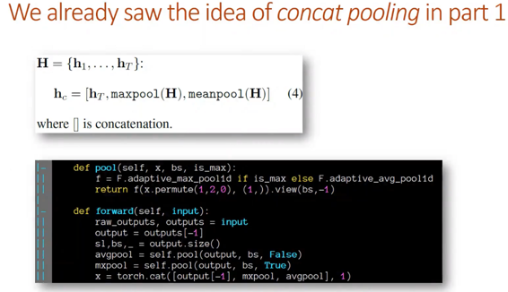

现在有了分类模型，我们有了一个解码器，它接受了RNN输出并抓住了三个东西：所有时间步骤的`maxpool`和`meanpool` ，以及最后一步的RNN值，将所有这些叠加在一起并通过它线性层 [[14:24](https://youtu.be/tY0n9OT5_nA%3Ft%3D14m24s)] 。 大多数人不这样做，只使用最后一步，所以我们今天要讨论的所有事情都使用最后一步。

我们首先通过RNN清除输入句子，然后从中出现一些“隐藏状态”（即一些向量，表示编码句子的RNN的输出）。

#### 编码器≈骨干 [[15:18](https://youtu.be/tY0n9OT5_nA%3Ft%3D15m18s)] 

斯蒂芬使用“编码器”这个词，但我们倾向于使用“骨干”这个词。 就像我们谈到为现有模型添加自定义头部时一样，例如，现有的预先训练过的ImageNet模型，我们说这是我们的支柱，然后我们会在它上面坚持一些能够完成我们想要的任务的头部。 顺序学习序列，他们使用单词编码器，但它基本上是相同的东西 - 它是一个神经网络架构的一部分，它接受输入并将其转换为一些表示，然后我们可以在顶部粘贴更多层从我们为分类器中抓取一些东西，我们在分类器上堆叠一个线性层，将int变成情绪。 但这一次，我们有一些东西比创造情绪更难 [[16:12](https://youtu.be/tY0n9OT5_nA%3Ft%3D16m12s)] 。 我们不是将隐藏状态转变为正面或负面情绪，而是将其变成一系列标记，其中标记序列是斯蒂芬的例子中的德语句子。

这听起来更像是语言模型而不是分类器，因为语言有多个标记（对于每个输入词，都有一个输出词）。 但语言模型也更容易，因为语言模型输出中的标记数量与语言模型输入中的标记数量相同。 它们不仅长度相同，而且它们完全匹配（例如，在第一个词出现第二个词之后，第二个词出现第三个词，依此类推）。 对于翻译语言，你不一定知道单词“he”将被翻译为输出中的第一个单词（不幸的是，在这种特殊情况下）。 通常情况下，主题对象顺序会有所不同，或者会插入一些额外的单词，或者我们需要添加一些性别文章等一些代词。这是我们要处理的关键问题是我们有一个任意长度的输出，其中输出中的标记不对应于输入中的相同顺序或特定标记 [[17:31](https://youtu.be/tY0n9OT5_nA%3Ft%3D17m31s)] 。 但总体思路是一样的。 这是一个对输入进行编码的RNN，将其转换为某种隐藏状态，然后我们要学习的新事物就是生成一个序列输出。

#### 序列输出 [[17:47](https://youtu.be/tY0n9OT5_nA%3Ft%3D17m47s)] 

我们已经知道了：

*   序列到类（IMDB分类器）
*   序列到等长序列（语言模型）

但是我们还不知道如何做一个通用序列来排序，所以这就是今天的新事物。 除非你真正理解第6课RNN是如何工作的，否则这一点很有意义。

#### 快速回顾[第6课](https://medium.com/%40hiromi_suenaga/deep-learning-2-part-1-lesson-6-de70d626976c)  [[18:20](https://youtu.be/tY0n9OT5_nA%3Ft%3D18m20s)] 

我们了解到RNN的核心是标准的完全连接网络。 下面是一个有4层 - 一个输入并通过四层，但在第二层，它连接在第二个输入，第三层连接在第三个输入，但我们实际上在Python中写了这只是一个四层神经网络。 除线性层和ReLU之外，我们没有使用任何其他内容。 每当输入进入时我们使用相同的权重矩阵，每当我们从一个隐藏状态进入下一个状态时我们使用相同的矩阵 - 这就是为什么这些箭头是相同的颜色。

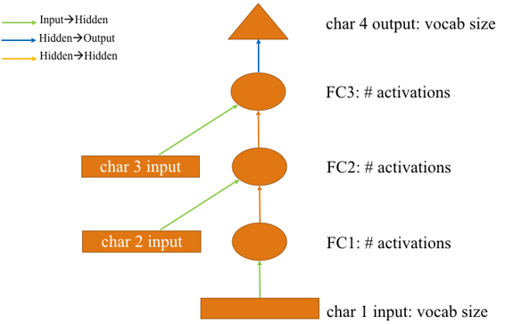

我们可以像下面 [[19:29](https://youtu.be/tY0n9OT5_nA%3Ft%3D19m29s)] 重新绘制上面的图表。

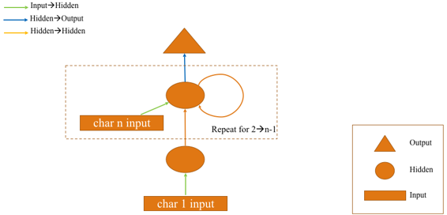

我们不仅重新绘制它，而且我们在PyTorch中使用了四行线性线性线性线性代码，我们用for循环替换它。 记住，我们有一些与下面完全相同的东西，但它只有四行代码说`self.l_in(input)` ，我们用for循环替换它，因为这很好重构。 不改变任何数学，任何想法或任何输出的重构是RNN。 它将代码中的一堆独立行转换为Python for循环。

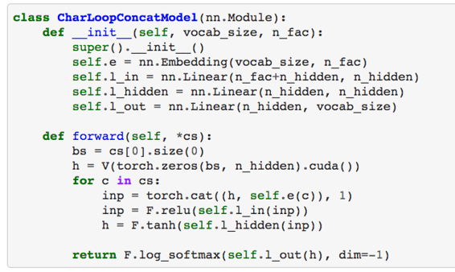

我们可以获取输出，使其不在循环之外并将其放入循环 [[20:25](https://youtu.be/tY0n9OT5_nA%3Ft%3D20m25s)] 。 如果我们这样做，我们现在将为每个输入生成一个单独的输出。 上面的代码，隐藏状态每次都被替换，我们最终只是输出最后的隐藏状态。 但是，如果相反，我们有一些东西说`hs.append(h)`并在最后返回`hs` ，这将是下图。

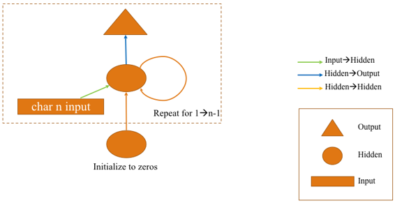

要记住的主要事情是，当我们说隐藏状态时，我们指的是一个向量 - 技术上是小批量中每个东西的向量，所以它是一个矩阵，但通常当杰里米谈到这些东西时，他忽略了小批量只需一件物品即可。

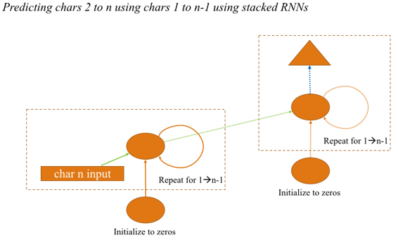

我们还了解到你可以将这些层叠在一起 [[21:41](https://youtu.be/tY0n9OT5_nA%3Ft%3D21m41s)] 。 因此，不是左边的RNN（在上图中）输出输出，它们只能将输入输出到第二个RNN中。 如果你正在考虑这一点“我想我理解这一点，但我不太确定”这意味着你不理解这一点。 你知道自己真正了解它的唯一方法就是在PyTorch或Numpy中从头开始编写。 如果你不能这样做，那么你知道你不理解它，你可以回去重新观看第6课，看看笔记本并复制一些想法，直到你可以。 从头开始编写代码非常重要 - 它不仅仅是代码屏幕。 因此，你需要确保可以创建2层RNN。 下面是展开它的样子。

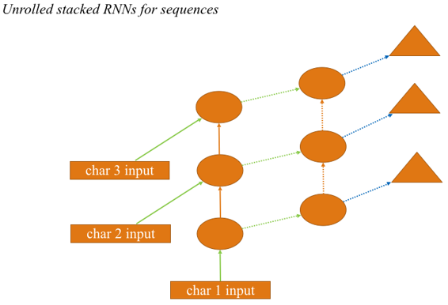

为了得到我们有（x，y）对句子的点，我们将从下载数据集 [[22:39](https://youtu.be/tY0n9OT5_nA%3Ft%3D22m39s)] 开始。 训练翻译模型需要很长时间。 谷歌的翻译模型有八层RNN叠加在一起。 八层和两层之间没有概念上的区别。 如果你是Google，并且你拥有的GPU或TPU比你知道的更多，那么你可以这样做。 在其他情况下，在我们的情况下，很可能我们正在构建的序列模型的序列类型不需要那么级别的计算。 所以为了简单[起见](https://youtu.be/tY0n9OT5_nA%3Ft%3D23m22s)  [[23:22](https://youtu.be/tY0n9OT5_nA%3Ft%3D23m22s)] ，让我们做一个简单的事情，而不是学习如何将法语翻译成英语用于任何句子，让我们学习将法语问题翻译成英语问题 - 特别是从什么/哪里开始的问题/哪个/时。 所以这是一个正则表达式，它寻找以“wh”开头并以问号结尾的内容。

```
 re_eq = re.compile('^(Wh[^?.!]+\?)')  re_fq = re.compile('^([^?.!]+\?)') 
```

```
 lines = ((re_eq.search(eq), re_fq.search(fq))  **for** eq, fq **in** zip(open(en_fname, encoding='utf-8'),  open(fr_fname, encoding='utf-8'))) 
```

```
 qs = [(e.group(), f.group()) **for** e,f **in** lines **if** e **and** f] 
```

我们通过语料库 [[23:43](https://youtu.be/tY0n9OT5_nA%3Ft%3D23m43s)] ，打开两个文件中的每一个，每行是一个平行文本，将它们压缩在一起，抓住英语问题和法语问题，并检查它们是否与正则表达式匹配。

```
 pickle.dump(qs, (PATH/'fr-en-qs.pkl').open('wb'))  qs = pickle.load((PATH/'fr-en-qs.pkl').open('rb')) 
```

把它作为一个泡菜倾倒，所以我们不必再这样做，所以现在我们有52,000个句子对，这里有一些例子：

```
 qs[:5], len(qs) 
```

```
 _([('What is light ?', 'Qu'est-ce que la lumière?'),_  _('Who are we?', 'Où sommes-nous?'),_  _('Where did we come from?', "D'où venons-nous?"),_  _('What would we do without it?', 'Que ferions-nous sans elle ?'),_  _('What is the absolute location (latitude and longitude) of Badger, Newfoundland and Labrador?',_  _'Quelle sont les coordonnées (latitude et longitude) de Badger, à Terre-Neuve-etLabrador?')],_  _52331)_ 
```

关于这一点的一个[好处](https://youtu.be/tY0n9OT5_nA%3Ft%3D24m8s)是什么/谁/哪里类型问题往往相当短 [[24:08](https://youtu.be/tY0n9OT5_nA%3Ft%3D24m8s)] 。 但我们可以从头开始学习，而不是先前对语言的概念有所了解的想法，更不用说英语或法语了，我们可以创建一些可以将任意一个问题翻译成另一个只有50k句子的话，这听起来像一个非常难以理解的事情要求这样做。 如果我们能够取得任何进展，那将是令人印象深刻的。 这是一项非常少的数据，可以进行非常复杂的练习。

`qs`包含法语和英语的元组 [[24:48](https://youtu.be/tY0n9OT5_nA%3Ft%3D24m48s)] 。 你可以使用这个方便的习惯用法将它们分成英语问题列表和法语问题列表。

```
 en_qs,fr_qs = zip(*qs) 
```

然后我们将英语问题标记出来并将法语问题分词。 所以请记住，只是意味着将它们分成单独的单词或类似单词的东西。 默认情况下 [[25:11](https://youtu.be/tY0n9OT5_nA%3Ft%3D25m11s)] ，我们在这里使用的分词器（记住这是一个围绕spaCy分词器的包装器，这是一个很棒的分词器）假设是英文。 所以要求法语，你只需添加一个额外的参数`'fr'` 。 第一次执行此操作时，你将收到一条错误消息，指出你没有安装spaCy French模型，因此你可以运行`python -m spacy download fr`来获取法语模型。

```
 en_tok = Tokenizer.proc_all_mp(partition_by_cores(en_qs)) 
```

```
 fr_tok = Tokenizer.proc_all_mp(partition_by_cores(fr_qs), 'fr') 
```

你不可能在这里遇到RAM问题，因为这不是特别大的语料库，但有些学生在本周试图训练一种新的语言模型并且有RAM问题。 如果你这样做，那么值得知道这些函数（ `proc_all_mp` ）实际上在做什么。 `proc_all_mp`正在处理多个进程中的每个句子 [[25:59](https://youtu.be/tY0n9OT5_nA%3Ft%3D25m59s)] ：

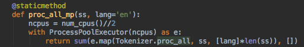

上面的函数找出你有多少CPU，除以2（因为通常使用超线程它们实际上并不都是并行工作），然后并行运行这个`proc_all`函数。 因此，这将为你拥有的每个CPU输出一个完整的Python进程。 如果你有很多内核，那就是很多Python进程 - 每个人都会加载所有这些数据，这可能会耗尽你所有的内存。 所以你可以用`proc_all`替换它而不是`proc_all_mp`来使用更少的RAM。 或者你可以使用更少的核心。 目前，我们正在调用`partition_by_cores` ，它调用列表中的`partition` ，并根据你拥有的CPU数量要求将其拆分为多个相等长度的内容。 因此，你可以将其替换为拆分为较小的列表，并在较少的事情上运行它。

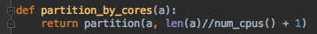

将英语和法语分词后，你可以看到它如何分裂 [[28:04](https://youtu.be/tY0n9OT5_nA%3Ft%3D28m4s)] ：

```
 en_tok[0], fr_tok[0] 
```

```
 (['what', 'is', 'light', '?'],  ['qu'', 'est', '-ce', 'que', 'la', 'lumière', '?']) 
```

你可以看到法语的分词看起来完全不同，因为法国人喜欢他们的撇号和连字符。 因此，如果你尝试使用英语标记符来表示法语句子，那么你将获得非常糟糕的结果。 你不需要知道大量的NLP思想来使用NLP的深度学习，但只是为你的语言使用正确的分词器这些基本的东西很重要 [[28:23](https://youtu.be/tY0n9OT5_nA%3Ft%3D28m23s)] 。 本周我们学习小组的一些学生一直在尝试为中文实例建立语言模型，当然这些模型并没有真正具有分词器的概念，所以我们一直在开始研究[句子](https://github.com/google/sentencepiece) 。将事物分成任意子字单元，所以当Jeremy说分词时，如果你使用的语言没有空格，你可能应该检查句子或其他类似的子词单位。 希望在接下来的一两周内，我们将能够用中文报​​告这些实验的早期结果。

```
 np.percentile([len(o) **for** o **in** en_tok], 90),  np.percentile([len(o) **for** o **in** fr_tok], 90) 
```

```
 _(23.0, 28.0)_ 
```

```
 keep = np.array([len(o)<30 **for** o **in** en_tok]) 
```

```
 en_tok = np.array(en_tok)[keep]  fr_tok = np.array(fr_tok)[keep] 
```

```
 pickle.dump(en_tok, (PATH/'en_tok.pkl').open('wb'))  pickle.dump(fr_tok, (PATH/'fr_tok.pkl').open('wb')) 
```

```
 en_tok = pickle.load((PATH/'en_tok.pkl').open('rb'))  fr_tok = pickle.load((PATH/'fr_tok.pkl').open('rb')) 
```

因此将其分词 [[29:25](https://youtu.be/tY0n9OT5_nA%3Ft%3D29m25s)] ，我们将其保存到磁盘。 然后记住，我们创建标记后的下一步是将它们变成数字。 要做到这一点，我们有两个步骤 - 第一步是获取所有出现的单词的列表，然后我们将每个单词转换为索引。 如果出现超过40,000个单词，那么让我们将其剪掉，这样就不会太疯狂了。 我们为流（ `_bos_` ），填充（ `_pad_` ），流尾（ `_eos_` ）和未知（ `_unk` ）的开头插入了一些额外的标记。 因此，如果我们试图查找不在40,000最常见的东西，那么我们使用`deraultdict`返回3，这是未知的。

```
 **def** toks2ids(tok,pre):  freq = Counter(p **for** o **in** tok **for** p **in** o)  itos = [o **for** o,c **in** freq.most_common(40000)]  itos.insert(0, '_bos_')  itos.insert(1, '_pad_')  itos.insert(2, '_eos_')  itos.insert(3, '_unk')  stoi = collections.defaultdict( **lambda** : 3,  {v:k **for** k,v **in** enumerate(itos)})  ids = np.array([([stoi[o] **for** o **in** p] + [2]) **for** p **in** tok])  np.save(TMP_PATH/f' **{pre}** _ids.npy', ids)  pickle.dump(itos, open(TMP_PATH/f' **{pre}** _itos.pkl', 'wb'))  **return** ids,itos,stoi 
```

现在我们可以继续将每个标记转换为ID，方法是将它通过字符串`stoi`我们刚刚创建的整数字典（ `stoi` ）中，然后在结尾处添加数字2，这是流的结尾。 你在这里看到的代码是Jeremy在迭代和试验时写的代码 [[30:25](https://youtu.be/tY0n9OT5_nA%3Ft%3D30m25s)] 。 因为他在迭代和实验时编写的代码中有99％证明是完全错误或愚蠢或令人尴尬，而你却无法看到它。 但是，当他写这篇文章时，没有点重构并使它变得美丽，所以他希望你能看到他所拥有的所有小捷径。 而不是为`_eos_`标记使用一些常量并使用它，当他进行原型设计时，他只是做了简单的事情。 并非如此，他最终会破坏代码，但他试图在美丽的代码和有效的代码之间找到一些中间立场。

**问** ：刚听到他提到我们将CPU的数量除以2，因为使用超线程，我们无法使用所有超线程内核加速。 这是基于实际经验还是有一些潜在的原因导致我们不能获得额外的加速 [[31:18](https://youtu.be/tY0n9OT5_nA%3Ft%3D31m18s)] ？ 是的，这只是实际经验而且并非所有事情都像这样，但我确实注意到了分词 - 超线程似乎让事情变得缓慢。 此外，如果我使用所有内核，通常我想同时做其他事情（比如运行一些交互式笔记本），我没有任何空余的空间来做这件事。

现在我们的英语和法语，我们可以获取ID列表`en_ids`  [[32:01](https://youtu.be/tY0n9OT5_nA%3Ft%3D32m1s)] 。 当我们这样做时，当然，我们需要确保我们也存储词汇。 如果我们不知道数字5代表什么是没有任何意义，那就没有数字5.这就是我们的词汇表`en_itos`和反向映射`en_stoi` ，我们可以用来转换未来更多的语料库。

```
 en_ids,en_itos,en_stoi = toks2ids(en_tok,'en')  fr_ids,fr_itos,fr_stoi = toks2ids(fr_tok,'fr') 
```

只是为了确认它是否正常工作，我们可以遍历每个ID，将int转换为字符串，然后将其输出来 - 现在我们已经将句子返回到末尾的流结束标记。 我们的英语词汇是17,000，而我们的法语词汇是25,000，所以这不是太大，也不是我们正在处理的太复杂的词汇。

```
 **def** load_ids(pre):  ids = np.load(TMP_PATH/f' **{pre}** _ids.npy')  itos = pickle.load(open(TMP_PATH/f' **{pre}** _itos.pkl', 'rb'))  stoi = collections.defaultdict( **lambda** : 3,  {v:k **for** k,v **in** enumerate(itos)})  **return** ids,itos,stoi 
```

```
 en_ids,en_itos,en_stoi = load_ids('en')  fr_ids,fr_itos,fr_stoi = load_ids('fr') 
```

```
 [fr_itos[o] **for** o **in** fr_ids[0]], len(en_itos), len(fr_itos) 
```

```
 _(['qu'', 'est', '-ce', 'que', 'la', 'lumière', '?', '_eos_'], 17573, 24793)_ 
```

#### 单词向量 [[32:53](https://youtu.be/tY0n9OT5_nA%3Ft%3D32m53s)] 

本周我们在论坛上花了很多时间讨论无意义的单词向量是如何以及如何停止对它们如此兴奋 - 现在我们将使用它们。 为什么？ 我们一直在学习使用语言模型和预训练的适当模型而不是预先训练的线性单层（这是单词向量）的所有内容同样适用于序列到序列。 但杰里米和塞巴斯蒂安开始关注这一点。 对于任何有兴趣创造一些真正新的高度可发表结果的人来说，有一个完整的事情，用预先训练的语言模型排序的整个序列区域还没有被触及。 杰里米认为它会和分类一样好。 如果你正在努力解决这个问题，那么你就会发现一些令人兴奋的东西并希望帮助发布它，Jeremy非常乐意帮助共同撰写论文。 因此，当你有一些有趣的结果时，请随时与我们联系。

在这个阶段，我们没有任何这个，所以我们将使用很少的fastai  [[34:14](https://youtu.be/tY0n9OT5_nA%3Ft%3D34m14s)] 。 我们所拥有的只是单词向量 - 所以让我们至少使用体面的单词向量。 Word2vec是非常古老的单词词向量。 现在有更好的单词向量和fast.text是一个非常好的单词向量源。 有数百种语言可供他们使用，你的语言可能会被表示出来。

fasttext字向量可从[https://fasttext.cc/docs/en/english-vectors.html获得](https://fasttext.cc/docs/en/english-vectors.html)

pytext中没有fasttext Python库，但这是一个方便的技巧 [[35:03](https://youtu.be/tY0n9OT5_nA%3Ft%3D35m3s)] 。 如果有一个GitHub存储库中有一个setup.py和reqirements.txt，你可以在开始时查看`git+`然后将其粘贴到你的`pip install`并且它可以工作。 几乎没有人知道这一点，如果你去快照回购，他们不会告诉你这个 - 他们会说你必须下载它并插入它并等等但你没有。 你可以运行这个：

```
 _# !_ _pip install git+https://github.com/facebookresearch/fastText.git_ 
```

```
 **import** **fastText** **as** **ft** 
```

要使用fastText库，你需要为你的语言下载[fasttext字向量](https://github.com/facebookresearch/fastText/blob/master/pretrained-vectors.md) （下载'bin plus text'文件）。

```
 en_vecs = ft.load_model(str((PATH/'wiki.en.bin'))) 
```

```
 fr_vecs = ft.load_model(str((PATH/'wiki.fr.bin'))) 
```

以上是我们的英语和法语模型。 有文本版本和二进制版本。 二进制版本更快，所以我们将使用它。 文本版本也有点儿麻烦。 我们将把它转换成标准的Python字典，以便更容易使用 [[35:55](https://youtu.be/tY0n9OT5_nA%3Ft%3D35m55s)] 。 这只是通过字典理解来完成每个单词并将其保存为pickle字典：

```
 **def** get_vecs(lang, ft_vecs):  vecd = {w:ft_vecs.get_word_vector(w)  **for** w **in** ft_vecs.get_words()}  pickle.dump(vecd, open(PATH/f'wiki. **{lang}** .pkl','wb'))  **return** vecd 
```

```
 en_vecd = get_vecs('en', en_vecs)  fr_vecd = get_vecs('fr', fr_vecs) 
```

```
 en_vecd = pickle.load(open(PATH/'wiki.en.pkl','rb'))  fr_vecd = pickle.load(open(PATH/'wiki.fr.pkl','rb')) 
```

```
 ft_words = ft_vecs.get_words(include_freq= **True** )  ft_word_dict = {k:v **for** k,v **in** zip(*ft_words)}  ft_words = sorted(ft_word_dict.keys(),  key= **lambda** x: ft_word_dict[x]) 
```

现在我们有了泡菜字典，我们可以继续查找一个单词，例如逗号 [[36:07](https://youtu.be/tY0n9OT5_nA%3Ft%3D36m7s)] 。 这将返回一个向量。 向量的长度是这组单词向量的维数。 在这种情况下，我们有300维英语和法语单词向量。

```
 dim_en_vec = len(en_vecd[','])  dim_fr_vec = len(fr_vecd[','])  dim_en_vec,dim_fr_vec 
```

```
 _(300, 300)_ 
```

由于你将在稍后看到的原因，我们还想知道我们的向量的平均值和标准偏差是什么。 因此平均值约为零，标准差约为0.3。

```
 en_vecs = np.stack(list(en_vecd.values()))  en_vecs.mean(),en_vecs.std() 
```

```
 _(0.0075652334, 0.29283327)_ 
```

#### 模型数据 [[36:48](https://youtu.be/tY0n9OT5_nA%3Ft%3D36m48s)] 

通常语料库具有相当长的序列长度分布，并且它是最长的序列，往往会压倒事情需要多长时间，使用多少内存等等。因此在这种情况下，我们将获得英语的第99百分位数到第97百分位数和法语并将它们截断到那个数量。 最初Jeremy使用了90个百分位数（因此变量名称）：

```
 enlen_90 = int(np.percentile([len(o) **for** o **in** en_ids], 99))  frlen_90 = int(np.percentile([len(o) **for** o **in** fr_ids], 97))  enlen_90,frlen_90 
```

```
 _(29, 33)_ 
```

我们[快到](https://youtu.be/tY0n9OT5_nA%3Ft%3D37m24s)了 [[37:24](https://youtu.be/tY0n9OT5_nA%3Ft%3D37m24s)] 。 我们已经获得了我们的分词，数字化的英语和法语数据集。 我们有一些单词向量。 所以现在我们需要为PyTorch做好准备。 PyTorch需要一个`Dataset`对象，希望现在可以说数据集对象需要两个东西 - 长度（ `__len__` ）和索引器（ `__getitem__` ）。 Jeremy开始编写`Seq2SeqDataset` ，结果证明它只是一个通用的`Dataset`  [[37:52](https://youtu.be/tY0n9OT5_nA%3Ft%3D37m52s)] 。

```
 en_ids_tr = np.array([o[:enlen_90] **for** o **in** en_ids])  fr_ids_tr = np.array([o[:frlen_90] **for** o **in** fr_ids]) 
```

```
 **class** **Seq2SeqDataset** (Dataset):  **def** __init__(self, x, y): self.x,self.y = x,y  **def** __getitem__(self, idx): **return** A(self.x[idx], self.y[idx])  **def** __len__(self): **return** len(self.x) 
```

*   `A` ：阵列。 它将通过你传递它的每一个东西，如果它不是一个numpy数组，它会转换成一个numpy数组，并返回一个你传递它的所有东西的元组，现在保证是numpy数组 [[38 ：32](https://youtu.be/tY0n9OT5_nA%3Ft%3D38m32s)] 。
*   `V` ：变量
*   `T` ：Tensors

#### 训练集和验证集 [[39:03](https://youtu.be/tY0n9OT5_nA%3Ft%3D39m3s)] 

现在我们需要获取我们的英语和法语ID并获得训练集和验证集。 关于互联网上很多代码令人非常失望的事情之一就是他们没有遵循一些简单的最佳实践。 例如，如果你去PyTorch网站，他们有一个序列到序列翻译的例子部分。 他们的示例没有单独的验证集。 Jeremy根据他们的设置尝试了训练，并使用验证装置对其进行了测试，结果发现它大量过度。 所以这不仅仅是一个理论问题 - 实际的PyTorch repo具有序列翻译实例的实际官方序列，它不会检查过拟合和过拟合 [[39:41](https://youtu.be/tY0n9OT5_nA%3Ft%3D39m41s)] 。 此外，它无法使用迷你批次，因此它实际上无法利用任何PyTorch的效率。 即使你在官方PyTorch回购中找到代码，也不要认为它有任何好处。 你会注意到的另一件事是，几乎所有其他序列模型Jeremy在PyTorch中在互联网上的任何地方找到的都清楚地复制了那个糟糕的PyTorch仓库，因为它们都有相同的变量名，它有相同的问题，它有同样的错误。

另一个例子是Jeremy发现的几乎每个PyTorch卷积神经网络都没有使用自适应汇集层 [[40:27](https://youtu.be/tY0n9OT5_nA%3Ft%3D40m27s)] 。 换句话说，最后一层总是平均池（7,7）。 他们假设前一层是7乘7，如果你使用任何其他大小的输入，你会得到一个例外，因此几乎所有Jeremy所说的使用PyTorch的人认为CNN的基本限制是它们与输入相关联尺寸，自VGG以来一直没有。 因此，每当Jeremy抓住一个新模型并将其粘贴在fastai repo中时，他必须去搜索“pool”并在开始时添加“adaptive”，并用1替换7，现在它适用于任何大小的对象。 所以要小心。 它还处于早期阶段并且信不信由你，尽管你们大多数人在去年开始了深度学习之旅，但你们对许多重要的实践方面的了解远远超过绝大多数人在官方回购中出版和撰写文章。 因此，在阅读其他人的代码时，你需要比自己预期的更自信。 如果你发现自己认为“看起来很奇怪”，那不一定是你。

如果你正在查看的回购没有关于它的部分说这里是我们所做的测试，我们得到了与应该实施的论文相同的结果，这几乎可以肯定意味着它们没有得到相同的结果他们正在实施的论文，但可能还没有检查 [[42:13](https://youtu.be/tY0n9OT5_nA%3Ft%3D42m13s)] 。 如果你运行它，肯定不会得到那些结果，因为第一次很难把事情弄好 - Jeremy 12需要它。 如果他们没有测试过一次，那几乎肯定是行不通的。

这是获得训练和验证集的简单方法 [[42:45](https://youtu.be/tY0n9OT5_nA%3Ft%3D42m45s)] 。 抓取一堆随机数 - 每行数据一行，看看它们是否大于0.1。 这会给你一个布尔列表。 使用该布尔列表索引到你的数组中以获取训练集，使用与布尔列表相反的索引到该数组中以获得验证集。

```
 np.random.seed(42)  trn_keep = np.random.rand(len(en_ids_tr))>0.1  en_trn,fr_trn = en_ids_tr[trn_keep],fr_ids_tr[trn_keep]  en_val,fr_val = en_ids_tr[~trn_keep],fr_ids_tr[~trn_keep]  len(en_trn),len(en_val) 
```

```
 _(45219, 5041)_ 
```

现在我们可以使用X和Y（即法语和英语） [[43:12](https://youtu.be/tY0n9OT5_nA%3Ft%3D43m12s)] 创建我们的数据集。 如果你想将英语翻译成法语，那就切换这两个，你就完成了。

```
 trn_ds = Seq2SeqDataset(fr_trn,en_trn)  val_ds = Seq2SeqDataset(fr_val,en_val) 
```

现在我们需要创建DataLoaders  [[43:22](https://youtu.be/tY0n9OT5_nA%3Ft%3D43m22s)] 。 我们可以抓住我们的数据加载器并传入我们的数据集和批量大小。 我们实际上必须转换数组 - 我们不会详细说明原因，但如果你有兴趣我们可以在本周谈论它，但要考虑为什么我们可能需要转换他们的方向。 由于我们已经完成了所有的预处理，因此没有任何工作要做，因此没有必要产生多个工作人员来进行扩充等。 因此， `making num_workers=1`可以节省一些时间。 我们必须告诉它我们的填充索引是什么 - 这是非常重要的，因为将要发生的是我们有不同长度的句子，fastai会自动将它们粘在一起并填充较短的句子，以便它们都是相等的长度。 记住张量必须是矩形的。

```
 bs=125 
```

```
 trn_samp = SortishSampler(en_trn, key= **lambda** x: len(en_trn[x]),  bs=bs)  val_samp = SortSampler(en_val, key= **lambda** x: len(en_val[x])) 
```

```
 trn_dl = DataLoader(trn_ds, bs, transpose= **True** , transpose_y= **True** ,  num_workers=1, pad_idx=1, pre_pad= **False** ,  sampler=trn_samp)  val_dl = DataLoader(val_ds, int(bs*1.6), transpose= **True** ,  transpose_y= **True** , num_workers=1, pad_idx=1,  pre_pad= **False** , sampler=val_samp)  md = ModelData(PATH, trn_dl, val_dl) 
```

特别是在解码器中，我们希望我们的填充结束，而不是在开始 [[44:29](https://youtu.be/tY0n9OT5_nA%3Ft%3D44m29s)] ：

*   分类器→填充开头。 因为我们希望最终的标记代表电影评论的最后一个字。
*   解码器→最后填充。 正如你将看到的那样，实际上最终会有更好的填充。

**采样器[** [**44:54**](https://youtu.be/tY0n9OT5_nA%3Ft%3D44m54s) **]**最后，既然我们已经有了不同长度的句子，并且它们都必须通过填充以小批量组合在一起，我们更喜欢迷你中的句子-batch已经具有相似的尺寸。 否则它将与最长的句子一样长，并且最终会浪费时间和记忆。 因此，我们将使用我们上次学习的采样器技巧，即验证集，我们将要求它先按长度对所有内容进行排序。 然后，对于训练集，我们将随机化事物的顺序，但大致使它成为相同长度的东西在同一地点。

**模型数据[** [**45:40**](https://youtu.be/tY0n9OT5_nA%3Ft%3D45m40s) **]**此时，我们可以创建一个模型数据对象 - 记住一个模型数据对象确实做了一件事，它说“我有一个训练集和一个验证集，一个可选的测试集”和将它们粘在一个物体上。 我们还有一个路径，以便它可以存储临时文件，模型，类似的东西。

在这个例子中，我们根本没有使用fastai。 我们使用PyTorch兼容的Dataset和DataLoader - 在幕后它实际上使用的是fastai版本，因为我们需要它来自动填充以方便使用，所以在fastai版本中有一些调整更快，更方便。 我们也在使用fastai的采样器，但这里没有太多。

#### 建筑 [[46:59](https://youtu.be/tY0n9OT5_nA%3Ft%3D46m59s)] 


*   该架构将采用我们的标记序列。
*   它将把它们吐进编码器（又称骨干）。
*   那就是输出最后的隐藏状态，对于每个句子，它只是一个向量。

这一切都不会是新的 [[47:41](https://youtu.be/tY0n9OT5_nA%3Ft%3D47m41s)] 。 这一切都将使用我们已经学过的非常直接的简单技术。

*   然后我们将采取这种方式，然后我们将其吐入不同的RNN，这是一个解码器。 这将有一些新的东西，因为我们需要一次可以通过一个单词的东西。 它一直持续到它认为它完成了句子。 它不知道这句话会提前多长时间。 它继续前进，直到它认为它完成了句子然后它停止并返回一个句子。

```
 **def** create_emb(vecs, itos, em_sz):  emb = nn.Embedding(len(itos), em_sz, padding_idx=1)  wgts = emb.weight.data  miss = []  **for** i,w **in** enumerate(itos):  **try** : wgts[i] = torch.from_numpy(vecs[w]*3)  **except** : miss.append(w)  print(len(miss),miss[5:10])  **return** emb 
```

```
 nh,nl = 256,2 
```

让我们从编码器 [[48:15](https://youtu.be/tY0n9OT5_nA%3Ft%3D48m15s)] 开始。 就这里的变量命名而言，编码器和解码器具有相同的属性。 编码器版本具有解码器版本的`dec` 。

*   `emb_enc` ：编码器的嵌入
*   `gru` ：RNN。 GRU和LSTM几乎是一回事。

我们需要创建一个嵌入层，因为请记住 - 我们传递的是将词汇索引到词汇表中。 我们想要抓住他们的fast.text嵌入。 然后，随着时间的推移，我们可能还需要微调以进行端到端的嵌入式训练。

`create_emb`  [[49:37](https://youtu.be/tY0n9OT5_nA%3Ft%3D49m37s)] ：现在知道如何设置嵌入的行和列非常重要，因此行数必须等于你的词汇量 - 所以每个词汇都有一个单词向量。 嵌入的大小由fast.text和fast.text嵌入确定，大小为300.所以我们必须使用大小300，否则我们不能通过使用它们的嵌入开始。

`nn.Embedding`最初会给我们一组随机的嵌入 [[50:12](https://youtu.be/tY0n9OT5_nA%3Ft%3D50m12s)] 。 所以我们将遍历其中的每一个，如果我们在fast.text中找到它，我们将用fast.text嵌入替换它。 同样，你应该已经知道的是（ `emb.weight.data` ）：

*   可学习的PyTorch模块具有`weight`属性
*   `weight`属性是一个具有`data`属性的`Variable`
*   `data`属性是张量

现在我们已经得到了我们的权重张量，我们可以通过我们的词汇表，我们可以在预先训练的向量中查找单词，如果我们找到它，我们将用预先训练的向量替换随机权重 [[52] ：35](https://youtu.be/tY0n9OT5_nA%3Ft%3D52m35s)] 。 随机权重的标准偏差为1.我们的预训练向量的标准偏差约为0.3。 再说一遍，这就是Jeremy在做原型时所做的那种hacky事情，他只是将它乘以3.当你看到这个视频时，我们可以将所有这些序列放到fastai库中。 ，你不会在那里找到那种可怕的黑客（肯定希望）。 但是当你进行原型设计时就会被砍掉。 有些事情不会在fast.text中，在这种情况下，我们只会跟踪它 [[53:22](https://youtu.be/tY0n9OT5_nA%3Ft%3D53m22s)] 。 打印声明在那里，以便我们可以看到发生了什么（即为什么我们缺少东西？）。 请记住，我们有大约30,000，所以我们不会错过太多。

```
 _3097 ['l'', "d'", 't_up', 'd'', "qu'"]_  _1285 ["'s", ''s', "n't", 'n't', ':']_ 
```

杰里米已经开始做一些关于将大量词汇处理纳入fastai的东西 - 它还没有完成，但希望当我们到达这里时，这种东西将是可能的 [[56:50](https://youtu.be/tY0n9OT5_nA%3Ft%3D56m50s)] 。

```
 **class** **Seq2SeqRNN** (nn.Module):  **def** __init__(self, vecs_enc, itos_enc, em_sz_enc, vecs_dec,  itos_dec, em_sz_dec, nh, out_sl, nl=2):  super().__init__()  self.nl,self.nh,self.out_sl = nl,nh,out_sl  self.emb_enc = create_emb(vecs_enc, itos_enc, em_sz_enc)  self.emb_enc_drop = nn.Dropout(0.15)  self.gru_enc = nn.GRU(em_sz_enc, nh, num_layers=nl,  dropout=0.25)  self.out_enc = nn.Linear(nh, em_sz_dec, bias= **False** )  self.emb_dec = create_emb(vecs_dec, itos_dec, em_sz_dec)  self.gru_dec = nn.GRU(em_sz_dec, em_sz_dec, num_layers=nl,  dropout=0.1)  self.out_drop = nn.Dropout(0.35)  self.out = nn.Linear(em_sz_dec, len(itos_dec))  self.out.weight.data = self.emb_dec.weight.data  **def** forward(self, inp):  sl,bs = inp.size()  h = self.initHidden(bs)  emb = self.emb_enc_drop(self.emb_enc(inp))  enc_out, h = self.gru_enc(emb, h)  h = self.out_enc(h)  dec_inp = V(torch.zeros(bs).long())  res = []  **for** i **in** range(self.out_sl):  emb = self.emb_dec(dec_inp).unsqueeze(0)  outp, h = self.gru_dec(emb, h)  outp = self.out(self.out_drop(outp[0]))  res.append(outp)  dec_inp = V(outp.data.max(1)[1])  **if** (dec_inp==1).all(): **break**  **return** torch.stack(res)  **def** initHidden(self, bs):  **return** V(torch.zeros(self.nl, bs, self.nh)) 
```

要知道的关键是编码器接受我们的输入并输出一个隐藏的向量，希望学会包含有关该句子所说的内容及其如何设置的所有信息 [[58:49](https://youtu.be/tY0n9OT5_nA%3Ft%3D58m49s)] 。 如果它不能这样做，我们就无法将它提供给解码器，并希望它用不同的语言输出我们的句子。 这就是我们希望它学会做的事情。 我们不会做任何特别的事情来让它学会这样做 - 我们只是做三件事（数据，架构，损失函数）和交叉手指。

**解码器[** [**59:58**](https://youtu.be/tY0n9OT5_nA%3Ft%3D59m58s) **]** ：我们现在如何做新位？ 新位的基本思想是一样的。 我们将完成同样的事情，但我们将编写自己的for循环。 for循环将完成PyTorch内部for循环对编码器的作用，但我们将手动完成。 for循环有多大？ 它是一个输出序列长度（ `out_sl` ），它传递给构造函数，它等于最大英语句子的长度。 由于我们正在翻译成英语，所以它至少在这个语料库中不可能比这更长。 如果我们然后在一些更长的语料库上使用它，那么这将失败 - 当然，你总是可以传递一个不同的参数。 所以基本思路是一样的 [[1:01:06](https://youtu.be/tY0n9OT5_nA%3Ft%3D1h1m6s)] 。

*   我们将通过嵌入来完成它。
*   我们将通过RNN，dropout和线性层来坚持它。
*   然后，我们将输出附加到列表中，该列表将堆叠到单个张量中并返回。

通常，递归神经网络一次对整个序列起作用，但我们有一个for循环分别[遍历](https://youtu.be/tY0n9OT5_nA%3Ft%3D1h1m37s)序列的每个部分 [[1:01:37](https://youtu.be/tY0n9OT5_nA%3Ft%3D1h1m37s)] 。 我们必须在开头添加一个前导单位轴（ `.unsqueeze(0)` ），基本上说这是一个长度为1的序列。 我们并没有真正充分利用循环网络 - 我们可以轻松地用线性层重写它。

需要注意的一点是`dec_inp`  [[1:02:34](https://youtu.be/tY0n9OT5_nA%3Ft%3D1h2m34s)] ： 嵌入的输入是什么？ 答案是我们翻译的是前一个词。 基本的想法是，如果你试图翻译新句子的第四个单词，但你不知道你刚才说的第三个单词是什么，那将是非常困难的。 因此，我们将在每个时间步骤中提供该信息。 一开始的话是什么？ 没有。 具体来说，我们将从流标记（ `_bos_` ）的开头开始，该标记为零。

`outp`  [[1:05:24](https://youtu.be/tY0n9OT5_nA%3Ft%3D1h5m24s)] ：它是一个张量，其长度等于我们英语词汇中的单词数，它包含每个单词的概率，即单词。

`outp.data.max` ：它在张量中查找哪个词的概率最高。 PyTorch中的`max`返回两件事：第一件事是什么是最大概率，第二件是什么是最大概率数组的索引。 所以我们希望第二个项目是最大的东西。

`dec_inp` ：它包含单词词汇表中的单词索引。 如果它是一个（即填充），这意味着我们已经完成 - 我们到达了最后，因为我们完成了一堆填充。 如果它不是一个，让我们回去继续。

每次，我们将输出（不是单词，但概率）附加到列表 [[1:06:48](https://youtu.be/tY0n9OT5_nA%3Ft%3D1h6m48s)] ，我们将它们叠加到张量中，现在我们可以继续将其输入到损失函数中。

#### 损失函数 [[1:07:13](https://youtu.be/tY0n9OT5_nA%3Ft%3D1h7m13s)] 

损失函数是分类交叉熵损失。 我们列出了每个类的概率列表，其中类是我们英语词汇中的所有单词，并且我们有一个正确类的目标（即，这个位置的正确单词）。 有两个调整，这就是为什么我们需要编写自己的损失函数，但你可以看到基本上它将是交叉熵损失。

```
 **def** seq2seq_loss(input, target):  sl,bs = target.size()  sl_in,bs_in,nc = input.size()  **if** sl>sl_in: input = F.pad(input, (0,0,0,0,0,sl-sl_in))  input = input[:sl]  **return** F.cross_entropy(input.view(-1,nc), target.view(-1)) 
```

调整 [[1:07:40](https://youtu.be/tY0n9OT5_nA%3Ft%3D1h7m40s)] ：

1.  如果生成的序列长度短于目标的序列长度，我们需要添加一些填充。 PyTorch填充函数需要6的元组来填充3级张量（序列长度，批量大小，按词汇中的单词数量）。 每对代表该维度之前和之后的填充。

2\. `F.cross_entropy`期望一个等级2张量，但我们按批量大小排序，所以让我们平了。 这就是`view(-1, ...)`作用。

```
 opt_fn = partial(optim.Adam, betas=(0.8, 0.99)) 
```

`.cuda()`和`to_gpu()` ： `to_gpu`之间的区别如果没有，则不会放入GPU中。 你还可以将`fastai.core.USE_GPU`设置为`false`以强制它不使用可以方便调试的GPU。

```
 rnn = Seq2SeqRNN(fr_vecd, fr_itos, dim_fr_vec, en_vecd, en_itos,  dim_en_vec, nh, enlen_90)  learn = RNN_Learner(md, SingleModel(to_gpu(rnn)), opt_fn=opt_fn)  learn.crit = seq2seq_loss 
```

```
 _3097 ['l'', "d'", 't_up', 'd'', "qu'"]_  _1285 ["'s", ''s', "n't", 'n't', ':']_ 
```

然后我们需要一些东西来告诉它如何处理学习率组，所以有一个名为`SingleModel`的东西你可以将它传递给整个东西作为单个学习率组 [[1:09:40](https://youtu.be/tY0n9OT5_nA%3Ft%3D1h9m40s)] 。 因此，这是将PyTorch模块转换为fastai模型的最简单方法。

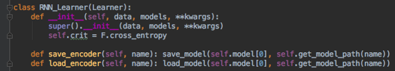

我们可以打电话给Learner把它变成一个学习器，但是如果我们调用RNN_Learner，它会添加`save_encoder`和`load_encoder` ，它们有时会很方便。 在这种情况下，我们真的可以说`Leaner`但`RNN_Learner`也可以。

```
 learn.lr_find()  learn.sched.plot() 
```

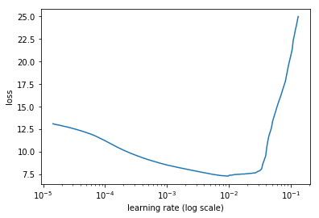

```
 lr=3e-3  learn.fit(lr, 1, cycle_len=12, use_clr=(20,10)) 
```

```
 _epoch trn_loss val_loss_  _0 5.48978 5.462648_  _1 4.616437 4.770539_  _2 4.345884 4.37726_  _3 3.857125 4.136014_  _4 3.612306 3.941867_  _5 3.375064 3.839872_  _6 3.383987 3.708972_  _7 3.224772 3.664173_  _8 3.238523 3.604765_  _9 2.962041 3.587814_  _10 2.96163 3.574888_  _11 2.866477 3.581224_ 
```

```
 _[3.5812237]_ 
```

```
 learn.save('initial')  learn.load('initial') 
```

#### 测试 [[1:11:01](https://youtu.be/tY0n9OT5_nA%3Ft%3D1h11m1s)] 

记住学习器的模型属性是一个标准的PyTorch模型，所以我们可以传递一些我们可以从我们的验证集中获取的`x` ，或者你可以`learn.predict_array`或任何你喜欢的东西来得到一些预测。 然后我们通过`.max()[1]`将这些预测转换为单词，以获取最高概率单词的索引以获得一些预测。 然后我们可以通过几个例子打印出法语，正确的英语和预测的英语，用于不填充的东西。

```
 x,y = next(iter(val_dl))  probs = learn.model(V(x))  preds = to_np(probs.max(2)[1])  **for** i **in** range(180,190):  print(' '.join([fr_itos[o] **for** o **in** x[:,i] **if** o != 1]))  print(' '.join([en_itos[o] **for** o **in** y[:,i] **if** o != 1]))  print(' '.join([en_itos[o] **for** o **in** preds[:,i] **if** o!=1]))  print() 
```

```
 _quels facteurs pourraient influer sur le choix de leur emplacement ?_ __eos__  _what factors influencetheir location ?_ __eos__  _what factors might might influence on the their ?_ _?_ __eos__  _qu' est -ce qui ne peut pas changer ?_ __eos__  _what can not change ?_ __eos__  _what not change change ?_ __eos__  _que faites - vous ?_ __eos__  _what do you do ?_ __eos__  _what do you do ?_ __eos__  _qui réglemente les pylônes d' antennes ?_ __eos__  _who regulates antenna towers ?_ __eos__  _who regulates the doors doors ?_ __eos__  _où sont - ils situés ?_ __eos__  _where are they located ?_ __eos__  _where are the located ?_ __eos__  _quelles sont leurs compétences ?_ __eos__  _what are their qualifications ?_ __eos__  _what are their skills ?_ __eos__  _qui est victime de harcèlement sexuel ?_ __eos__  _who experiences sexual harassment ?_ __eos__  _who is victim sexual sexual ?_ _?_ __eos__  _quelles sont les personnes qui visitent les communautés autochtones ?_ __eos__  _who visits indigenous communities ?_ __eos__  _who are people people aboriginal aboriginal ?_ __eos__  _pourquoi ces trois points en particulier ?_ __eos__  _why these specific three ?_ __eos__  _why are these two different ?_ _?_ __eos__  _pourquoi ou pourquoi pas ?_ __eos__  _why or why not ?_ __eos__  _why or why not _eos__ 
```

令人惊讶的是，这种最简单的可能性很大程度上是从零开始写的PyTorch模块上只有五万个句子，有时候能够在验证集上为你提供正确的答案。 有时候正确的答案是措辞略有不同，有时句子真的没有语法上的明智，甚至有太多的问号。 所以我们走在正确的轨道上。 我们认为你会同意即使是最简单的seq-to-seq训练的极少数迭代，没有任何预训练，除了使用单词嵌入是惊人的好。 我们稍后会对此进行改进，但是这里的消息甚至是顺序排列的模型，你认为它们比它们可能工作的更简单，即使数据少于你认为你可以学到的数据也可能是非常有效的，在某些情况下这可能就足够了你的需求。

**问题** ：标准化标点符号会有帮助吗（例如`'` vs. `'` ）？  [[1:13:10](https://youtu.be/tY0n9OT5_nA%3Ft%3D1h13m10s)] 这个特殊情况的答案可能是肯定的 - 卷曲引号和直引号之间的区别实际上是语义上的。 你必须非常小心，因为可能会发现人们使用漂亮的卷曲引号，比如使用更正式的语言，而且他们的写作方式不同。 因此，如果你要进行某些预处理（如标点符号规范化），你一定要检查结果是否有，因为几乎总是那种预处理会使事情变得更糟，即使你确定它不会。

**问题** ：除了 Dropout 和权重衰减之外，还有哪些方法可以使这些seq2seq模型正规化？  [[1:14:17](https://youtu.be/tY0n9OT5_nA%3Ft%3D1h14m17s)] 让我在一周内考虑一下。 我们一直依赖的AWD-LSTM有许多不同种类的 Dropout 者，还有一种基于激活和变化的正规化。 杰里米没有看到任何人将这样的工作量放到正则序列到序列模型中，并且有人有很大机会像seq-to-seq的AWD-LSTM那样做，这可能就像窃取所有想法一样简单AWD-LSTM并直接在seq-to-seq中使用它们，这很容易尝试。 有一篇有趣的论文，Stephen Merity在过去几周中添加了一个想法，该想法采用了所有这些不同的AWD-LSTM超参数并训练了一堆不同的模型，然后使用随机森林来找出特征的重要性 - 哪些实际上最重要，然后弄清楚如何设置它们。 你可以完全使用这种方法来确定序列以对正则化方法进行排序，其中一种方法是最好的并且优化它们并且这将是惊人的。 但目前，我们还不知道是否还有其他想法可以排序，以便将正则化排序超出常规语言模型的论文。

### 技巧 [[1:16:28](https://youtu.be/tY0n9OT5_nA%3Ft%3D1h16m28s)] 

#### **技巧＃1：走向双向**

对于分类，双向Jeremy建议使用的方法是获取所有标记序列，旋转它们，训练新的语言模型，并训练新的分类器。 他还提到了wikitext预训练模型，如果你用名字中的`bwd`替换`fwd` ，你将获得他为你创建的预训练后向模型。 获得一组预测，然后像正常的集合一样平均预测。 这就是我们为这种分类做bi-dir的方式。 可能有办法端到端地做到这一点，但杰里米尚未完全弄清楚它们还没有在fastai。 所以，如果你弄明白，这是一个有趣的研究方向。 但是因为我们没有做大量的文件，我们不得不把它分成不同的位然后汇集它们，在这种情况下我们可以很容易地做bi-dir。 它实际上就像向我们的编码器添加`bidirectional=True`一样简单。 人们往往不会为解码器做双向操作，部分原因是它被认为是作弊但可能在某些情况下可以工作，尽管它可能需要更多的解码器中的整体方法，因为它有点不那么明显。 但编码器非常简单 - `bidirectional=True` ，我们现在有第二个RNN正朝着相反的方向发展。 第二个RNN以相反的顺序访问每个标记，因此当我们到达最终隐藏状态时，它是第一个（即最左边）标记。 但隐藏状态大小相同，因此最终结果是我们最终得到一个长度为2的额外轴的张量。根据你使用的库，通常会将其与层数相结合，所以如果你有2层和双向 - 张量维度现在是长度4.使用PyTorch，它取决于你正在查看的每个层和/或每个双向位的单独结果。 你必须查阅文档，它会告诉你输入的输出张量大小是否适合于层数以及你是否有`bidirectional=True` 。

在这种特殊情况下，你将看到必须进行的所有更改 [[1:19:38](https://youtu.be/tY0n9OT5_nA%3Ft%3D1h19m38s)] 。 例如，当我们添加`bidirectional=True` ， `Linear`层现在需要隐藏次数2（即`nh*2` ）以反映我们在隐藏状态下具有第二个方向的事实。 同样在`initHidden`它现在是`self.nl*2` 。

```
 **class** **Seq2SeqRNN_Bidir** (nn.Module):  **def** __init__(self, vecs_enc, itos_enc, em_sz_enc, vecs_dec,  itos_dec, em_sz_dec, nh, out_sl, nl=2):  super().__init__()  self.emb_enc = create_emb(vecs_enc, itos_enc, em_sz_enc)  self.nl,self.nh,self.out_sl = nl,nh,out_sl  self.gru_enc = nn.GRU(em_sz_enc, nh, num_layers=nl,  dropout=0.25, bidirectional= **True** )  self.out_enc = nn.Linear(nh ***2** , em_sz_dec, bias= **False** )  self.drop_enc = nn.Dropout(0.05)  self.emb_dec = create_emb(vecs_dec, itos_dec, em_sz_dec)  self.gru_dec = nn.GRU(em_sz_dec, em_sz_dec, num_layers=nl,  dropout=0.1)  self.emb_enc_drop = nn.Dropout(0.15)  self.out_drop = nn.Dropout(0.35)  self.out = nn.Linear(em_sz_dec, len(itos_dec))  self.out.weight.data = self.emb_dec.weight.data  **def** forward(self, inp):  sl,bs = inp.size()  h = self.initHidden(bs)  emb = self.emb_enc_drop(self.emb_enc(inp))  enc_out, h = self.gru_enc(emb, h)  h = h.view(2,2,bs,-1).permute(0,2,1,3)  .contiguous().view(2,bs,-1)  h = self.out_enc(self.drop_enc(h)) 
```

```
 dec_inp = V(torch.zeros(bs).long())  res = []  **for** i **in** range(self.out_sl):  emb = self.emb_dec(dec_inp).unsqueeze(0)  outp, h = self.gru_dec(emb, h)  outp = self.out(self.out_drop(outp[0]))  res.append(outp)  dec_inp = V(outp.data.max(1)[1])  **if** (dec_inp==1).all(): **break**  **return** torch.stack(res)  **def** initHidden(self, bs):  **return** V(torch.zeros(self.nl ***2** , bs, self.nh)) 
```

**问题** ：为什么将解码器双向考虑作弊？  [[1:20:13](https://youtu.be/tY0n9OT5_nA%3Ft%3D1h20m13s)] 这不只是作弊，而是我们有这个循环，所以它不像拥有两个张量那么简单。 那么如何将这两个独立的循环转化为最终结果呢？ 在休息期间讨论它之后，Jeremy已经从“每个人都知道它不起作用”变成“也许它可以工作”，但它需要更多的思考。 在这一周很有可能，他会意识到这是一个愚蠢的想法，但我们会考虑它。

**问题** ：为什么需要为循环设置范围？  [[1:20:58](https://youtu.be/tY0n9OT5_nA%3Ft%3D1h20m58s)] 因为当我们开始训练时，一切都是随机的，所以`if (dec_inp==1).all(): break`可能永远不会是真的。 后来，它几乎总会最终突破，但基本上我们将永远消失。 重要的是要记住，当你设计一个架构，当你开始时，模型对任何事情一无所知。 所以你想确定它是否会做一些至少它含糊不清的事情。

单方向 [[1:21:46](https://youtu.be/tY0n9OT5_nA%3Ft%3D1h21m46s)] 得到3.58交叉熵损失。 随着双向，我们降到3.51，所以改善了一点。 它不应该真的减慢太多的东西。 双向确实意味着必须进行更多的顺序处理，但这通常是一个很好的胜利。 在谷歌翻译模型中，在8层中，只有第一层是双向的，因为它允许它并行执行更多操作，所以如果你创建真正的深层模型，你可能需要考虑哪些是双向的，否则我们有表现问题。

```
 rnn = Seq2SeqRNN_Bidir(fr_vecd, fr_itos, dim_fr_vec, en_vecd,  en_itos, dim_en_vec, nh, enlen_90)  learn = RNN_Learner(md, SingleModel(to_gpu(rnn)), opt_fn=opt_fn)  learn.crit = seq2seq_loss 
```

```
 learn.fit(lr, 1, cycle_len=12, use_clr=(20,10)) 
```

```
 _epoch trn_loss val_loss_  _0 4.896942 4.761351_  _1 4.323335 4.260878_  _2 3.962747 4.06161_  _3 3.596254 3.940087_  _4 3.432788 3.944787_  _5 3.310895 3.686629_  _6 3.454976 3.638168_  _7 3.093827 3.588456_  _8 3.257495 3.610536_  _9 3.033345 3.540344_  _10 2.967694 3.516766_  _11 2.718945 3.513977_ 
```

```
 _[3.5139771]_ 
```

#### 技巧＃2教师强迫 [[1:22:39](https://youtu.be/tY0n9OT5_nA%3Ft%3D1h22m39s)] 

现在让我们谈谈教师强迫。 当一个模型开始学习时，它什么都不知道。 因此，当模型开始学习时，它不会在第一步输出“呃”，它会输出一些随机无意义的词，因为它对德语或英语或语言的概念一无所知。 并且它将把它作为输入提供给下一个过程并且完全没有用。 这意味着，早期学习将变得非常困难，因为它正在输入一个愚蠢的输入到一个什么都不知道的模型，不知何故它会变得更好。 所以最终它没有得到太多的要求，但它绝对不会像我们那样有用。 那么，如果不是在我刚才预测的东西中收费，那么如果我们用实际正确的词来表达，那该怎么办呢？ 我们不能在推理时间那样做，因为根据定义我们不知道正确的词 - 它必须翻译它。 我们不能要求正确的翻译才能进行翻译。

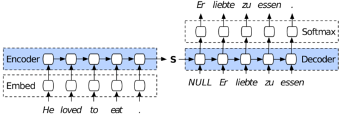

所以它的设置方式是我们有一个名为`pr_force`东西，它是强迫的概率 [[1:24:01](https://youtu.be/tY0n9OT5_nA%3Ft%3D1h24m1s)] 。 如果某个随机数小于该概率，那么我们将用实际正确的东西替换我们的解码器输入。 如果我们已经走得太远，如果它已经超过目标序列，我们就会停止，因为显然我们不能给它正确的东西。 所以你可以看到PyTorch是多么美丽。 在去年的课堂上我们切换到PyTorch的关键原因是因为Jeremy试图在Keras和TensorFlow中实施教师，并且比他开始时更加疯狂。 然后他在推特上看到了几周无处可去的安德烈·卡尔帕西（Andrej Karpathy）说了一些名为PyTorch的东西刚刚问世，这真的很酷。 那天他试了一下，第二天，他让老师强迫。 尝试调试东西的所有这些东西突然变得如此简单，而且这种动态的东西变得如此简单。 所以这是一个很好的例子，“嘿，我可以使用随机数和if语句”。

```
 **class** **Seq2SeqStepper** (Stepper):  **def** step(self, xs, y, epoch):  self.m.pr_force = (10-epoch)*0.1 **if** epoch<10 **else** 0  xtra = []  output = self.m(*xs, y)  **if** isinstance(output,tuple): output,*xtra = output  self.opt.zero_grad()  loss = raw_loss = self.crit(output, y)  **if** self.reg_fn: loss = self.reg_fn(output, xtra, raw_loss)  loss.backward()  **if** self.clip: _# Gradient clipping_  nn.utils.clip_grad_norm(trainable_params_(self.m),  self.clip)  self.opt.step()  **return** raw_loss.data[0] 
```

这是基本思路 [[1:25:29](https://youtu.be/tY0n9OT5_nA%3Ft%3D1h25m29s)] 。 在训练开始时，让我们将`pr_force`设置`pr_force`非常高，以便几乎总能得到实际正确的前一个单词，因此它有一个有用的输入。 然后，当我们训练更多时，让我们减少`pr_force`以便到最后`pr_force`为零并且它必须正确学习哪个是好的，因为它现在实际上大部分时间都在合理输入。

```
 **class** **Seq2SeqRNN_TeacherForcing** (nn.Module):  **def** __init__(self, vecs_enc, itos_enc, em_sz_enc, vecs_dec,  itos_dec, em_sz_dec, nh, out_sl, nl=2):  super().__init__()  self.emb_enc = create_emb(vecs_enc, itos_enc, em_sz_enc)  self.nl,self.nh,self.out_sl = nl,nh,out_sl  self.gru_enc = nn.GRU(em_sz_enc, nh, num_layers=nl,  dropout=0.25)  self.out_enc = nn.Linear(nh, em_sz_dec, bias= **False** )  self.emb_dec = create_emb(vecs_dec, itos_dec, em_sz_dec)  self.gru_dec = nn.GRU(em_sz_dec, em_sz_dec, num_layers=nl,  dropout=0.1)  self.emb_enc_drop = nn.Dropout(0.15)  self.out_drop = nn.Dropout(0.35)  self.out = nn.Linear(em_sz_dec, len(itos_dec))  self.out.weight.data = self.emb_dec.weight.data  self.pr_force = 1.  **def** forward(self, inp, y= **None** ):  sl,bs = inp.size()  h = self.initHidden(bs)  emb = self.emb_enc_drop(self.emb_enc(inp))  enc_out, h = self.gru_enc(emb, h)  h = self.out_enc(h) 
```

```
 dec_inp = V(torch.zeros(bs).long())  res = []  **for** i **in** range(self.out_sl):  emb = self.emb_dec(dec_inp).unsqueeze(0)  outp, h = self.gru_dec(emb, h)  outp = self.out(self.out_drop(outp[0]))  res.append(outp)  dec_inp = V(outp.data.max(1)[1])  **if** (dec_inp==1).all(): **break**  **if** (y **is** **not** **None** ) **and** (random.random()<self.pr_force):  **if** i>=len(y): **break**  dec_inp = y[i]  **return** torch.stack(res)  **def** initHidden(self, bs):  **return** V(torch.zeros(self.nl, bs, self.nh)) 
```

`pr_force` ：“强迫的概率”。 在结束时开始为零。

现在让我们写一些东西，在训练循环中，逐渐减少`pr_force`  [[1:26:01](https://youtu.be/tY0n9OT5_nA%3Ft%3D1h26m1s)] 。 我们怎么做？ 一种方法是编写我们自己的训练循环但不要这样做，因为我们已经有一个训练循环，其中包含进度条，使用指数加权平均值来消除损失，跟踪指标，并做一堆事情。 他们还跟踪在迭代开始时调用RNN的重置，以确保隐藏状态设置为零。 我们倾向于发现，当我们开始编写一些新东西并且需要替换代码的某些部分时，我们会添加一些小钩子，以便我们都可以使用该钩子来简化操作。 在这种特殊情况下，Jeremy最终使用了一个钩子，这个钩子叫做步进器。 如果你看一下源代码，model.py是我们的fit函数所在的地方，这是最低级别的东西，不需要学习器或任何东西 - 只需要一个标准的PyTorch模型和一个模型数据对象。 你只需要知道有多少个时期，一个标准的PyTorch优化器和一个标准的PyTorch损失函数。 我们几乎没有在课堂上使用，我们通常称为`learn.fit` ，但是`learn.fit`称之为。

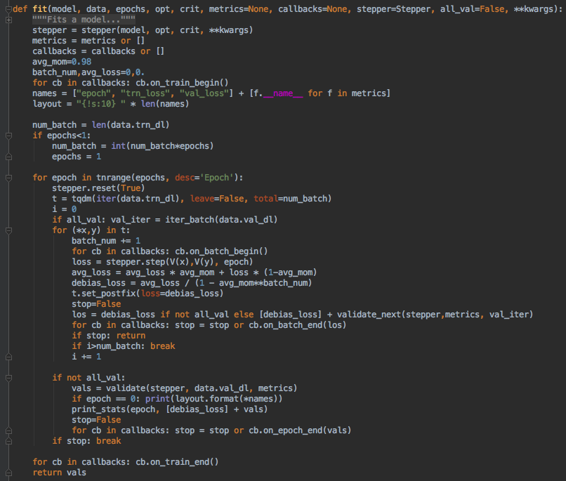

我们曾经 [[1:27:49](https://youtu.be/tY0n9OT5_nA%3Ft%3D1h27m49s)] 查看了源代码。 我们已经看到它在每个迭代中如何`stepper.step` ，并且循环遍历我们批处理中的每个事物并调用`stepper.step` 。 `stepper.step`是负责的事情：

*   打电话给模型
*   得到了损失
*   找到损失函数
*   调用优化器

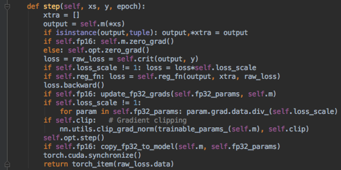

因此，默认情况下， `stepper.step`使用一个名为`Stepper`的特定类，它基本上调用模型，将梯度归零，调用loss函数， `backward`调用，必要时进行渐变裁剪，然后调用优化器。 当我们从头开始查看“PyTorch”时，它们是我们必须要做的基本步骤。 好消息是，我们可以用其他东西替换它而不是替换训练循环。 如果你从`Stepper`继承，然后编写自己的`step`版本，你可以复制并粘贴步骤的内容并添加你喜欢的任何内容。 或者，如果它是你之前或之后要做的事情，你甚至可以调用`super.step` 。 在这种情况下，杰里米相当怀疑他已经不必要地复杂 [[1:29:12](https://youtu.be/tY0n9OT5_nA%3Ft%3D1h29m12s)]  - 他可能做了类似的事情：

```
 **class** **Seq2SeqStepper** (Stepper):  **def** step(self, xs, y, epoch): self.m.pr_force =（10-epoch）* 0.1 if epoch <10 else 0  return super.step（xs，y，epoch）
```

但正如他所说，当他进行原型设计时，他并没有仔细考虑如何最小化他的代码 - 他复制并粘贴了内容，`step`并在顶部添加了一行代替`pr_force`模块中的内容。对于前10个时期，线性地逐渐减小，并且在10个时期之后，它为零。所以完全破解，但足以尝试它。好的是，除了添加这三行之外，其他一切都是相同的：

```
 如果（Y 是 不 无）和（random.random（）<self.pr_force）： 如果 I> = LEN（Y）：破  dec_inp =值Y [i]
```

我们需要做的唯一不同的事情是，当我们打电话时`fit`，我们会传递我们的定制步进器类。

```
rnn = Seq2SeqRNN_TeacherForcing（fr_vecd，fr_itos，dim_fr_vec，en_vecd，en_itos，dim_en_vec，nh，enlen_90）learn = RNN_Learner（md，SingleModel（to_gpu（rnn）），opt_fn = opt_fn）learn.crit = seq2seq_loss
```

```
learn.fit（lr，1，cycle_len = 12，use_clr =（20,10），stepper = Seq2SeqStepper）
```

```
 _epoch trn_loss val_loss_ 
0 4.460622 12.661013 
1 3.468132 7.138729 
2 3.235244 6.202878 
3 3.101616 5.454283 
4 3.135989 4.823736 
5 2.980696 4.933402 
6 2.91562 4.287475 
7 3.032661 3.975346 
8 3.103834 3.790773 
9 3.121457 3.578682 
10 2.917534 3.532427 
11 3.326946 3.490643 
```

```
 [3.490643] 
```

而现在我们的损失降至3.49。我们需要确保至少做10个迭代，因为在此之前，它是通过使用教师强制作弊。

#### 技巧＃3注意模型 [[1:31:00](https://youtu.be/tY0n9OT5_nA%3Ft%3D1h31m)] 

下一个技巧是一个更大，更酷的技巧。它被称为“注意力”。注意力的基本思想是这样 - 期望将整个句子概括为这个单一的隐藏向量。它必须知道所说的内容，如何说，以及用德语创造句子所需的一切。关注的想法基本上可能是我们要求太多了。特别是因为我们可以使用这种形式的模型（下面），我们输出循环的每一步，不仅在结尾处有隐藏状态，而且在每个单词之后都有隐藏状态。为什么不尝试使用这些信息呢？它已经存在，但到目前为止我们只是扔掉了它。不仅如此，而且是双向的，我们可以使用每一步的两个状态向量。我们应该怎么做？


假设我们正在翻译“谎言” [[1:32:34](https://youtu.be/tY0n9OT5_nA%3Ft%3D1h32m34s)] 。我们想要的前五个州中的哪一个？我们显然想要“爱”，因为它就是这个词。 “zu”怎么样？我们可能需要“吃”和“去”并且喜欢“以确保我们已经变得紧张，并且知道我实际上需要这部分动词等等。因此，根据我们正在翻译的位，我们需要这些不同隐藏状态的一个或多个位。事实上，我们可能想要对它们进行一些加权。换句话说，对于这五个隐藏状态，我们想要加权平均值 [[1:33:47](https://youtu.be/tY0n9OT5_nA%3Ft%3D1h33m47s)]。我们希望它能够通过能够确定句子中哪些位是最重要的东西来加权。我们如何弄清楚这句话的哪些部分现在很重要？我们创建了一个神经网络，我们训练神经网络来计算它。我们什么时候训练神经网络？端到端。那么现在让我们训练两个神经网络 [[1:34:18](https://youtu.be/tY0n9OT5_nA%3Ft%3D1h34m18s)] 。好吧，我们已经有了一堆--NRN编码器，RNN解码器，几个线性层，什么，让我们在混合中添加另一个神经网络。这个神经网络将为这些状态中的每一个输出一个权重，我们将在每一步都采用加权平均值，而这只是我们同时学习的另一组参数。所以这被称为“关注”。

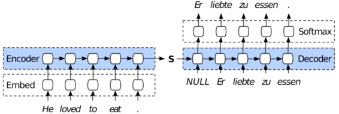

我们的想法是，一旦学会了这些注意力，每个单词都会采用加权平均值，正如你在Chris Olah和Shan Carter  [[1:34:50](https://youtu.be/tY0n9OT5_nA%3Ft%3D1h34m50s)]  这个极好的演示中所看到的那样。看看这篇[distill.pub文章](https://distill.pub/2016/augmented-rnns/) - 这些东西是交互式图表，向你展示注意力如何工作以及在训练有素的翻译模型中实际注意力的样子。

[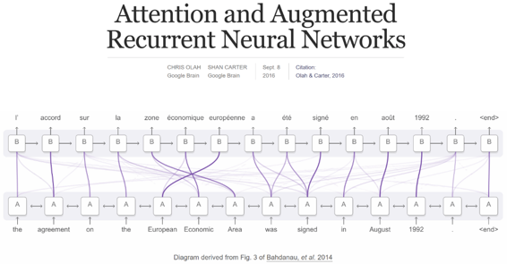](https://distill.pub/2016/augmented-rnns/)

让我们尝试并实施关注 [[1:35:47](https://youtu.be/tY0n9OT5_nA%3Ft%3D1h35m47s)] ：

```
 def rand_t（* sz）：return torch.randn（sz）/math.sqrt（sz [0]） def rand_p（* sz）：return nn.Parameter（rand_t（* sz））
```

```
 class  Seq2SeqAttnRNN（nn.Module）： def __init __（self，vecs_enc，itos_enc，em_sz_enc，vecs_dec，itos_dec，em_sz_dec，nh，out_sl，nl = 2）： super().__init__() self.emb_enc = create_emb（vecs_enc，itos_enc，em_sz_enc）self.nl，self.nh，self.out_sl = nl，nh，out_sl self.gru_enc = nn.GRU（em_sz_enc，nh，num_layers = nl，dropout = 0.25）self .out_enc = nn.Linear（nh，em_sz_dec，bias = False）self.emb_dec = create_emb（vecs_dec，itos_dec，em_sz_dec）self.gru_dec = nn.GRU（em_sz_dec，em_sz_dec，num_layers = nl，dropout = 0.1）self.emb_enc_drop = nn.Dropout（0.15）self.out_drop = nn.Dropout（0.35）self.out = nn.Linear（em_sz_dec * 2，len（itos_dec））self.out.weight.data = self.emb_dec.weight.data
```

```
self.W1 = rand_p（nh，em_sz_dec）self.l2 = nn.Linear（em_sz_dec，em_sz_dec）self.l3 = nn.Linear（em_sz_dec + nh，em_sz_dec）self.V = rand_p（em_sz_dec）
```

```
 def forward（self，inp ，y = None，ret_attn = False）：sl，bs = inp.size（）h = self.initHidden（bs）emb = self.emb_enc_drop（self.emb_enc（inp ））enc_out，h = self.gru_enc（emb，h）h = self.out_enc（h）
```

```
dec_inp = V（torch.zeros（bs）.long（））res，attns = []，[] w1e = enc_out @ self.W1  for i in range（self.out_sl）：w2h = self.l2（h [ - 1]）u = F.tanh（w1e + w2h）a = F.softmax（u @ self.V，0）attns.append（a）Xa =（a.unsqueeze（2）* enc_out）.sum（0）emb = self.emb_dec（dec_inp）wgt_enc = self.l3（torch.cat（[emb，Xa]，1））outp，h = self.gru_dec（wgt_enc.unsqueeze（0），h）outp = self.out（ self.out_drop（OUTP [0]））res.append（OUTP）dec_inp = V（outp.data.max（1）[1]） 如果（dec_inp == 1）。所有（）：断裂  如果（Y 是 不 没有）和（random.random（）<self.pr_force）： 如果 i> = len（y）：break  dec_inp = y [i]
```

```
res = torch.stack（res） 如果 ret_attn：res = res，torch.stack（attns） 返回 res
```

```
 def initHidden（self，bs）： return V（torch.zeros（self.nl，bs，self.nh））
```

注意，大多数代码都是相同的。一个主要的区别是这一行：`Xa = (a.unsqueeze(2) * enc_out).sum(0)`。我们将采用加权平均值，我们将采用加权平均值的方式是创建一个小神经网络，我们将在这里看到：

```
w2h = self.l2（h [-1]）u = F.tanh（w1e + w2h）a = F.softmax（u @ self.V，0）
```

我们使用softmax因为softmax的好处是我们想要确保我们使用的所有权重加起来为1，我们也期望其中一个权重应该高于其他权重 [[1:36:38](https://youtu.be/tY0n9OT5_nA%3Ft%3D1h36m38s)] 。 Softmax为我们提供了保证，它们加起来为1，因为它有`e^`，它往往会鼓励其中一个权重高于其他权重。

让我们看看这是如何运作的 [[1:37:09](https://youtu.be/tY0n9OT5_nA%3Ft%3D1h37m9s)] 。 我们将采用最后一层的隐藏状态，我们将把它粘贴到一个线性层。 然后我们将它固定在非线性激活中，然后我们将进行矩阵乘法运算。 因此，如果你考虑它 - 一个线性层，非线性激活，矩阵多重 - 它是一个神经网络。 它是一个有一个隐藏层的神经网络。 将其粘贴到softmax中，然后我们可以使用它来加权我们的编码器输出。 现在，不仅仅是采用最后一个编码器输出，我们得到了所有编码器输出的整个张量，我们只是通过我们创建的神经网络加权。

在Python中， `A @ B`是矩阵乘积， `A * B`是元素乘积

#### 论文 [[1:38:18](https://youtu.be/tY0n9OT5_nA%3Ft%3D1h38m18s)] 

*   [通过共同学习对齐和翻译的神经机器翻译](https://arxiv.org/abs/1409.0473) - 一篇引人注目的论文，最初引入了这种关注的想法，以及一些真正改变了人们在这个领域工作方式的关键事物。 他们说，关注领域不仅用于文本，还用于从图片中读取文本或用计算机视频做各种事情。
*   [语法作为外语](https://arxiv.org/abs/1412.7449) - Geoffrey Hinton所参与的第二篇论文使用了RNN的这个概念，注意尝试用RNN替换基于规则的语法，RNN根据语法自动标记每个单词。 事实证明，它比任何基于规则的系统做得更好，而今天这个系统显而易见，但当时它被认为是非常令人惊讶的。 它们总结了注意力的工作原理，非常简洁。

**问** ：你能再次解释一下注意力吗？  [[1:39:46](https://youtu.be/tY0n9OT5_nA%3Ft%3D1h39m46s)] 当然可以！ 让我们回过头来看看我们的原始编码器。

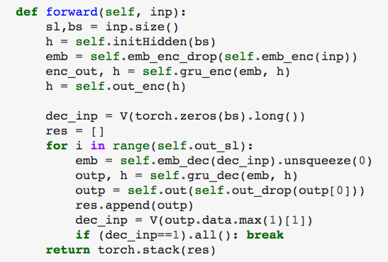

RNN输出两件事：它在每个时间步之后输出一个状态列表（ `enc_out` ），它还告诉你最后一个步骤（ `h` ）的状态，我们在最后一个步骤创建状态来创建我们的解码器的输入状态是下面的一个向量：

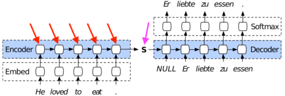

但我们知道它在每个步骤（橙色箭头）创建一个向量，所以使用它们不是很好吗？ 但是，使用与我们现在翻译的单词翻译最相关的一个或多个不是很好吗？ 因此，能够在每个时间步加上隐藏状态的加权平均值并不是很好，因为现在任何适当的权重加权。 例如，“liebte”绝对是时间步骤＃2就是它的全部内容，因为这就是我正在翻译的单词。 那么我们如何得到一个适合我们现在正在训练的词的权重列表呢？ 答案是通过训练神经网络来确定权重列表。 因此，任何时候我们想要弄清楚如何训练一个完成任何任务的神经网络，最简单的方法，通常总是这样做，就是将它包含在你的模块中，并根据其他一切进行训练。 最小可能的神经网络包含两层和一个非线性激活函数，因此`self.l2`是一个线性层。

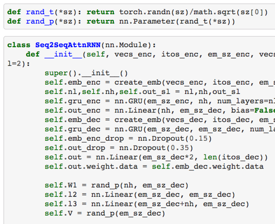

事实上，如果我们不关心偏见，我们甚至可以只抓取一个随机矩阵而不是线性层 [[1:42:18](https://youtu.be/tY0n9OT5_nA%3Ft%3D1h42m18s)] 。 `self.W1`是一个包含在`Parameter`的随机张量。

`Parameter` ：请记住， `Parameter`与PyTorch `Variable`相同，但它只是告诉PyTorch“我希望你为此学习权重。” [[1:42:35](https://youtu.be/tY0n9OT5_nA%3Ft%3D1h42m35s)] 

因此，当我们开始我们的解码器时，让我们采用解码器的当前隐藏状态，将其放入线性层（ `self.l2` ），因为我们用什么信息来决定接下来应该关注哪些词 - 我们唯一的信息必须继续是现在解码器的隐藏状态。 所以让我们抓住：

*   把它放入线性层（ `self.l2` ）
*   通过非线性（ `F.tanh` ）
*   把它穿过另一个非线性层（ `u @ self.V`没有偏差，所以它只是矩阵乘法）
*   把它通过softmax

就是这样 - 一个小小的神经网络。 它没有做任何事情。 它只是一个神经网络，没有神经网络可以做任何事情，它们只是具有随机权重的非线性激活的线性层。 但如果我们给它一份工作，它就会开始做点什么。 在这种情况下，我们给它做的工作就是说不要只采取最终状态，而是现在让我们使用所有的编码器状态，然后让它们全部用它们乘以那个小神经网络的输出。 因此，考虑到这个小神经网络中的东西是可学习的权重，希望它能学会通过有用的东西来加权那些编码器隐藏状态。 这就是所有神经网络所做的是我们给它一些随机权重开始和一项工作，并希望它学会做这项工作。 事实证明，确实如此。

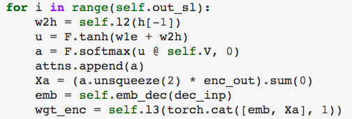

这里的其他所有内容都与之前的相同。 我们有老师强迫，它不是双向的，所以我们可以看到这是怎么回事。

```
 rnn = Seq2SeqAttnRNN(fr_vecd, fr_itos, dim_fr_vec, en_vecd, en_itos, dim_en_vec, nh, enlen_90)  learn = RNN_Learner(md, SingleModel(to_gpu(rnn)), opt_fn=opt_fn)  learn.crit = seq2seq_loss  lr=2e-3 
```

```
 learn.fit(lr, 1, cycle_len=15, use_clr=(20,10),  stepper=Seq2SeqStepper) 
```

```
 _epoch trn_loss val_loss_  _0 3.882168 11.125291_  _1 3.599992 6.667136_  _2 3.236066 5.552943_  _3 3.050283 4.919096_  _4 2.99024 4.500383_  _5 3.07999 4.000295_  _6 2.891087 4.024115_  _7 2.854725 3.673913_  _8 2.979285 3.590668_  _9 3.109851 3.459867_  _10 2.92878 3.517598_  _11 2.778292 3.390253_  _12 2.795427 3.388423_  _13 2.809757 3.353334_  _14 2.6723 3.368584_ 
```

```
 [3.3685837] 
```

教师强迫有3.49现在和几乎完全相同的东西，但我们有这个小的最小神经网络弄清楚什么权重给我们的输入，我们降到3.37。 请记住，这些损失是日志，所以`e^3.37`是一个非常重要的变化。

```
 learn.save('attn') 
```

#### 测试 [[1:45:37](https://youtu.be/tY0n9OT5_nA%3Ft%3D1h45m37s)] 

```
 x,y = next(iter(val_dl))  probs,attns = learn.model(V(x),ret_attn= **True** )  preds = to_np(probs.max(2)[1]) 
```

```
 **for** i **in** range(180,190):  print(' '.join([fr_itos[o] **for** o **in** x[:,i] **if** o != 1]))  print(' '.join([en_itos[o] **for** o **in** y[:,i] **if** o != 1]))  print(' '.join([en_itos[o] **for** o **in** preds[:,i] **if** o!=1]))  print() 
```

```
 _quels facteurs pourraient influer sur le choix de leur emplacement ?_ __eos__  _what factors influencetheir location ?_ __eos__  _what factors might influence the their their their ?_ __eos__ 
```

```
 _qu' est -ce qui ne peut pas changer ?_ __eos__  _what can not change ?_ __eos__  _what can not change change ?_ __eos__ 
```

```
 _que faites - vous ?_ __eos__  _what do you do ?_ __eos__  _what do you do ?_ __eos__ 
```

```
 _qui réglemente les pylônes d' antennes ?_ __eos__  _who regulates antenna towers ?_ __eos__  _who regulates the lights ?_ _?_ __eos__ 
```

```
 _où sont - ils situés ?_ __eos__  _where are they located ?_ __eos__  _where are they located ?_ __eos__ 
```

```
 _quelles sont leurs compétences ?_ __eos__  _what are their qualifications ?_ __eos__  _what are their skills ?_ __eos__ 
```

```
 _qui est victime de harcèlement sexuel ?_ __eos__  _who experiences sexual harassment ?_ __eos__  _who is victim sexual sexual ?_ __eos__ 
```

```
 _quelles sont les personnes qui visitent les communautés autochtones ?_ __eos__  _who visits indigenous communities ?_ __eos__  _who is people people aboriginal people ?_ __eos__ 
```

```
 _pourquoi ces trois points en particulier ?_ __eos__  _why these specific three ?_ __eos__  _why are these three three ?_ _?_ __eos__ 
```

```
 _pourquoi ou pourquoi pas ?_ __eos__  _why or why not ?_ __eos__  _why or why not ?_ __eos__ 
```

不错。 它仍然不完美，但其中有一些是正确的，并再次考虑我们要求它了解两种不同语言的语言概念以及如何在两者之间进行翻译，语法和词汇，我们只有50,000个句子，很多单词只出现一次，我会说这实际上是非常惊人的。

**问题：**为什么我们使用tanh而不是ReLU作为注意迷你网？  [[1:46:23](https://youtu.be/tY0n9OT5_nA%3Ft%3D1h46m23s)] 我不太记得 - 从我看过它已经有一段时间了。 你应该完全尝试使用价值并看看它是如何发展的。 显然，关键区别在于它可以在每个方向上进行，并且它在顶部和底部都受到限制。 我经常知道RNN，LSTM和GRU中的大门，但是经常会有更好的效果，但是我实际看了一下这个具体问题已经有一年了，所以我会在一周内看一下。 简短的回答是你应该尝试不同的激活功能，看看你是否可以获得更好的结果。

> 从第7课 [[44:06](https://youtu.be/H3g26EVADgY%3Ft%3D44m6s)] ：正如我们上周看到的那样，tanh强迫值在-1和1之间。由于我们一次又一次地乘以这个权重矩阵，我们会担心relu（因为它是无界）可能有更多的梯度爆炸问题。 话虽如此，你可以指定RNNCell使用默认为tanh的不同非线性，并要求它使用relu（如果你愿意）。

#### 可视化 [[1:47:12](https://youtu.be/tY0n9OT5_nA%3Ft%3D1h47m12s)] 

我们还可以做的是通过将return注意参数添加到`forward`功能，我们可以从模型中获取注意力。 你可以把任何你喜欢的东西放在`forward`函数参数中。 所以我们添加了一个返回注意参数，默认为false，因为很明显训练循环它不知道任何关于它但是我们刚才有一些东西说如果返回注意，那么`if ret_attn: res = res,torch.stack(attns)`注意（ `if ret_attn: res = res,torch.stack(attns)` ）。 注意力只是将其放在列表中的值（ `attns.append(a)` ）。 我们现在可以调用模型，返回注意力等于true，并回归概率和注意事项 [[1:47:53](https://youtu.be/tY0n9OT5_nA%3Ft%3D1h47m53s)] ：

```
 probs,attns = learn.model(V(x),ret_attn= **True** ) 
```

我们现在可以在每个时间步骤绘制关注的图片。

```
 attn = to_np(attns[...,180]) 
```

```
 fig, axes = plt.subplots(3, 3, figsize=(15, 10))  **for** i,ax **in** enumerate(axes.flat):  ax.plot(attn[i]) 
```

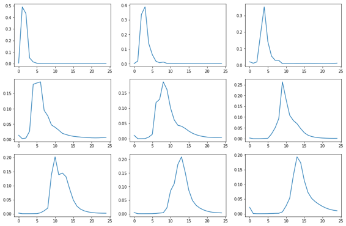

当你是Chris Olah和Shan Carter时，你做的事情看起来像是你是杰里米霍华德，完全相同的信息看起来像☝︎ [[1:48:24](https://youtu.be/tY0n9OT5_nA%3Ft%3D1h48m24s)] 。 你可以在每个不同的时间步骤看到，我们有不同的关注。

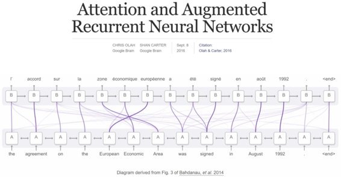

当你尝试构建这样的东西时，你真的不知道它是否正常工作是非常重要的，因为如果它不起作用（按照通常的Jeremy的前12次尝试被打破）并且它们在某种意义上被打破了没有真正学到任何有用的东西。 因此，它对所有事情都给予了同等的关注，并没有更糟糕 - 它只是没有好多少。 直到你真正找到以某种方式可视化事物的方法，你知道它应该提前看起来像什么，你真的不知道它是否有效 [[1:49:16](https://youtu.be/tY0n9OT5_nA%3Ft%3D1h49m16s)] 。 因此，尝试找出检查输出中间步骤的方法非常重要。

**问题** ：注意神经网络的损失功能是什么？  [[1:49:31](https://youtu.be/tY0n9OT5_nA%3Ft%3D1h49m31s)] 不，注意神经网络没有丢失功能。 它是端到端的训练。 它只是坐在我们的解码器循环中。 解码器循环的损失函数是相同的损失函数，因为结果包含与以前完全相同的东西 - 单词的概率。 怎么来迷你神经网学习什么？ 因为为了使输出更好更好，如果它使加权平均的权重更好更好，那将是很好的。 因此，创建我们的输出的一部分是为了找到一组好的权重，如果它没有很好地找到好的权重集，那么损失函数将不会从那个位改进。 因此，端到端学习意味着你可以将所有内容都投入到一个损失函数中，并且所有不同参数的渐变指向一个方向，即“嘿，你知道如果你在那里增加了更多的权重，它本来是更好。“并且由于链规则的魔力，它知道在那里增加更多的权重，改变矩阵中的参数稍微增加等等。这是端到端学习的魔力。 这是一个非常容易理解的问题，但你必须意识到这个代码并没有什么特别的说明这个特定的比特是单独的迷你神经网络，而不是GRU是一个单独的小神经网络，或者线性层是一个单独的小函数。 它最终被推入一个输出，这是一组概率，最终在一个损失函数中返回一个数字，表示这个或者不是一个好的翻译。 因此，由于链规则的神奇之处，我们然后向所有参数传播少量更新，以使它们更好一些。 这是一个很大的，奇怪的，违反直觉的想法，如果它有点令人费解，那就完全可以了。 甚至回到第1课“我们怎样才能找到狗与猫？” - 我们没有。 我们所做的只是我们说“这是我们的数据，这是我们的架构，这是我们的损失功能。 请重新传播到权重中以使它们变得更好，并且在你使它们变好一段时间之后，它将开始从狗中找到猫。“在这种情况下（即翻译），我们没有使用别人的卷积网络架构。 我们说“这是一个自定义架构，我们希望在这个问题上特别好。”即使没有这个自定义架构，它仍然可以。 但是我们以更有意义的方式制作它，或者我们认为应该做得更好。 但是，在任何情况下，除了说“这里是一个数据，这里是一个架构，这里是一个损失函数 - 请去寻找参数”之外，我们做了什么不同的事情。它做到了，因为这就是神经网络的作用。

这就是序列到序列的学习 [[1:53:19](https://youtu.be/tY0n9OT5_nA%3Ft%3D1h53m19s)] 。

*   如果你想将图像编码成某种类型的CNN骨干，然后将其传递到像RNN一样注意的解码器中，并且你的y值是每个图像的实际正确标题，你将最终使用图像标题生成器。
*   如果你对视频和字幕做同样的事情，你最终会得到一个视频字幕生成器。
*   如果你对3D CT扫描和放射学报告做同样的事情，你将最终获得放射学报告生成器。
*   如果你对Github问题和人们选择的摘要做同样的事情，你将得到一个Github问题摘要生成器。

> Seq-to-seq是神奇的，但它们有效 [[1:54:07](https://youtu.be/tY0n9OT5_nA%3Ft%3D1h54m7s)] 。 我并不觉得人们已经开始在自己的领域中开始研究如何使用seq-to-seq模型。 不是Github的人，我永远不会想到“从一些问题开始并自动创建摘要会很酷”。 但是现在，当然，下次我进入Github时，我希望看到为我写的摘要。 我不想写自己的提交消息。 当我在很多行中添加注释时，为什么要编写自己的代码审查摘要 - 它也应该为我做。 现在我认为Github如此落后，它可能正在做这些事情。 那么你所在的行业有什么用呢？ 你可以从序列开始并从中生成一些东西。 我无法想象。 同样，它是一个相当新的领域，它的工具不容易使用 - 它们甚至还没有内置到fastai。 希望很快就会有。 我认为没有人知道机会是什么。

### 设计 [[1:55:23](https://youtu.be/tY0n9OT5_nA%3Ft%3D1h55m23s)] 

[笔记本](https://github.com/fastai/fastai/blob/master/courses/dl2/devise.ipynb) / [纸](http://papers.nips.cc/paper/5204-devise-a-deep-visual-semantic-embedding-model.pdf)

我们将首次将我们关注的两个小世界 - 文本和图像 [[1:55:49](https://youtu.be/tY0n9OT5_nA%3Ft%3D1h55m49s)]  [聚集在一起](https://youtu.be/tY0n9OT5_nA%3Ft%3D1h55m49s) 。 这个想法出现在一位非凡的深度学习实践者和研究员Andrea Frome的论文中。 安德里亚当时在谷歌，而她的疯狂想法是文字可以有一个分布式表示，一个空间，特别是当时只是单词向量。 图像可以在空间中表示。 最后，如果我们有一个全连接层，它们最终会成为向量表示。 我们能合并这两个吗？ 我们能以某种方式鼓励图像最终的向量空间与单词所在的向量空间相同吗？ 如果我们能做到这一点，那意味着什么？ 我们能做些什么呢？ 那么我们可以做些什么来涵盖这样的事情，如果我错了怎么办，如果我预测这个图像是一个小猎犬，我预测大喷射和Yannet的模型预测corgi。 正常的损失函数表明Yannet和Jeremy的模型同样好（即它们都是错误的）。 但是，如果我们能够以某种方式说出来，虽然你知道什么corgi更接近比格犬而不是大型喷气机怎么办？ 因此，Yannet的模型比Jeremy的模型更好。 我们应该能够做到这一点，因为在单词向量空间中，比格犬和柯基犬非常接近，但是大型喷射并非如此。 所以它会给我们一个很好的情况，希望如果他们错了，我们的推论会以更加健全的方式出错。 它还允许我们搜索不在ImageNet Synset ID中的内容（即ImageNet中的类别）。 为什么我们必须训练一个全新的模型来找到狗与猫，因为我们已经找到了一些可以找到corgis和tabbies的东西。 为什么我们不能说找到我的狗？ 如果我们在单词向量空间中训练它，我们完全可以因为它们是单词向量，我们可以找到具有正确图像向量的东西，依此类推。 我们将在稍后看一些我们可以用它做的很酷的事情，但首先让我们训练一个模型，在这个模型中，这个模型没有学习一个类别（一个热编码ID），其中每个类别都与其他类别相同，让我们改为训练一个模型，我们找到一个因变量，这是一个单词向量。 那么什么词向量？ 显然，你想要的单词的向量字。 因此，如果它是corgi，让我们训练它来创建一个单词向量，这是一个小型单词向量，如果它是一个巨型喷射，让我们用一个因变量训练它，这个变量说明这是大型喷气机的单词向量。

```
 **from** **fastai.conv_learner** **import** *  torch.backends.cudnn.benchmark= **True**  **import** **fastText** **as** **ft** 
```

```
 PATH = Path('data/imagenet/')  TMP_PATH = PATH/'tmp'  TRANS_PATH = Path('data/translate/')  PATH_TRN = PATH/'train' 
```

这很容易 [[1:59:17](https://youtu.be/tY0n9OT5_nA%3Ft%3D1h59m17s)] 。 让我们再次抓住快速文本词向量，加载它们（这次我们只需要英语）。

```
 ft_vecs = ft.load_model(str((TRANS_PATH/'wiki.en.bin'))) 
```

```
 np.corrcoef(ft_vecs.get_word_vector('jeremy'),  ft_vecs.get_word_vector('Jeremy')) 
```

```
 _array([[1\. , 0.60866],_  _[0.60866, 1\. ]])_ 
```

例如，“jeremy”和“Jeremy”的相关性为.6。

```
 np.corrcoef(ft_vecs.get_word_vector('banana'),  ft_vecs.get_word_vector('Jeremy')) 
```

```
 _array([[1\. , 0.14482],_  _[0.14482, 1\. ]])_ 
```

杰里米根本不喜欢香蕉，还有“香蕉”和“杰里米”.14。 因此，你期望相关的单词是相关的，并且单词应该尽可能远离彼此，不幸的是，它们仍然略有相关但不是那么多 [[1:59:41](https://youtu.be/tY0n9OT5_nA%3Ft%3D1h59m41s)] 。

#### 将ImageNet类映射到单词向量

现在让我们抓住所有的ImageNet类，因为我们实际上想知道哪一个是corgi，哪一个是jumbo jet。

```
 ft_words = ft_vecs.get_words(include_freq= **True** )  ft_word_dict = {k:v **for** k,v **in** zip(*ft_words)}  ft_words = sorted(ft_word_dict.keys(), key= **lambda** x: ft_word_dict[x]) 
```

```
 len(ft_words) 
```

```
 _2519370_ 
```

```
 **from** **fastai.io** **import** get_data 
```

我们列出了所有关于files.fast.ai的文件，我们可以抓住它们。

```
 CLASSES_FN = 'imagenet_class_index.json'  get_data(f'http://files.fast.ai/models/{CLASSES_FN}',  TMP_PATH/CLASSES_FN) 
```

我们还要列出Jeremy在这里提供的所有英语名词列表：

```
 WORDS_FN = 'classids.txt'  get_data(f'http://files.fast.ai/data/{WORDS_FN}', PATH/WORDS_FN) 
```

因此，根据WordNet，我们拥有千个ImageNet类和英语中所有名词的名称，这对于表示单词是什么和不是什么来说是很受欢迎的。 我们现在可以加载ImageNet类列表，将其转换为字典，因此`classids_1k`包含竞争数据集中1000个图像的类ID。

```
 class_dict = json.load((TMP_PATH/CLASSES_FN).open())  classids_1k = dict(class_dict.values())  nclass = len(class_dict); nclass 
```

```
 _1000_ 
```

这是一个例子。 “tench”显然是一种鱼。

```
 class_dict['0'] 
```

```
 _['n01440764', 'tench']_ 
```

让我们为所有WordNet名词做同样的事情 [[2:01:11](https://youtu.be/tY0n9OT5_nA%3Ft%3D2h1m11s)] 。 事实证明，ImageNet正在使用WordNet类名，这样可以很容易地在两者之间进行映射。

```
 classid_lines = (PATH/WORDS_FN).open().readlines()  classid_lines[:5] 
```

```
 _['n00001740 entity\n',_  _'n00001930 physical_entity\n',_  _'n00002137 abstraction\n',_  _'n00002452 thing\n',_  _'n00002684 object\n']_ 
```

```
 classids = dict(l.strip().split() **for** l **in** classid_lines)  len(classids),len(classids_1k) 
```

```
 _(82115, 1000)_ 
```

所以这些是我们的两个世界 - 我们拥有ImageNet千万，我们拥有82,000个WordNet。

```
 lc_vec_d = {w.lower(): ft_vecs.get_word_vector(w) **for** w  **in** ft_words[-1000000:]} 
```

因此，我们希望将两者映射到一起，这就像创建几个字典一样简单，以根据Synset ID或WordNet ID映射它们。

```
 syn_wv = [(k, lc_vec_d[v.lower()]) **for** k,v **in** classids.items()  **if** v.lower() **in** lc_vec_d]  syn_wv_1k = [(k, lc_vec_d[v.lower()]) **for** k,v **in** classids_1k.items()  **if** v.lower() **in** lc_vec_d]  syn2wv = dict(syn_wv)  len(syn2wv) 
```

```
 _49469_ 
```

我们现在需要做的是抓住WordNet中的82,000个名词并尝试用快速文本查找它们。 我们设法用快速文本查找了49,469个。 我们现在有一个字典，它来自synset ID，这是WordNet将它们称为单词向量。 我们也专门为1k ImageNet类提供相同的功能。

```
 pickle.dump(syn2wv, (TMP_PATH/'syn2wv.pkl').open('wb'))  pickle.dump(syn_wv_1k, (TMP_PATH/'syn_wv_1k.pkl').open('wb')) 
```

```
 syn2wv = pickle.load((TMP_PATH/'syn2wv.pkl').open('rb'))  syn_wv_1k = pickle.load((TMP_PATH/'syn_wv_1k.pkl').open('rb')) 
```

现在我们抓住你现在可以从Kaggle  [[2:02:54](https://youtu.be/tY0n9OT5_nA%3Ft%3D2h2m54s)] 下载的所有[ImageNet](https://youtu.be/tY0n9OT5_nA%3Ft%3D2h2m54s) 。 如果你看看Kaggle ImageNet本地化竞赛，它也包含整个ImageNet分类。

```
 images = []  img_vecs = [] 
```

```
 **for** d **in** (PATH/'train').iterdir():  **if** d.name **not** **in** syn2wv: **continue**  vec = syn2wv[d.name]  **for** f **in** d.iterdir():  images.append(str(f.relative_to(PATH)))  img_vecs.append(vec) 
```

```
 n_val=0  **for** d **in** (PATH/'valid').iterdir():  **if** d.name **not** **in** syn2wv: **continue**  vec = syn2wv[d.name]  **for** f **in** d.iterdir():  images.append(str(f.relative_to(PATH)))  img_vecs.append(vec)  n_val += 1 
```

```
 n_val 
```

```
 _28650_ 
```

它有一个28,650项的验证集。 对于ImageNet中的每个图像，我们可以使用synset到字向量（ `syn2wv` ）来获取其快速文本字向量，我们可以将其粘贴到图像向量数组（ `img_vecs` ）中，将所有内容叠加到单个矩阵中并将其保存。

```
 img_vecs = np.stack(img_vecs)  img_vecs.shape 
```

现在我们拥有的是每个ImageNet图像的东西，我们还有通过查找同义词ID→WordNet→快速文本→单词向量与 [[2:03:43](https://youtu.be/tY0n9OT5_nA%3Ft%3D2h3m43s)] 相关联的快速文本单词向量。

```
 pickle.dump(images, (TMP_PATH/'images.pkl').open('wb'))  pickle.dump(img_vecs, (TMP_PATH/'img_vecs.pkl').open('wb')) 
```

```
 images = pickle.load((TMP_PATH/'images.pkl').open('rb'))  img_vecs = pickle.load((TMP_PATH/'img_vecs.pkl').open('rb')) 
```

```
 arch = resnet50 
```

```
 n = len(images); n 
```

```
 _766876_ 
```

```
 val_idxs = list(range(n-28650, n)) 
```

这是一个很酷的技巧 [[2:04:06](https://youtu.be/tY0n9OT5_nA%3Ft%3D2h4m6s)] 。 我们现在可以创建一个模型数据对象，它特别是一个图像分类器数据对象，我们有一个名为`from_names_and_array`东西我不确定我们之前是否使用过它但我们可以传递一个文件名列表（所有文件） ImageNet中的名称）和我们的因变量数组（所有快速文本字向量）。 然后我们可以传入验证索引，在这种情况下只是所有最后的ID - 我们需要确保它们与ImageNet相同，否则我们将作弊。 然后我们传入`continuous=True` ，这意味着这再次对这个图像分类器说谎数据现在是一个图像回归数据，所以连续等于True意味着不要对我的输出进行热编码，而是将它们视为连续值。 所以现在我们有一个模型数据对象，它包含我们所有的文件名，每个文件名都有一个表示单词向量的连续数组。 所以我们有数据，现在我们需要一个架构和损失函数。

```
 tfms = tfms_from_model(arch, 224, transforms_side_on, max_zoom=1.1)  md = ImageClassifierData. **from_names_and_array** (PATH, images,  img_vecs, val_idxs=val_idxs, classes= **None** , tfms=tfms,  continuous= **True** , bs=256) 
```

```
 x,y = next(iter(md.val_dl)) 
```

让我们创建一个架构 [[2:05:26](https://youtu.be/tY0n9OT5_nA%3Ft%3D2h5m26s)] 。 我们下周会对此进行修改，但我们可以使用迄今为止学到的技巧，实际上非常简单。 Fastai有一个`ConvnetBuilder` ，当你说`ConvLerner.pretrained`时你会调用`ConvLerner.pretrained` ，你指定：

*   `f` ：架构（我们将使用ResNet50）
*   `c` ：你想要多少个类（在这种情况下，它不是真正的类 - 它是你想要多少输出，即快速文本字向量的长度，即300）。
*   `is_multi` ：它不是多分类，因为它根本不是分类。
*   `is_reg` ：是的，这是一个回归。
*   `xtra_fc` ：你想要的全连接层。 我们只是要添加一个长度为1024的完全连接的隐藏层。为什么是1024？ 我认为最后一层ResNet50是1024长，我们需要的最终输出是300长。 我们显然需要倒数第二层（倒数第二层）超过300层。否则它的信息不够，所以我们选择了更大的东西。 也许不同的数字会更好，但这对Jeremy来说很有用。
*   `ps` ：你想要多少 Dropout 。 Jeremy发现默认 Dropout ，他一直处于不合适状态，所以他只是将 Dropout 率从0.5降低到0.2。

所以现在这是一个卷积神经网络，没有任何softmax或类似的东西，因为它回归它只是一个线性层，最后是我们的模型 [[2:06:55](https://youtu.be/tY0n9OT5_nA%3Ft%3D2h6m55s)] 。 我们可以从该模型创建一个ConvLearner并为其提供优化功能。 所以现在我们所需要的只是一个损失函数。

```
 models = ConvnetBuilder(arch, md.c, is_multi= **False** , is_reg= **True** ,  xtra_fc=[1024], ps=[0.2,0.2]) 
```

```
 learn = ConvLearner(md, models, precompute= **True** )  learn.opt_fn = partial(optim.Adam, betas=(0.9,0.99)) 
```

**损失函数**  [[2:07:38](https://youtu.be/tY0n9OT5_nA%3Ft%3D2h7m38s)] ：回归的默认损失函数是L1损失（绝对差异） - 这不错。 但不幸的是，在非常高维度的空间（任何研究过一些机器学习的人都知道这一点）一切都在外面（在这种情况下，它是300维）。 当一切都在外面时，距离并非毫无意义，而是有点尴尬。 事情往往是在一起或者很远，在这些真正高维度的空间里并不是真的很重要，因为一切都在边缘。 但是，有意思的是，如果有一件东西在这边的边缘，并且有一件事在那边的边缘，我们可以在这些向量之间形成一个角度，角度是有意义的。 这就是为什么我们在寻找高维空间中的近距离或远距离时使用余弦相似性的原因。 如果之前没有看到余弦相似性，它基本上与欧几里德距离相同，但它被归一化为单位范数（即除以长度）。 所以我们不关心向量的长度，我们只关心它的角度。 有很多东西你可以在几个小时内轻松学习，但如果你以前没见过它，那就有点神秘了。 现在，只要知道损失函数和高维空间，你试图找到相似性，你关心角度，你不关心距离 [[2:09:13](https://youtu.be/tY0n9OT5_nA%3Ft%3D2h9m13s)] 。 如果你没有使用以下自定义丢失功能，它仍然可以工作，但它有点不太好。 现在我们有数据，架构和损失功能，因此，我们已经完成了。 我们可以继续前进并适应。

```
 **def** cos_loss(inp,targ):  **return** 1 - F.cosine_similarity(inp,targ).mean()  learn.crit = cos_loss 
```

```
 learn.lr_find(start_lr=1e-4, end_lr=1e15) 
```

```
 learn.sched.plot() 
```

```
 lr = 1e-2  wd = 1e-7 
```

我们正在训练所有需要很长时间的ImageNet。 所以`precompute=True`是你的朋友。 还记得`precompute=True`吗？ 这是我们很久以前学到的东西，它可以缓存最终卷积层的输出并训练完全连接的位。 即使`precompute=True` ，在整个ImageNet上训练一个迭代大约需要3分钟。 所以这大约需要一个小时的训练，但是使用fastai非常酷，我们可以在一个小时左右的时间内在所有ImageNet上训练40个迭代的新定制头。

```
 learn.precompute= **True** 
```

```
 learn.fit(lr, 1, cycle_len=20, wds=wd, use_clr=(20,10)) 
```

```
 _epoch trn_loss val_loss_  _0 0.104692 0.125685_  _1 0.112455 0.129307_  _2 0.110631 0.126568_  _3 0.108629 0.127338_  _4 0.110791 0.125033_  _5 0.108859 0.125186_  _6 0.106582 0.123875_  _7 0.103227 0.123945_  _8 0.10396 0.12304_  _9 0.105898 0.124894_  _10 0.10498 0.122582_  _11 0.104983 0.122906_  _12 0.102317 0.121171_  _13 0.10017 0.121816_  _14 0.099454 0.119647_  _15 0.100425 0.120914_  _16 0.097226 0.119724_  _17 0.094666 0.118746_  _18 0.094137 0.118744_  _19 0.090076 0.117908_ 
```

```
 _[0.11790786389489033]_ 
```

```
 learn.bn_freeze( **True** ) 
```

```
 learn.fit(lr, 1, cycle_len=20, wds=wd, use_clr=(20,10)) 
```

```
 _epoch trn_loss val_loss_  _0 0.104692 0.125685_  _1 0.112455 0.129307_  _2 0.110631 0.126568_  _3 0.108629 0.127338_  _4 0.110791 0.125033_  _5 0.108859 0.125186_  _6 0.106582 0.123875_  _7 0.103227 0.123945_  _8 0.10396 0.12304_  _9 0.105898 0.124894_  _10 0.10498 0.122582_  _11 0.104983 0.122906_  _12 0.102317 0.121171_  _13 0.10017 0.121816_  _14 0.099454 0.119647_  _15 0.100425 0.120914_  _16 0.097226 0.119724_  _17 0.094666 0.118746_  _18 0.094137 0.118744_  _19 0.090076 0.117908_ 
```

```
 _[0.11790786389489033]_ 
```

```
 lrs = np.array([lr/1000,lr/100,lr]) 
```

```
 learn.precompute= **False**  learn.freeze_to(1) 
```

```
 learn.save('pre0') 
```

```
 learn.load('pre0') 
```

### 图片搜索

#### 搜索imagenet类

最后，我们现在可以说让我们抓住1000个ImageNet类，让我们预测整个验证集，然后看看几张图片 [[2:10:26](https://youtu.be/tY0n9OT5_nA%3Ft%3D2h10m26s)] 。

```
 syns, wvs = list(zip(*syn_wv_1k))  wvs = np.array(wvs) 
```

```
 %time pred_wv = learn.predict() 
```

```
 _CPU times: user 18.4 s, sys: 7.91 s, total: 26.3 s_  _Wall time: 7.17 s_ 
```

```
 start=300 
```

```
 denorm = md.val_ds.denorm 
```

```
 **def** show_img(im, figsize= **None** , ax= **None** ):  **if** **not** ax: fig,ax = plt.subplots(figsize=figsize)  ax.imshow(im)  ax.axis('off')  **return** ax 
```

```
 **def** show_imgs(ims, cols, figsize= **None** ):  fig,axes = plt.subplots(len(ims)//cols, cols, figsize=figsize)  **for** i,ax **in** enumerate(axes.flat): show_img(ims[i], ax=ax)  plt.tight_layout() 
```

因为验证集是有序的，所以相同类型的东西在同一个地方。

```
 show_imgs(denorm(md.val_ds[start:start+25][0]), 5, (10,10)) 
```


**最近邻搜索**  [[2:10:56](https://youtu.be/tY0n9OT5_nA%3Ft%3D2h10m56s)] ：我们现在可以做的是现在我们可以使用最近邻搜索。 所以最近的邻居搜索意味着这里是一个300维向量，这里有很多其他300维向量，它最接近的是什么？ 通常这需要很长时间，因为你必须查看每个300维向量，计算它的距离，并找出它有多远。 但是有一个令人惊讶的几乎未知的库叫做**NMSLib** ，它的速度非常快。 你们中的一些人可能已经尝试了其他最近邻居的库，我保证这比你们正在使用的库更快 - 我可以告诉你，因为它是以人们为生，以这些东西为生。 到目前为止，这是每个可能维度上最快的。 我们想要创建角距离的索引，我们需要在所有ImageNet字向量上进行。 添加整批，创建索引，现在我们可以一次查询一堆向量，得到10个最近的邻居。 该库使用多线程，绝对是太棒了。 你可以从pip（ `pip install nmslib` ） `pip install nmslib`可以了。

```
 **import** **nmslib** 
```

```
 **def** create_index(a):  index = nmslib.init(space='angulardist')  index.addDataPointBatch(a)  index.createIndex()  **return** index 
```

```
 **def** get_knns(index, vecs):  **return** zip(*index.knnQueryBatch(vecs, k=10, num_threads=4)) 
```

```
 **def** get_knn(index, vec): **return** index.knnQuery(vec, k=10) 
```

```
 nn_wvs = create_index(wvs) 
```

它告诉你它们和它们的指数有多远 [[2:12:13](https://youtu.be/tY0n9OT5_nA%3Ft%3D2h12m13s)] 。

```
 idxs,dists = get_knns(nn_wvs, pred_wv) 
```

所以现在我们可以通过并打印前三名，所以事实证明那只鸟实际上是一个傻瓜。 有趣的是，第四个并没有说它是一个傻瓜，杰里米抬起头来。 他对鸟类知之甚少，但其他一切都是褐色的白点，但第四个不是。 所以我们不知道这实际上是不是一个limpkin，或者它是否被错误标记，但确定它看起来不像其他鸟类。

```
 [[classids[syns[id]] **for** id **in** ids[:3]]  **for** ids **in** idxs[start:start+10]] 
```

```
 _[['limpkin', 'oystercatcher', 'spoonbill'],_  _['limpkin', 'oystercatcher', 'spoonbill'],_  _['limpkin', 'oystercatcher', 'spoonbill'],_  _['spoonbill', 'bustard', 'oystercatcher'],_  _['limpkin', 'oystercatcher', 'spoonbill'],_ 
['limpkin'，'蛎鹬'，'琵鹭']，
['limpkin'，'蛎鹬'，'琵鹭']，
['limpkin'，'蛎鹬'，'琵鹭']，
['limpkin'，'蛎鹬' ，'琵鹭'，
['limpkin'，'蛎鹬'，'琵鹭']] 
```

这不是一件特别难的事情，因为只有一千个ImageNet类，它没有做任何新的事情。但是，如果我们现在引入整个WordNet并且我们现在说它最接近的那些4.5万件中的哪一件怎么办？

#### 搜索所有WordMet名词类

```
all_syns，all_wvs = list（zip（* syn2wv.items（）））all_wvs = np.array（all_wvs）
```

```
 nn_allwvs = create_index（all_wvs） 
```

```
 idxs，dists = get_knns（nn_allwvs，pred_wv） 
```

```
[[ClassID的[all_syns [ID] 为 ID 中的ID [：3]]  对于 IDS 在 idxs [启动：启动+ 10]]
```

```
 [['limpkin'，'oystercatcher'，'琵鹭']，
['limpkin'，'蛎鹬'，'琵鹭']，
['limpkin'，'蛎鹬'，'琵鹭']，
['琵鹭'，'bust '，''oystercatcher']，
['limpkin'，'蛎鹬'，'琵鹭']，
['limpkin'，'蛎鹬'，'琵鹭']，
['limpkin'，'蛎鹬'，'琵鹭']，
[ 'limpkin'，'蛎鹬'，'琵鹭'，
['limpkin'，'蛎鹬'，'琵鹭']，
['limpkin'，'蛎鹬'，'琵鹭']] 
```

完全相同的结果。它现在正在搜索所有的WordNet。

#### 文字 - &gt;图片搜索 [[2:13:16](https://youtu.be/tY0n9OT5_nA%3Ft%3D2h13m16s)] 

现在让我们做一些不同的事情 - 这是采取我们所有的预测（`pred_wv`）所以基本上采取我们的整个验证图像集并创建一个图像表示的KNN索引，因为记住，它预测的事情是有意义的单词向量。现在让我们抓住“船”的快速文本向量，船不是ImageNet的概念 - 但我们现在可以在我们预测的单词向量（即我们的验证集）中找到最接近单词船的所有图像，它甚至可以工作虽然它不是经过训练的东西。

```
nn_predwv = create_index（pred_wv）en_vecd = pickle.load（open（TRANS_PATH /'wiki.en.pkl'，'rb'））vec = en_vecd ['boat']
```

```
idxs，dists = get_knn（nn_predwv，vec）show_imgs（[open_image（PATH / md.val_ds.fnames [i]）for id in idxs [：3]]，3，figsize =（9,3））;
```


如果我们现在采用引擎的向量和船的向量并取其平均值，如果我们现在查看我们最近的邻居（[2:14:04](https://youtu.be/tY0n9OT5_nA%3Ft%3D2h14m4s)）怎么办？

```
 vec =（en_vecd ['engine'] + en_vecd ['boat']）/ 2 
```

```
idxs，dists = get_knn（nn_predwv，vec）show_imgs（[open_image（PATH / md.val_ds.fnames [i]）for id in idxs [：3]]，3，figsize =（9,3））;
```


这些是带发动机的船。我的意思是，中间的实际上是一艘带引擎的船 - 它恰好也有翅膀。顺便说一句，帆不是ImageNet的东西，也不是船。以下是两件不是ImageNet的东西的平均值，但有一个例外，它发现我们有两艘帆船。

```
 vec =（en_vecd ['sail'] + en_vecd ['boat']）/ 2 
```

```
idxs，dists = get_knn（nn_predwv，vec）show_imgs（[open_image（PATH / md.val_ds.fnames [i]）for id in idxs [：3]]，3，figsize =（9,3））;
```


#### 图像 - &gt;图像 [[2:14:35](https://youtu.be/tY0n9OT5_nA%3Ft%3D2h14m35s)] 

好吧，让我们做别的事疯了。让我们在验证集中打开一个图像。让我们调用`predict_array`该图像来获取它的单词向量，让我们在所有其他图像上进行最近邻搜索。

```
fname ='valid / n01440764 / ILSVRC2012_val_00007197.JPEG'img = open_image（PATH / fname）show_img（img）;
```

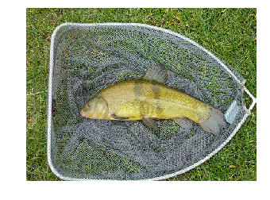

```
t_img = md.val_ds.transform（img）pred = learn.predict_array（t_img [ None ]）
```

```
idxs，dists = get_knn（nn_predwv，pred）show_imgs（[open_image（PATH / md.val_ds.fnames [i]）for id in idxs [1：4]]，3，figsize =（9,3））;
```


以下是所有其他图像。所以你可以看到，这很疯狂 - 我们在一小时内在所有ImageNet上训练过一个东西，使用一个基本上需要两行代码的自定义头，这些东西在300毫秒内运行来进行这些搜索。

Jeremy去年也教过这个基本想法，但它是在Keras，它是页面和代码页，所有内容都花了很长时间和复杂。那时候，杰里米说他无法开始思考你能做的所有事情。他认为还没有人真正深入思考过这个问题，但他认为这很有意思。因此，回过头来阅读DeVICE论文，因为Andrea有很多其他的想法，现在它很容易做到，希望人们现在可以深入研究。杰里米认为这很疯狂，令人惊叹。

好的，下周见！
