# 深度学习：第二部分第十二课

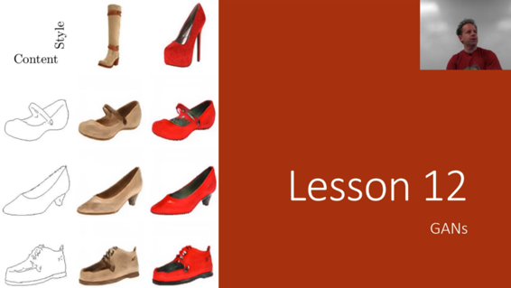

### 生成对抗网络（GAN）

[视频](https://youtu.be/ondivPiwQho) / [论坛](http://forums.fast.ai/t/part-2-lesson-12-in-class/15023)

非常热门的技术，但绝对值得深入学习课程的一部分，因为它们并没有被证明对任何事情都有用，但它们几乎就在那里并且肯定会到达那里。 我们将专注于它们在实践中肯定会有用的东西，并且在许多领域它们可能变得有用但我们还不知道。 因此我认为它们在实践中肯定会有用的区域是你在幻灯片左侧看到的那种东西 - 例如将绘图转换为渲染图片。 这是来自[2天前刚刚发布的论文](https://arxiv.org/abs/1804.04732) ，所以现在正在进行一项非常活跃的研究。

**从上一次讲座[** [**1:04**](https://youtu.be/ondivPiwQho%3Ft%3D1m4s) **]：**我们的多元化研究员之一Christine Payne拥有斯坦福大学的医学硕士学位，因此她有兴趣思考如果我们建立一种医学语言模型会是什么样子。 我们在第4课中简要介绍过但上次没有真正谈论过的事情之一就是这个想法，你实际上可以种下一个生成语言模型，这意味着你已经在一些语料库中训练了一个语言模型，然后你就是将从该语言模型生成一些文本。 你可以先用几句话来说“这是在语言模型中创建隐藏状态的前几个单词，然后从那里生成。 克里斯汀做了一些聪明的事情，就是用一个问题来播种它，并重复三次问题并让它从那里产生。 她提供了许多不同医学文本的语言模型，如下所示：

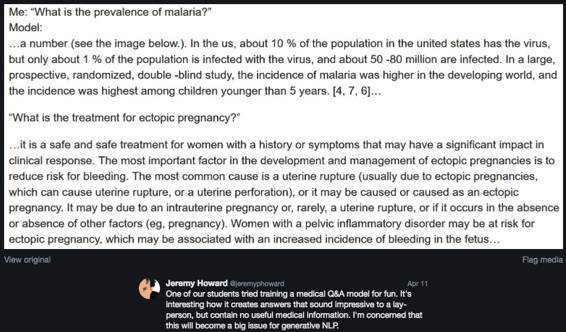

杰里米对此感到有趣的是，对于那些没有医学硕士学位的人来说，这是一个可信的答案。 但它与现实无关。 他认为这是一种有趣的道德和用户体验困境。 Jeremy参与​​了一家名为doc.ai的公司，该公司正在努力做一些事情，但最终为医生和患者提供了一个应用程序，可以帮助创建一个对话用户界面，帮助他们解决他们的医疗问题。 他一直在对那个团队的软件工程师说，请不要尝试使用LSTM创建一个生成模型，因为他们会非常善于创建听起来令人印象深刻的糟糕建议 - 有点像政治专家或终身教授谁可以说具有很大权威的背叛。 所以他认为这是非常有趣的实验。 如果你做了一些有趣的实验，请在论坛，博客，Twitter上分享。 让人们了解它并让真棒的人注意到。

#### CIFAR10  [[5:26](https://youtu.be/ondivPiwQho%3Ft%3D5m26s)] 

让我们来谈谈CIFAR10，原因是我们今天要研究一些比较简单的PyTorch的东西来构建这些生成的对抗模型。 现在根本没有对GAN说话的快速支持 - 很快就会出现，但目前还没有，我们将从头开始构建大量模型。 我们已经做了很多严肃的模型建设已经有一段时间了。 我们在课程的第1部分看了CIFAR10，我们制作了一些准确率达到85％的东西，花了几个小时训练。 有趣的是，现在正在进行一场竞赛，看谁能最快地训练CIFAR10（ [DAWN](https://dawn.cs.stanford.edu/benchmark/) ），目标是让它达到94％的准确率。 看看我们是否可以构建一个可以达到94％精度的架构会很有趣，因为这比我们之前的尝试要好得多。 希望在这样做的过程中，我们将学到一些关于创建良好架构的知识，这对于今天查看GAN非常有用。 此外它很有用，因为Jeremy在过去几年关于不同类型的CNN架构的论文中已经深入研究，并且意识到这些论文中的许多见解没有被广泛利用，并且显然没有被广泛理解。 因此，如果我们能够利用这种理解，他想告诉你会发生什么。

#### [cifar10-darknet.ipynb](https://github.com/fastai/fastai/blob/master/courses/dl2/cifar10-darknet.ipynb)  [[7:17](https://youtu.be/ondivPiwQho%3Ft%3D7m17s)] 

笔记本电脑被称为[暗网，](https://pjreddie.com/darknet/)因为我们要看的特定架构非常接近暗网架构。 但是你会在整个过程中看到暗网结构不是整个YOLO v3端到端的东西，而只是它们在ImageNet上预先训练过来进行分类的部分。 它几乎就像你能想到的最通用的简单架构，所以它是实验的一个非常好的起点。 因此我们将其称为“暗网”，但它并不是那样，你可以摆弄它来创造绝对不是暗网的东西。 它实际上只是几乎所有基于ResNet的现代架构的基础。

CIFAR10是一个相当小的数据集 [[8:06](https://youtu.be/ondivPiwQho%3Ft%3D8m6s)] 。 图像大小只有32 x 32，这是一个很好的数据集，因为：

*   与ImageNet不同，你可以相对快速地训练它
*   相对少量的数据
*   实际上很难识别图像，因为32乘32太小，不容易看到发生了什么。

这是一个不受重视的数据集，因为它已经过时了。 当他们可以使用整个服务器机房处理更大的数据时，谁想要使用小的旧数据集。 但它是一个非常好的数据集，专注于。

来吧，导入我们常用的东西，我们将尝试从头开始构建一个网络来训练 [[8:58](https://youtu.be/ondivPiwQho%3Ft%3D8m58s)] 。

```
 %matplotlib inline  %reload_ext autoreload  %autoreload 2 
```

```
 **from** **fastai.conv_learner** **import** *  PATH = Path("data/cifar10/")  os.makedirs(PATH,exist_ok= **True** ) 
```

对于那些对他们的广播和PyTorch基本技能没有100％信心的人来说，这是一个非常好的练习，可以理解Jeremy如何提出这些`stats`数据。 这些数字是CIFAR10中每个通道的平均值和标准偏差。 尝试并确保你可以重新创建这些数字，看看是否可以使用不超过几行代码（无循环！）来完成。

因为它们相当小，我们可以使用比平时更大的批量大小，这些图像的大小是32  [[9:46](https://youtu.be/ondivPiwQho%3Ft%3D9m46s)] 。

```
 classes = ('plane', 'car', 'bird', 'cat', 'deer', 'dog', 'frog',  'horse', 'ship', 'truck')  stats = (np.array([ 0.4914 , 0.48216, 0.44653]),  np.array([ 0.24703, 0.24349, 0.26159]))  num_workers = num_cpus()//2  bs=256  sz=32 
```

转换 [[9:57](https://youtu.be/ondivPiwQho%3Ft%3D9m57s)] ，通常我们使用这组标准的side_on转换，用于普通对象的照片。 我们不打算在这里使用它，因为这些图像非常小，试图将32 x 32的图像稍微旋转会引入大量的块状失真。 所以人们倾向于使用的标准变换是随机水平翻转，然后我们在每一侧添加4个像素（大小除以8）的填充。 一个非常有效的方法是默认情况下fastai不添加许多其他库所做的黑色填充。 Fastai拍摄现有照片的最后4个像素并翻转并反射它，我们发现默认情况下使用反射填充可以获得更好的效果。 现在我们有了40 x 40的图像，这组训练中的变换会随机选择一个32乘32的作物，所以我们得到一点变化而不是堆。 我们可以使用普通的`from_paths`来获取我们的数据。

```
 tfms = tfms_from_stats(stats, sz, aug_tfms=[RandomFlip()],  pad=sz//8)  data = ImageClassifierData.from_paths(PATH, val_name='test',  tfms=tfms, bs=bs) 
```

现在我们需要一个架构，我们将创建一个适合一个屏幕 [[11:07](https://youtu.be/ondivPiwQho%3Ft%3D11m7s)] 。 这是从头开始的。 我们使用预定义的`Conv2d` ， `BatchNorm2d` ， `LeakyReLU`模块，但我们没有使用任何块或任何东西。 整个过程都在一个屏幕上，所以如果你想知道我能理解一个现代的优质建筑，绝对是！ 我们来研究这个。

```
 **def** conv_layer(ni, nf, ks=3, stride=1):  **return** nn.Sequential(  nn.Conv2d(ni, nf, kernel_size=ks, bias= **False** , stride=stride,  padding=ks//2),  nn.BatchNorm2d(nf, momentum=0.01),  nn.LeakyReLU(negative_slope=0.1, inplace= **True** )) 
```

```
 **class** **ResLayer** (nn.Module):  **def** __init__(self, ni):  super().__init__()  self.conv1=conv_layer(ni, ni//2, ks=1)  self.conv2=conv_layer(ni//2, ni, ks=3)  **def** forward(self, x): **return** x.add_(self.conv2(self.conv1(x))) 
```

```
 **class** **Darknet** (nn.Module):  **def** make_group_layer(self, ch_in, num_blocks, stride=1):  **return** [conv_layer(ch_in, ch_in*2,stride=stride)  ] + [(ResLayer(ch_in*2)) **for** i **in** range(num_blocks)]  **def** __init__(self, num_blocks, num_classes, nf=32):  super().__init__()  layers = [conv_layer(3, nf, ks=3, stride=1)]  **for** i,nb **in** enumerate(num_blocks):  layers += self.make_group_layer(nf, nb, stride=2-(i==1))  nf *= 2  layers += [nn.AdaptiveAvgPool2d(1), Flatten(),  nn.Linear(nf, num_classes)]  self.layers = nn.Sequential(*layers)  **def** forward(self, x): **return** self.layers(x) 
```

一个体系结构的基本出发点是它是一堆堆叠的层，一般来说，层会有某种层次 [[11:51](https://youtu.be/ondivPiwQho%3Ft%3D11m51s)] 。 在最底层，有卷积层和批量规范层之类的东西，但是只要你有卷积，你可能会有一些标准序列。 通常它会是：

1.  CONV
2.  批量规范
3.  非线性激活（例如ReLU）

我们将首先确定我们的基本单元是什么，并在一个函数（ `conv_layer` ）中定义它，这样我们就不必担心尝试保持一致性，它会使一切变得更简单。

**Leaky Relu**  [[12:43](https://youtu.be/ondivPiwQho%3Ft%3D12m43s)] ：

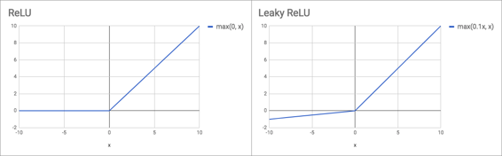

Leaky ReLU（其中_x_ &lt;0）的梯度变化但是大约0.1或0.01的常数。 它背后的想法是，当你处于负区域时，你不会得到零梯度，这使得更新它变得非常困难。 在实践中，人们发现Leaky ReLU在较小的数据集上更有用，而在大数据集中则不太有用。 但有趣的是，对于[YOLO v3](https://pjreddie.com/media/files/papers/YOLOv3.pdf)论文，他们使用了Leaky ReLU并从中获得了很好的表现。 它很少使事情变得更糟，它往往使事情变得更好。 因此，如果你需要创建自己的架构以使你的默认设置是使用Leaky ReLU，那可能并不错。

你会注意到我们没有在`conv_layer`定义PyTorch模块，我们只是做`nn.Sequential`  [[14:07](https://youtu.be/ondivPiwQho%3Ft%3D14m7s)] 。 如果你阅读其他人的PyTorch代码，这是真的未充分利用。 人们倾向于将所有东西都写成带有`__init__`和`forward`的PyTorch模块，但是如果你想要的东西只是一个接一个的序列，那么它就更简洁易懂，使它成为一个`Sequential` 。

**剩余块**  [[14:40](https://youtu.be/ondivPiwQho%3Ft%3D14m40s)] ：如前所述，在大多数现代网络中通常存在许多单元层次结构，现在我们知道ResNet的这个单元层次结构中的下一个层次是ResBlock或残差块（参见`ResLayer` ） 。 回到我们上次做CIFAR10时，我们过度简化了这一点（作弊一点）。 我们有`x`进来，我们通过`conv` ，然后我们将它添加回`x`出去。 在真正的ResBlock中，有两个。 当我们说“conv”时，我们将它用作我们的`conv_layer` （conv，batch norm，ReLU）的快捷方式。

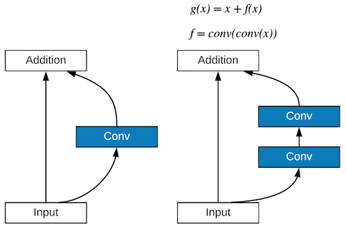

这里有一个有趣的见解是这些卷积中的通道数量 [[16:47](https://youtu.be/ondivPiwQho%3Ft%3D16m47s)] 。 我们有一些`ni`进来（一些输入通道/过滤器）。 黑暗人们设置的方式是他们让这些Res层中的每一个都输出相同数量的通道，Jeremy喜欢这个，这就是他在`ResLayer`使用它的原因，因为它让生活更简单。 第一个转换器将通道数量减半，然后第二个转换器将它再次加倍。 所以你有这种漏斗效果，64个频道进入，第一个转换为32个频道，然后再次恢复到64个频道。

**问题：**为什么`LeakyReLU`中的`LeakyReLU` `inplace=True`  [[17:54](https://youtu.be/ondivPiwQho%3Ft%3D17m54s)] ？ 谢谢你的询问！ 很多人都忘记了这个或者不知道它，但这是一个非常重要的记忆技术。 如果你考虑一下，这个`conv_layer` ，它是最低级别的东西，所以我们的ResNet中的所有内容一旦全部放在一起就会有很多`conv_layer` 。 如果你没有`inplace=True` ，那么它将为ReLU的输出创建一个完整的独立内存，因此它将分配一大堆完全没有必要的内存。 另一个例子是`ResLayer`中的原始`forward`看起来像：

```
 **def** forward(self, x): **return** x + self.conv2(self.conv1(x)) 
```

希望你们中的一些人可能还记得在PyTorch中，几乎每个函数都有一个下划线后缀版本，告诉它在原地进行。 `+`相当于`add`和就地版本`add_`所以这会减少内存使用量：

```
 **def** forward(self, x): **return** x.add_(self.conv2(self.conv1(x))) 
```

这些都是非常方便的小动作。 Jeremy最初忘记了`inplace=True` ，但是他不得不将批量减少到更低的数量，这让他发疯了 - 然后他意识到这种情况已经消失了。 如果你有 Dropout ，你也可以通过 Dropout 来做到这一点。 以下是需要注意的事项：

*   退出
*   所有激活功能
*   任何算术运算

**问题** ：在ResNet中，为什么在conv_layer  [[19:53](https://youtu.be/ondivPiwQho%3Ft%3D19m53s)] 中偏差通常设置为False？ 在`Conv` ，有一个`BatchNorm` 。 请记住， `BatchNorm`每次激活都有2个可学习的参数 - 你乘以的东西和你添加的东西。 如果我们在`Conv`有偏见然后在`BatchNorm`添加另一个东西，我们将添加两个完全没有意义的东西 - 这是两个权重，其中一个会做。 因此，如果你在`Conv`之后有BatchNorm，你可以告诉`BatchNorm`不要包含添加位，或者更容易告诉`Conv`不要包含偏差。 没有特别的损害，但同样，它需要更多的记忆，因为它需要跟踪更多的渐变，所以最好避免。

另外一个小技巧是，大多数人的`conv_layer`都有填充作为参数 [[21:11](https://youtu.be/ondivPiwQho%3Ft%3D21m11s)] 。 但一般来说，你应该能够轻松地计算填充。 如果你的内核大小为3，那么显然每侧会有一个单元重叠，所以我们要填充1.否则，如果它的内核大小为1，那么我们不需要任何填充。 所以一般来说，内核大小“整数除以”的填充是你需要的。 有时会有一些调整，但在这种情况下，这非常有效。 再次，尝试通过计算机为我计算内容来简化我的代码，而不是我自己必须这样做。

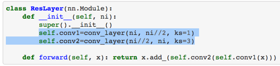

两个`conv_layer`的另一件事 [[22:14](https://youtu.be/ondivPiwQho%3Ft%3D22m14s)] ：我们有这个瓶颈的想法（减少通道然后再增加它们），还有使用的内核大小。 第一个有1比1的`Conv` 。 什么实际发生在1对1转？ 如果我们有4个4格的网格和32个滤波器/通道，我们将逐步进行转换，转换器的内核看起来像中间的那个。 当我们谈论内核大小时，我们从不提及最后一块 - 但是让我们说它是1乘1乘32，因为这是过滤器的一部分并过滤掉了。 内核以黄色放在第一个单元格上，我们得到这32个深位的点积，这给了我们第一个输出。 然后我们将它移动到第二个单元格并获得第二个输出。 因此，网格中的每个点都会有一堆点积。 它允许我们以任何方式在通道维度中更改维度。 我们正在创建`ni//2`过滤器，我们将有`ni//2`点积，这些产品基本上是输入通道的加权平均值。 通过非常少的计算，它可以让我们添加额外的计算和非线性步骤。 这是一个很酷的技巧，利用这些1比1的转换，创建这个瓶颈，然后再用3乘3转将其拉出 - 这将充分利用输入的2D性质。 或者，1乘1转并没有充分利用它。

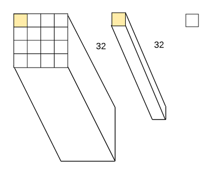

这两行代码中没有太多内容，但它是对你的理解和直觉的一个非常好的考验 [[25:17](https://youtu.be/ondivPiwQho%3Ft%3D25m17s)]  - 为什么它有效？ 为什么张量排队？ 为什么尺寸排列很好？ 为什么这是个好主意？ 它到底在做什么？ 摆弄它是一件非常好的事情。 也许在Jupyter Notebook中创建一些小的，自己运行它们，看看输入和输出是什么输入和输出。 真的感受到了这一点。 一旦你这样做了，你就可以玩弄不同的东西。

其中一篇真正[未被重视的](https://youtu.be/ondivPiwQho%3Ft%3D26m9s)论文是 [[26:09](https://youtu.be/ondivPiwQho%3Ft%3D26m9s)]  - [广泛的剩余网络](https://arxiv.org/abs/1605.07146) 。 这是非常简单的纸张，但他们所做的是他们用这两行代码摆弄：

*   我们做了什么`ni*2`而不是`ni//2` ？
*   如果我们添加了`conv3`怎么`conv3` ？

他们提出了这种简单的符号来定义两行代码的样子，并展示了大量的实验。 他们展示的是，这种减少ResNet中几乎普遍的渠道数量的瓶颈方法可能不是一个好主意。 事实上，从实验中，绝对不是一个好主意。 因为它会让你创建真正的深层网络。 创建ResNet的人因创建1001层网络而闻名。 但是关于1001层的事情是你在第1层完成之前无法计算第2层。在完成第2层计算之前，你无法计算第3层。所以它是顺序的。 GPU不喜欢顺序。 所以他们展示的是，如果你有更少的层，但每层有更多的计算 - 所以一个简单的方法是删除`//2` ，没有其他变化：

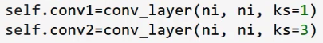

在家尝试一下。 尝试运行CIFAR，看看会发生什么。 甚至乘以2或摆弄。 这可以让你的GPU做更多的工作而且非常有趣，因为绝大多数谈论不同架构表现的论文从未实际计算通过它运行批量需要多长时间。 他们说“这个每批需要X次浮点运算”，但他们从来没有像真正的实验主义者那样费心去运行，并且发现它是更快还是更慢。 许多真正着名的体系结构现在变得像糖蜜一样缓慢并且需要大量的内存并且完全没用，因为研究人员从来没有真正费心去看它们是否很快并且实际上看它们是否适合RAM正常批量大小。 因此，广泛的ResNet纸张不同寻常之处在于它实际上需要花费多长时间才能获得同样的洞察力的YOLO v3纸张。 他们可能错过了Wide ResNet论文，因为YOLO v3论文得出了许多相同的结论，但Jeremy不确定他们选择了Wide ResNet论文，所以他们可能不知道所有这些工作都已完成。 很高兴看到人们真正计时并注意到实际上有意义的东西。

**问题** ：你对SELU（缩放指数线性单位）有何看法？  [[29:44](https://youtu.be/ondivPiwQho%3Ft%3D29m44s)]  [SELU](https://youtu.be/ondivPiwQho%3Ft%3D29m44s)主要用于全连接层，它允许你摆脱批量规范，基本的想法是，如果你使用这个不同的激活功能，它是自我规范化。 自我归一化意味着它将始终保持单位标准差和零均值，因此你不需要批量规范。 它并没有真正去过任何地方，原因是因为它非常挑剔 - 你必须使用一个非常具体的初始化，否则它不会以恰当的标准偏差和平均值开始。 很难将它与嵌入之类的东西一起使用，如果你这样做，你必须使用一种特殊的嵌入初始化，这对于嵌入是没有意义的。 你完成所有这些工作，很难做到正确，如果你最终做到了，那有什么意义呢？ 好吧，你已经设法摆脱了一些批量标准层，无论如何都没有真正损害你。 这很有趣，因为SELU论文 - 人们注意到它的主要原因是它是由LSTM的发明者创造的，并且它有一个巨大的数学附录。 因此人们认为“很多来自一个着名人物的数学 - 它一定很棒！”但在实践中，杰里米并没有看到任何人使用它来获得任何最先进的结果或赢得任何比赛。

`Darknet.make_group_layer`包含一堆`ResLayer`  [[31:28](https://youtu.be/ondivPiwQho%3Ft%3D31m28s)] 。 `group_layer`将有一些频道/过滤器进入。我们将通过使用标准的`conv_layer`加倍进入的频道数量。 可选地，我们将使用2的步幅将网格大小减半。然后我们将做一大堆ResLayers - 我们可以选择多少（2,3,8等），因为记住ResLayers不会改变网格大小和它们不会更改通道数，因此你可以添加任意数量的通道而不会出现任何问题。 这将使用更多的计算和更多的RAM，但没有其他理由，你不能添加任意多的。 因此， `group_layer`最终会使通道数增加一倍，因为初始卷积使通道数增加一倍，并且根据我们在`stride`传递的内容，如果我们设置`stride=2` ，它也可以将网格大小减半。 然后我们可以根据需要进行一大堆Res块计算。

为了定义我们的`Darknet` ，我们将传递一些看起来像这样的东西 [[33:13](https://youtu.be/ondivPiwQho%3Ft%3D33m13s)] ：

```
 m = Darknet([1, 2, 4, 6, 3], num_classes=10, nf=32)  m = nn.DataParallel(m, [1,2,3]) 
```

这说的是创建五个组层：第一个将包含1个额外的ResLayer，第二个将包含2个，然后是4个，6个，3个，我们希望从32个过滤器开始。 ResLayers中的第一个将包含32个过滤器，并且只有一个额外的ResLayer。 第二个，它将使过滤器的数量增加一倍，因为这是我们每次有新的组层时所做的事情。 所以第二个将有64，然后是128,256,512，那就是它。 几乎所有的网络都将成为那些层，并记住，这些组层中的每一个在开始时也都有一个卷积。 那么我们所拥有的就是在所有这一切发生之前，我们将在一开始就有一个卷积层，最后我们将进行标准的自适应平均池化，展平和线性层来创建数字最后的课程。 总结 [[34:44](https://youtu.be/ondivPiwQho%3Ft%3D34m44s)] ，在一端的一个卷积，自适应池和另一端的一个线性层，在中间，这些组层每个由卷积层和随后的`n`个ResLayers组成。

**自适应平均汇集**  [[35:02](https://youtu.be/ondivPiwQho%3Ft%3D35m2s)] ：杰里米曾多次提到这一点，但他还没有看到任何代码，任何地方，任何地方，使用自适应平均池。 他所看到的每一个人都像`nn.AvgPool2d(n)`那样写，其中`n`是一个特定的数字 - 这意味着它现在与特定的图像大小相关联，这绝对不是你想要的。 因此，大多数人仍然认为特定架构与特定大小相关联。 当人们认为这是一个巨大的问题，因为它确实限制了他们使用较小尺寸来启动建模或使用较小尺寸进行实验的能力。

**顺序**  [[35:53](https://youtu.be/ondivPiwQho%3Ft%3D35m53s)] ：创建体系结构的一个好方法是首先创建一个列表，在这种情况下，这是一个只有一个`conv_layer`的列表，而`make_group_layer`返回另一个列表。 然后我们可以使用`+=`将该列表附加到上一个列表，并对包含`AdaptiveAvnPool2d`另一个列表执行相同的操作。 最后，我们将调用所有这些层的`nn.Sequential` 。 现在， `forward`只是`self.layers(x)` 。

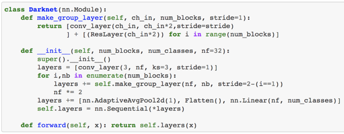

这是一个很好的图片，说明如何使你的架构尽可能简单。 有很多你可以摆弄。 你可以参数化`ni`的分隔符，使其成为你传入的数字以传递不同的数字 - 可能会执行2次。 你还可以传入更改内核大小的内容，或更改卷积层的数量。 杰里米有一个版本，他将为你运行，它实现了Wide ResNet论文中的所有不同参数，所以他可以摆弄一下，看看效果如何。

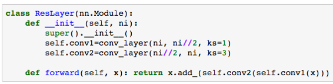

```
 lr = 1.3  learn = ConvLearner.from_model_data(m, data)  learn.crit = nn.CrossEntropyLoss()  learn.metrics = [accuracy]  wd=1e-4 
```

```
 %time learn.fit(lr, 1, wds=wd, cycle_len=30, use_clr_beta=(20, 20,  0.95, 0.85)) 
```

一旦我们得到了它，我们可以使用`ConvLearner.from_model_data`来获取我们的PyTorch模块和模型数据对象，并将它们变成学习器 [[37:08](https://youtu.be/ondivPiwQho%3Ft%3D37m8s)] 。 给它一个标准，如果我们愿意，添加一个指标，然后我们可以适应和离开我们去。

**问题** ：你能解释一下自适应平均汇总吗？ 如何设置1工作 [[37:25](https://youtu.be/ondivPiwQho%3Ft%3D37m25s)] ？ 当然。 通常当我们进行平均合并时，假设我们有4x4而且我们做了`avgpool((2, 2))`  [[40:35](https://youtu.be/ondivPiwQho%3Ft%3D40m35s)] 。 这会创建2x2区域（下方为蓝色）并取这四个区域的平均值。 如果我们传入`stride=1` ，则下一个是2x2，显示为绿色并取平均值。 所以这就是正常的2x2平均合并量。 如果我们没有任何填充，那将会输出3x3。 如果我们想要4x4，我们可以添加填充。

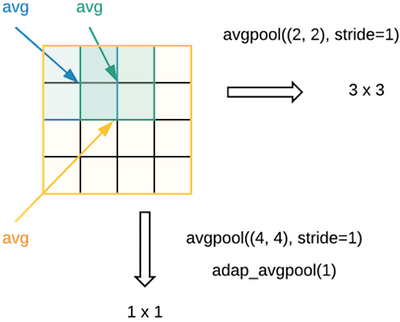

如果我们想要1x1怎么办？ 然后我们可以说`avgpool((4,4), stride=1)`将以黄色做4x4并且平均整个批次导致1x1。 但这只是一种方法。 而不是说汇集过滤器的大小，为什么我们不说“我不关心输入网格的大小是什么。 我总是一个接一个地想要“。 这就是你说`adap_avgpool(1)` 。 在这种情况下，你没有说明池化过滤器的大小，而是说出我们想要的输出大小。 我们想要一个接一个的东西。 如果你输入一个整数`n` ，它假定你的意思是`n`乘以`n` 。 在这种情况下，具有4x4网格的自适应平均合并1与平均合并（4,4）相同。 如果它是7x7网格，它将与平均合并（7,7）相同。 它是相同的操作，它只是表达它的方式，无论输入如何，我们想要一些大小的输出。

**DAWNBench**  [[37:43](https://youtu.be/ondivPiwQho%3Ft%3D37m43s)] ：让我们看看我们如何利用我们简单的网络来对抗这些最先进的结果。 杰里米准备好了。 我们已经把所有这些东西都放到了一个简单的Python脚本中，他修改了他提到的一些参数来创建一些他称之为`wrn_22`网络的东西，这种东西不是正式存在但是它对我们所讨论的参数有一些变化基于杰里米的实验。 它有一堆很酷的东西，如：

*   莱斯利史密斯的一个周期
*   半精度浮点实现

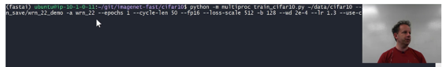

这将在具有8个GPU和Volta架构GPU的AWS p3上运行，这些GPU具有对半精度浮点的特殊支持。 Fastai是第一个将Volta优化的半精度浮点实际集成到库中的库，因此你可以自动`learn.half()`并获得该支持。 它也是第一个整合一个周期的人。

它实际上做的是使用PyTorch的多GPU支持 [[39:35](https://youtu.be/ondivPiwQho%3Ft%3D39m35s)] 。 由于有八个GPU，它实际上将启动八个独立的Python处理器，每个处理器将进行一些训练，然后最后它将梯度更新传递回将要集成的主进程他们都在一起。 所以你会看到很多进度条一起出现。

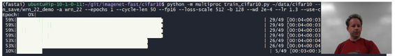

当你这样做时，你可以看到训练三到四秒。 在其他地方，当杰里米早些时候训练时，他每个时期得到30秒。 所以这样做，我们可以训练的东西快10倍，非常酷。

**检查状态**  [[43:19](https://youtu.be/ondivPiwQho%3Ft%3D43m19s)] ：

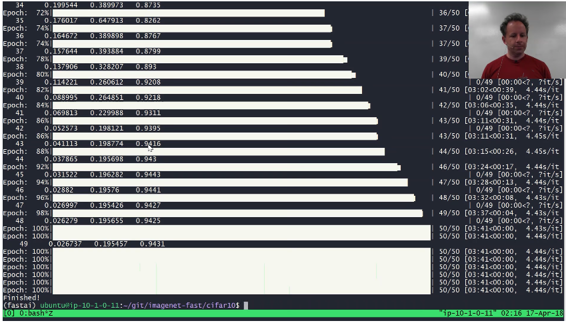

完成！ 我们达到了94％，耗时3分11秒。 以前最先进的是1小时7分钟。 是否值得摆弄这些参数并了解这些架构如何实际工作而不只是使用开箱即用的东西？ 好吧，圣洁的废话。 我们刚刚使用了一个公开的实例（我们使用了一个现场实例，所以每小时花费8美元--3分钟40美分），从头开始训练这比以往任何人都快20倍。 所以这是最疯狂的最先进的结果之一。 我们已经看过很多，但是这个只是把它从水中吹走了。 这部分归功于摆弄架构的那些参数，主要是坦率地说使用Leslie Smith的一个周期。 提醒它正在做什么 [[44:35](https://youtu.be/ondivPiwQho%3Ft%3D44m35s)] ，对于学习率，它创造了与向下路径同样长的向上路径，因此它是真正的三角形循环学习率（CLR）。 按照惯例，你可以选择x和y的比率（即起始LR /峰值LR）。 在

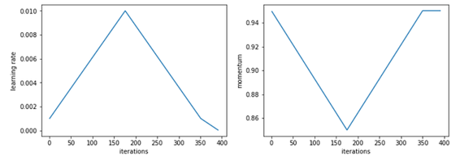

在这种情况下，我们选择了50比例。 所以我们开始时学习率要小得多。 然后它就有了这个很酷的想法，你可以说你的迭代占了三角形底部的百分比从几乎一直到零 - 这是第二个数字。 所以15％的批次都是从三角形底部进一步消耗的。

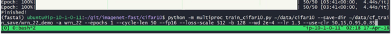

这不是一个周期的唯一作用，我们也有动力。 动量从.95到.85。 换句话说，当学习率非常低时，我们会使用很多动力，当学习率非常高时，我们使用的动量非常小，这很有意义但是直到Leslie Smith在论文中表明这一点，Jeremy从来没有看到有人以前做过。 这是一个非常酷的技巧。 你现在可以通过在fastai中使用`use-clr-beta`参数（ [Sylvain的论坛帖子](http://forums.fast.ai/t/using-use-clr-beta-and-new-plotting-tools/14702) ）来使用它，你应该能够复制最先进的结果。 你可以在自己的计算机或纸张空间中使用它，你唯一不会得到的是多GPU部件，但这使得它更容易进行训练。

**问题** ： `make_group_layer`包含步幅等于2，因此这意味着步幅为第1层，第2步为第二层。 它背后的逻辑是什么？ 通常我所看到的步伐是奇怪的 [[46:52](https://youtu.be/ondivPiwQho%3Ft%3D46m52s)] 。 跨栏是一两个。 我认为你在考虑内核大小。 所以stride = 2意味着我跳过两个意味着你将网格大小减半。 所以我认为你可能会对步幅和内核大小感到困惑。 如果你有一个步幅，网格大小不会改变。 如果你有两步，那就确实如此。 在这种情况下，因为这是CIFAR10,32乘32很小，我们不会经常将网格大小减半，因为很快我们就会耗尽单元格。 这就是为什么第一层有一个步幅，所以我们不会立即减小网格尺寸。 这是一种很好的方式，因为这就是为什么我们在第一个`Darknet([1, 2, 4, 6, 3], …)`数字很​​少。 我们可以从大网格上没有太多的计算开始，然后随着网格变得越来越小，我们可以逐渐进行越来越多的计算，因为较小的网格计算将花费更少的时间

### 生成性对抗网络（GAN） [[48:49](https://youtu.be/ondivPiwQho%3Ft%3D48m49s)] 

*   [Wasserstein GAN](https://arxiv.org/abs/1701.07875)
*   [用深层卷积生成对抗网络学习无监督表示](https://arxiv.org/abs/1511.06434)

我们将谈论生成对抗网络，也称为GAN，特别是我们将关注Wasserstein GAN论文，其中包括继续创建PyTorch的Soumith Chintala。 Wasserstein GAN（WGAN）深受卷积生成对抗性网络论文的影响，该论文也与Soumith有关。 这是一篇非常有趣的论文。 很多看起来像这样：

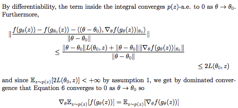

好消息是你可以跳过那些位，因为还有一些看起来像这样：

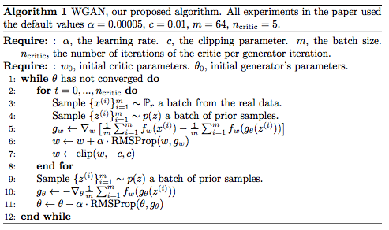

很多论文都有一个理论部分，似乎完全是为了超越评论者对理论的需求。 WGAN论文不是这样。 理论位实际上很有趣 - 你不需要知道它就可以使用它，但是如果你想了解一些很酷的想法并看到为什么这个特殊的算法背后的想法，它绝对是迷人的。 在这篇论文出来之前，杰里米知道没有人研究它所基于的数学，所以每个人都必须学习数学。 这篇文章很好地布置了所有的部分（你必须自己做一堆阅读）。 因此，如果你有兴趣深入挖掘一些论文背后的深层数学，看看研究它是什么样的，我会选择这个，因为在理论部分结束时，你会说“我现在可以看到他们为什么使这个算法成为现实。“

GAN的基本思想是它是一个生成模型 [[51:23](https://youtu.be/ondivPiwQho%3Ft%3D51m23s)] 。 它可以创建句子，创建图像或生成某些东西。 它会尝试创造一个很难分辨生成的东西和真实东西之间的东西的东西。 因此，可以使用生成模型来交换视频 - 这是一个非常有争议的深刻假货和伪造的色情内容。 它可以用来伪造某人的声音。 它可以用来假冒医学问题的答案 - 但在这种情况下，它不是真的假，它可能是一个医学问题的生成性答案，实际上是一个很好的答案，所以你生成语言。 例如，你可以为图像生成标题。 所以生成模型有很多有趣的应用。 但一般来说，它们需要足够好，例如，如果你使用它来为Carrie Fisher在下一部星球大战电影中自动创建一个新场景而且她不再玩那个部分，你想尝试生成她的形象看起来一样，然后它必须欺骗星球大战的观众思考“好吧，这看起来不像一些奇怪的嘉莉费舍尔 - 看起来像真正的嘉莉费舍尔。 或者，如果你正在尝试生成医学问题的答案，你希望生成能够很好地清晰读取的英语，并且听起来具有权威性和意义。 生成对抗网络的想法是我们不仅要创建生成图像的生成模型，而且要创建第二个模型来尝试选择哪些是真实的，哪些是生成的（我们称之为“假的”） ）。 因此，我们有一个生成器，它将创建我们的虚假内容和一个鉴别器，它将试图善于识别哪些是真实的，哪些是假的。 因此，将会有两个模型，它们将是对抗性的，意味着发电机将试图不断变得更好地愚弄鉴别者认为假货是真实的，并且鉴别器将试图在辨别力方面继续变得更好真假之间。 所以他们将要面对面。 它基本上就像杰里米刚才描述的那样容易 [[54:14](https://youtu.be/ondivPiwQho%3Ft%3D54m14s)] ：

*   我们将在PyTorch中构建两个模型
*   我们将创建一个训练循环，首先说鉴别器的损失函数是“你能告诉真实和假的区别，然后更新它的权重。
*   我们将为生成器创建一个损失函数，“你可以生成一些愚弄鉴别器并从损失中更新权重的东西。
*   我们将循环几次，看看会发生什么。

#### 看代码 [[54:52](https://youtu.be/ondivPiwQho%3Ft%3D54m52s)] 

[笔记本](https://github.com/fastai/fastai/blob/master/courses/dl2/wgan.ipynb)

你可以用GANS做很多不同的事情。 我们将做一些有点无聊但易于理解的事情，它甚至可能很酷，我们将从无到有生成一些图片。 我们只是想拍一些照片。 具体来说，我们将把它画成卧室的照片。 希望你有机会在一周内使用自己的数据集来解决这个问题。 如果你选择一个像ImageNet这样变化很大的数据集，然后让GAN尝试创建ImageNet图片，那么它往往不会很好，因为它不够清晰，你想要的图片。 所以最好给它，例如，有一个名为[CelebA](http://mmlab.ie.cuhk.edu.hk/projects/CelebA.html)的数据集，这是名人面孔的图片，与GAN很有效。 你创造了真正清晰的名人面孔，这些面孔实际上并不存在。 卧室数据集也很好 - 相同类型的图片。

有一种叫做LSUN场景分类数据集 [[55:55](https://youtu.be/ondivPiwQho%3Ft%3D55m55s)] 。

```
 **from** **fastai.conv_learner** **import** *  **from** **fastai.dataset** **import** *  **import** **gzip** 
```

下载LSUN场景分类数据集卧室类别，解压缩并将其转换为jpg文件（脚本文件夹位于`dl2`文件夹中）：

```
 curl 'http://lsun.cs.princeton.edu/htbin/download.cgi?tag=latest&category=bedroom&set=train' -o bedroom.zip 
```

```
 unzip bedroom.zip 
```

```
 pip install lmdb 
```

```
 python lsun-data.py {PATH}/bedroom_train_lmdb --out_dir {PATH}/bedroom 
```

这不在Windows上测试 - 如果它不起作用，你可以使用Linux框转换文件，然后将其复制。 或者，你可以从Kaggle数据集下载[此20％样本](https://www.kaggle.com/jhoward/lsun_bedroom) 。

```
 PATH = Path('data/lsun/')  IMG_PATH = PATH/'bedroom'  CSV_PATH = PATH/'files.csv'  TMP_PATH = PATH/'tmp'  TMP_PATH.mkdir(exist_ok= **True** ) 
```

在这种情况下，在处理我们的数据时，更容易使用CSV路径。 因此，我们生成一个包含我们想要的文件列表的CSV，以及一个假标签“0”，因为我们根本没有这些标签。 One CSV file contains everything in that bedroom dataset, and another one contains random 10%. It is nice to do that because then we can most of the time use the sample when we are experimenting because there is well over a million files even just reading in the list takes a while.

```
 files = PATH.glob('bedroom/**/*.jpg')  with CSV_PATH.open('w') as fo:  for f in files: fo.write(f'{f.relative_to(IMG_PATH)},0 \n ') 
```

```
 # Optional - sampling a subset of files  CSV_PATH = PATH/'files_sample.csv' 
```

```
 files = PATH.glob('bedroom/**/*.jpg')  with CSV_PATH.open('w') as fo:  for f in files:  if random.random()<0.1:  fo.write(f'{f.relative_to(IMG_PATH)},0 \n ') 
```

这看起来很熟悉 [[57:10](https://youtu.be/ondivPiwQho%3Ft%3D57m10s)] 。 这是在Jeremy意识到顺序模型要好得多之前。 因此，如果你将此与前一个带有顺序模型的conv块进行比较，那么这里有更多的代码行 - 但它与conv，ReLU，批量规范相同。

```
 **class** **ConvBlock** (nn.Module):  **def** __init__(self, ni, no, ks, stride, bn= **True** , pad= **None** ):  super().__init__()  **if** pad **is** **None** : pad = ks//2//stride  self.conv = nn.Conv2d(ni, no, ks, stride, padding=pad,  bias= **False** )  self.bn = nn.BatchNorm2d(no) **if** bn **else** **None**  self.relu = nn.LeakyReLU(0.2, inplace= **True** )  **def** forward(self, x):  x = self.relu(self.conv(x))  **return** self.bn(x) **if** self.bn **else** x 
```

我们要做的第一件事就是建立一个鉴别者 [[57:47](https://youtu.be/ondivPiwQho%3Ft%3D57m47s)] 。 鉴别器将接收图像作为输入，并且它将输出一个数字。 如果它认为这个图像是真实的，那么该数字应该更低。 当然，“它为较低数量做了什么”的事情并没有出现在架构中，而是出现在损失函数中。 因此，我们所要做的就是创建一个带图像并输出数字的东西。 很多这些代码都是从本文的原始作者那里借来的，因此一些命名方案与我们习惯的方法不同。 但它看起来与我们以前的相似。 我们从卷积开始（conv，ReLU，批量规范）。 然后我们有一堆额外的转换层 - 这不会使用残差，所以它看起来非常类似于一堆额外的层之前，但这些将是转换层而不是res层。 最后，我们需要追加足够的步幅2转换层，我们将网格尺寸减小到不大于4x4。 所以它将继续使用步幅2，将大小除以2，并重复直到我们的网格大小不大于4.这是一种很好的方法，可以在网络中创建任意数量的层来处理任意大小的图像和将它们转换为固定的已知网格大小。

**问题** ：GAN是否需要比狗与猫或NLP更多的数据？ 或者它是否可比 [[59:48](https://youtu.be/ondivPiwQho%3Ft%3D59m48s)] ？ 老实说，我有点不好意思说我不是GAN的专家。 我在第一部分讲的内容是我很乐意说的事情，我知道做这些事情的最好方法，所以我可以向你展示最先进的结果，就像我们在CIFAR10的帮助下做的一样学生们。 GANs我根本不在那里，所以我不太确定你需要多少。 一般来说，它似乎需要相当多但是记住我们在狗和猫中不需要太多的唯一原因是因为我们有一个预先训练过的模型，我们可以利用预先训练过的GAN模型并对它们进行微调，可能。 据我所知，我认为没有人这么做过。 这对于人们思考和实验来说可能是非常有趣的事情。 也许人们已经做到了，有些文献我们没有遇到过。 我对GAN中的主要文献有点熟悉，但我不知道所有这些，所以也许我错过了关于GAN中转学的一些内容。 但这不是需要太多数据的诀窍。

**问** ：那么巨大的加速结合了一个周期学习率和动量退火加上八个GPU并行训练的半精度？ 是否只能用消费者GPU进行半精度计算？ 另一个问题是，为什么计算从单精度到半精度的速度提高了8倍，而从单精度加倍只有2倍 [[1:01:09](https://youtu.be/ondivPiwQho%3Ft%3D1h1m9s)] ？ 好的，所以CIFAR10结果，从单一到一半的速度不是8倍。 它从单一到一半快2到3倍。 NVIDIA声称张量核的触发器表现在学术上是正确的，但实际上没有意义，因为它实际上取决于你需要什么样的电话 - 所以大约有2或3倍的改进。 所以半精度有点帮助，额外的GPU有点帮助，一个循环有助于大量，然后另一个关键部分是玩我告诉你的参数。 因此，仔细阅读广泛的ResNet论文，确定他们在那里找到的东西，然后编写你刚看到的架构版本，这使我们很容易摆弄参数，熬夜尝试各种可能的组合不同内核大小，内核数量，层组数量，层组大小。 请记住，我们确实存在瓶颈，但实际上我们倾向于将注意力集中在扩大上，因此我们增加了尺寸然后减小它，因为它更好地利用了GPU。 所有这些事情结合在一起，我会说一个周期可能是最关键的，但每个周期都会导致大幅加速。 这就是为什么我们能够比最先进的CIFAR10获得30倍的改进。 我们对其他事情有一些想法 - 在这个DAWN工作台完成之后，也许我们会尝试进一步看看我们是否能在一天内击败一分钟。 那会很有趣。

```
 **class** **DCGAN_D** (nn.Module):  **def** __init__(self, isize, nc, ndf, n_extra_layers=0):  super().__init__()  **assert** isize % 16 == 0, "isize has to be a multiple of 16"  self.initial = ConvBlock(nc, ndf, 4, 2, bn= **False** )  csize,cndf = isize/2,ndf  self.extra = nn.Sequential(*[ConvBlock(cndf, cndf, 3, 1)  **for** t **in** range(n_extra_layers)])  pyr_layers = []  **while** csize > 4:  pyr_layers.append(ConvBlock(cndf, cndf*2, 4, 2))  cndf *= 2; csize /= 2  self.pyramid = nn.Sequential(*pyr_layers)  self.final = nn.Conv2d(cndf, 1, 4, padding=0, bias= **False** )  **def** forward(self, input):  x = self.initial(input)  x = self.extra(x)  x = self.pyramid(x)  **return** self.final(x).mean(0).view(1) 
```

所以这是我们的鉴别器 [[1:03:37](https://youtu.be/ondivPiwQho%3Ft%3D1h3m37s)] 。关于一个架构要记住的重要事情是它没有做任何事情，而是有一些输入张量大小和等级，以及一些输出张量大小和等级。 如你所见，最后一个转换器有一个通道。 这与我们习惯的不同，因为通常我们的最后一件事是线性块。 但是我们这里的最后一层是转换块。 它只有一个通道，但它的网格大小约为4x4（不超过4x4）。 所以我们要输出来（让我们说它是4x4），4乘4乘1张。 然后我们做的是我们采取的意思。 所以它从4x4x1变为标量。 这有点像最终的自适应平均汇集，因为我们只有一个频道，我们采取均值。 所以这有点不同 - 通常我们首先进行平均汇总，然后我们通过一个全连接层来完成我们的一件事。 但这是一个渠道，然后取其平均值。 Jeremy怀疑如果我们按照正常方式行事会更好，但是他还没有尝试过，而且他并没有足够的直觉知道他是否遗漏了某些东西 - 但这将是一个有趣的实验尝试如果有人想要在一个输出后坚持自适应平均汇集层和全连接层。

所以这是一个鉴别者。 让我们假设我们已经有了一台发电机 - 有人说“好吧，这是一台生成卧室的发电机。 我希望你建立一个模型，可以找出哪些是真实的，哪些不是“。 我们将采用数据集并标记来自生成器的假卧室的一堆图像，以及来自LSUN数据集的一堆真实卧室的图像，以在每一个上粘贴1或0。 然后我们将尝试让鉴别器分辨出来。 所以这很简单。 但是我们没有得到发电机。 我们需要建立一个。 我们还没有谈到损失函数 - 我们将假设有一些损失函数来做这件事。

#### **发电机**  [[1:06:15](https://youtu.be/ondivPiwQho%3Ft%3D1h6m15s)] 

生成器也是一种架构，在我们有丢失函数和数据之前，它本身不会做任何事情。 但是张量的等级和大小是多少？ 生成器的输入将是随机数的向量。 在论文中，他们称之为“先前”。有多大？ 我们不知道。 这个想法是，一堆不同的随机数会产生不同的卧室。 因此，我们的生成器必须将向量作为输入，通过顺序模型将其粘贴，并将其转换为等级4张量（没有批量维度的等级3） - 高度宽度乘以3.因此在最后一步中， `nc` （数量为通道）必须最终成为3，因为它将创建一个大小的3通道图像。

```
 **class** **DeconvBlock** (nn.Module):  **def** __init__(self, ni, no, ks, stride, pad, bn= **True** ):  super().__init__()  self.conv = nn.ConvTranspose2d(ni, no, ks, stride,  padding=pad, bias= **False** )  self.bn = nn.BatchNorm2d(no)  self.relu = nn.ReLU(inplace= **True** )  **def** forward(self, x):  x = self.relu(self.conv(x))  **return** self.bn(x) **if** self.bn **else** x 
```

```
 **class** **DCGAN_G** (nn.Module):  **def** __init__(self, isize, nz, nc, ngf, n_extra_layers=0):  super().__init__()  **assert** isize % 16 == 0, "isize has to be a multiple of 16"  cngf, tisize = ngf//2, 4  **while** tisize!=isize: cngf*=2; tisize*=2  layers = [DeconvBlock(nz, cngf, 4, 1, 0)]  csize, cndf = 4, cngf  **while** csize < isize//2:  layers.append(DeconvBlock(cngf, cngf//2, 4, 2, 1))  cngf //= 2; csize *= 2  layers += [DeconvBlock(cngf, cngf, 3, 1, 1)  **for** t **in** range(n_extra_layers)]  layers.append(nn.ConvTranspose2d(cngf, nc, 4, 2, 1,  bias= **False** ))  self.features = nn.Sequential(*layers)  **def** forward(self, input): **return** F.tanh(self.features(input)) 
```

**问题** ：在ConvBlock中，为什么批量规范出现在ReLU之后（即`self.bn(self.relu(…))` ） [[1:07:50](https://youtu.be/ondivPiwQho%3Ft%3D1h7m50s)] ？ 我通常希望ReLU然后批量规范 [[1:08:23](https://youtu.be/ondivPiwQho%3Ft%3D1h8m23s)] 这实际上是对Jeremy有意义的顺序。 我们在暗网中的顺序是他们在暗网中使用的顺序，所以每个人似乎都有不同的顺序。 事实上，CIFAR10的大多数人都有不同的顺序，这是批量规范→ReLU→conv，这是一种古怪的思考方式，但事实证明，通常对于更好的残留块。 这被称为“预激活ResNet”。有一些博客文章在那里，人们已经尝试了不同的这些事情的顺序，它似乎很大程度上取决于它是什么特定的数据集和你正在做什么 - 虽然表现上的差异很小，除非是竞赛，否则你不会在意。

#### 反卷积 [[1:09:36](https://youtu.be/ondivPiwQho%3Ft%3D1h9m36s)] 

因此，生成器需要以向量开始，最终得到秩3张量。 我们还不知道该怎么做。 我们需要使用一种称为“反卷积”的东西，PyTorch称它为转置卷积 - 同样的东西，不同的名称。 解卷积不是减小网格尺寸，而是增加网格尺寸。 就像所有事情一样，它最容易在Excel电子表格中看到。

这是一个卷积。 比方说，我们开始使用带有单个通道的4 x 4网格单元。 让我们通过一个带有单个输出过滤器的3乘3内核。 所以我们在单个过滤器内核中有一个通道，所以如果我们不添加任何填充，我们将以2乘2结束。记住，卷积只是内核和产品的总和。适当的网格单元 [[1:11:09](https://youtu.be/ondivPiwQho%3Ft%3D1h11m9s)] 。 所以有我们标准的3乘3转1通道一个滤波器。

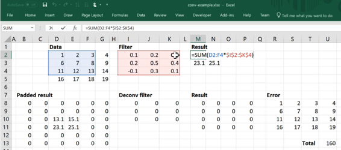

所以现在的想法是我们想要走向相反的方向 [[1:11:25](https://youtu.be/ondivPiwQho%3Ft%3D1h11m25s)] 。 我们想要从2乘2开始，我们想要创建一个4乘4.具体来说，我们想要创建与我们开始时相同的4乘4。 我们希望通过使用卷积来实现这一点。 我们怎么做？

如果我们有一个3乘3的卷积，那么如果我们想要创建一个4乘4的输出，我们将需要创建这么多的填充：

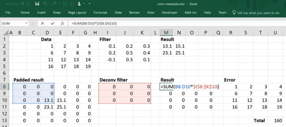

因为有这么大的填充，我们最终会得到4乘4.所以假设我们的卷积滤波器只是一堆零，那么我们可以通过这个减法来计算每个单元的误差：

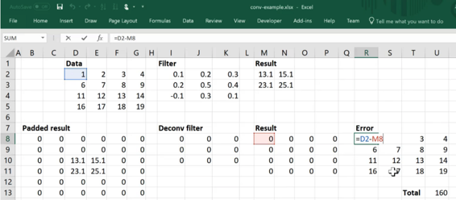

然后我们可以通过总结这些误差的绝对值来得到绝对值之和（L1损失）：

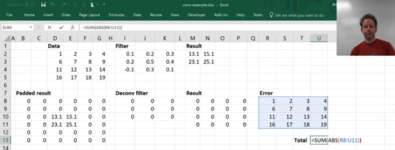

所以现在我们可以使用优化，在Excel中它被称为“求解器”来进行梯度下降。 因此，我们将Total cell设置为最小值，我们将尝试通过更改过滤器来减少损失。 你可以看到它有一个过滤器，结果就像数据一样。 它并不完美，一般来说，你不能认为解卷积可以完全创造出你想要的完全相同的东西，因为它还不够。 因为过滤器中有9个东西，结果中有16个东西。 但这是一次非常好的尝试。 所以这就是解卷积的样子 - 在2x2网格单元输入上的步幅1,3x3反卷积。

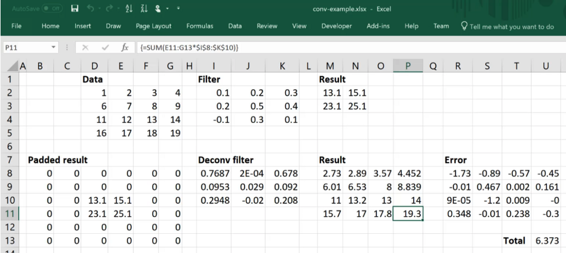

**问题** ：创建鉴别器以识别假新闻与真实新闻 [[1:13:43](https://youtu.be/ondivPiwQho%3Ft%3D1h13m43s)] 有多难？ 你不需要任何特别的东西 - 那只是一个分类器。 所以你只需要使用上一课和第4课的NLP分类器。在这种情况下，没有生成部分，所以你只需要一个数据集，说明这些是我们认为是假新闻的东西，这些是我们考虑的事情要成为真正的新闻，它实际上应该工作得很好。 据我们所知，如果你尝试一下，你应该得到与其他人一样好的结果 - 这是否足以在实践中有用，杰里米不知道。 在这个阶段你可以做的最好的事情就是产生一种分类，说这些东西看起来很粗略，基于它们的编写方式，然后一些人可以进入并对事实进行检查。 NLP分类器和RNN无法对事物进行事实检查，但它可以认识到这些是以那种高度普及的风格编写的，这种风格通常是假新闻写的，所以这些可能值得关注。 如果不利用某种外部数据源，这可能是你所希望的最好的。 但重要的是要记住鉴别器基本上只是一个分类器，除了我们已经学会做的NLP分类之外，你不需要任何特殊技术。

#### ConvTranspose2d  [[1:16:00](https://youtu.be/ondivPiwQho%3Ft%3D1h16m)] 

要在PyTorch中进行反卷积，只需说：

`nn.ConvTranspose2d(ni, no, ks, stride, padding=pad, bias=False)`

*   `ni` ：输入通道数
*   `no` ：输入通道数
*   `ks` ：内核大小

它被称为ConvTranspose的原因是因为事实证明这与卷积梯度的计算相同。 这就是他们称之为的原因。

**可视化**  [[1:16:33](https://youtu.be/ondivPiwQho%3Ft%3D1h16m33s)] 


<figcaption class="imageCaption">[http://deeplearning.net/software/theano/tutorial/conv_arithmetic.html](http://deeplearning.net/software/theano/tutorial/conv_arithmetic.html)</figcaption>

左边的一个就是我们刚看到做2x2反卷积的东西。 如果有一个步幅2，那么你不仅要在外面有填充物，而且你实际上也必须在中间填充填充物。 它们实际上并没有以这种方式实现，因为这样做很慢。 在实践中，你将以不同的方式实现它们，但这一切都发生在幕后，所以你不必担心它。 我们之前已经讨论过这个[卷积算术教程](http://deeplearning.net/software/theano/tutorial/conv_arithmetic.html) ，如果你仍然对卷积感觉不舒服，为了适应解卷积，这是一个很棒的网站。 如果你想看这篇论文，那就是[深度学习的卷积算法指南](https://arxiv.org/abs/1603.07285) 。

`DeconvBlock`看起来与`DeconvBlock`相同，只不过它有`Transpose`  [[1:17:49](https://youtu.be/ondivPiwQho%3Ft%3D1h17m49s)] 这个词。 我们像以前一样去转换→relu→批量规范，它有输入过滤器和输出过滤器。 唯一的区别是taht stride 2意味着网格大小将加倍而不是一半。

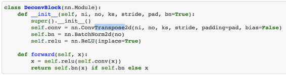

问题： `nn.ConvTranspose2d`和`nn.Upsample`似乎都做同样的事情，即从前一层扩展网格大小（高度和宽度）。 我们可以说`nn.ConvTranspose2d`总是优于`nn.Upsample` ，因为`nn.Upsample`只是调整大小并用零或插值填充未知数 [[1:18:10](https://youtu.be/ondivPiwQho%3Ft%3D1h18m10s)] ？ 不，你不能。 在distill.pub上有一篇名为Deconvolution [和Checkerboard Artifacts](https://distill.pub/2016/deconv-checkerboard/)的精彩互动论文，它指出我们现在正在做的事情非常不理想，但好消息是其他人都做到了。

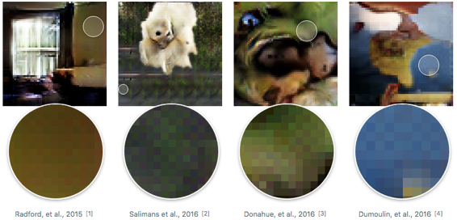

看看这里，你能看到这些棋盘文物吗？ 这些都是来自实际的论文，基本上他们注意到这些具有生成模型的论文中的每一篇都有这些棋盘格的文物，他们意识到这是因为当你有一个大小为3的内容的步幅2卷积时，它们重叠。 所以一些网格单元的激活次数是原来的两倍

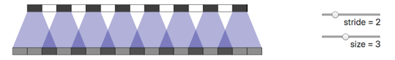

因此，即使你从随机权重开始，你最终也会得到一个棋盘格。 你得到的越深，越糟糕。 Jeremy发现，对于大多数生成模型，上采样更好。他们的建议不像应该的那样直接。 如果你`nn.Upsample` ，它基本上与池相反 - 它说让我们用四个（2x2）替换这个网格单元。 上采样的方法有很多 - 一种是将它们全部复制到这四种，另一种是使用双线性或双三次插值。 有各种技术可以尝试创建平滑的上采样版本，你可以在PyTorch中选择任何一种。 如果你做一个2 x 2上采样，然后定期步长一个3 x 3卷积，这是另一种做与ConvTranspose相同的事情 - 它将网格大小加倍并对其进行一些卷积算术。 对于生成模型，它几乎总是更好。 在那个distil.pub出版物中，他们表示这可能是一个很好的方法，但他们不只是出来说这样做，而杰里米只会说这样做。 话虽如此，对于GANS来说，他还没有取得那么大的成功，他认为可能需要进行一些调整才能让它发挥作用。问题在于，在早期阶段，它并没有产生足够的噪音。 他有一个版本，他试图用一个上传样本，你可以看到噪音看起来不是很嘈杂。 下周我们看一下风格转移和超级分辨率，你会看到`nn.Upsample`真的自成一体。

生成器，我们现在可以从向量 [[1:22:04](https://youtu.be/ondivPiwQho%3Ft%3D1h22m04s)] 开始。 我们可以决定并说好吧让我们不要把它想象成一个向量，但实际上它是1x1网格单元，然后我们可以把它变成4x4然后8x8等等。 这就是为什么我们必须确保它是一个合适的倍数，以便我们可以创造适当大小的东西。 正如你所看到的，它与以前完全相反。 它使得单元格大小一次变大2，直到它达到我们想要的大小的一半，然后最后我们在步骤1中再添加`n` 。然后我们再添加一个ConvTranspose最终达到我们想要的尺寸，我们就完成了。 最后，我们将它放在`tanh` ，这将迫使我们处于零到一个范围，因为我们当然不想输出任意大小的像素值。 因此，我们有一个生成器架构，它使用正确数量的通道输出一些给定大小的图像，其值在0和1之间。

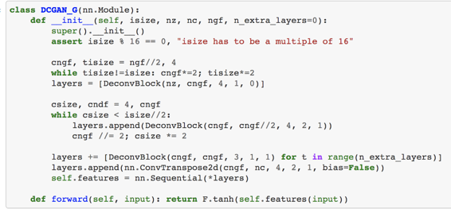

此时，我们现在可以创建模型数据对象 [[1:23:38](https://youtu.be/ondivPiwQho%3Ft%3D1h23m38s)] 。 这些东西需要一段时间来训练，所以我们用128到128（只是一种方便的方式使它更快一点）。 所以这将是输入的大小，但是我们将使用转换将其转换为64乘64。

最近有一些进展试图真正将其提高到高分辨率尺寸，但它们仍然需要批量大小为1或者批量和大量的GPU  [[1:24:05](https://youtu.be/ondivPiwQho%3Ft%3D1h24m5s)] 。 所以我们正在努力做一些我们可以用单个消费者GPU做的事情。 这是64乘64间卧室之一的示例。

```
 bs,sz,nz = 64,64,100 
```

```
 tfms = tfms_from_stats(inception_stats, sz)  md = ImageClassifierData.from_csv(PATH, 'bedroom', CSV_PATH,  tfms=tfms, bs=128, skip_header= **False** , continuous= **True** ) 
```

```
 md = md.resize(128) 
```

```
 x,_ = next(iter(md.val_dl)) 
```

```
 plt.imshow(md.trn_ds.denorm(x)[0]); 
```


#### 把它们放在一起 [[1:24:30](https://youtu.be/ondivPiwQho%3Ft%3D1h24m30s)] 

我们将手动完成所有操作，所以让我们继续创建我们的两个模型 - 我们的生成器和鉴别器，你可以看到它们是DCGAN，换句话说，它们与[本文](https://arxiv.org/abs/1511.06434)中出现的模块相同。 值得回顾并查看DCGAN论文以了解这些架构是什么，因为当你阅读Wasserstein GAN论文时，你已经知道这一点。

```
 netG = DCGAN_G(sz, nz, 3, 64, 1).cuda()  netD = DCGAN_D(sz, 3, 64, 1).cuda() 
```

**问题** ：如果我们想要0到1之间的值 [[1:25:06](https://youtu.be/ondivPiwQho%3Ft%3D1h25m6s)] ，我们不应该使用sigmoid吗？ 像往常一样，我们的图像已被标准化为-1到1的范围，因此它们的像素值不再在0和1之间。 这就是为什么我们希望值从-1到1，否则我们不会为鉴别器提供正确的输入（通过[这篇文章](http://forums.fast.ai/t/part-2-lesson-12-wiki/15023/140) ）。

所以我们有一个生成器和一个鉴别器，我们需要一个返回“先前”向量的函数（即一堆噪声） [[1:25:49](https://youtu.be/ondivPiwQho%3Ft%3D1h25m49s)] 。 我们通过创建一堆零来做到这一点。 `nz`是`z`的大小 - 在我们的代码中经常出现，如果你看到一个神秘的字母，那是因为那是他们在论文中使用的字母。 这里， `z`是我们的噪声向量的大小。 然后我们使用正态分布生成0到1之间的随机数。这需要是一个变量，因为它将参与渐变更新。

```
 **def** create_noise(b):  **return** V(torch.zeros(b, nz, 1, 1).normal_(0, 1)) 
```

```
 preds = netG(create_noise(4))  pred_ims = md.trn_ds.denorm(preds)  fig, axes = plt.subplots(2, 2, figsize=(6, 6))  **for** i,ax **in** enumerate(axes.flat): ax.imshow(pred_ims[i]) 
```

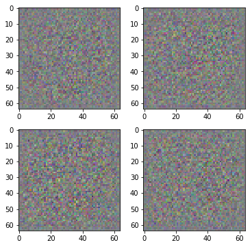

所以这里是一个创建一些噪音并产生四种不同噪音的例子。

```
 **def** gallery(x, nc=3):  n,h,w,c = x.shape  nr = n//nc  **assert** n == nr*nc  **return** (x.reshape(nr, nc, h, w, c)  .swapaxes(1,2)  .reshape(h*nr, w*nc, c)) 
```

我们需要一个优化器来更新渐变 [[1:26:41](https://youtu.be/ondivPiwQho%3Ft%3D1h26m41s)] 。 在Wasserstein GAN论文中，他们告诉我们使用RMSProp：

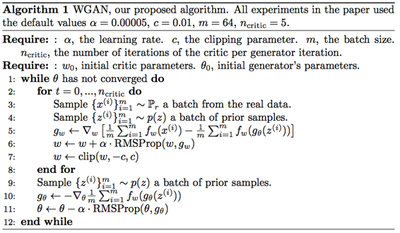

我们可以在PyTorch中轻松完成：

```
 optimizerD = optim.RMSprop(netD.parameters(), lr = 1e-4)  optimizerG = optim.RMSprop(netG.parameters(), lr = 1e-4) 
```

在论文中，他们建议学习率为0.00005（ `5e-5` ），我们发现`1e-4`似乎有效，所以我们把它做得更大了。

现在我们需要一个训练循环 [[1:27:14](https://youtu.be/ondivPiwQho%3Ft%3D1h27m14s)] ：

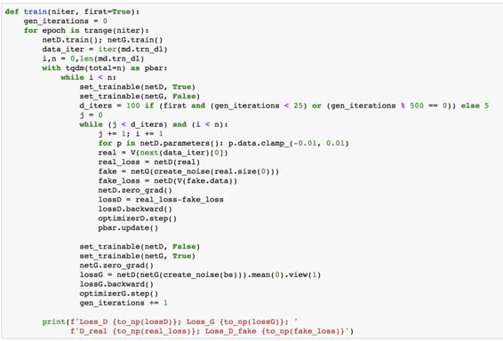

<figcaption class="imageCaption">为了更容易阅读</figcaption>

训练循环将经历我们要选择的一些时期（因此这将是一个参数）。 请记住，当你手动完成所有操作时，你必须记住要执行的所有手动步骤：

1.  在进行训练时，你必须将模块设置为训练模式，并在评估时进入评估模式，因为在训练模式下，批量规范更新发生并且发生丢失，在评估模式下，这两个事情将被关闭。
2.  我们将从训练数据加载器中获取迭代器
3.  我们将看到我们要经历多少步骤，然后我们将使用`tqdm`为我们提供一个进度条，我们将经历这么多步骤。

本文算法的第一步是更新鉴别器（在论文中，他们称鉴别者为“批评者”， `w`是批评者的权重）。 所以第一步是训练我们的批评者一点点，然后我们将训练我们的发生器一点点，我们将回到循环的顶部。 文中的内部`for`循环对应于我们代码中的第二个`while`循环。

我们现在要做的是我们现在有一个随机的发电机 [[1:29:06](https://youtu.be/ondivPiwQho%3Ft%3D1h29m6s)] 。 所以我们的发电机会产生看起来像噪音的东西。 首先，我们需要教导我们的鉴别器来区分噪音和卧室之间的区别 - 这不应该是你想要的太难。 所以我们只是以通常的方式进行，但有一些小的调整：

1.  我们将获取一小批真实的卧室照片，这样我们就可以从迭代器中获取下一批，将其转换为变量。
2.  然后我们将计算损失 - 所以这将是鉴别者认为这看起来多么伪造（“真实的看起来是假的吗？”）。
3.  然后我们将创建一些假图像，为此我们将创建一些随机噪声，我们将通过我们的生成器将其粘贴在此阶段只是一堆随机权重。 这将创建一批迷你假图像。
4.  然后我们将通过与之前相同的鉴别器模块进行处理以获得损失（“假的看起来有多假？”）。 请记住，当你手动执行所有操作时，必须将循环中的渐变（ `netD.zero_grad()` ）归零。 如果你忘记了这一点，请回到第1部分课程，我们从头开始做所有事情。
5.  最后，总识别器损失等于实际损失减去假损失。

所以你可以在这里看到 [[1:30:58](https://youtu.be/ondivPiwQho%3Ft%3D1h30m58s)] ：

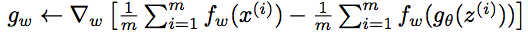

他们没有谈论损失，他们实际上只是谈论其中一个渐变更新。

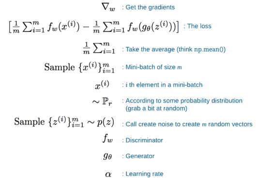

在PyTorch中，我们不必担心获得渐变，我们可以只指定损失和调用`loss.backward()`然后鉴别器的`optimizer.step()`  [[1:34:27](https://youtu.be/ondivPiwQho%3Ft%3D1h34m27s)] 。 有一个关键步骤是我们必须将所有权重作为PyTorch模块中的参数保持在-0.01和0.01的小范围内。 为什么？ 因为使该算法有效的数学假设仅适用于小球。 有趣的是要理解为什么会出现这种情况的数学，但这对于这篇论文非常具体，理解它不会帮助你理解任何其他论文，所以只有你感兴趣才能学习它。 这很好地解释了，Jeremy认为这很有趣，但除非你超越GAN，否则你将无法重复使用其他信息。 他还提到，在出现并改进后，Wasserstein GAN表示有更好的方法来确保你的权重空间在这个紧张的球中，这是为了惩罚太高的渐变，所以现在有一些稍微不同的方法这个。 但是这行代码是关键的贡献，它是Wasserstein GAN的原因：

```
 **for** p **in** netD.parameters(): p.data.clamp_(-0.01, 0.01) 
```

最后，我们有一个鉴别器，可以识别真正的卧室和我们完全随机的蹩脚生成的图像 [[1:36:20](https://youtu.be/ondivPiwQho%3Ft%3D1h36m20s)] 。 我们现在尝试创建一些更好的图像。 因此，现在将可训练的鉴别器设置为假，将可训练的发生器设置为真，将发生器的梯度归零。 我们的损失再次是发电机的`fw` （鉴别器）应用于一些更随机的噪声。 所以它与之前我们在噪声上做发生器然后将其传递给鉴别器完全相同，但这一次，可训练的是发生器，而不是鉴别器。 换句话说，在伪代码中，它们更新的东西是Ɵ，它是生成器的参数。 因此它需要噪声，生成一些图像，尝试找出它们是假的还是真实的，并使用它来获得关于生成器的渐变，而不是之前我们得到它们的鉴别器，并使用它来更新我们的权重与RMSProp具有alpha学习率 [[1:38:21](https://youtu.be/ondivPiwQho%3Ft%3D1h38m21s)] 。

```
 **def** train(niter, first= **True** ):  gen_iterations = 0  **for** epoch **in** trange(niter):  netD.train(); netG.train()  data_iter = iter(md.trn_dl)  i,n = 0,len(md.trn_dl)  **with** tqdm(total=n) **as** pbar:  **while** i < n:  set_trainable(netD, **True** )  set_trainable(netG, **False** )  d_iters = 100 **if** (first **and** (gen_iterations < 25)  **or** (gen_iterations % 500 == 0)) **else** 5  j = 0  **while** (j < d_iters) **and** (i < n):  j += 1; i += 1  **for** p **in** netD.parameters():  p.data.clamp_(-0.01, 0.01)  real = V(next(data_iter)[0])  real_loss = netD(real)  fake = netG(create_noise(real.size(0)))  fake_loss = netD(V(fake.data))  netD.zero_grad()  lossD = real_loss-fake_loss  lossD.backward()  optimizerD.step()  pbar.update()  set_trainable(netD, **False** )  set_trainable(netG, **True** )  netG.zero_grad()  lossG = netD(netG(create_noise(bs))).mean(0).view(1)  lossG.backward()  optimizerG.step()  gen_iterations += 1  print(f'Loss_D {to_np(lossD)}; Loss_G {to_np(lossG)}; '  f'D_real {to_np(real_loss)}; Loss_D_fake  {to_np(fake_loss)}') 
```

你会发现鉴别器正在接受训练的_ncritic_时间（上面代码中的`d_iters` ）是不公平的，每当我们训练一次发生器时它们就会设置为5。 本文稍微讨论了这一点，但基本思路是，如果鉴别器不知道如何区分，那么没有必要使发生器更好。 这就是为什么我们有第二个while循环。 这是5：

```
 d_iters = 100 **if** (first **and** (gen_iterations < 25)  **or** (gen_iterations % 500 == 0)) **else** 5 
```

实际上在后面的论文或者补充材料中添加的东西是这样的想法，即在开始时不时和多次，你应该在鉴别器上做更多的步骤以确保鉴别器能够。

```
 torch.backends.cudnn.benchmark= **True** 
```

让我们训练一个迭代：

```
 train(1, **False** ) 
```

```
 0%| | 0/1 [00:00<?, ?it/s]  100%|██████████| 18957/18957 [19:48<00:00, 10.74it/s]  Loss_D [-0.67574]; Loss_G [0.08612]; D_real [-0.1782]; Loss_D_fake [0.49754]  100%|██████████| 1/1 [19:49<00:00, 1189.02s/it] 
```

然后让我们创建一些噪音，这样我们就可以生成一些例子。

```
 fixed_noise = create_noise(bs) 
```

但在此之前，将学习率降低10并再做一遍：

```
 set_trainable(netD, **True** )  set_trainable(netG, **True** )  optimizerD = optim.RMSprop(netD.parameters(), lr = 1e-5)  optimizerG = optim.RMSprop(netG.parameters(), lr = 1e-5) 
```

```
 train(1, **False** ) 
```

```
 0%| | 0/1 [00:00<?, ?it/s]  100%|██████████| 18957/18957 [23:31<00:00, 13.43it/s]  Loss_D [-1.01657]; Loss_G [0.51333]; D_real [-0.50913]; Loss_D_fake [0.50744]  100%|██████████| 1/1 [23:31<00:00, 1411.84s/it] 
```

然后让我们使用噪声将它传递给我们的生成器，然后通过我们的非规范化将其转换回我们可以看到的东西，然后绘制它：

```
 netD.eval(); netG.eval();  fake = netG(fixed_noise).data.cpu()  faked = np.clip(md.trn_ds.denorm(fake),0,1)  plt.figure(figsize=(9,9))  plt.imshow(gallery(faked, 8)); 
```

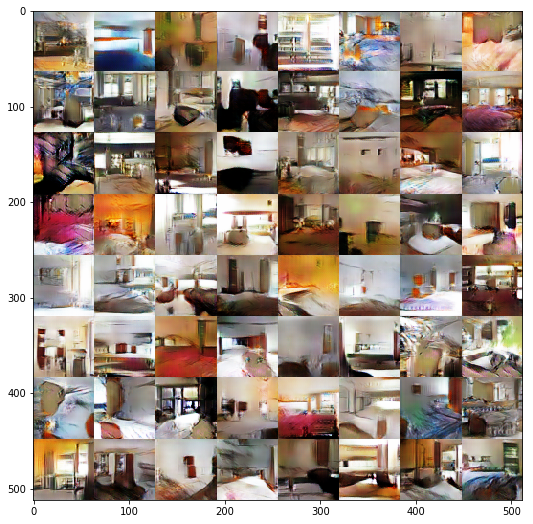

我们有一些卧室。 这些不是真正的卧室，有些看起来不像卧室，但有些看起来很像卧室，所以这就是主意。 那是GAN。 考虑GAN的最佳方式是它就像一种你可能永远不会使用的底层技术，但你会以很多有趣的方式使用它。 例如，我们将使用它来创建循环GAN。

**问题** ：有没有理由将RMSProp专门用作优化器而不是Adam等 [[1:41:38](https://youtu.be/ondivPiwQho%3Ft%3D1h41m38s)] ？ 我不记得在论文中明确讨论过它。 我不知道这只是实验还是理论上的原因。 看看报纸，看看它的内容。

[来自论坛](http://forums.fast.ai/t/part-2-lesson-12-wiki/15023/211)

> 从实验中我发现亚当和WGAN不仅工作更糟 - 它导致完全无法训练有意义的发电机。

> 来自WGAN论文：

> _最后，作为否定结果，我们报告说，当一个人使用基于动量的优化器（例如Adam [8]（β1&gt; 0）对评论者或者使用高学习率时，WGAN训练变得不稳定。_ _由于评论家的损失是非平稳的，基于动量的方法似乎表现更差。_ _我们将动量确定为潜在原因，因为随着损失的爆发和样本变得更糟，亚当步和梯度之间的余弦通常变为负值。_ _这个余弦是负面的唯一地方是在这些不稳定的情况下。_ _因此，我们改用RMSProp [21]，即使在非常不稳定的问题上也能表现良好_

**问题** ：在训练时哪种方法可以检测过度拟合？ 或者在我们完成训练后评估其中一个GAN模型的表现？ 换句话说，火车/瓦尔/测试装置的概念如何转化为GAN  [[1:41:57](https://youtu.be/ondivPiwQho%3Ft%3D1h41m57s)] ？ 这是一个很棒的问题，并且有很多人开玩笑说GAN是如何在一个你不需要测试集的领域，人们通过制作东西并说它看起来很棒来利用它。 GAN有一些着名的问题，其中一个叫做模式崩溃。 模式崩溃发生在你看卧室的地方，结果发现每种可能的噪声向量都只有三种卧室。 你看看你的画廊，结果发现它们都是同一个东西，或者只是三个不同的东西。 如果你崩溃到少数模式，如3或4，很容易看到模式崩溃。但是如果你有一个模式崩溃到10,000模式怎么办？ 因此，只有10,000个可能的卧室，所有的噪声向量都会崩溃。 你将无法在我们刚看到的画廊视图中看到，因为你不可能在10,000个房间中拥有两个相同的卧室。 或者如果这些卧室中的每一个基本上都是其中一个输入的直接副本 - 它基本上记住了一些输入。 可能会发生吗？ 事实上，大多数论文都没有做好工作，有时也没有做任何检查这些事情的工作。 因此，我们如何评估GANS的问题，甚至可能我们应该正确地评估GAN的问题，即使是现在还没有得到广泛的理解。 有些人正试图真正推动。 Ian Goodfellow是最着名的深度学习书籍的第一作者，也是GAN的发明者，他一直在发送连续的推文，提醒人们正确测试GAN的重要性。 如果你看到一篇声称具有特殊GAN结果的论文，那么这绝对值得关注。 他们谈过模式崩溃了吗？ 他们谈过记忆吗？ 等等。

**问题** ：GAN可以用于数据增加 [[1:45:33](https://youtu.be/ondivPiwQho%3Ft%3D1h45m33s)] 吗？ 是的，绝对可以使用GAN进行数据扩充。 你应该？ 我不知道。 有些论文试图用GAN进行半监督学习。 我还没有发现任何特别引人注目的东西，它们在广泛研究的真正有趣的数据集上展示了最先进的结果。 我有点怀疑并且我有点怀疑的原因是因为根据我的经验，如果你用合成数据训练模型，神经网络将非常善于识别你的合成数据的具体问题和那个结束它正在学习的东西。 有许多其他方法可以完成半监督模型。 有些地方可以工作。 例如，你可能还记得Otavio Good在缩放转换网络的第1部分中创建了奇妙的可视化，其中显示了通过MNIST的信件，至少在那个时候，他是自动遥控车比赛中的头号人物，并且他接受了训练他的模型使用综合增强数据，他基本上拍摄了一辆汽车在赛道上行驶的真实视频，并添加假人和假冒其他车辆。 我认为这很有效，因为A.他是一个天才和B.因为我认为他有一个明确定义的小子集，他必须工作。但总的来说，使用合成数据真的很难。 几十年来我一直尝试使用合成数据和模型（显然不是GAN，因为它们很新）但总的来说很难做到。 非常有趣的研究问题。

### 循环GAN  [[1:41:08](https://youtu.be/ondivPiwQho%3Ft%3D1h41m8s)] 

[纸](https://arxiv.org/abs/1703.10593) / [笔记本](https://github.com/fastai/fastai/blob/master/courses/dl2/cyclegan.ipynb)

我们将使用循环GAN将马变成斑马。 你还可以使用它将Monet打印成照片或将夏天的Yosemite照片变成冬天。


这将是非常直接的，因为它只是一个神经网 [[1:44:46](https://youtu.be/ondivPiwQho%3Ft%3D1h44m46s)] 。 我们要做的就是创建一个包含大量斑马照片的输入，每一个我们都会将它与一张等效的马照片配对，我们只需训练一个从一个到另一个的神经网络。 或者你可以为每一幅莫奈画作同样的事情 - 创建一个包含该地方照片的数据集......哦等等，这是不可能的，因为莫奈画的地方不再存在，并且没有确切的斑马版本的马......这是怎么回事？ 这似乎打破了我们所知道的关于神经网络可以做什么以及它们如何做到的一切。

所以不知怎的，伯克利的这些人们在没有任何照片的情况下，将一匹马变成了斑马的模型。 除非他们去那里画马并拍摄前后拍摄，但我相信他们并没有 [[1:47:51](https://youtu.be/ondivPiwQho%3Ft%3D1h47m51s)] 。 那他们是怎么做到的呢？ 这是天才。

我认识的那个现在正在做最有趣的循环GAN练习的人是我们的学生之一Helena Sarin [**@** glagolista](https://twitter.com/glagolista) 。 她是我所知道的唯一一位GAN艺术家。

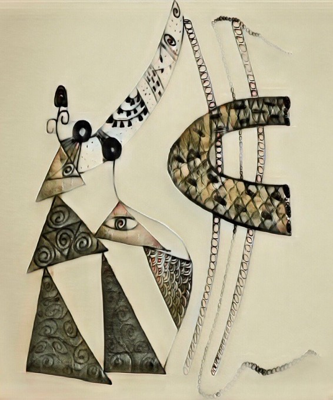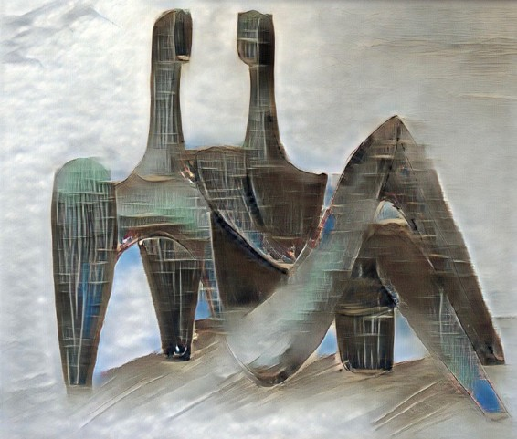

这里有一些她的惊人作品，我觉得它真的很有趣。 我在本课程开始时提到过，GAN属于那些尚不存在的东西，但它几乎就在那里。 在这种情况下，世界上至少有一个人使用GAN（特别是循环GAN）创造美丽而非凡的艺术作品。 我知道至少有十几个人正在使用神经网络进行有趣的创造性工作。 创意人工智能领域将会大幅扩展。


这是基本技巧 [[1:50:11](https://youtu.be/ondivPiwQho%3Ft%3D1h50m11s)] 。 这是来自循环GAN论文。 我们将有两个图像（假设我们正在使用图像）。 关键是它们不是配对图像，因此我们没有马匹和等效斑马的数据集。 我们有一堆马和一堆斑马。 抓一匹马_X_ ，抓住一匹斑马_Y._ 我们将训练一个将马变成斑马的发电机（他们称之为“映射功能”）。 我们将调用映射函数_G_ ，我们将创建一个映射函数（也就是生成器），将斑马变为马，我们将调用_F._我们将创建一个鉴别器，就像我们之前所做的一样。尽可能地从假马中识别真实，这将是_Dx。_ 另一个在识别真实斑马的情况下尽可能好的鉴别器，我们称之为_Dy_ 。 这是我们的出发点。

使这项工作的关键 [[1:51:27](https://youtu.be/ondivPiwQho%3Ft%3D1h51m27s)]  - 所以我们在这里产生一个损失函数（ _Dx_和_Dy_ ）。 我们将创造一种称为**循环一致性损失的**东西，在你用你的发电机将你的马变成斑马之后，并检查我是否能够认识到它是真实的。 我们将我们的马变成斑马，然后尝试将斑马变回我们开始的同一匹马。 然后我们将要有另一个功能来检查这匹马是否完全不知道_x_生成的这匹马是否完全来自这匹斑马_Y，它_是否与原始马相似。 因此，如果你生成的斑马看起来不像你的原始马，那么你就没有机会将它变回原始的马。 因此，将_x-hat_与_x_进行比较的损失将非常糟糕，除非你可以进入_Y_并再次退出，如果你能够创建看起来像的斑马线，你可能会做到这一点原始的马让你知道原始马的样子。 反之亦然 - 带上你的斑马，把它变成假马，并检查你是否能识别出来，然后尝试将它变回原始的斑马并检查它是否与原始斑马一样。

所以注意_F_ （斑马到马）和_G_ （马到斑马）做两件事 [[1:53:09](https://youtu.be/ondivPiwQho%3Ft%3D1h53m9s)] 。他们都把原始的马变成了斑马，然后把斑马变成了原始的马。所以只有两台发电机。反向映射没有单独的生成器。你必须使用与原始映射相同的生成器。所以这就是循环一致性损失。我认为这是天才。认为这是一件甚至可能的事情。老实说，当它出现时，我从来没有想过，我甚至可以尝试解决这个问题。看起来显然是不可能的，然后你可以像这样解决它的想法 - 我只是觉得它太聪明了。

看看本文中的方程是很好的，因为它们是很好的例子 - 它们写得非常简单，并且它不像Wasserstein GAN论文中的一些，它有很多理论证明和其他任何东西 [[1:54:05](https://youtu.be/ondivPiwQho%3Ft%3D1h54m5s)] 。在这种情况下，它们只是用于说明正在发生的事情的方程式。你真的想要达到可以阅读并理解它们的程度。

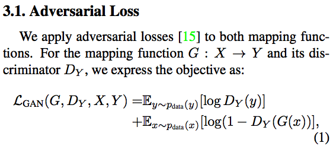

所以我们有一匹马_X_和斑马_Y_  [[1:54:34](https://youtu.be/ondivPiwQho%3Ft%3D1h54m34s)] 。对于一些映射函数_G_，这是我们的马到斑马映射函数然后有一个GAN损失，我们已经熟悉它说我们有一匹马，一匹斑马，一个假斑马识别器和一个马斑马发生器。失败是我们之前看到的 - 它是我们能够从斑马中抽出一只斑马并识别它是真的还是假的。然后拿一匹马把它变成一匹斑马，并确认这是真的还是假的。然后你做一个减去另一个（在这种情况下，他们有一个登录，但日志不是非常重要）。所以这就是我们刚看到的东西。这就是为什么我们先做Wasserstein GAN。这只是数学形式的标准GAN损失。

**问题**：所有这些听起来都非常像是将一种语言翻译成另一种语言然后再翻译成原文。有没有GAN或任何等价的翻译 [[1:55:54](https://youtu.be/ondivPiwQho%3Ft%3D1h55m54s)] ？[来自论坛的论文](https://arxiv.org/abs/1711.00043)。回到我所知道的 - 通常用翻译你需要这种配对输入（即平行文本 - “这是这个英文句子的法语翻译”）。最近有几篇论文显示了在没有配对数据的情况下创建高质量翻译模型的能力。我没有实现它们，我不理解我没有实现的任何东西，但它们可能正在做同样的基本想法。我们会在一周内查看它并回复你。

**循环一致性损失**  [[1:57:14](https://youtu.be/ondivPiwQho%3Ft%3D1h57m14s)] ：所以我们有一个GAN损失，下一个是循环一致性损失。所以这里的基本想法是我们从我们的马开始，使用我们的斑马发生器创建斑马，使用我们的马发生器创建一匹马并将其与原始马进行比较。这个双线与1是L1损失 - 差异的绝对值之和 [[1:57:35](https://youtu.be/ondivPiwQho%3Ft%3D1h57m35s)] 。如果这是2，那么它将是L2损失，因此2范数将是平方差的总和。

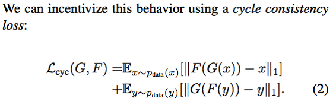

我们现在知道这个波浪形的想法，这是来自我们的马匹抓住了一匹马。这就是我们所说的分布样本。有各种各样的分布，但最常见的是在这些论文中我们使用的是经验分布，换句话说，我们有一些数据行，抓住一排。所以在这里，它是说从数据中抓取一些东西，我们将称之为_x_。重新夺回：

1.  从我们的马图片中，抓住一匹马
2.  把它变成斑马
3.  把它变回马
4.  将其与原始值和绝对值之和进行比较
5.  为马匹做斑马也是如此
6.  并将两者加在一起

这就是我们的周期一致性损失。

**完全目标**  [[1:58:54](https://youtu.be/ondivPiwQho%3Ft%3D1h58m54s)] 

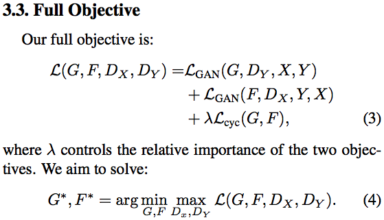

现在我们得到了我们的损失函数，整个损失函数取决于：

*   我们的马发电机
*   斑马发电机
*   我们的马识别器
*   我们的斑马识别器（又名鉴别器）

我们要加起来：

*   识别马匹的GAN损失
*   识别斑马的GAN损失
*   我们两台发电机的循环一致性损失

我们在这里有一个lambda，希望我们已经习惯了这个想法，现在就是当你有两种不同的损失时，你可以将参数放在那里，你可以将它们相乘，所以它们的大小相同 [[1:59： 23](https://youtu.be/ondivPiwQho%3Ft%3D1h59m23s)] 。当我们进行本地化时，与分类器丢失相比，我们的边界框丢失做了类似的事情。

然后，对于这种损失函数，我们将尝试最大化鉴别器区分的能力，同时最小化发生器的能力。因此，发电机和鉴别器将相互对立。当你在论文中看到这个_最小的_东西时，它基本上意味着这个想法，在你的训练循环中，有一件事是试图让事情变得更好，另一件事是试图让事情变得更糟，并且有很多方法可以做到但是最常见的是，你会在两者之间交替。你会经常看到这在数学论文中被称为min-max。因此，当你看到min-max时，你应该立即考虑**对抗训练**。

#### 实施循环GAN  [[2:00:41](https://youtu.be/ondivPiwQho%3Ft%3D2h41s)] 

我们来看看代码吧。我们将做一些几乎闻所未闻的事情，我开始查看其他人的代码，我并不那么反感，因为我把整件事扔掉了，自己做了。我实际上说我非常喜欢这个，我很喜欢它，我会把它展示给我的学生。[这](https://github.com/junyanz/pytorch-CycleGAN-and-pix2pix)是代码的来源，这是为循环GAN创建原始代码的人之一，他们创建了PyTorch版本。我不得不把它清理干净但实际上它非常好。关于这个很酷的事情是你现在要看到fast.ai的几乎所有部分或者其他人用不同方式写的fast.ai的所有相关部分。因此，你将了解他们如何处理数据集，数据加载器，模型，训练循环等。

你会发现有一个`cgan`目录 [[2:02:12](https://youtu.be/ondivPiwQho%3Ft%3D2h2m12s)] 基本上几乎是原始的一些清理，我希望有时候作为公关提交。它是以一种方式编写的，不幸的是它使它与它们如何将它用作脚本有点联系，所以我清理了一点，所以我可以将它用作模块。但除此之外，它非常相似。

```
 **from** **fastai.conv_learner** **import** *  **from** **fastai.dataset** **import** *  来自 cgan.options.train_options  import *
```

因此`cgan`，他们的代码是从他们的github repo中复制的，并进行了一些小的更改。`cgan`设置迷你库的方式是，他们假设的配置选项正如脚本一样传递。所以他们有`TrainOptions().parse`方法，我基本上传递了一系列脚本选项（我的数据，有多少线程，我想要退出，有多少次迭代，我要称之为这个模型，我想要运行哪个GPU）它在）。这给了我们一个`opt`对象，你可以看到它包含的内容。你会发现它包含了一些我们没有提到的东西，因为它有我们没有提到的其他一些东西的默认值。

```
opt = TrainOptions（）。parse（[' -  dataroot'，'/ data0 / datasets / cyclegan / horse2zebra'，' -  nThreads'，'8'，' -  no_dropout'，' -  niter'，'100 '，' -  niter_decay'，'100'，' -  name'，'nodrop'，' -  gpu_ids'，'2']）
```

因此，我们将主要使用cgan的东西，而不是使用fast.ai的东西。

```
 从 cgan.data.data_loader  进口 CreateDataLoader  从 cgan.models.models  导入 create_model
```

我们首先需要的是数据加载器。因此，这也是你再次练习使用所选编辑器或IDE浏览代码的能力的绝佳机会。我们将开始`CreateDataLoader`。你应该能够找到符号或在vim标签中直接跳转到`CreateDataLoader`我们可以看到正在创建一个`CustomDatasetDataLoader`。然后我们可以看到`CustomDatasetDataLoader`是一个`BaseDataLoader`。我们可以看到它将使用标准的PyTorch DataLoader，所以这很好。我们知道如果你要使用标准的PyTorch DataLoader，你已经传递了一个数据集，我们知道数据集包含一个长度和一个索引器，所以当我们看到`CreateDataset`它会这样做时。

这是`CreateDataset`和这个库不仅仅循环GAN - 它处理对齐和未对齐的图像对 [[2:04:46](https://youtu.be/ondivPiwQho%3Ft%3D2h4m46s)] 。我们知道我们的图像对是不对齐的，所以我们要去`UnalignedDataset`。

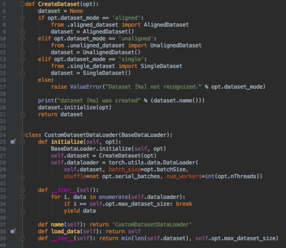

正如所料，它已经`__getitem__`和`__len__`。对于长度，A和B是我们的马和斑马，我们有两套，所以无论哪一个更长的是长度`DataLoader`。`__getitem__`将要：

*   随机从我们的两匹马和斑马中抓取一些东西
*   用枕头（PIL）打开它们
*   通过一些转换运行它们
*   然后我们可以把马变成斑马或斑马变成马，所以有一些方向
*   归还我们的马，斑马，通往马的道路和斑马之路

希望你能看到这看起来非常类似于fast.ai的那种东西。Fast.ai在转换和表现方面显然做得更多，但请记住，这是这一件事的研究代码，他们做了所有这些工作真的很酷。


```
data_loader = CreateDataLoader（opt）dataset = data_loader.load_data（）dataset_size = len（data_loader）dataset_size
```

```
 1334 
```

我们有一个数据加载器，所以我们可以将数据加载到它 [[2:06:17](https://youtu.be/ondivPiwQho%3Ft%3D2h6m17s)] 。这将告诉我们其中有多少个迷你批次（这是PyTorch中数据加载器的长度）。

下一步是创建模型。同样的想法，我们有不同类型的模型，我们将做一个循环GAN。

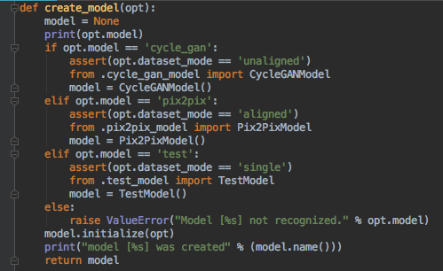

这是我们的`CycleGANModel`。里面有很多东西`CycleGANModel`，让我们一起来看看会用到什么。在这个阶段，我们刚刚调用初始化器，所以当我们初始化它时，它将通过并定义两个发生器，这对于我们的马匹和斑马发生器来说并不奇怪。它有一些方法可以生成一个假数据池，然后我们就会抓住我们的GAN损失，因为我们谈到我们的循环一致性损失是L1损失。他们将使用亚当，所以很明显，对于骑行GANS，他们发现亚当的效果非常好。然后我们将为我们的马鉴别器，我们的斑马鉴别器的优化器和我们的发生器的优化器提供优化器。生成器的优化器将在一个地方包含马发生器和斑马发生器的参数。

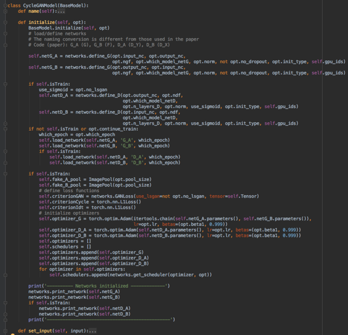

所以初始化器将设置我们需要的所有不同网络和丢失函数，它们将被存储在`model` [[2:08:14](https://youtu.be/ondivPiwQho%3Ft%3D2h8m14s)] 内。

```
 model = create_model（opt） 
```

然后打印出来并向我们展示我们所拥有的PyTorch模型。有趣的是看到他们正在使用ResNets，所以你可以看到ResNets看起来很熟悉，所以我们有conv，批量规范，Relu。`InstanceNorm`基本上与批量规范相同，但它一次适用于一个图像，并且差异不是特别重要。你可以看到他们正在做反射填充，就像我们一样。你可以看到当你尝试从头开始构建所有东西时，这是很多工作，你可以忘记fast.ai自动为你做的好东西。你必须手工完成所有这些操作，只有你最终得到它们的一部分。所以随着时间的推移，希望很快，我们将把所有这些GAN的东西都放到fast.ai中，它会很好很容易。

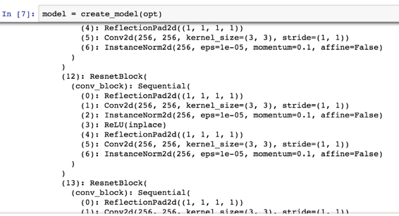

我们得到了我们的模型并记住模型包含损失函数，生成器，鉴别器，所有这些都在一个方便的地方 [[2:09:32](https://youtu.be/ondivPiwQho%3Ft%3D2h9m32s)] 。我已经完成了复制和粘贴并稍微重构了他们的代码中的训练循环，以便我们可以在笔记本中运行它。所以这个应该看起来很熟悉。循环遍历每个时期，循环遍历数据。在我们这样做之前，我们建立了`dataset`。这实际上不是PyTorch数据集，我认为这是他们稍微混淆地讨论他们所谓的模型数据对象 - 他们需要的所有数据。通过它`tqdm`来获取进度条，现在我们可以查看模型中发生的情况。

```
TOTAL_STEPS = 0  对于历元在范围（opt.epoch_count，opt.niter + opt.niter_decay + 1）：epoch_start_time =了time.time（）iter_data_time =了time.time（）epoch_iter = 0  为 I，数据在 tqdm（枚举（数据集））：iter_start_time = time.time（） if total_steps％opt.print_freq == 0：t_data = iter_start_time  -  iter_data_time total_steps + = opt.batchSize epoch_iter + = opt.batchSize model.set_input（data）model.optimize_parameters（） if total_steps ％opt.display_freq == 0：save_result = total_steps％opt.update_html_freq == 0  iftotal_steps％opt.print_freq == 0：errors = model.get_current_errors（）t =（time.time（） -  iter_start_time）/ opt.batchSize  if total_steps％opt.save_latest_freq == 0：print（' save the latest model（epoch）％d，total_steps ％d）' ％（epoch，total_steps））model.save（'latest'）iter_data_time = time.time（） if epoch％opt.save_epoch_freq == 0：print（'end the model of the model of end epoch ％d，iters ％d ' ％（epoch，total_steps））model.save（'latest'）model.save（epoch）print（'epoch ％d / ％d'） \ t时间：％d sec'％（epoch，opt.niter + opt.niter_decay，time.time（）-  epoch_start_time））model.update_learning_rate（）
```

`set_input` [[2:10:32](https://youtu.be/ondivPiwQho%3Ft%3D2h10m32s)] ：这与我们在fast.ai所做的不同。这有点整洁，它非常特定于循环GAN，但基本上在这个模型内部是这个想法，我们将进入我们的数据并抓住适当的。我们要么是骑马到斑马，要么是斑马到马，这取决于我们走哪条路，`A`要么是马还是斑马，反之亦然。如有必要，请将其放在适当的GPU上，然后抓住相应的路径。因此，该模型现在拥有一批小马和一批小批量的斑马。

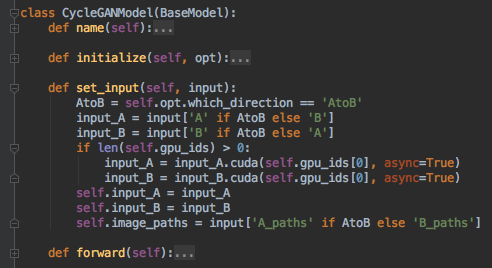

现在我们优化参数 [[2:11:19](https://youtu.be/ondivPiwQho%3Ft%3D2h11m19s)] 。很高兴看到它像这样。你可以看到每一步。首先，尝试优化发生器，然后尝试优化马鉴别器，然后尝试优化斑马鉴别器。`zero_grad()`是PyTorch的一部分，以及`step()`。所以有趣的是在发生器上进行反向传播的实际情况。

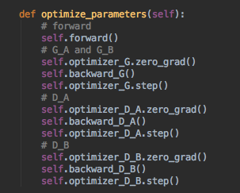

这是 [[2:12:04](https://youtu.be/ondivPiwQho%3Ft%3D2h12m4s)] 。让我们跳到关键部分。我们刚才在论文中看到了所有的公式。让我们骑一匹马并生成斑马。我们现在使用鉴别器来判断我们是否可以判断它是否是假的（`pred_fake`）。然后让我们将其放入我们之前设置的损失函数中，以根据该预测获得GAN损失。让我们使用相反的鉴别器向相反的方向做同样的事情然后再通过损失函数。然后让我们做循环一致性损失。再次，我们采取我们创建的假货，并尝试将其再次转回原始版本。让我们使用我们之前创建的循环一致性损失函数将其与真实原始数据进行比较。这就是lambda - 所以我们使用了一些权重，实际上我们只是使用他们在选项中建议的默认值。然后对相反的方向做同样的事情，然后将它们全部加在一起。然后我们做后退步骤。而已。

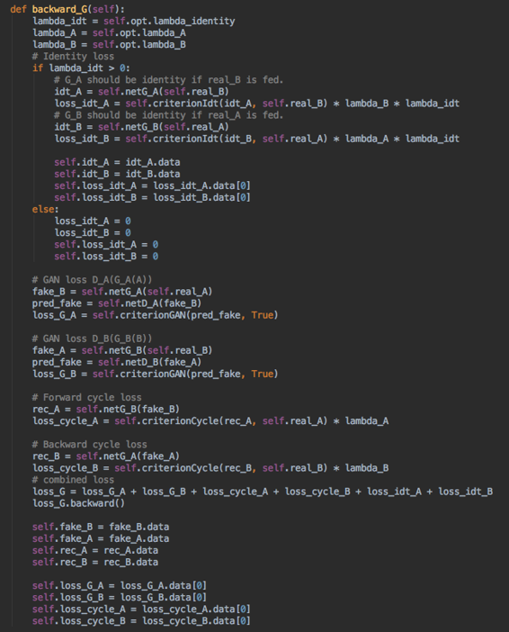

所以我们可以为第一个鉴别器 [[2:13:50](https://youtu.be/ondivPiwQho%3Ft%3D2h13m50s)]  做同样的事情。由于现在基本上所有的工作都已完成，所以这里做的事情要少得多。就是那样。我们不会全力以赴，但它基本上与我们已经看过的基本相同。

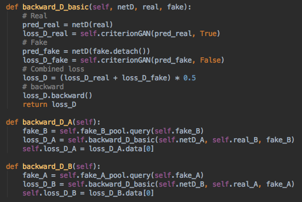

所以`optimize_parameters()`计算损失并执行优化步骤。有时，保存并打印出一些结果。然后，不时更新学习率，这样他们就可以在这里建立一些学习率退火。有点像fast.ai，他们有调度员的想法，然后你可以用它来更新你的学习率。

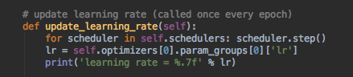

对于那些有兴趣更好地理解深度学习API，为fast.ai做出更多贡献，或者在某些不同的后端创建自己的某些内容版本感兴趣的人来说，看看涵盖某些子集的第二个API是很酷的。一些类似的事情，以了解他们如何解决这些问题以及相似/不同之处。

```
 def show_img（im，ax = None，figsize = None）： **if** **not** ax: fig,ax = plt.subplots(figsize=figsize)  ax.imshow(im) ax.get_xaxis（）。set_visible（False）ax.get_yaxis（）。set_visible（False） **return** ax 
```

```
 def get_one（data）：model.set_input（data）model.test（） 返回列表（model.get_current_visuals（）。values（））
```

```
 model.save（201） 
```

```
test_ims = []  for i，o in enumerate（dataset）： if i> 10：break  test_ims.append（get_one（o））
```

```
 def show_grid（ims）：fig，axes = plt.subplots（2,3，figsize =（9,6）） for i，ax in enumerate（axes.flat）：show_img（ims [i]，ax）; fig.tight_layout（）
```

```
 对于我在范围（8）：show_grid（test_ims [I]）
```

我们训练了一段时间然后我们可以抓住几个例子，在这里我们有它们 [[2:15:29](https://youtu.be/ondivPiwQho%3Ft%3D2h15m29s)] 。这里有马匹，斑马，还有马匹。

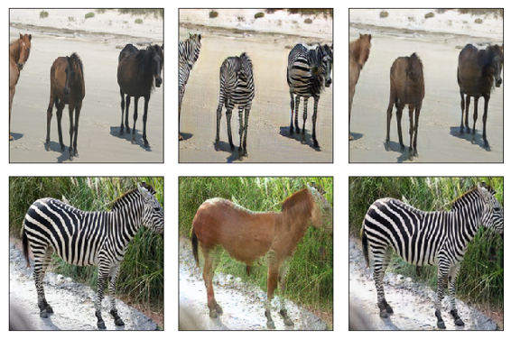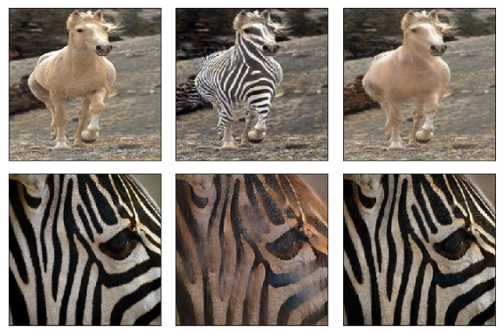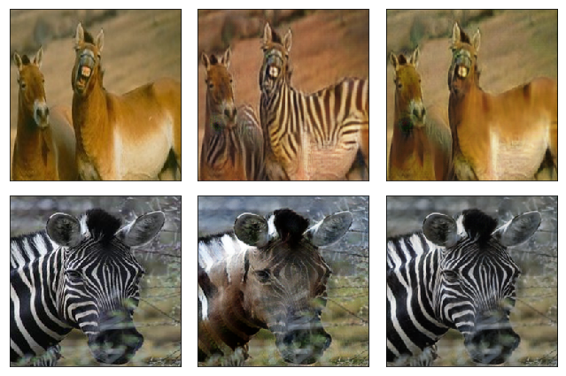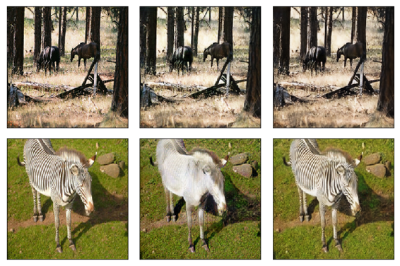

我花了24个小时训练它甚至那么远，所以它有点慢 [[2:16:39](https://youtu.be/ondivPiwQho%3Ft%3D2h16m39s)] 。我知道海伦娜一直在Twitter上抱怨这些事情需要多长时间。我不知道她是如何富有成效的。

```
＃！wget https://people.eecs.berkeley.edu/~taesung_park/CycleGAN/datasets/horse2zebra.zip
```

我会提到昨天刚出来的另一件事 [[2:16:54](https://youtu.be/ondivPiwQho%3Ft%3D2h16m54s)] ：

[多模态无监督图像到图像的翻译](https://arxiv.org/abs/1804.04732)

现在有一个多模态图像来对未配对的图像进行翻译。所以你现在基本上可以用这只狗创造不同的猫。

这基本上不仅仅是创建一个你想要的输出示例，而是创建多个输出。这是昨天或前一天发布的。我觉得这太棒了。所以你可以看到这项技术是如何发展的，我认为有很多机会可以用音乐，演讲，写作或者为艺术家创造一种工具。
