# 第一部分第二课

+   [论坛](http://forums.fast.ai/t/wiki-lesson-2/9399/1)
+   [笔记本](https://github.com/fastai/fastai/blob/master/courses/dl1/lesson1.ipynb)

## 回顾上一课[ [01:02](https://youtu.be/JNxcznsrRb8%3Ft%3D1m2s) ]

*   我们使用3行代码来构建图像分类器。
*   为了训练模型，需要在`PATH`下以某种方式组织数据（在本例中为`data/dogscats/` ）：

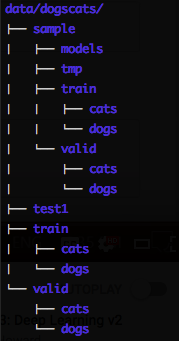

*   应该有`train`文件夹和`valid`文件夹，并且在每个文件夹下都有带有分类标签的文件夹（例如本例中的`cats` ），其中包含相应的图像。
*   训练输出： `[epoch #, training loss, validation loss, accuracy]`

```
 [ 0. 0.04955 0.02605 0.98975] 
```

## 学习率[ [4:54](https://youtu.be/JNxcznsrRb8%3Ft%3D4m54s) ]

*   学习率的基本思想是，它将决定我们对解决方案的缩放/打磨速度。

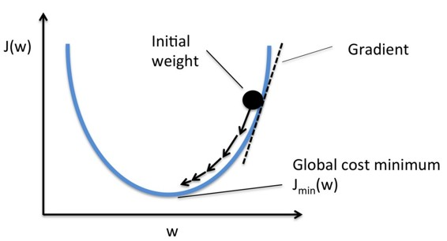

*   如果学习率太小，则需要很长时间才能达到最低点。
*   如果学习率太大，它可能会在底部摆动。
*   学习率查找器（ `learn.lr_find` ）将在每个小批量之后提高学习率。 最终，学习率太高，损失会变得更糟。 然后，我们查看学习率与损失的关系曲线，确定最低点并返回一个幅度，并选择它作为学习率（下例中为`1e-2` ）。
*   小批量是我们每次查看的一组图像，因此我们有效地使用 GPU 的并行处理能力（通常一次 64 或 128 个图像）
*   在 Python 中：

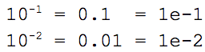

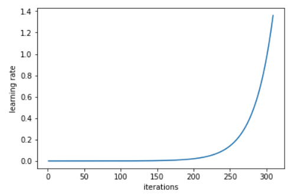

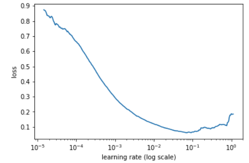

*   通过调整这一个数字，您应该能够获得相当不错的结果。 fast.ai 库为您选择其余的超参数。 但随着课程的进展，我们将了解到还有一些我们可以调整的东西，可以获得更好的结果。 但学习率是我们设定的关键数字。
*   学习率查找器位于其他优化器（例如动量，Adam 等）之上，并根据您正在使用的其他调整（例如高级优化器但不限于优化器）帮助您选择最佳学习率。
*   问题：在迭代期间改变学习率，优化器会发生什么？ 这个查找器是否选择了初始学习率？[ [14:05](https://youtu.be/JNxcznsrRb8%3Ft%3D14m5s) ]我们稍后会详细了解优化器，但基本答案是否定的。 即使 Adam 的学习率也会除以先前的平均梯度以及最近的梯度的平方和。 即使那些所谓的“动态学习率”方法也具有学习率。
*   使模型更好的最重要的事情是，为它提供更多数据。 由于这些模型有数百万个参数，如果你训练它们一段时间，它们就会开始所谓的“过拟合”。
*   过拟合 - 模型开始在训练集中看到图像的具体细节，而不是学习可以传递到验证集的一般内容。
*   我们可以收集更多数据，但另一种简单方法是数据增强。

## 数据增强[ [15:50](https://youtu.be/JNxcznsrRb8%3Ft%3D15m50s) ]

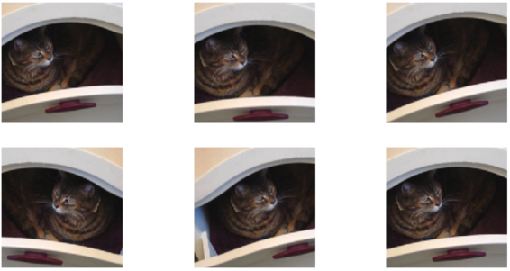

*   每个迭代，我们都会随机改变图像。 换句话说，该模型将在每个迭代看到略有不同的图像版本。
*   您希望对不同类型的图像使用不同类型的数据增强（水平翻转，垂直翻转，放大，缩小，改变对比度和亮度等等）。

## 学习率查找器问题[ [19:11](https://youtu.be/JNxcznsrRb8%3Ft%3D19m11s) ]：

*   为什么不选择底部？ 损失最低的点是红色圆圈所在的位置。 但是那个学习率实际上太大了，不太可能收敛。 那么之前的那个将是一个更好的选择（选择一个小于过大的学习率总是更好）

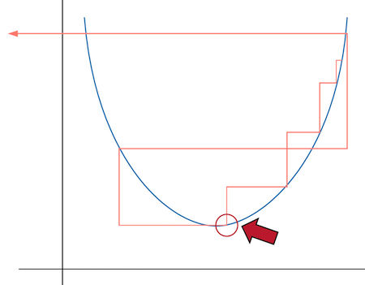

*   我们什么时候应该学习`lr_find` ？ [ [23:02](https://youtu.be/JNxcznsrRb8%3Ft%3D23m2s) ]在开始时运行一次，也许在把层解冻后（我们稍后会学习）。 当我改变我正在训练的东西或改变我训练它的方式时。 运行它永远不会有任何损害。

## 返回数据增强[ [24:10](https://youtu.be/JNxcznsrRb8%3Ft%3D24m10s) ]

```
 tfms = tfms_from_model(resnet34, sz, **aug_tfms=transforms_side_on** , max_zoom=1.1) 
```

*   `transform_side_on` - 侧面照片的预定义变换集（还有`transform_top_down` ）。 稍后我们将学习如何创建自定义变换列表。
*   它不是完全创建新数据，而是允许卷积神经网络学习如何从不同的角度识别猫或狗。

```
 data = ImageClassifierData.from_paths(PATH, tfms= **tfms** )  learn = ConvLearner.pretrained(arch, data, precompute=True) 
```

```
 learn.fit(1e-2, 1) 
```

*   现在我们创建了一个带增强的新`data`对象。 最初，由于`precompute=True` ，增强实际上什么都不做。
*   卷积神经网络将这些东西称为“激活”。激活是一个数字，表示“这个特征在这个地方具有这种置信水平（概率）”。 我们正在使用已经学会识别特征的预训练网络（即我们不想改变它所学习的超参数），所以我们可以做的是预先计算隐藏层的激活并只训练最后的线性部分。

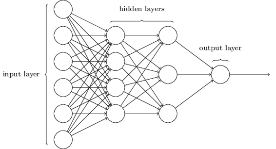

*   这就是为什么当你第一次训练你的模型时，它需要更长的时间 - 它预先计算这些激活。
*   即使我们每次尝试显示不同版本的猫，我们已经预先计算了特定版本猫的激活（即我们没有重新计算更改版本的激活）。
*   要使用数据增强，我们必须做`learn.precompute=False` ：

```
 learn.precompute=False 
```

```
 learn.fit(1e-2, 3, **cycle_len=1** ) 
```

```
 _[ 0\. 0.03597 0.01879 0.99365]_  _[ 1\. 0.02605 0.01836 0.99365]_  _[ 2\. 0.02189 0.0196 0.99316]_ 
```

*   坏消息是准确性没有提高。 训练损失正在减少，但验证损失不是，但我们并没有过拟合。 当训练损失远低于验证损失时，过拟合。 换句话说，当您的模型在训练集上做得比在验证集上做得好得多时，这意味着您的模型不是一般化的。
*   `cycle_len=1` [ [30:17](https://youtu.be/JNxcznsrRb8%3Ft%3D30m17s) ]：这样可以**通过重启（SGDR）**实现**随机梯度下降** 。 基本的想法是，当你以最小的损失越来越接近现场时，你可能想要开始降低学习率（采取较小的步骤），以便到达正确的位置。
*   在训练时降低学习率的想法称为**学习率退火** ，这是非常常见的。 最常见和“hacky”的方法是在一段时间内训练具有一定学习速度的模型，当它停止改进时，手动降低学习率（逐步退火）。
*   一个更好的方法就是选择某种功能形式 - 结果是真正好的功能形式是cosign曲线的一半，它在开始时保持一段时间的高学习率，然后当你靠近时迅速下降。

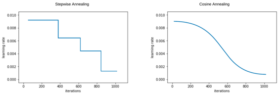

*   然而，我们可能会发现自己处于重量空间的一部分，这个重量空间不是很有弹性 - 也就是说，重量的微小变化可能会导致损失发生重大变化。 我们希望鼓励我们的模型找到既精确又稳定的重量空间部分。 因此，我们不时会增加学习率（这是'SGDR'中的'重新启动'），如果当前区域是“尖锐的”，这将迫使模型跳转到权重空间的不同部分。 这是一张如果我们将学习率重置3次（在[本文中](https://arxiv.org/abs/1704.00109)他们称之为“循环LR计划”）的情况下的图片：

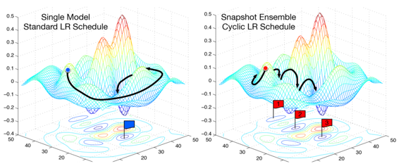

*   重置学习率之间的时期数由`cycle_len`设置，并且这种情况发生的次数称为_循环次数_ ，并且是我们实际传递的第二个参数`fit()` 。 所以这就是我们的实际学习率：

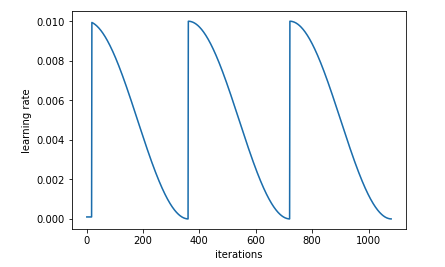

*   问题：我们可以通过使用随机起点获得相同的效果吗？ [ [35:40](https://youtu.be/JNxcznsrRb8%3Ft%3D35m40s) ]在SGDR创建之前，人们习惯于创建“合奏”，他们会重新整理一个新模型十次，希望其中一个最终会变得更好。 在SGDR中，一旦我们接近最佳且稳定的区域，重置实际上不会“重置”，但权重会更好。 因此，SGDR将为您提供更好的结果，而不是随机尝试几个不同的起点。
*   选择学习率（这是SGDR使用的最高学习率）非常重要，该学习率足以允许重置跳转到功能的不同部分。 [ [37:25](https://youtu.be/JNxcznsrRb8%3Ft%3D37m25s) ]
*   SGDR降低了每个小批量的学习率，并且每个`cycle_len`时期都会`cycle_len` （在这种情况下，它设置为1）。
*   问题：我们的主要目标是概括而不是最终陷入狭隘的最佳状态。 在这种方法中，我们是否跟踪最小值并对它们求平均值并对它们进行整合？ [ [39:27](https://youtu.be/JNxcznsrRb8%3Ft%3D39m27s) ]这是另一个复杂程度，你会在图中看到“快照合奏”。 我们目前没有这样做，但如果你想要更好地概括，你可以在重置之前保存权重并取平均值。 但就目前而言，我们只是选择最后一个。
*   如果你想跳过，有一个叫做`cycle_save_name`的参数你可以添加，还有`cycle_len` ，它会在每个学习率周期结束时保存一组权重，然后你可以将它们合奏[ [40:14](https://youtu.be/JNxcznsrRb8%3Ft%3D40m14s) ]。

## 拯救模特[ [40:31](https://youtu.be/JNxcznsrRb8%3Ft%3D40m31s) ]

```
 learn.save('224_lastlayer') 
```

```
 learn.load('224_lastlayer') 
```

*   当您预先计算激活或创建调整大小的图像（我们将很快了解它）时，会创建各种临时文件，您可以在`data/dogcats/tmp`文件夹中看到这些文件。 如果您遇到奇怪的错误，可能是因为预先计算的激活只完成了一半，或者在某种程度上与您正在做的事情不兼容。 所以你总是可以继续删除这个`/tmp`文件夹以查看它是否会使错误消失（fast.ai相当于将其关闭再打开）。
*   您还会看到有一个名为`/models`的目录，当您说`learn.save`时，模型会被保存

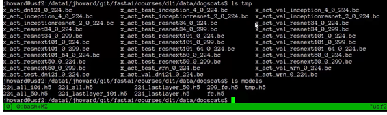

## 微调和差分学习率[ [43:49](https://youtu.be/JNxcznsrRb8%3Ft%3D43m49s) ]

*   到目前为止，我们没有重新训练任何预先训练的特征 - 特别是卷积内核中的任何权重。 我们所做的就是在顶部添加了一些新图层，并学习如何混合和匹配预先训练的功能。
*   卫星图像，CT扫描等图像具有完全不同的特征（与ImageNet图像相比），因此您需要重新训练多个图层。
*   对于狗和猫，图像类似于模型预训练的图像，但我们仍然可能发现稍微调整一些后面的图层是有帮助的。
*   以下是告诉学习者我们想要开始实际更改卷积过滤器的方法：

```
 learn.unfreeze() 
```

*   “冻结”层是未被训练/更新的层。 `unfreeze`解冻所有图层。
*   像第一层（检测对角线边缘或渐变）或第二层（识别角或曲线）的早期层可能不需要改变太多，如果有的话。
*   后面的图层更有可能需要更多的学习。 因此，我们创建了一系列学习率（差异学习率）：

```
 lr=np.array([1e-4,1e-3,1e-2]) 
```

*   `1e-4` ：前几层（基本几何特征）
*   `1e-3` ：用于中间层（复杂的卷积特征）
*   `1e-2` ：对于我们在顶部添加的图层
*   为什么3？ 实际上它们是3个ResNet块，但就目前而言，它被认为是一组层。

**问题** ：如果我的图像比训练模型的图像大，怎么办？ [ [50:30](https://youtu.be/JNxcznsrRb8%3Ft%3D50m30s) ]简短的回答是，通过我们使用的图书馆和现代建筑，我们可以使用任何我们喜欢的尺寸。

**问题** ：我们可以解冻特定的图层吗？ [ [51:03](https://youtu.be/JNxcznsrRb8%3Ft%3D51m3s) ]我们还没有这样做，但如果你想，你可以做`lean.unfreeze_to(n)` （它将从`n`层`lean.unfreeze_to(n)`解冻层）。 Jeremy几乎从未发现它有用，他认为这是因为我们使用的是差异学习率，优化器可以根据需要学习。 他发现它有用的一个地方是，如果他使用的是一个非常大的内存密集型模型，并且他的GPU耗尽，你解冻的层次越少，内存和时间就越少。

使用差异学习率，我们高达99.5％！ [ [52:28](https://youtu.be/JNxcznsrRb8%3Ft%3D52m28s) ]

```
 learn.fit(lr, 3, cycle_len=1, **cycle_mult** =2) 
```

```
 _[ 0\. 0.04538 0.01965 0.99268]_  _[ 1\. 0.03385 0.01807 0.99268]_  _[ 2\. 0.03194 0.01714 0.99316]_  _[ 3\. 0.0358 0.0166 0.99463]_  _[ 4\. 0.02157 0.01504 0.99463]_  _[ 5\. 0.0196 0.0151 0.99512]_  _[ 6\. 0.01356 0.01518 0.9956 ]_ 
```

*   早些时候我们说`3`是时代的数量，但它实际上是**周期** 。 因此，如果`cycle_len=2` ，它将进行3个循环，其中每个循环是2个时期（即6个时期）。 那为什么7呢？ 这是因为`cycle_mult`
*   `cycle_mult=2` ：这乘以每个周期后的周期长度（1个时期+ 2个时期+ 4个时期= 7个时期）。

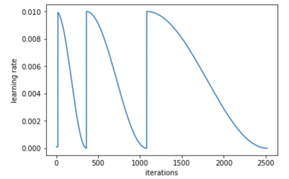

直觉地说[ [53:57](https://youtu.be/JNxcznsrRb8%3Ft%3D53m57s) ]，如果周期太短，它会开始下降找到一个好位置，然后弹出，然后试图找到一个好位置并且弹出，并且从未真正找到一个好点。 早些时候，你希望它能做到这一点，因为它试图找到一个更平滑的点，但是稍后，你希望它做更多的探索。 这就是为什么`cycle_mult=2`似乎是一个好方法。

我们正在介绍越来越多的超级参数，告诉你没有多少。 你可以选择一个好的学习率，但随后添加这些额外的调整有助于在没有任何努力的情况下获得额外的升级。 一般来说，好的起点是：

*   `n_cycle=3, cycle_len=1, cycle_mult=2`
*   `n_cycle=3, cycle_len=2` （没有`cycle_mult` ）

问题：为什么更平滑的表面与更广义的网络相关？ [ [55:28](https://youtu.be/JNxcznsrRb8%3Ft%3D55m28s) ]

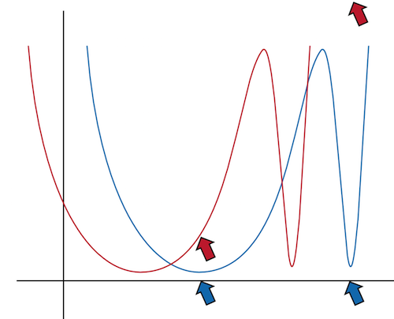

说你有尖刻的东西（蓝线）。 当您更改此特定参数时，X轴显示识别狗与猫的有多好。 可以推广的东西意味着当我们给它一个稍微不同的数据集时我们希望它能够工作。 稍微不同的数据集可能在此参数与猫类与狗类之间的关系略有不同。 它可能看起来像红线。 换句话说，如果我们最终得到蓝色尖头部分，那么它就不会在这个稍微不同的数据集上做得很好。 或者，如果我们最终得到更广泛的蓝色部分，它仍将在红色数据集上做得很好。

*   [这](http://forums.fast.ai/t/why-do-we-care-about-resilency-of-where-we-are-in-the-weight-space/7323)是关于尖尖极小的一些有趣的讨论。

## 测试时间增加（TTA）[ [56:49](https://youtu.be/JNxcznsrRb8%3Ft%3D56m49s) ]

我们的模型达到了99.5％。 但我们还能让它变得更好吗？ 让我们来看看我们错误预测的图片：

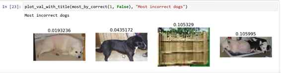

在这里，杰里米打印出了所有这些照片。 当我们进行验证集时，我们对模型的所有输入必须是正方形。 原因是一些细微的技术细节，但如果您对不同的图像有不同的尺寸，GPU不会很快。 它需要保持一致，以便GPU的每个部分都能做同样的事情。 这可能是可以修复的，但是现在这就是我们所拥有的技术状态。

为了使它成为正方形，我们只选择中间的正方形 - 如下所示，可以理解为什么这张图片被错误分类：

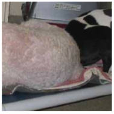

我们将进行所谓的“ **测试时间增强** ”。 这意味着我们将随机采取4个数据增强以及未增强的原始（中心裁剪）。 然后，我们将计算所有这些图像的预测，取平均值，并将其作为我们的最终预测。 请注意，这仅适用于验证集和/或测试集。

要做到这一点，你所要做的就是`learn.TTA()` - 它将精度提高到99.65％！

```
 log_preds,y = **learn.TTA()**  probs = np.mean(np.exp(log_preds),0) 
```

```
 accuracy(probs, y) 
```

```
 _0.99650000000000005_ 
```

**关于增强方法的问题[** [**01:01:36**](https://youtu.be/JNxcznsrRb8%3Ft%3D1h1m36s) **]：**为什么没有边框或填充使它成为正方形？ 通常Jeremy没有做太多填充，但他做了一点点**缩放** 。 有一种称为**反射填充**的东西适用于卫星图像。 一般来说，使用TTA加上数据增强，最好的办法是尝试尽可能使用大图像。 此外，对于TTA，固定裁剪位置加上随机对比度，亮度，旋转变化可能更好。

**问题：**非图像数据集的数据增强？ [ [01:03:35](https://youtu.be/JNxcznsrRb8%3Ft%3D1h3m35s) ]似乎没有人知道。 看起来它会有所帮助，但是很少有例子。 在自然语言处理中，人们试图替换同义词，但总的来说，该领​​域正处于研究和开发之中。

**问** ：fast.ai库是开源的吗？[ [01:05:34](https://youtu.be/JNxcznsrRb8%3Ft%3D1h5m34s) ]是的。 然后他介绍了[Fast.ai从Keras + TensorFlow切换到PyTorch的原因](http://www.fast.ai/2017/09/08/introducing-pytorch-for-fastai/)

随机说明：PyTorch不仅仅是一个深度学习库。 它实际上让我们从头开始编写任意GPU加速算法 - Pyro是人们在深度学习之外使用PyTorch做的一个很好的例子。

## 分析结果[ [01:11:50](https://youtu.be/JNxcznsrRb8%3Ft%3D1h11m50s) ]

## **混淆矩阵**

查看分类结果的简单方法称为混淆矩阵 - 它不仅用于深度学习，而且用于任何类型的机器学习分类器。 特别是如果您有四到五个班级试图预测哪个班级最容易出问题。

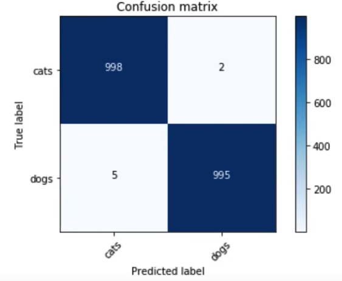

```
 preds = np.argmax(probs, axis=1)  probs = probs[:,1] 
```

```
 **from** **sklearn.metrics** **import** confusion_matrix  cm = confusion_matrix(y, preds) 
```

```
 plot_confusion_matrix(cm, data.classes) 
```

## 让我们再看看这些照片[ [01:13:00](https://youtu.be/JNxcznsrRb8%3Ft%3D1h13m) ]

大多数不正确的猫（只有左边两个不正确 - 默认显示4个）：

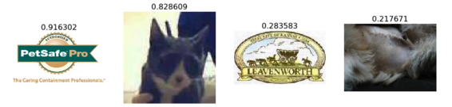

最不正确的点：

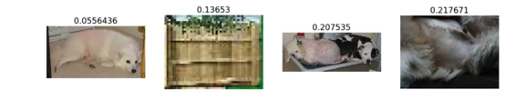

### 回顾：培养世界级图像分类器的简单步骤[ [01:14:09](https://youtu.be/JNxcznsrRb8%3Ft%3D1h14m9s) ]

1.  启用数据增强，并`precompute=True`
2.  使用`lr_find()`找到最高学习率，其中损失仍在明显改善
3.  从预先计算的激活训练最后一层1-2个时期
4.  使用数据增强（即`precompute=False` ）训练最后一层，持续2-3个时期，其中`cycle_len=1`
5.  解冻所有图层
6.  将早期图层设置为比下一个更高层低3x-10x的学习率。 经验法则：ImageNet像图像10倍，卫星或医学成像3倍
7.  再次使用`lr_find()` （注意：如果你调用`lr_find`设置差异学习率，它打印出来的是最后一层的学习率。）
8.  使用`cycle_mult=2`训练完整网络，直到过拟合

## 让我们再做一次： [狗品种挑战](https://www.kaggle.com/c/dog-breed-identification) [ [01:16:37](https://youtu.be/JNxcznsrRb8%3Ft%3D1h16m37s) ]

*   您可以使用[Kaggle CLI](https://github.com/floydwch/kaggle-cli)下载Kaggle比赛的数据
*   笔记本电脑不是公开的，因为它是一个积极的竞争

```
 %reload_ext autoreload  %autoreload 2  %matplotlib inline 
```

```
 from fastai.imports import *  from fastai.transforms import *  from fastai.conv_learner import *  from fastai.model import *  from fastai.dataset import *  from fastai.sgdr import *  from fastai.plots import * 
```

```
 PATH = 'data/dogbreed/'  sz = 224  arch = resnext101_64  bs=16 
```

```
 label_csv = f'{PATH}labels.csv'  n = len(list(open(label_csv)))-1  val_idxs = get_cv_idxs(n) 
```

```
 !ls {PATH} 
```

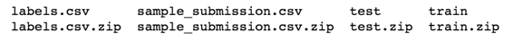

这与我们之前的数据集略有不同。 而不是`train`文件夹，每个品种的狗都有一个单独的文件夹，它有一个带有正确标签的CSV文件。 我们将使用Pandas阅读CSV文件。 我们在Python中使用Pandas来进行像CSV这样的结构化数据分析，通常以`pd`格式导入：

```
 label_df = pd.read_csv(label_csv)  label_df.head() 
```

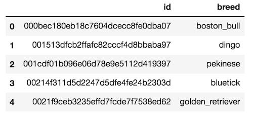

```
 label_df. **pivot_table** (index='breed', aggfunc=len).sort_values('id', ascending=False) 
```

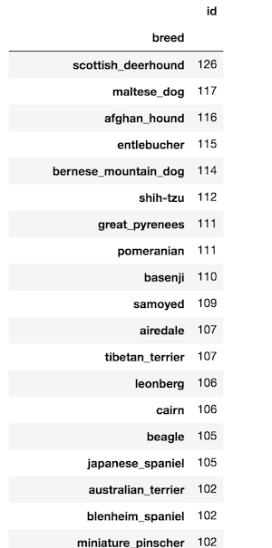

<figcaption class="imageCaption">每个品种有多少只狗图像</figcaption>


```
 tfms = tfms_from_model(arch, sz, aug_tfms=transforms_side_on,  max_zoom=1.1) 
```

```
 data = ImageClassifierData.from_csv(PATH, 'train',  f'{PATH}labels.csv', test_name='test',  val_idxs=val_idxs, suffix='.jpg', tfms=tfms, bs=bs) 
```

*   `max_zoom` - 我们将放大1.1倍
*   `ImageClassifierData.from_csv` - 上次我们使用了`from_paths`但由于标签是CSV文件，我们将调用`from_csv` 。
*   `test_name` - 如果要提交给Kaggle比赛，我们需要指定测试集的位置
*   `val_idx` - 没有`validation`文件夹，但我们仍想跟踪我们的本地性能有多好。 所以上面你会看到：

`n = len(list(open(label_csv)))-1` ：打开CSV文件，创建行列表，然后取长度。 `-1`因为第一行是标题。 因此`n`是我们拥有的图像数量。

`val_idxs = **get_cv_idxs** (n)` ：“获取交叉验证索引” - 默认情况下，这将返回随机的20％的行（准确的索引）以用作验证集。 您也可以发送`val_pct`以获得不同的金额。

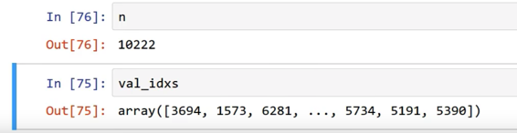

*   `suffix='.jpg'` - 文件名末尾有`.jpg` ，但CSV文件没有。 所以我们将设置`suffix`以便它知道完整的文件名。

```
 fn = PATH + data.trn_ds.fnames[0]; fn 
```

```
 _'data/dogbreed/train/001513dfcb2ffafc82cccf4d8bbaba97.jpg'_ 
```

*   您可以通过说`data.trn_ds`和`trn_ds`包含很多内容来访问训练数据集，包括文件名（ `fnames` ）

```
 img = PIL.Image.open(fn); img 
```


```
 img.size 
```

```
 _(500, 375)_ 
```

*   现在我们检查图像大小。 如果它们很大，那么你必须仔细考虑如何处理它们。 如果它们很小，那也很有挑战性。 大多数ImageNet模型都是通过224×224或299×299图像进行训练的

```
 size_d = {k: PIL.Image.open(PATH+k).size for k in data.trn_ds.fnames} 
```

*   字典理解 - `key: name of the file` ， `value: size of the file`

```
 row_sz, col_sz = list(zip(*size_d.values())) 
```

*   `*size_d.values()`将解压缩列表。 `zip`将配对元组元素以创建元组列表。

```
 plt.hist(row_sz); 
```

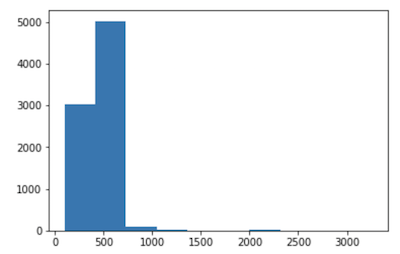

<figcaption class="imageCaption">行的直方图</figcaption>


*   如果你在Python中进行任何类型的数据科学或机器学习，那么Matplotlib就是你非常熟悉的东西。 Matplotlib总是被称为`plt` 。

**问题** ：我们应该使用多少图像作为验证集？ [ [01:26:28](https://youtu.be/JNxcznsrRb8%3Ft%3D1h26m28s) ]使用20％是好的，除非数据集很小 - 那么20％是不够的。 如果您多次训练相同的模型并且验证集结果非常不同，则验证集太小。 如果验证集小于一千，则很难解释您的表现如何。 如果您关心精度的第三个小数位，并且验证集中只有一千个内容，则单个图像会改变精度。 如果您关心0.01和0.02之间的差异，您希望它代表10或20行。 通常20％似乎工作正常。

```
 def get_data(sz, bs):  tfms = tfms_from_model(arch, sz, aug_tfms=transforms_side_on,  max_zoom=1.1)  data = ImageClassifierData.from_csv(PATH, 'train',  f'{PATH}labels.csv', test_name='test', num_workers=4,  val_idxs=val_idxs, suffix='.jpg', tfms=tfms, bs=bs) 
```

```
 return data if sz>300 else data.resize(340, 'tmp') 
```

*   这是常规的两行代码。 当我们开始使用新数据集时，我们希望一切都超级快。 因此，我们可以指定大小，并从64开始快速运行。 之后，我们将使用更大的图像和更大的架构，此时，您可能会耗尽GPU内存。 如果您看到CUDA内存不足错误，您需要做的第一件事就是重新启动内核（无法从中恢复），然后缩小批量。

```
 data = get_data(224, bs) 
```

```
 learn = ConvLearner.pretrained(arch, data, precompute=True) 
```

```
 learn.fit(1e-2, 5) 
```

```
 _[0._ _1.99245 1.0733 0.76178]_  _[1._ _1.09107 0.7014 0.8181 ]_  _[2._ _0.80813 0.60066 0.82148]_  _[3._ _0.66967 0.55302 0.83125]_  _[4._ _0.57405 0.52974 0.83564]_ 
```

*   120个班级的83％相当不错。

```
 **learn.precompute = False** 
```

```
 learn.fit(1e-2, 5, **cycle_len** =1) 
```

*   提醒：一个`epoch`是一次通过数据，一个`cycle`是你所说的`cycle`有多少个时代

```
 learn.save('224_pre')  learn.load('224_pre') 
```

## 增加图像尺寸[1:32:55]

```
 learn.set_data(get_data(299, bs)) 
```

*   如果您在较小尺寸的图像上训练模型，则可以调用`learn.set_data`并传入更大尺寸的数据集。 这将是你的模型，但它已经训练到目前为止，它将让你继续训练更大的图像。

> 开始对几个时代的小图像进行训练，然后切换到更大的图像，继续训练是避免过拟合的一种非常有效的方法。

```
 learn.fit(1e-2, 3, cycle_len=1) 
```

```
 _[0._ _0.35614 0.22239 0.93018]_  _[1._ _0.28341 0.2274 0.92627]_  _[2._ **_0.28341_**  **_0.2274_** _ 0.92627]_ 
```

*   如您所见，验证集损失（0.2274）远低于训练集损失（0.28341） - 这意味着它**不合适** 。 当你处于拟合状态时，这意味着`cycle_len=1`太短（学习率在它有机会正确放大之前被重置）。 所以我们将添加`cycle_mult=2` （即第1个周期是1个时期，第2个周期是2个时期，第3个周期是4个时期）

```
 learn.fit(1e-2, 3, cycle_len=1, **cycle_mult=2** ) 
```

```
 [0. 0.27171 0.2118 0.93192]  [1. 0.28743 0.21008 0.9324 ]  [2. 0.25328 0.20953 0.93288]  [3. 0.23716 0.20868 0.93001]  [4. 0.23306 0.20557 0.93384]  [5. 0.22175 0.205 0.9324 ]  [6. 0.2067 0.20275 0.9348 ] 
```

*   现在验证损失和训练损失大致相同 - 这是关于正确的轨道。 然后我们尝试`TTA` ：

```
 log_preds, y = learn.TTA()  probs = np.exp(log_preds)  accuracy(log_preds,y), metrics.log_loss(y, probs) 
```

```
 _(0.9393346379647749, 0.20101565705592733)_ 
```

其他尝试：

*   尝试再运行2个时期的循环
*   解冻（在这种情况下，训练卷积层没有丝毫帮助，因为图像实际上来自ImageNet）
*   删除验证集并重新运行相同的步骤，并提交 - 这使我们可以使用100％的数据。

**问题** ：我们如何处理不平衡的数据集？ [ [01:38:46](https://youtu.be/JNxcznsrRb8%3Ft%3D1h38m46s) ]这个数据集并不是完全平衡的（在60到100之间），但它并不是不平衡的，杰里米会给它第二个想法。 最近的一篇论文说，处理非常不平衡的数据集的最佳方法是制作罕见案例的副本。

**问题** ： `precompute=True`和`unfreeze`之间的区别？

*   我们从一个预先训练好的网络开始
*   我们在它的末尾添加了几层，随机开始。 一切都冻结了， `precompute=True` ，我们所学的就是我们添加的层。
*   使用`precompute=True` ，数据增强不会执行任何操作，因为我们每次都显示完全相同的激活。
*   然后我们设置`precompute=False` ，这意味着我们仍然只训练我们添加的层，因为它被冻结但数据增强现在正在工作，因为它实际上正在通过并从头开始重新计算所有激活。
*   最后，我们解冻，说“好吧，现在你可以继续改变所有这些早期的卷积过滤器”。

**问题** ：为什么不从头开始设置`precompute=False` ？ `precompute=True`的唯一原因是它更快（10次或更多次）。 如果您正在使用相当大的数据集，它可以节省相当多的时间。 使用`precompute=True`没有准确的原因。

**获得良好结果的最小步骤：**

1.  使用`lr_find()`找到最高学习率，其中损失仍在明显改善
2.  使用数据增强（即`precompute=False` ）训练最后一层，持续2-3个时期，其中`cycle_len=1`
3.  解冻所有图层
4.  将早期图层设置为比下一个更高层低3x-10x的学习率
5.  使用`cycle_mult=2`训练完整网络，直到过拟合

**问题** ：减小批量大小只会影响训练速度吗？ [ [1:43:34](https://youtu.be/JNxcznsrRb8%3Ft%3D1h43m34s) ]是的， [差不多](https://youtu.be/JNxcznsrRb8%3Ft%3D1h43m34s) 。 如果每次显示较少的图像，那么它用较少的图像计算梯度 - 因此不太准确。 换句话说，知道去哪个方向以及朝这个方向走多远都不太准确。 因此，当您使批量较小时，您会使其更具波动性。 它会影响您需要使用的最佳学习率，但在实践中，将批量大小除以2而不是4似乎并没有太大改变。 如果您更改批量大小，可以重新运行学习率查找器进行检查。

**问题：**灰色图像与右侧图像有什么关系？

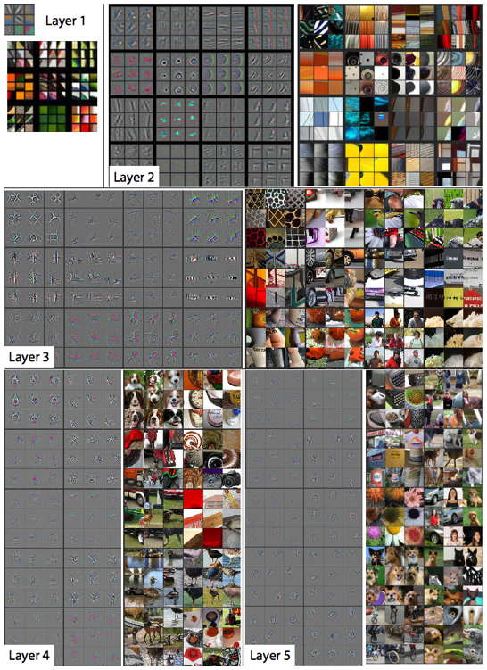

<figcaption class="imageCaption">[可视化和理解卷积网络](https://arxiv.org/abs/1311.2901)</figcaption>


第1层，它们正是过滤器的样子。 它很容易可视化，因为它的输入是像素。 后来，它变得更难，因为输入本身是激活，这是激活的组合。 Zeiler和Fergus想出了一个聪明的技术来展示过滤器平均看起来像什么 - 称为**反卷积** （我们将在第2部分中学习）。 右侧的图像是高度激活该过滤器的图像块的示例。

**问题** ：如果狗离开角落或很小的话，你会做什么（re：狗品种鉴定）？ [ [01:47:16](https://youtu.be/JNxcznsrRb8%3Ft%3D1h47m16s) ]我们将在第2部分中了解它，但是有一种技术可以让你粗略地弄清楚图像的哪些部分最有可能包含有趣的东西。 然后你可以裁剪出那个区域。

## 进一步改进[ [01:48:16](https://youtu.be/JNxcznsrRb8%3Ft%3D1h48m16s) ]

我们可以立即采取两项措施来改善它：

1.  假设您使用的图像大小小于您给出的图像的平均大小，则可以增加大小。 正如我们之前看到的，您可以在训练期间增加它。
2.  使用更好的架构。 将卷积滤波器的大小和它们如何相互连接的方法有不同的方法，不同的架构具有不同的层数，内核大小，滤波器等。

我们一直在使用ResNet34 - 一个很好的起点，通常是一个很好的终点，因为它没有太多的参数，适用于小数据集。 另一个名为ResNext的架构在去年的ImageNet竞赛中获得第二名.ResNext50的内存比ResNet34长两倍，内存的2-4倍。

[这](https://github.com/fastai/fastai/blob/master/courses/dl1/lesson1-rxt50.ipynb)是与原始狗几乎完全相同的笔记本。 与猫。 它使用ResNext50，精度达到99.75％。

## 卫星图像[01:53:01]

[笔记本](https://github.com/fastai/fastai/blob/master/courses/dl1/lesson2-image_models.ipynb)

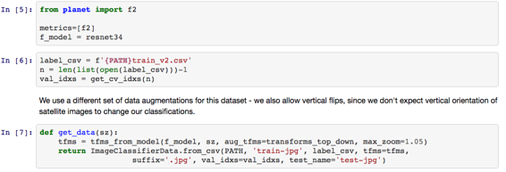

代码与我们之前看到的几乎相同。 以下是一些差异：

*   `transforms_top_down` - 由于它们是卫星图像，因此它们在垂直翻转时仍然有意义。
*   更高的学习率 - 与此特定数据集有关
*   `lrs = np.array([lr/9,lr/3,lr])` - 差异学习率现在变化3倍，因为图像与ImageNet图像完全不同
*   `sz=64` - 这有助于避免过拟合卫星图像，但他不会那样做狗。 与猫或狗品种（与ImageNet相似的图像），64乘64非常小，可能会破坏预先训练过的重量。

## 如何获得您的AWS设置[ [01:58:54](https://youtu.be/JNxcznsrRb8%3Ft%3D1h58m54s) ]

您可以关注视频，或者[这](https://github.com/reshamas/fastai_deeplearn_part1/blob/master/tools/aws_ami_gpu_setup.md)是一位学生写的很棒的文章。
