# 深度学习：第一部分第四课

### [第4课](http://forums.fast.ai/t/wiki-lesson-4/9402/1)

学生用品：

*   [改善我们学习率的方式](https://techburst.io/improving-the-way-we-work-with-learning-rate-5e99554f163b)
*   [循环学习率技术](http://teleported.in/posts/cyclic-learning-rate/)
*   [使用重新启动（SGDR）探索随机梯度下降](https://medium.com/38th-street-studios/exploring-stochastic-gradient-descent-with-restarts-sgdr-fa206c38a74e)
*   [使用差异学习率转移学习](https://towardsdatascience.com/transfer-learning-using-differential-learning-rates-638455797f00)
*   [让计算机看得比人类更好](https://medium.com/%40ArjunRajkumar/getting-computers-to-see-better-than-humans-346d96634f73)

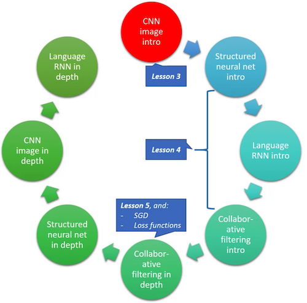

#### 辍学[04:59]

```
 learn = ConvLearner.pretrained(arch, data, ps=0.5, precompute=True) 
```

*   `precompute=True` ：预先计算从最后一个卷积层出来的激活。 请记住，激活是一个数字，它是根据构成内核/过滤器的一些权重/参数计算出来的，它们会应用于上一层的激活或输入。

```
 learn 
```

```
 _Sequential(_  _(0): BatchNorm1d(1024, eps=1e-05, momentum=0.1, affine=True)_  _(1): Dropout(p=0.5)_  _(2): Linear(in_features=1024, out_features=512)_  _(3): ReLU()_  _(4): BatchNorm1d(512, eps=1e-05, momentum=0.1, affine=True)_  _(5): Dropout(p=0.5)_  _(6): Linear(in_features=512, out_features=120)_  _(7): LogSoftmax()_  _)_ 
```

`learn` - 这将显示我们最后添加的图层。 这些是我们在`precompute=True`时训练的层

（0），（4）： `BatchNorm`将在上一课中介绍

（1），（5）： `Dropout`

（2）： `Linear`层简单地表示矩阵乘法。 这是一个包含1024行和512列的矩阵，因此它将进行1024次激活并吐出512次激活。

（3）： `ReLU` - 只需用零替换负数

（6）： `Linear` - 第二个线性层，从前一个线性层获取512次激活并将它们通过一个新矩阵乘以512乘120并输出120次激活

（7）： `Softmax` - 激活函数，返回最多为1的数字，每个数字在0和1之间：

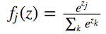

出于较小的数值精度原因，事实证明最好直接使用softmax的log而不是softmax [ [15:03](https://youtu.be/gbceqO8PpBg%3Ft%3D15m3s) ]。 这就是为什么当我们从模型中得到预测时，我们必须做`np.exp(log_preds)` 。

#### 什么是`Dropout` ，什么是`p` ？ [ [08:17](https://youtu.be/gbceqO8PpBg%3Ft%3D8m17s) ]

```
 _Dropout(p=0.5)_ 
```

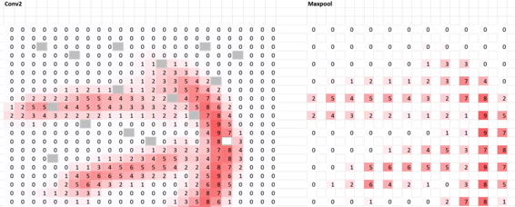

如果我们将`p=0.5`压降应用于`Conv2`层，它将如上所示。 我们通过，选择激活，并以50％的几率删除它。 所以`p=0.5`是删除该单元格的概率。 输出实际上并没有太大变化，只是一点点。

随机丢弃一层激活的一半有一个有趣的效果。 需要注意的一件重要事情是，对于每个小批量，我们会丢弃该层中不同的随机半部分激活。 它迫使它不适合。 换句话说，当一个特定的激活只学习那只精确的狗或精确的猫被淘汰时，模型必须尝试找到一个表示，即使随机的一半激活每次被抛弃，它仍然继续工作。

这对于进行现代深度学习工作以及解决泛化问题至关重要。 Geoffrey Hinton和他的同事们提出了这个想法，这个想法受到大脑工作方式的启发。

*   `p=0.01`将丢弃1％的激活。 它根本不会改变任何东西，也不会阻止过拟合（不是一般化）。
*   `p=0.99`将抛弃99％的激活。 不会过度适应并且非常适合概括，但会破坏你的准确性。
*   默认情况下，第一层为`0.25` ，第二层为`0.5` [17:54]。 如果你发现它过拟合，就开始碰撞它 - 尝试将全部设置为`0.5` ，仍然过拟合，尝试`0.7`等。如果你不合适，你可以尝试降低它，但你不太可能需要降低它。
*   ResNet34具有较少的参数，因此它不会过度匹配，但对于像ResNet50这样的更大的架构，你通常需要增加丢失。

你有没有想过为什么验证损失比训练早期的训练损失更好？ [ [12:32](https://youtu.be/gbceqO8PpBg%3Ft%3D12m32s) ]这是因为我们在验证集上运行推理（即进行预测）时关闭了丢失。 我们希望尽可能使用最好的模型。

**问题** ：你是否必须采取任何措施来适应你正在放弃激活的事实？ [ [13:26](https://youtu.be/gbceqO8PpBg%3Ft%3D13m26s) ]我们没有，但是当你说`p=0.5`时，PyTorch会做两件事。 它抛弃了一半的激活，并且它已经存在的所有激活加倍，因此平均激活不会改变。

在Fast.ai中，你可以传入`ps` ，这是所有添加的图层的`p`值。 它不会改变预训练网络中的辍学率，因为它应该已经训练过一些适当的辍学水平：

```
 learn = ConvLearner.pretrained(arch, data, **ps=0.5** , precompute=True) 
```

你可以通过设置`ps=0.`来删除dropout `ps=0.` 但即使在几个时代之后，我们开始大规模过拟合（训练损失«验证损失）：

```
 [2. **0.3521** **0.55247** 0.84189] 
```

当`ps=0.` ，dropout图层甚至没有添加到模型中：

```
 Sequential(  (0): BatchNorm1d(4096, eps=1e-05, momentum=0.1, affine=True)  (1): Linear(in_features=4096, out_features=512)  (2): ReLU()  (3): BatchNorm1d(512, eps=1e-05, momentum=0.1, affine=True)  (4): Linear(in_features=512, out_features=120)  (5): LogSoftmax()  ) 
```

你可能已经注意到，它已经添加了两个`Linear`层[ [16:19](https://youtu.be/gbceqO8PpBg%3Ft%3D16m19s) ]。 我们不必这样做。 你可以设置`xtra_fc`参数。 注意：你至少需要一个获取卷积层输出（本例中为4096）并将其转换为类数（120个品种）的一个：

```
 learn = ConvLearner.pretrained(arch, data, ps=0., precompute=True,  **xtra_fc=[]** ); learn 
```

```
 _Sequential(_  _(0): BatchNorm1d(1024, eps=1e-05, momentum=0.1, affine=True)_  _(1): Linear(in_features=1024, out_features=120)_  _(2): LogSoftmax()_  _)_ 
```

```
 learn = ConvLearner.pretrained(arch, data, ps=0., precompute=True,  **xtra_fc=[700, 300]** ); learn 
```

```
 _Sequential(_  _(0): BatchNorm1d(1024, eps=1e-05, momentum=0.1, affine=True)_  _(1): Linear(in_features=1024, out_features=_ **_700_** _)_  _(2): ReLU()_  _(3): BatchNorm1d(700, eps=1e-05, momentum=0.1, affine=True)_  _(4): Linear(in_features=700, out_features=_ **_300_** _)_  _(5): ReLU()_  _(6): BatchNorm1d(300, eps=1e-05, momentum=0.1, affine=True)_  _(7): Linear(in_features=300, out_features=120)_  _(8): LogSoftmax()_  _)_ 
```

**问题** ：有没有特定的方法可以确定它是否过度装配？ [ [19:53](https://youtu.be/gbceqO8PpBg%3Ft%3D19m53s) ]。 是的，你可以看到训练损失远低于验证损失。 你无法判断它是否_过度_装修。 零过拟合通常不是最佳的。 你要做的唯一事情就是降低验证损失，因此你需要尝试一些事情，看看是什么导致验证损失很低。 对于你的特殊问题，你会有一种过度加工的感觉。

**问题** ：为什么平均激活很重要？ [ [21:15](https://youtu.be/gbceqO8PpBg%3Ft%3D21m15s) ]如果我们刚刚删除了一半的激活，那么将它们作为输入的下一次激活也将减半，之后的所有内容。 例如，如果蓬松的耳朵大于0.6，则蓬松的耳朵会蓬松，现在如果它大于0.3则只是蓬松 - 这改变了意义。 这里的目标是删除激活而不改变含义。

**问题** ：我们可以逐层提供不同级别的辍学吗？ [ [22:41](https://youtu.be/gbceqO8PpBg%3Ft%3D22m41s) ]是的，这就是它被称为`ps` ：

```
 learn = ConvLearner.pretrained(arch, data, ps=[0., 0.2],  precompute=True, xtra_fc=[512]); learn 
```

```
 _Sequential(_  _(0): BatchNorm1d(4096, eps=1e-05, momentum=0.1, affine=True)_  _(1): Linear(in_features=4096, out_features=512)_  _(2): ReLU()_  _(3): BatchNorm1d(512, eps=1e-05, momentum=0.1, affine=True)_  _(4): Dropout(p=0.2)_  _(5): Linear(in_features=512, out_features=120)_  _(6): LogSoftmax()_  _)_ 
```

*   当早期或晚期的图层应该具有不同的辍学量时，没有经验法则。
*   如果有疑问，请为每个完全连接的层使用相同的压差。
*   通常人们只会在最后一个线性层上投入辍学。

**问题** ：为什么要监控损失而不是准确性？ [ [23:53](https://youtu.be/gbceqO8PpBg%3Ft%3D23m53s) ]损失是我们唯一可以看到的验证集和训练集。 正如我们后来所了解的那样，损失是我们实际上正在优化的事情，因此更容易监控和理解这意味着什么。

**问题** ：我们是否需要在添加辍学后调整学习率？[ [24:33](https://youtu.be/gbceqO8PpBg%3Ft%3D24m33s) ]它似乎不足以影响学习率。 理论上，它可能但不足以影响我们。

#### 结构化和时间序列数据[ [25:03](https://youtu.be/gbceqO8PpBg%3Ft%3D25m3s) ]

[笔记本](https://github.com/fastai/fastai/blob/master/courses/dl1/lesson3-rossman.ipynb) / [Kaggle](https://www.kaggle.com/c/rossmann-store-sales)

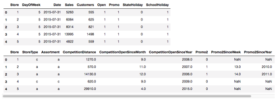

列有两种类型：

*   分类 - 它有许多“级别”，例如StoreType，Assortment
*   连续 - 它有一个数字，其中数字的差异或比率具有某种含义，例如竞争距离

```
 cat_vars = ['Store', 'DayOfWeek', 'Year', 'Month', 'Day',  'StateHoliday', 'CompetitionMonthsOpen', 'Promo2Weeks',  'StoreType', 'Assortment', 'PromoInterval',  'CompetitionOpenSinceYear', 'Promo2SinceYear', 'State',  'Week', 'Events', 'Promo_fw', 'Promo_bw',  'StateHoliday_fw', 'StateHoliday_bw',  'SchoolHoliday_fw', 'SchoolHoliday_bw'] 
```

```
 contin_vars = ['CompetitionDistance', 'Max_TemperatureC',  'Mean_TemperatureC', 'Min_TemperatureC',  'Max_Humidity', 'Mean_Humidity', 'Min_Humidity',  'Max_Wind_SpeedKm_h', 'Mean_Wind_SpeedKm_h',  'CloudCover', 'trend', 'trend_DE',  'AfterStateHoliday', 'BeforeStateHoliday', 'Promo',  'SchoolHoliday'] 
```

```
 n = len(joined); n 
```

*   数字，如`Year` ， `Month` ，虽然我们可以将它们视为连续的，但我们没有必要。 如果我们决定将`Year`作为一个分类变量，我们告诉我们的神经网络，对于`Year` （2000,2001,2002）的每个不同“级别”，你可以完全不同地对待它; 在哪里 - 如果我们说它是连续的，它必须提出某种平滑的功能来适应它们。 通常情况下，实际上是连续的但没有很多不同的级别（例如`Year` ， `DayOfWeek` ），通常将它们视为分类更好。
*   选择分类变量和连续变量是你要做出的建模决策。 总之，如果它在数据中是分类的，则必须是分类的。 如果它在数据中是连续的，你可以选择是在模型中使其连续还是分类。
*   一般来说，浮点数难以分类，因为有很多级别（我们将级别数称为“ **基数** ” - 例如，星期几变量的基数为7）。

**问题** ：你有没有对连续变量进行分类？[ [31:02](https://youtu.be/gbceqO8PpBg%3Ft%3D31m2s) ] Jeremy不会对变量进行分类，但我们可以做的一件事，比如最高温度，分为0-10,10-20,20-30，然后调用分类。 有趣的是，上周刚发表一篇论文，其中一组研究人员发现有时候分组可能会有所帮助。

**问题** ：如果你将年份作为一个类别，当模型遇到一个前所未有的年份时会发生什么？ [ [31:47](https://youtu.be/gbceqO8PpBg%3Ft%3D31m47s) ]我们会到达那里，但简短的回答是，它将被视为一个未知类别。 熊猫有一个特殊的类别叫做未知，如果它看到一个以前没见过的类别，它会被视为未知。

```
 for v in cat_vars:  joined[v] = joined[v].astype('category').cat.as_ordered() 
```

```
 for v in contin_vars:  joined[v] = joined[v].astype('float32') 
```

```
 dep = 'Sales'  joined = joined[cat_vars+contin_vars+[dep, 'Date']].copy() 
```

*   循环遍历`cat_vars`并将适用的数据框列转换为分类列。
*   循环通过`contin_vars`并将它们设置为`float32` （32位浮点），因为这是PyTorch所期望的。

#### 从一个小样本开始[ [34:29](https://youtu.be/gbceqO8PpBg%3Ft%3D34m29s) ]

```
 idxs = get_cv_idxs(n, val_pct=150000/n)  joined_samp = joined.iloc[idxs].set_index("Date")  samp_size = len(joined_samp); samp_size 
```

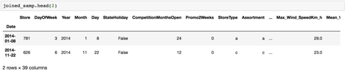

这是我们的数据。 即使我们将一些列设置为“类别”（例如'StoreType'，'Year'），Pandas仍然在笔记本中显示为字符串。

```
 df, y, nas, mapper = proc_df(joined_samp, 'Sales', do_scale=True)  yl = np.log(y) 
```

`proc_df` （进程数据框） - Fast.ai中的一个函数，它执行以下操作：

1.  拉出因变量，将其放入单独的变量中，并从原始数据框中删除它。 换句话说， `df`没有`Sales`列， `y`只包含`Sales`列。
2.  `do_scale` ：神经网络真的希望所有输入数据都在零左右，标准偏差大约为1.因此，我们取数据，减去均值，然后除以标准偏差即可。 它返回一个特殊对象，用于跟踪它用于该规范化的均值和标准偏差，因此你可以稍后对测试集执行相同操作（ `mapper` ）。
3.  它还处理缺失值 - 对于分类变量，它变为ID：0，其他类别变为1,2,3等。 对于连续变量，它用中位数替换缺失值，并创建一个新的布尔列，说明它是否丢失。

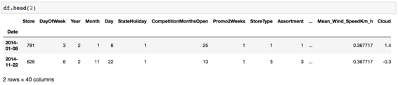

在处理之后，2014年例如变为2，因为分类变量已经被从零开始的连续整数替换。 原因是，我们将在稍后将它们放入矩阵中，并且当它可能只是两行时，我们不希望矩阵长度为2014行。

现在我们有一个数据框，它不包含因变量，一切都是数字。 这就是我们需要深入学习的地方。 查看机器学习课程了解更多详情。 机器学习课程中涉及的另一件事是验证集。 在这种情况下，我们需要预测未来两周的销售情况，因此我们应该创建一个验证集，这是我们训练集的最后两周：

```
 val_idx = np.flatnonzero((df.index<=datetime.datetime(2014,9,17)) &  (df.index>=datetime.datetime(2014,8,1))) 
```

*   [如何（以及为什么）创建一个好的验证集](http://www.fast.ai/2017/11/13/validation-sets/)

#### 让我们直接进入深度学习行动[ [39:48](https://youtu.be/gbceqO8PpBg%3Ft%3D39m48s) ]

对于任何Kaggle比赛，重要的是你要充分了解你的指标 - 你将如何评判。 在[本次比赛中](https://www.kaggle.com/c/rossmann-store-sales) ，我们将根据均方根百分比误差（RMSPE）进行判断。

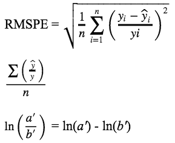

```
 def inv_y(a): return np.exp(a) 
```

```
 def exp_rmspe(y_pred, targ):  targ = inv_y(targ)  pct_var = (targ - inv_y(y_pred))/targ  return math.sqrt((pct_var**2).mean()) 
```

```
 max_log_y = np.max(yl)  y_range = (0, max_log_y*1.2) 
```

*   当你获取数据的日志时，获得均方根误差实际上会得到均方根百分比误差。

```
 md = **ColumnarModelData.from_data_frame** (PATH, val_idx, df,  yl.astype(np.float32), cat_flds=cat_vars, bs=128,  test_df=df_test) 
```

*   按照惯例，我们将从创建模型数据对象开始，该对象具有内置于其中的验证集，训练集和可选测试集。 从那以后，我们将获得一个学习者，然后我们可以选择调用`lr_find` ，然后调用`learn.fit`等等。
*   这里的区别是我们没有使用`ImageClassifierData.from_csv`或`.from_paths` ，我们需要一种名为`.from_paths`的不同类型的模型数据，我们调用`from_data_frame` 。
*   `PATH` ：指定存储模型文件的位置等
*   `val_idx` ：我们要放入验证集的行的索引列表
*   `df` ：包含自变量的数据框
*   `yl` ：我们取了`proc_df`返回的因变量`y`并记录了它的日志（即`np.log(y)` ）
*   `cat_flds` ： `cat_flds`哪些列视为分类。 请记住，到目前为止，一切都是一个数字，所以除非我们指定，否则它们将全部视为连续的。

现在我们有一个熟悉的标准模型数据对象，包含`train_dl` ， `val_dl` ， `train_ds` ， `val_ds`等。

```
 m = md.get_learner(emb_szs, len(df.columns)-len(cat_vars),  0.04, 1, [1000,500], [0.001,0.01],  y_range=y_range) 
```

*   在这里，我们要求它创建一个适合我们的模型数据的学习者。
*   `0.04` ：使用多少辍学
*   `[1000,500]` ： `[1000,500]`激活多少次
*   `[0.001,0.01]` ：在后续层使用多少辍学者

#### 关键新概念：嵌入[ [45:39](https://youtu.be/gbceqO8PpBg%3Ft%3D45m39s) ]

我们暂时忘记分类变量：

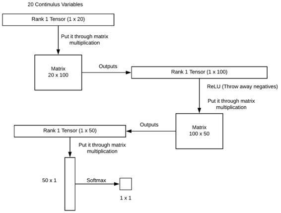

请记住，你永远不想将ReLU放在最后一层，因为softmax需要负数来创建低概率。

#### **完全连接神经网络的简单视图[** [**49:13**](https://youtu.be/gbceqO8PpBg%3Ft%3D49m13s) **]：**

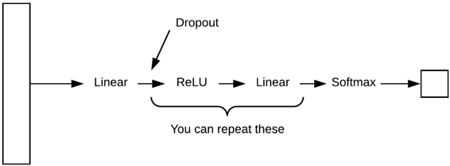

对于回归问题（不是分类），你甚至可以跳过softmax图层。

#### 分类变量[ [50:49](https://youtu.be/gbceqO8PpBg%3Ft%3D50m49s) ]

我们创建一个7行的新矩阵和我们选择的列数（例如4）并用浮点数填充它。 要使用连续变量将“星期日”添加到我们的等级1张量中，我们会查看此矩阵，它将返回4个浮点数，并将它们用作“星期日”。

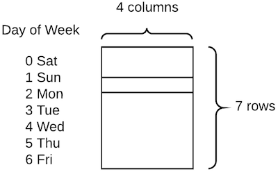

最初，这些数字是随机的。 但我们可以通过神经网络将它们更新，并以减少损失的方式更新它们。 换句话说，这个矩阵只是我们神经网络中的另一组权重。 这种类型的**矩阵**称为“ **嵌入矩阵** ”。 嵌入矩阵是我们从该类别的零和最大级别之间的整数开始的。 我们索引矩阵以找到一个特定的行，然后将它追加到我们所有的连续变量中，之后的所有内容与之前的相同（线性→ReLU→等）。

**问题** ：这4个数字代表什么？[ [55:12](https://youtu.be/gbceqO8PpBg%3Ft%3D55m12s) ]当我们看协同过滤时，我们会更多地了解这一点，但就目前而言，它们只是我们正在学习的参数，最终会给我们带来很大的损失。 我们稍后会发现这些特定的参数通常是人类可解释的并且非常有趣，但这是副作用。

**问题** ：你对嵌入矩阵的维数有很好的启发式吗？ [ [55:57](https://youtu.be/gbceqO8PpBg%3Ft%3D55m57s) ]我确实做到了！ 让我们来看看。

```
 cat_sz = [(c, len(joined_samp[c].cat.categories)+1)  **for** c **in** cat_vars]  cat_sz 
```

```
 _[('Store', 1116),_  _('DayOfWeek', 8),_  _('Year', 4),_  _('Month', 13),_  _('Day', 32),_  _('StateHoliday', 3),_  _('CompetitionMonthsOpen', 26),_  _('Promo2Weeks', 27),_  _('StoreType', 5),_  _('Assortment', 4),_  _('PromoInterval', 4),_  _('CompetitionOpenSinceYear', 24),_  _('Promo2SinceYear', 9),_  _('State', 13),_  _('Week', 53),_  _('Events', 22),_  _('Promo_fw', 7),_  _('Promo_bw', 7),_  _('StateHoliday_fw', 4),_  _('StateHoliday_bw', 4),_  _('SchoolHoliday_fw', 9),_  _('SchoolHoliday_bw', 9)]_ 
```

*   以下是每个分类变量及其基数的列表。
*   即使原始数据中没有缺失值，你仍然应该留出一个未知的，以防万一。
*   确定嵌入大小的经验法则是基数大小除以2，但不大于50。

```
 emb_szs = [(c, min(50, (c+1)//2)) **for** _,c **in** cat_sz]  emb_szs 
```

```
 _[(1116, 50),_  _(8, 4),_  _(4, 2),_  _(13, 7),_  _(32, 16),_  _(3, 2),_  _(26, 13),_  _(27, 14),_  _(5, 3),_  _(4, 2),_  _(4, 2),_  _(24, 12),_  _(9, 5),_  _(13, 7),_  _(53, 27),_  _(22, 11),_  _(7, 4),_  _(7, 4),_  _(4, 2),_  _(4, 2),_  _(9, 5),_  _(9, 5)]_ 
```

然后将嵌入大小传递给学习者：

```
 m = md.get_learner(emb_szs, len(df.columns)-len(cat_vars), 0.04, 1,  [1000,500], [0.001,0.01], y_range=y_range) 
```

**问题** ：有没有办法初始化嵌入矩阵除了随机？ [ [58:14](https://youtu.be/gbceqO8PpBg%3Ft%3D58m14s) ]我们可能会在课程的后期讨论预训练，但基本的想法是，如果罗斯曼的其他人已经训练了一个神经网络来预测奶酪销售，你也可以从他们的嵌入矩阵开始商店预测酒类销售。 例如，在Pinterest和Instacart就会发生这种情况。 Instacart使用这种技术来路由他们的购物者，Pinterest使用它来决定在网页上显示什么。 他们嵌入了在组织中共享的产品/商店矩阵，因此人们无需训练新的产品/商店。

**问题** ：使用嵌入矩阵优于单热编码有什么好处？ [ [59:23](https://youtu.be/gbceqO8PpBg%3Ft%3D59m23s) ]对于上面一周的例子，我们可以很容易地传递7个数字（例如星期日的[ [0,1,0,0,0,0,0](https://youtu.be/gbceqO8PpBg%3Ft%3D59m23s) ]），而不是4个数字。 这也是一个浮动列表，这将完全起作用 - 这就是一般来说，分类变量多年来一直用于统计（称为“虚拟变量”）。 问题是，星期日的概念只能与单个浮点数相关联。 所以它得到了这种线性行为 - 它说周日或多或少只是一件事。 通过嵌入，星期日是四维空间的概念。 我们倾向于发现的是这些嵌入向量倾向于获得这些丰富的语义概念。 例如，如果事实证明周末有不同的行为，你往往会看到周六和周日会有更高的特定数字。

> 通过具有更高的维度向量而不仅仅是单个数字，它为深度学习网络提供了学习这些丰富表示的机会。

嵌入的想法是所谓的“分布式表示” - 神经网络的最基本概念。 这就是神经网络中的概念具有很难解释的高维表示的想法。 这个向量中的这些数字甚至不必只有一个含义。 它可能意味着一件事，如果这个是低的，一个是高的，如果那个是高的那个，而另一个是低的，因为它正在经历这个丰富的非线性函数。 正是这种丰富的表现形式使它能够学习这种有趣的关系。

**问题** ：嵌入是否适合某些类型的变量？ [ [01:02:45](https://youtu.be/gbceqO8PpBg%3Ft%3D1h2m45s) ]嵌入适用于任何分类变量。 它唯一不能很好地工作的是基数太高的东西。 如果你有600,000行且变量有600,000个级别，那么这不是一个有用的分类变量。 但总的来说，本次比赛的第三名获胜者确实认为所有基因都不是太高，他们都把它们都视为绝对的。 好的经验法则是，如果你可以创建一个分类变量，你也可以这样，因为它可以学习这种丰富的分布式表示; 如果你把它留在连续的地方，它最能做的就是试着找到一个适合它的单一功能形式。

#### 场景背后的矩阵代数[ [01:04:47](https://youtu.be/gbceqO8PpBg%3Ft%3D1h4m47s) ]

查找具有索引的嵌入与在单热编码向量和嵌入矩阵之间进行矩阵乘积相同。 但这样做非常低效，因此现代库实现这一点，即采用整数并查看数组。

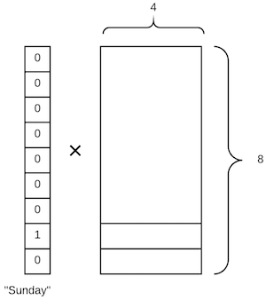

**问题** ：你能否触及使用日期和时间作为分类以及它如何影响季节性？ [ [01:06:59](https://youtu.be/gbceqO8PpBg%3Ft%3D1h6m59s) ]有一个名为`add_datepart`的Fast.ai函数，它接受数据框和列名。 它可以选择从数据框中删除该列，并将其替换为代表该日期的所有有用信息的大量列，例如星期几，日期，月份等等（基本上是Pandas给我们的所有内容）。

```
 add_datepart(weather, "Date", drop=False)  add_datepart(googletrend, "Date", drop=False)  add_datepart(train, "Date", drop=False)  add_datepart(test, "Date", drop=False) 
```

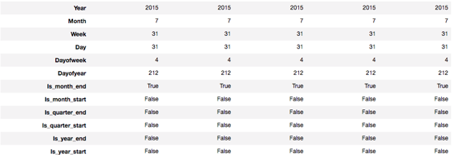

因此，例如，星期几现在变为八行四列嵌入矩阵。 从概念上讲，这允许我们的模型创建一些有趣的时间序列模型。 如果有一个七天周期的周期在周一和周三上升，但仅限于每天和仅在柏林，它可以完全这样做 - 它拥有它需要的所有信息。 这是处理时间序列的绝佳方式。 你只需确保时间序列中的循环指示符作为列存在。 如果你没有一个名为day of week的列，那么神经网络很难学会做mod 7并在嵌入矩阵中查找。 这不是不可能，但真的很难。 如果你预测旧金山的饮料销售，你可能想要一个AT＆T公园球赛开始时的清单，因为这会影响到SoMa有多少人在喝啤酒。 因此，你需要确保基本指标或周期性在你的数据中，并且只要它们在那里，神经网络将学会使用它们。

#### 学习者[ [01:10:13](https://youtu.be/gbceqO8PpBg%3Ft%3D1h10m13s) ]

```
 m = md.get_learner(emb_szs, len(df.columns)-len(cat_vars), 0.04, 1,  [1000,500], [0.001,0.01], y_range=y_range)  lr = 1e-3 
```

*   `emb_szs` ：嵌入大小
*   `len(df.columns)-len(cat_vars)` ：数据框中连续变量的数量
*   `0.04` ：嵌入矩阵有自己的丢失，这是辍学率
*   `1` ：我们想要创建多少输出（最后一个线性层的输出）
*   `[1000, 500]` ：第一线性层和第二线性层中的激活次数
*   `[0.001, 0.01]` ：第一线性层和第二线性层中的脱落
*   `y_range` ：我们暂时不担心

```
 m.fit(lr, 3, metrics=[exp_rmspe]) 
```

```
 _A Jupyter Widget_ 
```

```
 _[ 0\. 0.02479 0.02205_ **_0.19309_** _]_  _[ 1\. 0.02044 0.01751_ **_0.18301_** _]_  _[ 2\. 0.01598 0.01571_ **_0.17248_** _]_ 
```

*   `metrics` ：这是一个自定义指标，它指定在每个纪元结束时调用的函数并打印出结果

```
 m.fit(lr, 1, metrics=[exp_rmspe], cycle_len=1) 
```

```
 _[ 0\. 0.00676 0.01041 0.09711]_ 
```

通过使用所有训练数据，我们实现了大约0.09711的RMSPE。 公共领导委员会和私人领导委员会之间存在很大差异，但我们肯定是本次竞赛的最高端。

所以这是一种处理时间序列和结构化数据的技术。 有趣的是，与使用这种技术的组（ [分类变量的实体嵌入](https://arxiv.org/abs/1604.06737) ）相比，第二名获胜者做了更多的特征工程。 本次比赛的获胜者实际上是物流销售预测的主题专家，因此他们有自己的代码来创建大量的功能。 Pinterest的人们为建议建立了一个非常相似的模型也表示，当他们从梯度增强机器转向深度学习时，他们的功能工程设计更少，而且模型更简单，需要的维护更少。 因此，这是使用这种深度学习方法的一大好处 - 你可以获得最先进的结果，但工作量却少得多。

**问题** ：我们是否正在使用任何时间序列？ [ [01:15:01](https://youtu.be/gbceqO8PpBg%3Ft%3D1h15m1s) ]间接地，是的。 正如我们刚刚看到的那样，我们的列中有一周中的一周，一年中的一些等，其中大多数都被视为类别，因此我们正在构建一月，周日等的分布式表示。 我们没有使用任何经典的时间序列技术，我们所做的只是在神经网络中真正完全连接的层。 嵌入矩阵能够以比任何标准时间序列技术更丰富的方式处理诸如星期几周期性之类的事情。

关于图像模型和这个模型之间差异的**问题** [ [01:15:59](https://youtu.be/gbceqO8PpBg%3Ft%3D1h15m59s) ]：我们调用`get_learner`的方式有所不同。 在成像中我们只是做了`Learner.trained`并传递数据：

```
 learn = ConvLearner.pretrained(arch, data, ps=0., precompute=True) 
```

对于这些类型的模型，事实上对于许多模型，我们构建的模型取决于数据。 在这种情况下，我们需要知道我们有什么嵌入矩阵。 所以在这种情况下，数据对象创建了学习者（颠倒到我们之前看到的）：

```
 m = md.get_learner(emb_szs, len(df.columns)-len(cat_vars), 0.04, 1,  [1000,500], [0.001,0.01], y_range=y_range) 
```

**步骤摘要** （如果你想将它用于你自己的数据集）[ [01:17:56](https://youtu.be/gbceqO8PpBg%3Ft%3D1h17m56s) ]：

**第1步** 。 列出分类变量名称，并列出连续变量名称，并将它们放在Pandas数据框中

**第2步** 。 在验证集中创建所需的行索引列表

**第3步** 。 调用这段确切的代码：

```
 md = ColumnarModelData.from_data_frame(PATH, val_idx, df,  yl.astype(np.float32), cat_flds=cat_vars, bs=128,  test_df=df_test) 
```

**第4步** 。 创建一个列表，列出每个嵌入矩阵的大小

**第5步** 。 调用`get_learner` - 你可以使用这些确切的参数开头：

```
 m = md.get_learner(emb_szs, len(df.columns)-len(cat_vars), 0.04, 1,  [1000,500], [0.001,0.01], y_range=y_range) 
```

**第6步** 。 打电话给`m.fit`

**问题** ：如何对此类数据使用数据增强，以及丢失如何工作？ [ [01:18:59](https://youtu.be/gbceqO8PpBg%3Ft%3D1h18m59s) ]不知道。 Jeremy认为它必须是针对特定领域的，但他从未见过任何论文或业内任何人使用结构化数据和深度学习进行数据增强。 他认为可以做到但没有看到它完成。 辍学者正在做什么与以前完全一样。

**问题** ：缺点是什么？ 几乎没有人使用这个。 为什么不？ [ [01:20:41](https://youtu.be/gbceqO8PpBg%3Ft%3D1h20m41s) ]基本上答案就像我们之前讨论过的那样，学术界没有人差不多正在研究这个问题，因为这不是人们发表的内容。 结果，人们可以看到的并没有很好的例子，并且说“哦，这是一种运作良好的技术，让我们的公司实施它”。 但也许同样重要的是，到目前为止，使用这个Fast.ai库，还没有任何方法可以方便地进行。 如果你想要实现其中一个模型，则必须自己编写所有自定义代码。 有很多大的商业和科学机会来使用它并解决以前未能很好解决的问题。

### 自然语言处理[ [01:23:37](https://youtu.be/gbceqO8PpBg%3Ft%3D1h23m37s) ]

最具前瞻性的深度学习领域，它落后于计算机视觉两三年。 软件的状态和一些概念远没有计算机视觉那么成熟。 你在NLP中找到的一件事是你可以解决的特殊问题，并且它们具有特定的名称。 NLP中存在一种称为“语言建模”的特殊问题，它有一个非常具体的定义 - 它意味着建立一个模型，只要给出一个句子的几个单词，你能预测下一个单词将会是什么。

#### 语言建模[ [01:25:48](https://youtu.be/gbceqO8PpBg%3Ft%3D1h25m48s) ]

[笔记本](https://github.com/fastai/fastai/blob/master/courses/dl1/lang_model-arxiv.ipynb)

这里我们有来自arXiv（arXiv.org）的18个月的论文，这是一个例子：

```
 ' '.join(md.trn_ds[0].text[:150]) 
```

```
 _'<cat> csni <summ> the exploitation of mm - wave bands is one of the key - enabler for 5 g mobile \n radio networks ._ _however , the introduction of mm - wave technologies in cellular \n networks is not straightforward due to harsh propagation conditions that limit \n the mm - wave access availability ._ _mm - wave technologies require high - gain antenna \n systems to compensate for high path loss and limited power ._ _as a consequence , \n directional transmissions must be used for cell discovery and synchronization \n processes : this can lead to a non - negligible access delay caused by the \n exploration of the cell area with multiple transmissions along different \n directions ._ _\n the integration of mm - wave technologies and conventional wireless access \n networks with the objective of speeding up the cell search process requires new \n'_ 
```

*   `&lt;cat&gt;` - 论文的类别。 CSNI是计算机科学和网络
*   `&lt;summ&gt;` - 论文摘要

以下是训练有素的语言模型的输出结果。 我们做了简单的小测试，在这些测试中你传递了一些启动文本，看看模型认为下一步应该是什么：

```
 sample_model(m, "<CAT> csni <SUMM> algorithms that") 
```

```
 _...use the same network as a single node are not able to achieve the same performance as the traditional network - based routing algorithms ._ _in this paper , we propose a novel routing scheme for routing protocols in wireless networks ._ _the proposed scheme is based ..._ 
```

它通过阅读arXiv论文得知，正在写关于计算机网络的人会这样说。 记住，它开始根本不懂英语。 它开始时是一个嵌入矩阵，用于英语中每个随机的单词。 通过阅读大量的arXiv论文，它学到了什么样的单词跟随他人。

在这里，我们尝试将类别指定为计算机视觉：

```
 sample_model(m, "<CAT> cscv <SUMM> algorithms that") 
```

```
 _...use the same data to perform image classification are increasingly being used to improve the performance of image classification algorithms ._ _in this paper , we propose a novel method for image classification using a deep convolutional neural network ( cnn ) ._ _the proposed method is ..._ 
```

它不仅学会了如何写好英语，而且在你说出“卷积神经网络”之后，你应该使用括号来指定首字母缩略词“（CNN）”。

```
 sample_model(m,"<CAT> cscv <SUMM> algorithms. <TITLE> on ") 
```

```
 ...the performance of deep learning for image classification <eos> 
```

```
 sample_model(m,"<CAT> csni <SUMM> algorithms. <TITLE> on ") 
```

```
 ...the performance of wireless networks <eos> 
```

```
 sample_model(m,"<CAT> cscv <SUMM> algorithms. <TITLE> towards ") 
```

```
 ...a new approach to image classification <eos> 
```

```
 sample_model(m,"<CAT> csni <SUMM> algorithms. <TITLE> towards ") 
```

```
 ...a new approach to the analysis of wireless networks <eos> 
```

语言模型可以非常深刻和微妙，所以我们将尝试构建它 - 不是因为我们关心这一点，而是因为我们正在尝试创建一个用于执行其他任务的预训练模型。 例如，鉴于IMDB电影评论，我们将确定它们是正面还是负面。 这很像猫与狗 - 分类问题。 所以我们真的想使用预先训练好的网络，至少知道如何阅读英语。 因此，我们将训练一个模型来预测句子的下一个单词（即语言模型），就像在计算机视觉中一样，在最后粘贴一些新的层并要求它预测某些东西是正面的还是负面的。

#### IMDB [ [1:31:11](https://youtu.be/gbceqO8PpBg?t=1h31m11s) ]

[笔记本](https://github.com/fastai/fastai/blob/master/courses/dl1/lesson4-imdb.ipynb)

我们要做的是训练语言模型，使其成为分类模型的预训练模型。 换句话说，我们正在努力充分利用我们在计算机视觉中学到的知识，即如何进行微调以创建强大的分类模型。

**问题** ：为什么直接做你想做的不行？ [ [01:31:34](https://youtu.be/gbceqO8PpBg?t=1h31m34s) ]事实证明它不是凭经验。 有几个原因。 首先，我们知道对预先训练好的网络进行微调非常强大。 因此，如果我们首先可以让它学习一些相关的任务，那么我们可以使用所有这些信息来尝试并帮助它完成第二项任务。 另一个是IMDB电影评论长达数千字。 因此，在阅读了几千个单词后，对英语的结构或单词或标点符号的概念一无所知，所得到的只是1或0（正面或负面）。 试图学习整个英语结构，然后从一个数字表达积极和消极的情绪，这太过于期待了。

**问题** ：这与卡尔帕西的Char-RNN相似吗？ [ [01:33:09](https://youtu.be/gbceqO8PpBg?t=1h33m9s) ]这有点类似于Char-RNN，它预测下一个字母给出了许多以前的字母。 语言模型通常在单词级别工作（但他们没有必要），我们将在本课程中专注于单词级别建模。

**问题** ：这些生成的单词/句子在多大程度上是在训练集中找到的实际副本？ [ [01:33:44](https://youtu.be/gbceqO8PpBg?t=1h33m44s) ]单词肯定是它之前看过的单词，因为它不是一个字符级别所以它只能给我们之前看过的单词。 句子，有严格的方法，但最简单的方法是通过查看上面的例子，你会感觉到它。 最重要的是，当我们训练语言模型时，我们将有一个验证集，以便我们试图预测下一个从未见过的东西。 使用语言模型生成像[波束搜索](http://forums.fast.ai/t/tricks-for-using-language-models-to-generate-text/8127/2)这样的文本有一些技巧。

文本分类用例：

*   对于对冲基金，确定过去导致大量市场下跌的文章或Twitter中的内容。
*   确定客户服务查询，这些查询往往与下个月取消合同的人员相关联
*   将文档组织成是否属于法律发现的一部分。

```
 from fastai.learner import * 
```

```
 import torchtext  from torchtext import vocab, data  from torchtext.datasets import language_modeling 
```

```
 from fastai.rnn_reg import *  from fastai.rnn_train import *  from fastai.nlp import *  from fastai.lm_rnn import * 
```

```
 import dill as pickle 
```

*   `torchtext` - PyTorch的NLP库

#### 数据[ [01:37:05](https://youtu.be/gbceqO8PpBg?t=1h37m5s) ]

IMDB [大型电影评论数据集](http://ai.stanford.edu/~amaas/data/sentiment/)

```
 PATH = 'data/aclImdb/' 
```

```
 TRN_PATH = 'train/all/'  VAL_PATH = 'test/all/'  TRN = f'{PATH}{TRN_PATH}'  VAL = f'{PATH}{VAL_PATH}' 
```

```
 %ls {PATH} 
```

```
 _imdbEr.txt imdb.vocab models/ README test/ tmp/ train/_ 
```

在这种情况下，我们没有单独的测试和验证。 就像在视觉中一样，训练目录中包含大量文件：

```
 trn_files = !ls {TRN}  trn_files[:10]  _['0_0.txt',_  _'0_3.txt',_  _'0_9.txt',_  _'10000_0.txt',_  _'10000_4.txt',_  _'10000_8.txt',_  _'1000_0.txt',_  _'10001_0.txt',_  _'10001_10.txt',_  _'10001_4.txt']_ 
```

```
 review = !cat {TRN}{trn_files[6]}  review[0] 
```

```
 _"I have to say when a name like Zombiegeddon and an atom bomb on the front cover I was expecting a flat out chop-socky fung-ku, but what I got instead was a comedy. So, it wasn't quite was I was expecting, but I really liked it anyway! The best scene ever was the main cop dude pulling those kids over and pulling a Bad Lieutenant on them!! I was laughing my ass off. I mean, the cops were just so bad! And when I say bad, I mean The Shield Vic Macky bad. But unlike that show I was laughing when they shot people and smoked dope.<br /><br />Felissa Rose...man, oh man. What can you say about that hottie. She was great and put those other actresses to shame. She should work more often!!!!! I also really liked the fight scene outside of the building. That was done really well. Lots of fighting and people getting their heads banged up. FUN! Last, but not least Joe Estevez and William Smith were great as the...well, I wasn't sure what they were, but they seemed to be having fun and throwing out_  _lines._ _I mean, some of it didn't make sense with the rest of the flick, but who cares when you're laughing so hard!_ _All in all the film wasn't the greatest thing since sliced bread, but I wasn't expecting that._ _It was a Troma flick so I_  _It's nice when something surprises you but not totally sucking.<br /><br />Rent it if you want to get stoned on a Friday night and laugh with your buddies._ _Don't rent it if you are an uptight weenie or want a zombie movie with lots of flesh eating.<br /><br />PS Uwe Boil was a nice touch."_ 
```

现在我们将检查数据集中有多少个单词：

```
 !find {TRN} -name '*.txt' | xargs cat | wc -w 
```

```
 _17486581_ 
```

```
 !find {VAL} -name '*.txt' | xargs cat | wc -w 
```

```
 _5686719_ 
```

在我们可以对文本执行任何操作之前，我们必须将其转换为令牌列表。 令牌基本上就像一个单词。 最终我们将它们变成一个数字列表，但第一步是将它变成一个单词列表 - 这在NLP中称为“标记化”。 一个好的标记器可以很好地识别句子中的碎片。 每个分隔的标点符号将被分开，并且多部分单词的每个部分将被适当地分开。 Spacy做了很多NLP的东西，它拥有Jeremy所知道的最好的标记器。 因此，Fast.ai库可以与Spacech tokenizer一起使用，就像使用torchtext一样。

#### 创建一个领域[ [01:41:01](https://youtu.be/gbceqO8PpBg?t=1h41m1s) ]

字段是如何预处理某些文本的定义。

```
 TEXT = data.Field(lower= **True** , tokenize=spacy_tok) 
```

*   `lower=True` - 小写文本
*   `tokenize=spacy_tok` - 使用`spacy_tok`标记

现在我们创建通常的Fast.ai模型数据对象：

```
 bs=64; bptt=70 
```

```
 FILES = dict(train=TRN_PATH, validation=VAL_PATH, test=VAL_PATH)  md = LanguageModelData.from_text_files(PATH, TEXT, **FILES, bs=bs,  bptt=bptt, min_freq=10) 
```

*   `PATH` ：按照通常的数据，保存模型的位置等
*   `TEXT` ：torchtext的字段定义
*   `**FILES` ：我们拥有的所有`**FILES`列表：训练，验证和测试（为了简单起见，我们没有单独的验证和测试集，因此两者都指向验证文件夹）
*   `bs` ：批量大小
*   `bptt` ：通过时间回到道具。 这意味着我们将立刻在GPU上坚持多长时间
*   `min_freq=10` ： `min_freq=10` ，我们将用整数替换单词（每个单词的唯一索引）。 如果有任何单词少于10次，请将其称为未知。

在构建`ModelData`对象之后，它会自动使用一个非常重要的属性`TEXT.vocab`填充`TEXT`对象。 这是一个_词汇表_ ，它存储文本中看到的唯一单词（或_标记_ ），以及每个单词如何映射到唯一的整数id。

```
 _# 'itos': 'int-to-string'_  TEXT.vocab.itos[:12] 
```

```
 _['<unk>', '<pad>', 'the', ',', '.', 'and', 'a', 'of', 'to', 'is', 'it', 'in']_ 
```

```
 _# 'stoi': 'string to int'_  TEXT.vocab.stoi['the'] 
```

```
 _2_ 
```

`itos`按频率排序，前两个特殊的除外。 使用`vocab` ，torchtext会将单词转换为整数ID给我们：

```
 md.trn_ds[0].text[:12] 
```

```
 _['i',_  _'have',_  _'always',_  _'loved',_  _'this',_  _'story',_  _'-',_  _'the',_  _'hopeful',_  _'theme',_  _',',_  _'the']_ 
```

```
 TEXT.numericalize([md.trn_ds[0].text[:12]]) 
```

```
 _Variable containing:_  _12_  _35_  _227_  _480_  _13_  _76_  _17_  _2_  _7319_  _769_  _3_  _2_  _[torch.cuda.LongTensor of size 12x1 (GPU 0)]_ 
```

**问题** ：做任何词干或引理调整是否常见？ [ [01:45:47](https://youtu.be/gbceqO8PpBg?t=1h45m47s) ]不是，不。 通常，标记化是我们想要的。 为了保持尽可能通用，我们想知道接下来会发生什么，所以无论是将来时态还是过去时，复数还是单数，我们都不知道哪些东西会有趣，哪些不是，所以它似乎通常最好尽量不让它。

**问题** ：处理自然语言时，上下文不重要吗？ 我们为什么要对单词进行标记和查看？ [ [01:46:38](https://youtu.be/gbceqO8PpBg?t=1h46m38s) ]不，我们不是在看单个词 - 它们仍然是有序的。 仅仅因为我们用12号替换了我，他们仍然按照这个顺序。 处理称为“词袋”的自然语言有一种不同的方式，它们会丢弃秩序和背景。 在机器学习课程中，我们将学习如何使用词语表示，但我相信它们不再有用或者不再有用。 我们开始学习如何使用深度学习来正确使用上下文。

#### 批量大小和BPTT [ [01:47:40](https://youtu.be/gbceqO8PpBg?t=1h47m40s) ]

在语言模型中发生的事情即使我们有很多电影评论，它们都会被连接成一个大块的文本。 因此，我们预测这个巨大的长篇内容中的下一个词是所有IMDB电影评论连接在一起。

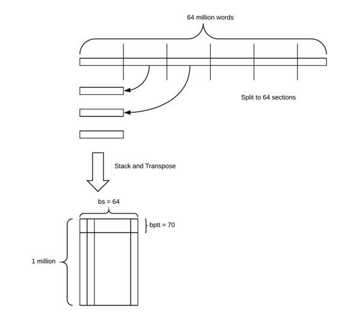

*   我们将连锁评论分成几批。 在这种情况下，我们将其拆分为64个部分
*   然后，我们将每个部分移动到前一部分之下，然后转置它。
*   我们最终得到一个100万乘64的矩阵。
*   然后我们抓住一小块时间，那些块长度**大约**等于BPTT。 在这里，我们抓住了一个70长的部分，这是我们第一次看到我们的GPU（即批处理）。

```
 next(iter(md.trn_dl)) 
```

```
 _(Variable containing:_  _12 567 3 ... 2118 4 2399_  **_35 7 33_** _ ... 6 148 55_  _227 103 533 ... 4892 31 10_  _... ⋱ ..._  _19 8879 33 ... 41 24 733_  _552 8250 57 ... 219 57 1777_  _5 19 2 ... 3099 8 48_  _[torch.cuda.LongTensor of size 75x64 (GPU 0)], Variable containing:_  **_35_**  **_7_**  **_33_**  _⋮_  _22_  _3885_  _21587_  _[torch.cuda.LongTensor of size 4800 (GPU 0)])_ 
```

*   我们通过使用`iter`包装数据加载器然后调用`next`获取我们的第一个训练批。
*   我们得到了一个75乘64张（约70行但不完全）
*   一个巧妙的技巧torchtext做的是每次随机改变`bptt`数，所以每个时代它的文本略有不同 - 类似于计算机视觉中的洗牌图像。 我们不能随意改变这些词，因为它们需要按正确的顺序排列，所以我们会随机移动它们的断点。
*   目标值也是75乘64但由于技术上的原因，它被展平为单个矢量。

**问题** ：为什么不用句子分开？ [ [01:53:40](https://youtu.be/gbceqO8PpBg?t=1h53m40s) ]不是真的 请记住，我们正在使用列。 因此，我们每个专栏的长度都在100万左右，所以尽管这些专栏并不总是完全停止完成，但我们并不关心它们。 每列包含多个句子。

关于这个问题，Jeremy在这个语言模型矩阵中发现了一段时间有点令人费解的东西，所以不要担心，如果需要一段时间，你必须问几千个问题。

#### 创建模型[ [01:55:46](https://youtu.be/gbceqO8PpBg?t=1h55m46s) ]

现在我们有了一个模型数据对象可以为我们批量生产，我们可以创建一个模型。 首先，我们将创建一个嵌入矩阵。

这是：＃批次; #vocab中的唯一标记; 数据集的长度; 单词数量

```
 len(md.trn_dl), md.nt, len(md.trn_ds), len(md.trn_ds[0].text) 
```

```
 _(4602, 34945, 1, 20621966)_ 
```

这是我们的嵌入矩阵看起来像：

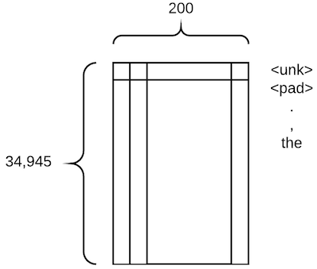

*   它是一个高基数的分类变量，而且，它是唯一的变量 - 这在NLP中是典型的
*   嵌入大小为200，比我们以前的嵌入向量大得多。 这并不奇怪，因为一个词比星期日的概念有更多的细微差别。 **通常，单词的嵌入大小将介于50和600之间。**

```
 em_sz = 200 _# size of each embedding vector_  nh = 500 _# number of hidden activations per layer_  nl = 3 _# number of layers_ 
```

研究人员发现，大量的_动量_ （我们将在后面了解）对这些类型的_RNN_模型不能很好地工作，因此我们创建了一个版本的_Adam_优化器，其动量小于其默认值`0.9` 。 每次你做NLP时，你应该包括这一行：

```
 opt_fn = partial(optim.Adam, betas=(0.7, 0.99)) 
```

Fast.ai使用由Stephen Merity开发的最先进的[AWD LSTM语言模型](https://arxiv.org/abs/1708.02182)的变体。 该模型的一个关键特性是它通过[Dropout](https://en.wikipedia.org/wiki/Convolutional_neural_network#Dropout)提供出色的正则化。 没有简单的方法（但是！）找到下面的辍学参数的最佳值 - 你只需要试验......

但是，其他参数（ `alpha` ， `beta`和`clip` ）通常不需要调整。

```
 learner = md.get_model(opt_fn, em_sz, nh, nl, dropouti=0.05,  dropout=0.05, wdrop=0.1, dropoute=0.02,  dropouth=0.05)  learner.reg_fn = partial(seq2seq_reg, alpha=2, beta=1)  learner.clip=0.3 
```

*   在上一讲中，我们将了解架构是什么以及所有这些辍学者是什么。 现在，只要知道它与平常一样，如果你试图建立一个NLP模型并且你不合适，那么减少所有这些辍学，如果过度拟合，然后以大致这个比率增加所有这些辍学。 由于这是最近的一篇论文，所以没有很多指导，但这些比率运作良好 - 这也是斯蒂芬一直在使用的。
*   还有另一种我们可以避免过度拟合的方法，我们将在最后一堂课中讨论。 目前， `learner.reg_fn = partial(seq2seq_reg, alpha=2, beta=1)`可靠地运行，因此你的所有NLP模型可能都需要此特定行。
*   `learner.clip=0.3` ：当你查看你的渐变并将它们乘以学习率来决定更新你的权重多少时，这将不允许它们超过0.3。 这是一个很酷的小技巧，可以防止我们采取太大的措施。
*   现在细节并不重要，所以你可以按原样使用它们。

**问题** ：Word2vec或GloVe中存在单词嵌入。 它们与此有何不同？ 为什么不用那些初始化权重？ [ [02:02:29](https://youtu.be/gbceqO8PpBg?t=2h2m29s) ]人们在进行各种其他任务之前已经预先训练了这些嵌入矩阵。 它们不称为预训练模型; 它们只是一个预先训练好的嵌入矩阵，你可以下载它们。 没有理由我们无法下载它们。 我发现以这种方式构建一个完整的预训练模型似乎并没有从使用预训练的单词向量中获益多少; 使用整个预训练语言模型的其他地方产生了更大的差异。 也许我们可以将两者结合起来，使它们更好一些。

**问题：**模型的架构是什么？ [ [02:03:55](https://youtu.be/gbceqO8PpBg?t=2h3m55s) ]我们将在[上一课](https://youtu.be/gbceqO8PpBg?t=2h3m55s)中学习模型架构，但目前，它是一个使用LSTM（长期短期记忆）的反复神经网络。

#### 适合[ [02:04:24](https://youtu.be/gbceqO8PpBg?t=2h4m24s) ]

```
 learner.fit(3e-3, 4, wds=1e-6, cycle_len=1, cycle_mult=2) 
```

```
 learner.save_encoder('adam1_enc') 
```

```
 learner.fit(3e-3, 4, wds=1e-6, cycle_len=10,  cycle_save_name='adam3_10') 
```

```
 learner.save_encoder('adam3_10_enc') 
```

```
 learner.fit(3e-3, 1, wds=1e-6, cycle_len=20,  cycle_save_name='adam3_20') 
```

```
 learner.load_cycle('adam3_20',0) 
```

在情绪分析部分，我们只需要一半的语言模型 - _编码器_ ，所以我们保存那部分。

```
 learner.save_encoder('adam3_20_enc') 
```

```
 learner.load_encoder('adam3_20_enc') 
```

语言建模的准确性通常使用度量_复杂_度来度量，这只是我们使用的损失函数的`exp()` 。

```
 math.exp(4.165) 
```

```
 _64.3926824434624_ 
```

```
 pickle.dump(TEXT, open(f' **{PATH}** models/TEXT.pkl','wb')) 
```

#### 测试[ [02:04:53](https://youtu.be/gbceqO8PpBg?t=2h4m53s) ]

我们可以使用我们的语言模型来检查它似乎工作正常。 首先，让我们创建一小段文本来“填充”一组预测。 我们将使用我们的torchtext字段对其进行数值化，以便我们可以将其提供给我们的语言模型。

```
 m=learner.model  ss=""". So, it wasn't quite was I was expecting, but I really liked it anyway! The best""" 
```

```
 s = [spacy_tok(ss)]  t=TEXT.numericalize(s)  ' '.join(s[0]) 
```

```
 _". So , it was n't quite was I was expecting , but I really liked it anyway ! The best"_ 
```

我们还没有添加方法来简化测试语言模型，因此我们需要手动完成这些步骤。

```
 _# Set batch size to 1_  m[0].bs=1  _# Turn off dropout_  m.eval()  _# Reset hidden state_  m.reset()  _# Get predictions from model_  res,*_ = m(t)  _# Put the batch size back to what it was_  m[0].bs=bs 
```

让我们看看在我们的简短文本之后的下一个单词的前10个预测：

```
 nexts = torch.topk(res[-1], 10)[1]  [TEXT.vocab.itos[o] **for** o **in** to_np(nexts)] 
```

```
 _['film',_  _'movie',_  _'of',_  _'thing',_  _'part',_  _'<unk>',_  _'performance',_  _'scene',_  _',',_  _'actor']_ 
```

...让我们看看我们的模型是否可以自己生成更多的文本！

```
 print(ss," **\n** ")  **for** i **in** range(50):  n=res[-1].topk(2)[1]  n = n[1] **if** n.data[0]==0 **else** n[0]  print(TEXT.vocab.itos[n.data[0]], end=' ')  res,*_ = m(n[0].unsqueeze(0))  print('...') 
```

```
 _._ _So, it wasn't quite was I was expecting, but I really liked it anyway!_ _The best_ 
```

```
 _film ever !_ _<eos> i saw this movie at the toronto international film festival ._ _i was very impressed ._ _i was very impressed with the acting ._ _i was very impressed with the acting ._ _i was surprised to see that the actors were not in the movie ._ _..._ 
```

#### 情绪[ [02:05:09](https://youtu.be/gbceqO8PpBg?t=2h5m9s) ]

所以我们预先训练了一种语言模型，现在我们想对其进行微调以进行情感分类。

要使用预先训练的模型，我们需要从语言模型中保存的词汇，因为我们需要确保相同的单词映射到相同的ID。

```
 TEXT = pickle.load(open(f' **{PATH}** models/TEXT.pkl','rb')) 
```

`sequential=False`告诉torchtext文本字段应该被标记化（在这种情况下，我们只想存储'正'或'负'单个标签）。

```
 IMDB_LABEL = data.Field(sequential= **False** ) 
```

这一次，我们不需要将整个事物视为一大块文本，但每个评论都是分开的，因为每个评论都有不同的情感。

`splits`是一种创建训练集，测试集和验证集的torchtext方法。 IMDB数据集内置于torchtext中，因此我们可以利用它。 看看`lang_model-arxiv.ipynb` ，看看如何定义自己的fastai / torchtext数据集。

```
 **splits** = torchtext.datasets.IMDB.splits(TEXT, IMDB_LABEL, 'data/') 
```

```
 t = splits[0].examples[0] 
```

```
 t.label, ' '.join(t.text[:16]) 
```

```
 _('pos', 'ashanti is a very 70s sort of film ( 1979 , to be precise ) .')_ 
```

fastai可以直接从torchtext `splits`创建`ModelData`对象。

```
 md2 = TextData.from_splits(PATH, splits, bs) 
```

现在你可以继续调用`get_model`来获取我们的学习者。 然后我们可以加载预训练的语言模型（ `load_encoder` ）。

```
 m3 = md2.get_model(opt_fn, 1500, bptt, emb_sz=em_sz, n_hid=nh,  n_layers=nl, dropout=0.1, dropouti=0.4,  wdrop=0.5, dropoute=0.05, dropouth=0.3) 
```

```
 m3.reg_fn = partial(seq2seq_reg, alpha=2, beta=1) 
```

```
 m3. **load_encoder** (f'adam3_20_enc') 
```

因为我们正在对预训练模型进行微调，所以我们将使用差分学习速率，并且还增加剪裁的最大梯度，以使SGDR更好地工作。

```
 m3.clip=25.  lrs=np.array([1e-4,1e-3,1e-2]) 
```

```
 m3.freeze_to(-1)  m3.fit(lrs/2, 1, metrics=[accuracy])  m3.unfreeze()  m3.fit(lrs, 1, metrics=[accuracy], cycle_len=1) 
```

```
 _[ 0\. 0.45074 0.28424 0.88458]_ 
```

```
 _[ 0\. 0.29202 0.19023 0.92768]_ 
```

我们确保冻结最后一层以外的所有图层。 然后我们训练一下，解冻它，训练一下。 好的一点是，一旦你有一个预先训练好的语言模型，它实际上训练得非常快。

```
 m3.fit(lrs, 7, metrics=[accuracy], cycle_len=2,  cycle_save_name='imdb2') 
```

```
 [ 0\. 0.29053 0.18292 0.93241]  [ 1\. 0.24058 0.18233 0.93313]  [ 2\. 0.24244 0.17261 0.93714]  [ 3\. 0.21166 0.17143 0.93866]  [ 4\. 0.2062 0.17143 0.94042]  [ 5\. 0.18951 0.16591 0.94083]  [ 6\. 0.20527 0.16631 0.9393 ]  [ 7\. 0.17372 0.16162 0.94159]  [ 8\. 0.17434 0.17213 0.94063]  [ 9\. 0.16285 0.16073 0.94311]  [ 10\. 0.16327 0.17851 0.93998]  [ 11\. 0.15795 0.16042 0.94267]  [ 12\. 0.1602 0.16015 0.94199]  [ 13\. 0.15503 0.1624 0.94171] 
```

```
 m3.load_cycle('imdb2', 4) 
```

```
 accuracy(*m3.predict_with_targs()) 
```

```
 _0.94310897435897434_ 
```

Bradbury等人最近的一篇论文， [学习翻译：语境化词汇向量](https://einstein.ai/research/learned-in-translation-contextualized-word-vectors) ，有一个方便的总结，解决了这个IMDB情绪分析问题的最新学术研究。 显示的许多最新算法都针对此特定问题进行了调整。

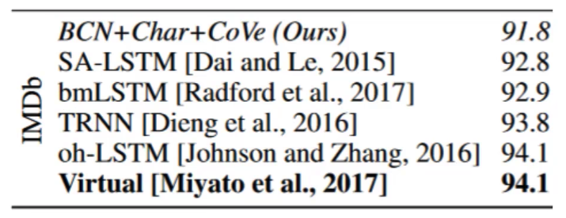

如你所见，我们在情绪分析中获得了新的最新结果，将误差从5.9％降低到5.5％！ 你应该能够使用相同的基本步骤获得类似的其他NLP分类问题的世界级结果。

有很多机会可以进一步改善这一点，尽管我们无法在本课程的第2部分之前找到它们。

*   例如，我们可以开始训练查看大量医学期刊的语言模型，然后我们可以制作一个可下载的医学语言模型，然后任何人都可以使用它来微调医学文献的前列腺癌子集。
*   我们还可以将它与预先训练的单词向量相结合
*   我们可以预先训练一个维基百科语料库语言模型，然后将其微调成IMDB语言模型，然后将其微调成IMDB情绪分析模型，我们会得到比这更好的东西。

有一位名叫塞巴斯蒂安·鲁德（Sebastian Ruder）的非常出色的研究员，他是唯一一位真正在NLP中进行预训练，微调和转学习的NLP研究员。 Jeremy问他为什么这不会发生更多，他的观点是因为没有软件可以让它变得简单。 希望Fast.ai会改变这一点。

#### 协同过滤介绍[ [02:11:38](https://youtu.be/gbceqO8PpBg?t=2h11m38s) ]

[笔记本](https://github.com/fastai/fastai/blob/master/courses/dl1/lesson5-movielens.ipynb)

数据来自[http://files.grouplens.org/datasets/movielens/ml-latest-small.zip](http://files.grouplens.org/datasets/movielens/ml-latest-small.zip)

```
 path='data/ml-latest-small/' 
```

```
 ratings = pd.read_csv(path+'ratings.csv')  ratings.head() 
```

数据集如下所示：

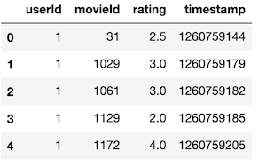

它包含用户的评级。 我们的目标将是一些我们以前从未见过的用户 - 电影组合，我们必须预测评级。

```
 movies = pd.read_csv(path+'movies.csv')  movies.head() 
```

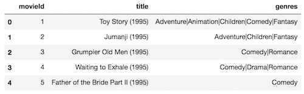

为了使它更有趣，我们还将实际下载电影列表，以便我们可以解释这些嵌入矩阵中的实际内容。

```
 g=ratings.groupby('userId')['rating'].count()  topUsers=g.sort_values(ascending=False)[:15] 
```

```
 g=ratings.groupby('movieId')['rating'].count()  topMovies=g.sort_values(ascending=False)[:15] 
```

```
 top_r = ratings.join(topUsers, rsuffix='_r', how='inner',  on='userId')  top_r = top_r.join(topMovies, rsuffix='_r', how='inner',  on='movieId') 
```

```
 pd.crosstab(top_r.userId, top_r.movieId, top_r.rating,  aggfunc=np.sum) 
```

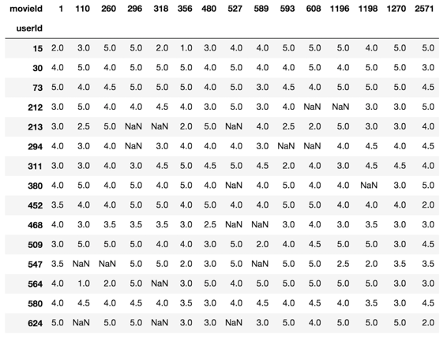

这就是我们正在创造的 - 电影用户的这种交叉标签。

你可以随意向前看，你会发现大多数步骤已经为你所熟悉。
