# 深度学习：第一部分第五课

+   [课程论坛](http://forums.fast.ai/t/wiki-lesson-5/9403)

## 一，引言

没有足够的关于结构化深度学习的出版物，但它肯定出现在行业中：

[结构化深度学习](https://towardsdatascience.com/structured-deep-learning-b8ca4138b848)，作者：Kerem Turgutlu @datascience.com

你可以使用[此工具](https://github.com/hardikvasa/google-images-download)从 Google 下载图片并解决自己的问题：

[小型图像数据集的乐趣（第2部分）](https://towardsdatascience.com/fun-with-small-image-data-sets-part-2-54d683ca8c96)，作者：Nikhil B @datascience.com

如何训练神经网络的介绍（一篇伟大的技术写作）：

[我们如何“训练”神经网络？](https://towardsdatascience.com/how-do-we-train-neural-networks-edd985562b73)，由 Vitaly Bushaev @datascience.com

学生们在 [Kaggle 幼苗分类比赛](https://www.kaggle.com/c/plant-seedlings-classification/leaderboard)中与 Jeremy 竞争。

## II. 协同过滤 - 使用 MovieLens 数据集

讨论的笔记本可以在[这里](https://github.com/fastai/fastai/blob/master/courses/dl1/lesson5-movielens.ipynb)找到（`lesson5-movielens.ipynb`）。

我们来看看数据。 我们将使用`userId` （类别）， `movieId` （类别）和`rating`（因变量）进行建模。

```py
ratings = pd.read_csv(path+'ratings.csv')
ratings.head() 
```

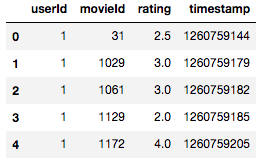

### 为 Excel 创建子集

我们创建了最受欢迎的电影和大多数电影狂热粉的交叉表，我们将其复制到 Excel 中进行可视化。

```py
g=ratings.groupby('userId')['rating'].count()  
topUsers=g.sort_values(ascending=False)[:15] 
```

```py
g=ratings.groupby('movieId')['rating'].count()  
topMovies=g.sort_values(ascending=False)[:15] 
```

```py
top_r = ratings.join(topUsers, rsuffix='_r', how='inner', on='userId')
top_r = top_r.join(topMovies, rsuffix='_r', how='inner', on='movieId') 
```

```py
pd.crosstab(top_r.userId, top_r.movieId, top_r.rating, aggfunc=np.sum) 
```


[这](https://github.com/fastai/fastai/blob/master/courses/dl1/excel/collab_filter.xlsx)是包含上述信息的 excel 文件。 首先，我们将使用矩阵分解而不构建神经网络。

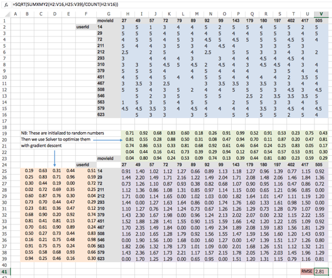

*   蓝色单元格 - 实际评级
*   紫色单元格 - 我们的预测
*   红色单元格 - 我们的损失函数即均方根误差（RMSE）
*   绿色单元格 - 电影嵌入（随机初始化）
*   橙色单元格 - 用户嵌入（随机初始化）

每个预测是电影嵌入向量和用户嵌入向量的点积。 在线性代数术语中，它等于矩阵乘积，因为一个是行，一个是列。 如果没有实际评级，我们将预测设置为零（将其视为测试数据 - 而不是训练数据）。

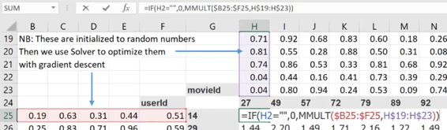

然后我们使用梯度下降来减少损失。 Microsoft Excel 在加载项中有一个“求解器”，可以通过更改所选单元格来最小化变量（`GRG Nonlinear`是你要使用的方法）。

这可称为“浅学习”（与深度学习相反），因为没有非线性层或第二线性层。 那么我们直觉上做了什么呢？ 每部电影的五个数字称为“嵌入”（潜在因式） - 第一个数字可能代表科幻和幻想的程度，第二个数字可能是电影使用了多少特效，第三个可能是对话驱动的程度。与之类似，每个用户还有 5 个数字，例如，表示用户喜欢幻想，特效和对话驱动的电影的程度。 我们的预测是这些向量的叉乘。 由于我们没有每个用户的每个电影评论，因此我们试图找出哪些电影与这部电影相似，以及其他用户评价其他电影，如何与这个用户评价这个电影类似（因此称为“协同”）。

我们如何处理新用户或新电影 - 我们是否需要重新训练模型？ 我们现在没有时间来讨论这个问题，但基本上你需要有一个新的用户模型或最初会使用的新电影模型，随着时间的推移你需要重新训练模型。

### 简单的 Python 版本 [[26:03](https://youtu.be/J99NV9Cr75I%3Ft%3D26m3s)]

这应该看起来很熟悉了。 我们通过选择随机 ID 集来创建验证集。 `wd`是 L2 正则化的权重衰减， `n_factors`是我们想要的嵌入矩阵有多大。

```py
val_idxs = get_cv_idxs(len(ratings)) 
wd = 2e-4 
n_factors = 50
```

我们从 CSV 文件创建模型数据对象：

```py
cf = CollabFilterDataset.from_csv(path, 'ratings.csv', 'userId', 'movieId', 'rating')
```

然后我们得到一个适合模型数据的学习器，并拟合模型：

```py
learn = cf.get_learner(n_factors, val_idxs, 64, opt_fn=optim.Adam)
learn.fit(1e-2, 2, wds=wd, cycle_len=1, cycle_mult=2)
```

```py
learn.fit(1e-2, 2, wds=wd, cycle_len=1, cycle_mult=2) 
```

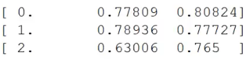

输出 MSE

由于输出是均方误差，你可以通过以下方式获取 RMSE：

```py
math.sqrt(0.765) 
```

输出约为 0.88，优于 0.91 的基准。

你可以通过常规方式获得预测：

```py
preds = learn.predict() 
```

你也可以使用 seaborn `sns`（建立在`matplotlib`之上）：

```py
y = learn.data.val_y
sns.jointplot(preds, y, kind='hex', stat_func=None)
```

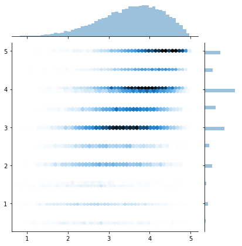

### 使用 Python 的点乘

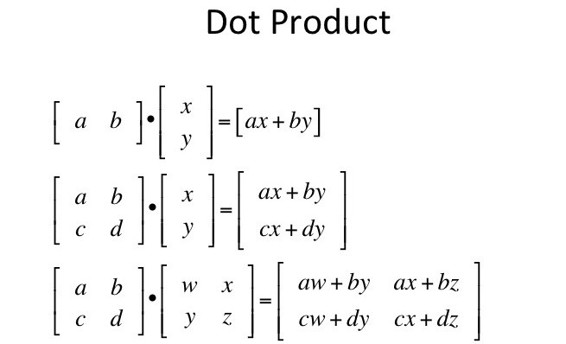

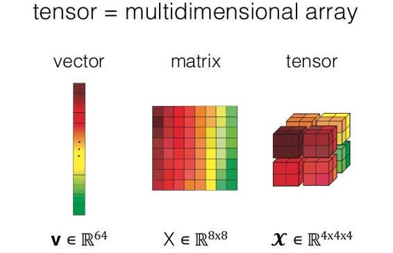

`T`是 PyTorch 中的张量

```py
a = T([[1., 2], [3, 4]])
b = T([[2., 2], [10, 10]])
```

当我们在 numpy 或 PyTorch 中的张量之间有一个数学运算符时，它将逐元素运算，假设它们都具有相同的维数。 下面是你如何计算两个向量的点积（例如`(1,2)·(2,2)= 6` - 矩阵`a`和`b`的第一行）：

```py
(a*b).sum(1)

'''
6
70
[torch.FloatTensor of size 2]
'''
```

### 构建我们的第一个自定义层（即 PyTorch 模块）[[33:55](https://youtu.be/J99NV9Cr75I%3Ft%3D33m55s)]

我们通过创建一个扩展`nn.Module`并覆盖`forward`函数的 Python 类来实现它。

```py
class DotProduct (nn.Module):
   def forward(self, u, m): return (u*m).sum(1)
```

现在我们可以调用它并得到预期的结果（注意我们不需要写`model.forward(a, b)`来调用`forward`函数 - 它是 PyTorch 魔法。） [[40:14](https://youtu.be/J99NV9Cr75I%3Ft%3D40m14s)] ：

```py
model = DotProduct()
model(a,b)

'''
6
70
[torch.FloatTensor of size 2]
'''
```

### 建造更复杂的模块 [[41:31](https://youtu.be/J99NV9Cr75I%3Ft%3D41m31s)]

这个实现对`DotProduct`类有两个补充：

*   两个`nn.Embedding`矩阵
*   在上面的嵌入矩阵中查找我们的用户和电影

用户 ID 很可能不是连续的，这使其很难用作嵌入矩阵的索引。 因此，我们将首先创建从零开始并且连续的索引，并使用匿名函数`lambda`和 Pandas 的`apply`函数，将`ratings.userId`列替换为索引，并对`ratings.movieId`执行相同的操作。

```py
u_uniq = ratings.userId.unique() 
user2idx = {o:i for i,o in enumerate(u_uniq)} 
ratings.userId = ratings.userId.apply(lambda x: user2idx[x])  

m_uniq = ratings.movieId.unique() 
movie2idx = {o:i for i,o in enumerate(m_uniq)} 
ratings.movieId = ratings.movieId.apply(lambda x: movie2idx[x])  

n_users=int(ratings.userId.nunique()) n_movies=int(ratings.movieId.nunique())
```

_提示：_ `{o:i for i,o in enumerate(u_uniq)}`是一个方便的代码行，保存在你的工具箱中！

```py
class EmbeddingDot(nn.Module):
    def __init__(self, n_users, n_movies):
        super().__init__()
        self.u = nn.Embedding(n_users, n_factors)
        self.m = nn.Embedding(n_movies, n_factors)
        self.u.weight.data.uniform_(0,0.05)
        self.m.weight.data.uniform_(0,0.05)
        
    def forward(self, cats, conts):
        users,movies = cats[:,0],cats[:,1]
        u,m = self.u(users),self.m(movies)
        return (u*m).sum(1)
```

请注意， `__init__`是一个现在需要的构造函数，因为我们的类需要跟踪“状态”（多少部电影，多少用户，多少因子等）。 我们将权重初始化为 0 到 0.05 之间的随机数，你可以在这里找到关于权重初始化的标准算法的更多信息，“Kaiming Initialization”（PyTorch 有 He 初始化实用函数，但是我们试图从头开始） [[46:58](https://youtu.be/J99NV9Cr75I%3Ft%3D46m58s)] 。

`Embedding`不是张量而是**变量** 。 变量执行与张量完全相同的操作，但它也可以自动微分。 要从变量中拉出张量，请调用`data`属性。 所有张量函数都有尾随下划线的变体（例如`uniform_` ），将原地执行。

```py
x = ratings.drop(['rating', 'timestamp'],axis=1)
y = ratings['rating'].astype(np.float32)
data = ColumnarModelData.from_data_frame(path, val_idxs, x, y, ['userId', 'movieId'], 64)
```

我们正在复用 Rossmann 笔记本中的 ColumnarModelData（来自 fast.ai 库），这也是`EmbeddingDot`类 [[50:20](https://youtu.be/J99NV9Cr75I%3Ft%3D50m20s)] 中的`def forward(self, cats, conts)`函数中，存在分类和连续变量的原因。 由于在这种情况下我们没有连续变量，我们将忽略`conts`并使用`cats`的第一和第二列作为`users`和`movies` 。 请注意，它们是小批量的用户和电影。 重要的是不要手动遍历小批量，因为你不会获得 GPU 加速，而是一次处理整个小批量，正如上面的`forward`功能的第 3 和第 4 行中你看到的那样 [[51:00-52:05](https://youtu.be/J99NV9Cr75I%3Ft%3D51m)]。

```py
wd=1e-5
model = EmbeddingDot(n_users, n_movies).cuda()
opt = optim.SGD(model.parameters(), 1e-1, weight_decay=wd, momentum=0.9)
```

`optim`为 PyTorch 提供优化器。 `model.parameters()`是从`nn.Modules`继承的函数之一，它为我们提供了更新/学习的权重。

```py
fit(model, data, 3, opt, F.mse_loss) 
```

这个函数来自 fast.ai 库 [[54:40](https://youtu.be/J99NV9Cr75I%3Ft%3D54m40s)] 并且比我们一直在使用的`learner.fit()`更接近常规的 PyTorch 方法。 它不会为你提供诸如“带有重启的随机梯度下降”或开箱即用的“可微分学习率”等功能。

### 让我们改进我们的模型

**偏差** - 适应普遍流行的电影或普遍热情的用户。

```py
min_rating,max_rating = ratings.rating.min(),ratings.rating.max()
min_rating,max_rating

def get_emb(ni,nf):
    e = nn.Embedding(ni, nf)
    e.weight.data.uniform_(-0.01,0.01)
    return e

class EmbeddingDotBias(nn.Module):
    def __init__(self, n_users, n_movies):
        super().__init__()
        (self.u, self.m, self.ub, self.mb) = [get_emb(*o) for o in [
            (n_users, n_factors), (n_movies, n_factors), (n_users,1), (n_movies,1)
        ]]
        
    def forward(self, cats, conts):
        users,movies = cats[:,0],cats[:,1]
        um = (self.u(users)* self.m(movies)).sum(1)
        res = um + self.ub(users).squeeze() + self.mb(movies).squeeze()
        res = F.sigmoid(res) * (max_rating-min_rating) + min_rating
        return res
```

`squeeze`是 PyTorch 版本的广播 [[1:04:11](https://youtu.be/J99NV9Cr75I%3Ft%3D1h4m11s)] 请参阅机器学习课程或[ numpy 文档](https://docs.scipy.org/doc/numpy-1.13.0/user/basics.broadcasting.html)，来获取更多信息。

我们可以压缩评级，使其在 1 到 5 之间吗？是！通过 sigmoid 函数进行预测将导致数字位于 1 和 0 之间。因此，在我们的情况下，我们可以将其乘以 4 并加 1 - 这将导致 1 到 5 之间的数字。

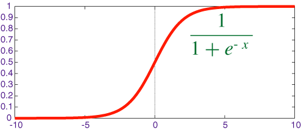

`F`是 PyTorch 函数（ `torch.nn.functional` ），包含用于张量的所有函数，在大多数情况下作为`F`导入。

```py
wd=2e-4
model = EmbeddingDotBias(cf.n_users, cf.n_items).cuda()
opt = optim.SGD(model.parameters(), 1e-1, weight_decay=wd, momentum=0.9)
fit(model, data, 3, opt, F.mse_loss)

'''
[ 0.       0.85056  0.83742]                                     
[ 1.       0.79628  0.81775]                                     
[ 2.       0.8012   0.80994]
'''
```

让我们来看看我们在简单的 Python 版本中，使用的 fast.ai 代码 [[1:13:44](https://youtu.be/J99NV9Cr75I%3Ft%3D1h13m44s)]。在`column_data.py`文件中，`CollabFilterDataSet.get_leaner`调用`get_model`函数，该函数创建`EmbeddingDotBias`类，与我们创建的相同。

### 神经网络版 [[1:17:21](https://youtu.be/J99NV9Cr75I%3Ft%3D1h17m21s)] 

我们回到 excel 表来理解直觉。 请注意，我们创建`user_idx`来查找嵌入，就像我们之前在 python 代码中所做的那样。 如果我们对`user_idx`进行单热编码并将其乘以用户嵌入，我们将为用户获取对应的行。 如果它只是矩阵乘法，为什么我们需要嵌入？ 它用于计算表现优化的目的。

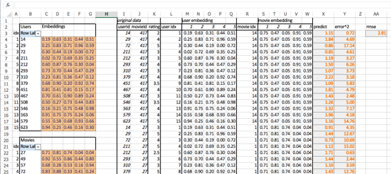

我们不计算用户嵌入向量和电影嵌入向量的点积来得到预测，而是将两者连接起来并使用神经网络来提供它。

```py
class EmbeddingNet(nn.Module):
    def __init__(self, n_users, n_movies, nh=10, p1=0.5, p2=0.5):
        super().__init__()
        (self.u, self.m) = [get_emb(*o) for o in [
            (n_users, n_factors), (n_movies, n_factors)]]
        self.lin1 = nn.Linear(n_factors*2, nh)
        self.lin2 = nn.Linear(nh, 1)
        self.drop1 = nn.Dropout(p1)
        self.drop2 = nn.Dropout(p2)
        
    def forward(self, cats, conts):
        users,movies = cats[:,0],cats[:,1]
        x = self.drop1(torch.cat([self.u(users),self.m(movies)], dim=1))
        x = self.drop2(F.relu(self.lin1(x)))
        return F.sigmoid(self.lin2(x)) * (max_rating-min_rating+1) + min_rating-0.5
```

请注意，我们不再有偏差项，因为 PyTorch 中的`Linear`层已经存在偏差。 `nh`是线性层创建的激活数量（Jeremy 称之为“隐藏数量”）。

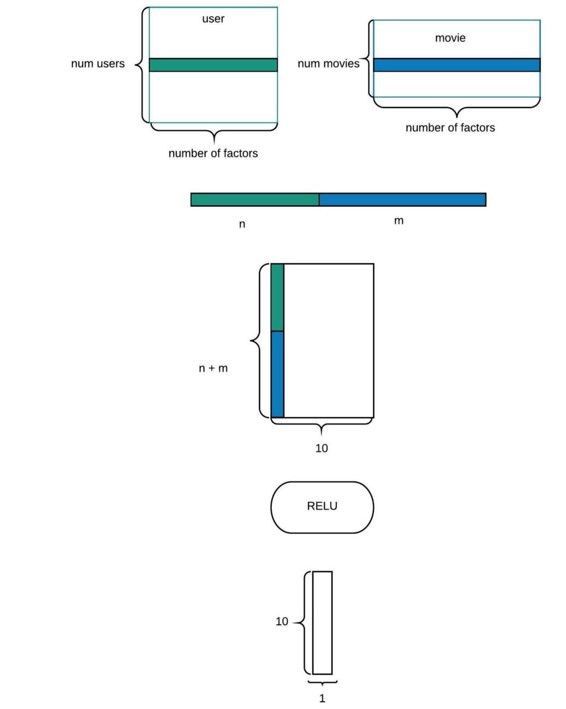

它只有一个隐藏层，所以可能不是“深层”，但这绝对是一个神经网络。

```py
wd=1e-5
model = EmbeddingNet(n_users, n_movies).cuda()
opt = optim.Adam(model.parameters(), 1e-3, weight_decay=wd)
fit(model, data, 3, opt, F.mse_loss)

'''
A Jupyter Widget
[ 0.       0.88043  0.82363]                                    
[ 1.       0.8941   0.81264]                                    
[ 2.       0.86179  0.80706]
'''
```

请注意，损失函数也在`F`中（这里，它是均方损失）。

既然我们有神经网络，我们可以尝试很多东西：

*   添加 Dropout
*   为用户嵌入和电影嵌入使用不同的嵌入大小
*   不仅是用户和电影嵌入，而且还附加来自原始数据的电影类型嵌入和/或时间戳。
*   增加/减少隐藏层数和激活个数
*   增加/减少正则化

### 训练循环中发生了什么？[[1:33:21](https://youtu.be/J99NV9Cr75I%3Ft%3D1h33m21s)] 

目前，我们正在将权重更新传递给 PyTorch 的优化器。 优化器有什么作用？ 什么是`momentum` ？

```py
opt = optim.SGD(model.parameters(), 1e-1, weight_decay=wd, momentum=0.9)
```

我们将在 excel 表（[graddesc.xlsm](https://github.com/fastai/fastai/blob/master/courses/dl1/excel/graddesc.xlsm)）中实现梯度下降 - 从右到左看工作表。 首先我们创建一个随机的`x`，`y`与`x`线性相关（例如`y = a * x + b`）。 通过使用`x`和`y`的集合，我们将尝试学习`a`和`b`。

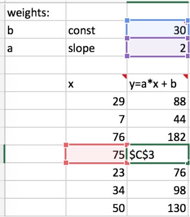

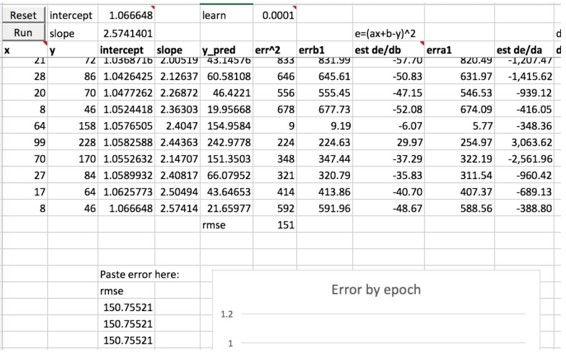

要计算误差，我们首先需要预测，并计算差的平方：

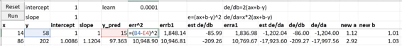

为了减少误差，我们增加/减少`a`和`b`一点点，并找出会导致误差减小的东西。 这被称为通过有限差分找到导数。


有限差分在高维空间中变得复杂 [[1:41:46](https://youtu.be/J99NV9Cr75I%3Ft%3D1h41m46s)] ，并且它变得非常耗费内存并且需要很长时间。 所以我们想找到一些方法来更快地完成这项工作。 值得查找 Jacobian 和 Hessian 之类的东西（深度学习书： [第 84 页第 4.3.1 节](http://www.deeplearningbook.org/contents/numerical.html) ）。

### 链式规则和反向传播

更快的方法是解析地做到这一点 [[1:45:27](https://youtu.be/J99NV9Cr75I%3Ft%3D1h45m27s)] 。 为此，我们需要一个链式规则：

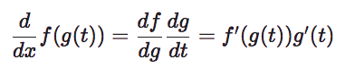

[链规则](https://www.khanacademy.org/math/multivariable-calculus/multivariable-derivatives/differentiating-vector-valued-functions/a/multivariable-chain-rule-simple-version)概述


这是 Chris Olah 的不错的文章，[作为链式规则的反向传播](http://colah.github.io/posts/2015-08-Backprop/)。

现在我们用 [WolframAlpha](https://www.wolframalpha.com/) 给出的实际导数替换有限差分（注意有限差分输出与实际导数非常接近，如果你需要计算自己的导数，那么它是个快速健全性检查的好方法）：

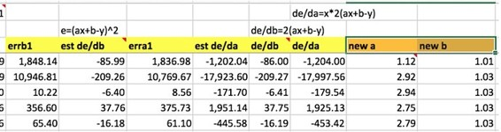

*   “在线”训练 - 大小为 1 的小批量

这就是你如何使用 excel 表格进行 SGD。 如果你要使用 CNN 电子表格的输出更改预测值，我们可以使用 SGD 训练 CNN。

### 动量 [[1:53:47](https://youtu.be/J99NV9Cr75I%3Ft%3D1h53m47s)] 

> 来吧，接受这个暗示 - 这是一个很好的方向。 请这样做下去，做得更多。

使用这种方法，我们将在当前的小批量导数，和我们在最后一个小批量（单元格 K9）之后采取的步骤（和方向）之间使用线性插值：


与`de/db`相比（它的符号（`+/-`）是随机的），具有动量的那个将继续向同一方向移动一点点直到某一点。 这将减少训练所需的迭代。

###  Adam  [[1:59:04](https://youtu.be/J99NV9Cr75I%3Ft%3D1h59m4s)] 

Adam 的速度要快得多，但问题在于最终的预测并不像带动量的 SGD 那样好。 似乎这是由于 Adam 和权重衰减的联合使用。 解决此问题的新版本称为 **AdamW**。

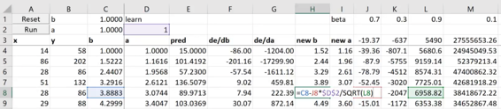

*   `cell J8`：导数和前一个方向的线性插值（与我们在动量中的相同）
*   `cell L8`：来自最后一步（ `cell L7` ）的导数平方，加上导数平方的线性插值
*   这个想法被称为“指数加权移动平均”（换句话说，平均值与之前的值相乘）

学习率比以前高得多，因为我们将它除以`L8`的平方根。

如果你看一下 fast.ai 库（`model.py`），你会注意到在`fit`函数中，它不只是计算平均损失，而是计算损失的**指数加权移动平均**。

```py
avg_loss = avg_loss * avg_mom + loss * (1-avg_mom) 
```

另一个有用的概念是每当你看到`α(...) + (1-α)(...)`时，立即想到**线性插值**。

### **一些直觉**

*   我们计算了梯度平方的指数加权移动平均值，取其平方根，并将学习率除以它。
*   梯度平方总是正的。
*   当梯度的方差很大时，梯度平方将很大。
*   当梯度恒定时，梯度平方将很小。
*   如果梯度变化很大，我们要小心并将学习率除以大数（减速）
*   如果梯度变化不大，我们将通过将学习率除以较小的数字来采取更大的步骤
*   **自适应学习率** - 跟踪梯度平方的平均值，并使用它来调整学习率。 因此，只有一种学习风格，但如果梯度是恒定的，每个迭代的每个参数都会跳跃得更大；否则会跳得更小。
*   有两个参数 - 一个用于梯度，另一个用于梯度平方（在 PyTorch 中，它被称为 beta，它是两个数字的元组）

### AdamW  [[2:11:18](https://youtu.be/J99NV9Cr75I%3Ft%3D2h11m18s)] 

当参数多于数据点时，正则化变得很重要。 我们以前见过 Dropout ，权重衰减是另一种正则化。 权重衰减（L2 正则化）通过将权重平方（乘以权重衰减因子）加到损失中来惩罚大权重。 现在损失函数想要保持较小的权重，因为增加权重会增加损失；因此，只有当损失的改善超过惩罚时才这样做。

问题在于，由于我们将权重平方添加到损失函数，这会影响梯度的移动平均值和 Adam 的梯度平方的移动平均值。 这导致当梯度变化很大时减少权重衰减量，并且当变化很小时增加权重衰减量。 换句话说，“惩罚大权重，如果梯度变化不大”，这不是我们想要的。 AdamW 从损失函数中删除了权重衰减，并在更新权重时直接添加它。
