# 深度学习：第一部分第六课

### [论坛](http://forums.fast.ai/t/wiki-lesson-6/9404)

[2017 年深度学习优化的重点](http://ruder.io/deep-learning-optimization-2017/index.html)

上周回顾 [[2:15](https://youtu.be/sHcLkfRrgoQ%3Ft%3D2m15s)] 

我们上周深入研究了协同过滤，最后我们在 fast.ai 库中重新创建了`EmbeddingDotBias`类（`column_data.py`）。 让我们看一下嵌入的样子（[笔记本](https://github.com/fastai/fastai/blob/master/courses/dl1/lesson5-movielens.ipynb)）。

在学习器`learn`内部，你可以通过调用`learn.model`来获取 PyTorch 模型。 `@property`看起来像常规函数，但在调用它时不需要括号。

```py
@property
def model(self): return self.models.model
```

`learn.models`是`learn.models`的一个实例，它是PyTorch模型的一个薄包装器，它允许我们使用“层组”，这不是PyTorch中可用的概念，而fast.ai使用它将不同的学习率应用于不同的层集（层组）。

PyTorch模型很好地打印出层，包括层名，这就是我们在代码中称之为的层名。

```py
m=learn.model; m

EmbeddingDotBias (
  (u): Embedding(671, 50)
  (i): Embedding(9066, 50)
  (ub): Embedding(671, 1)
  (ib): Embedding(9066, 1)
)
```

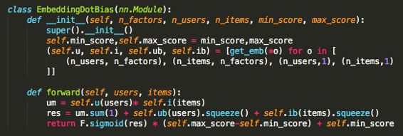

`m.ib`是指项目偏差的嵌入层 - 在我们的例子中是电影偏见。 PyTorch模型和层的好处是我们可以将它们称为函数。 因此，如果你想获得预测，则调用`m(...)`并传入变量。

层需要变量而不是张量，因为它需要跟踪导数 - 这就是`V(...)`将张量转换为变量的原因。PyTorch 0.4 将摆脱变量，我们将能够直接使用张量。

```py
movie_bias = to_np(m.ib(V(topMovieIdx))) 
```

`to_np`函数将接受变量或张量（无论是在 CPU 还是 GPU 上）并返回 numpy 数组。 Jeremy 的方法 [[12:03](https://youtu.be/sHcLkfRrgoQ%3Ft%3D12m3s)] 是将 numpy 用于一切，除非他明确需要在 GPU 上运行某些东西或者需要它的导数 - 在这种情况下他使用 PyTorch。 Numpy 比 PyTorch 的使用时间更长，并且可以与 OpenCV，Pandas 等其他库一起使用。

有关生产中 CPU 与 GPU 的问题。 建议的方法是对 CPU 进行推理，因为它更具可扩展性，你无需批量生产。 你可以通过键入`m.cpu()`将模型移动到 CPU 上，类似于对变量键入`V(topMovieIndex).cpu()`（从 CPU 到 GPU 是`m.cuda()`）。如果你的服务器没有 GPU ，它会自动在 CPU 上运行推理。 要加载在 GPU 上训练过的已保存模型，请查看`torch_imports.py`以下代码`torch_imports.py` ：

```py
def load_model(m, p): m.load_state_dict(torch.load(p, map_location=lambda storage, loc: storage))
```

现在我们对前 3000 部电影有了偏差，让我们来看看收视率：

```py
movie_ratings = [(b[0], movie_names[i]) for i,b in zip(topMovies,movie_bias)]
```

`zip`将允许你同时迭代多个列表。

#### 最糟糕的电影

对于有序的键 - Python 有`itemgetter`函数，但普通的`lambda`只多了一个字符。

```py
sorted(movie_ratings, key=lambda o: o[0])[:15]

'''
[(-0.96070349, 'Battlefield Earth (2000)'),
 (-0.76858485, 'Speed 2: Cruise Control (1997)'),
 (-0.73675376, 'Wild Wild West (1999)'),
 (-0.73655486, 'Anaconda (1997)'),
 ...]
'''

sorted(movie_ratings, key=itemgetter(0))[:15]
```

#### 最好的电影

```py
sorted(movie_ratings, key=lambda o: o[0], reverse=True)[:15]

'''
[(1.3070084, 'Shawshank Redemption, The (1994)'),
 (1.1196285, 'Godfather, The (1972)'),
 (1.0844109, 'Usual Suspects, The (1995)'),
 (0.96578616, "Schindler's List (1993)"),
 ...]
'''
```

#### 嵌入的解释 [[18:42](https://youtu.be/sHcLkfRrgoQ%3Ft%3D18m42s)] 

每部电影有 50 个嵌入，很难看到 50 维空间，所以我们将它变成一个三维空间。 我们可以使用几种技术来压缩维度：[主成分分析（PCA）](https://plot.ly/ipython-notebooks/principal-component-analysis/)（Rachel 的计算线性代数课程详细介绍了这一点 - 几乎与奇异值分解（SVD）相同）

```py
movie_emb = to_np(m.i(V(topMovieIdx)))
movie_emb.shape

# (3000, 50)

from sklearn.decomposition import PCA
pca = PCA(n_components=3)
movie_pca = pca.fit(movie_emb.T).components_
movie_pca.shape

# (3, 3000)
```

我们将看看第一个维度“轻松与严肃”（我们不知道它代表什么但可以通过观察它们来推测）：

```py
fac0 = movie_pca[0] 
movie_comp = [(f, movie_names[i]) for f,i in zip(fac0, topMovies)]
sorted(movie_comp, key=itemgetter(0), reverse=True)[:10]

sorted(movie_comp, key=itemgetter(0), reverse=True)[:10]

'''
[(0.06748189, 'Independence Day (a.k.a. ID4) (1996)'),
 (0.061572548, 'Police Academy 4: Citizens on Patrol (1987)'),
 (0.061050549, 'Waterworld (1995)'),
 (0.057877172, 'Rocky V (1990)'),
 ...
]
'''

sorted(movie_comp, key=itemgetter(0))[:10]

'''
[(-0.078433245, 'Godfather: Part II, The (1974)'),
 (-0.072180331, 'Fargo (1996)'),
 (-0.071351372, 'Pulp Fiction (1994)'),
 (-0.068537779, 'Goodfellas (1990)'),
 ...
]
'''
```

第二个维度“对话驱动与 CGI”

```py
fac1 = movie_pca[1]
movie_comp = [(f, movie_names[i]) for f,i in zip(fac1, topMovies)]
sorted(movie_comp, key=itemgetter(0), reverse=True)[:10]

'''
[(0.058975246, 'Bonfire of the Vanities (1990)'),
 (0.055992026, '2001: A Space Odyssey (1968)'),
 (0.054682467, 'Tank Girl (1995)'),
 (0.054429606, 'Purple Rose of Cairo, The (1985)'),
 ...]
'''

sorted(movie_comp, key=itemgetter(0))[:10]

'''
[(-0.1064609, 'Lord of the Rings: The Return of the King, The (2003)'),
 (-0.090635143, 'Aladdin (1992)'),
 (-0.089208141, 'Star Wars: Episode V - The Empire Strikes Back (1980)'),
 (-0.088854566, 'Star Wars: Episode IV - A New Hope (1977)'),
 ...]
'''
```

情节

```py
idxs = np.random.choice(len(topMovies), 50, replace=False)
X = fac0[idxs]
Y = fac1[idxs]
plt.figure(figsize=(15,15))
plt.scatter(X, Y)
for i, x, y in zip(topMovies[idxs], X, Y):
    plt.text(x,y,movie_names[i], color=np.random.rand(3)*0.7, fontsize=11)
plt.show()
```


当你说`learn.fit`时会发生什么？

#### [类别变量的实体嵌入](https://arxiv.org/pdf/1604.06737.pdf) [[24:42](https://youtu.be/sHcLkfRrgoQ%3Ft%3D24m42s)] 

第二篇论文谈论累呗嵌入。 图一的标题应该听起来很熟悉，因为它们讨论了实体嵌入层如何等效于单热编码，然后是矩阵乘法。

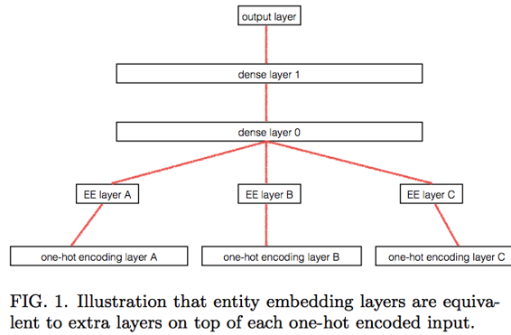

他们做的有趣的事情是，他们采用由神经网络训练的实体嵌入，用学习的实体嵌入替换每个类别变量，然后将其输入到梯度增强机（GBM），随机森林（RF）和 KNN 中 - 这减少了某些误差，几乎与神经网络（NN）一样好。 这是一种很好的方式，可以在你的组织中提供神经网络的强大功能，而不必强迫其他人学习深度学习，因为他们可以继续使用他们当前使用的东西并使用嵌入作为输入。 GBM 和 RF 的训练比 NN 快得多。

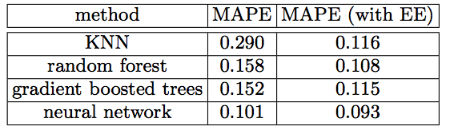

他们还绘制了德国的州的嵌入，有趣的是（正如 Jeremy 所说的那样“令人费解”）类似于实际的地图。

他们还绘制了物理空间和嵌入空间中商店的距离 - 这显示出美丽而清晰的相关性。

一周的天数或一年中的几个月之间似乎也存在相关性。 可视化嵌入可能很有趣，因为它向你显示你期望看到的内容或你未看到的内容。

#### 关于 Skip-Gram 生成嵌入的问题 [[31:31](https://youtu.be/sHcLkfRrgoQ%3Ft%3D31m31s)] 

Skip-Gram 特定于 NLP。 将未标记的问题转变为标记问题的好方法是“发明”标签。 Word2Vec 的方法是选取 11 个单词的句子，删除中间单词，并用随机单词替换它。 然后他们将标签 1 给原句，标签 0 给假的句子，并建立了一个机器学习模型来查找假的句子。 因此，他们现在可以将嵌入用于其他目的。 如果你将它实现为单个矩阵乘法（浅模型）而不是深度神经网络，你可以非常快速地训练 - 缺点是它是一个预测性较低的模型，但优点是你可以训练一个非常大的数据集，更重要的是，最终的嵌入具有线性特征 ，允许我们很好地加，减或绘制。 在 NLP 中，我们应该超越 Word2Vec 和 Glove（即基于线性的方法），因为这些嵌入不太具有预测性。 最先进的语言模型使用深度 RNN。

#### 要学习任何类型的特征空间，你需要标记数据或者需要发明虚假任务 [[35:45](https://youtu.be/sHcLkfRrgoQ%3Ft%3D35m45s)] 

*   一个虚假任务比另一个好吗？ 还没有很好的研究。
*   直观地说，我们想要一个任务，帮助机器学习你关心的各种关系。
*   在计算机视觉中，人们使用的一种虚假任务是应用虚幻和不合理的数据增强。
*   如果你不能提出很棒的虚假任务，那就去使用糟糕的任务 - 你需要的很少，这通常是令人惊讶的。
*   **自编码器** [[38:10](https://youtu.be/sHcLkfRrgoQ%3Ft%3D38m10s)] - 它最近赢得了[保险索赔竞赛](https://www.kaggle.com/c/porto-seguro-safe-driver-prediction/discussion/44629)。 采取单一策略，通过神经网络运行，并让它重建自己（确保中间层的激活少于输入变量）。 基本上，这是一个任务，其输入等于输出，作为一个假任务它有效，令人惊讶。

在计算机视觉中，你可以在猫狗上训练并将其用于 CT 扫描。 也许它可能适用于语言/ NLP！ （未来的研究）

#### [Rossmann](https://github.com/fastai/fastai/blob/master/courses/dl1/lesson3-rossman.ipynb) [[41:04](https://youtu.be/sHcLkfRrgoQ%3Ft%3D41m4s)] 

*   正确使用测试集的方法已添加到笔记本中。
*   对于更详细的说明，请参阅机器学习课程。
*   `apply_cats(joined_test, joined)`用于确保测试集和训练集具有相同的类别编号。
*   跟踪包含每个连续列的平均值和标准差的`mapper` ，并将相同的`mapper`应用于测试集。
*   不要依赖Kaggle公共董事会 - 依靠你自己精心设计的验证集。

#### 为罗斯曼寻找一个好的[核心](https://www.kaggle.com/thie1e/exploratory-analysis-rossmann)

*   周日对销售的影响

商店关闭前后的销售额有所增长。 第三名获胜者在开始任何分析之前删除了关闭的商店行。

> **不要触摸你的数据，除非你首先分析看你正在做什么是好的 - 没有假设。**

#### Vim技巧 [[49:12](https://youtu.be/sHcLkfRrgoQ%3Ft%3D49m12s)] 

*   `:tag ColumnarModelData`将带你进入类定义
*   `ctrl + ]`将带你定义光标下的内容
*   `ctrl + t`回去
*   `*`找到光标下的内容的用法
*   你可以使用`:tabn`选项在选项卡之间切换`:tabn`和`:tabp` ，使用`:tabe &lt;filepath&gt;`可以添加新选项卡; 并使用常规`:q`或`:wq`你关闭一个标签。 如果将`:tabn`和`:tabp`到F7 / F8键，则可以轻松地在文件之间切换。

#### [ColumnarModelData](https://youtu.be/sHcLkfRrgoQ%3Ft%3D51m1s)内部 [[51:01](https://youtu.be/sHcLkfRrgoQ%3Ft%3D51m1s)] 

慢慢但肯定地，过去只是“神奇”的东西开始看起来很熟悉。 如你所见， `get_learner`返回`Learner` ，它是包装数据和PyTorch模型的fast.ai概念：

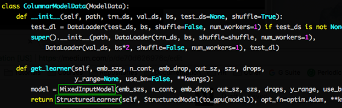

在`MixedInputModel`内部，你可以看到它是如何创建我们现在更了解的`Embedding` 。 `nn.ModuleList`用于注册层列表。 我们将在下周讨论`BatchNorm` ，但我们之前已经看过了休息。

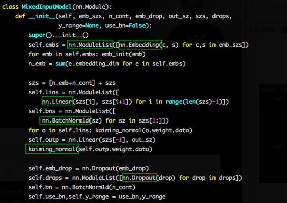

同样，我们现在了解`forward`功能正在发生什么。

*   使用第_i_个类别变量调用嵌入层并将它们连接在一起
*   通过 Dropout 把它
*   浏览每个线性层，调用它，应用relu和dropout
*   然后最终线性层的大小为1
*   如果`y_range` ，则应用sigmoid并将输出拟合到一个范围内（我们上周学到的）

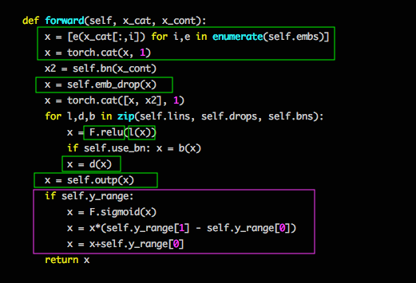

#### [随机梯度下降 - 新元](https://github.com/fastai/fastai/blob/master/courses/dl1/lesson6-sgd.ipynb)  [[59:56](https://youtu.be/sHcLkfRrgoQ%3Ft%3D59m56s)] 

为了确保我们完全适应SGD，我们将用它来学习`_y = ax + b_` 。 如果我们可以用2个参数解决问题，我们可以使用相同的技术来解决1亿个参数。

```py
# Here we generate some fake data
def lin(a,b,x): return a*x+b

def gen_fake_data(n, a, b):
    x = s = np.random.uniform(0,1,n) 
    y = lin(a,b,x) + 0.1 * np.random.normal(0,3,n)
    return x, y

x, y = gen_fake_data(50, 3., 8.)

plt.scatter(x,y, s=8); plt.xlabel("x"); plt.ylabel("y");
```

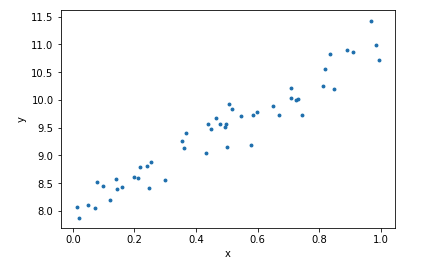

首先，我们需要一个损失功能。 这是一个回归问题，因为输出是连续输出，最常见的损失函数是均方误差（MSE）。

> 回归 - 目标输出是实数或整数实数

> 分类 - 目标输出是类标签

```py
def mse(y_hat, y): return ((y_hat - y) ** 2).mean()

def mse_loss(a, b, x, y): return mse(lin(a,b,x), y)
```

*   `y_hat` - 预测

我们将制作10,000多个假数据并将它们转换为PyTorch变量，因为Jeremy不喜欢使用衍生物而PyTorch可以为他做到这一点：

```py
x, y = gen_fake_data(10000, 3., 8.) 
x,y = V(x),V(y)
```

然后为`a`和`b`创建随机权重，它们是我们想要学习的变量，所以设置`requires_grad=True` 。

```py
a = V(np.random.randn(1), requires_grad=True) 
b = V(np.random.randn(1), requires_grad=True)
```

然后设置学习率并完成10000个完全梯度下降的时期（不是SGD，因为每个时期将查看所有数据）：

```py
learning_rate = 1e-3
for t in range(10000):
    # Forward pass: compute predicted y using operations on Variables
    loss = mse_loss(a,b,x,y)
    if t % 1000 == 0: print(loss.data[0])
    
    # Computes the gradient of loss with respect to all Variables with requires_grad=True.
    # After this call a.grad and b.grad will be Variables holding the gradient
    # of the loss with respect to a and b respectively
    loss.backward()
    
    # Update a and b using gradient descent; a.data and b.data are Tensors,
    # a.grad and b.grad are Variables and a.grad.data and b.grad.data are Tensors
    a.data -= learning_rate * a.grad.data
    b.data -= learning_rate * b.grad.data
    
    # Zero the gradients
    a.grad.data.zero_()
    b.grad.data.zero_()
```

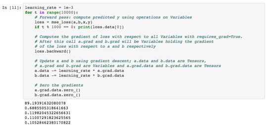

*   计算损失（记住， `a`和`b`最初设置为随机）
*   不时（每1000个时期），打印出损失
*   `loss.backward()`将使用`requires_grad=True`计算所有变量的渐变，并填写`.grad`属性
*   将`a`更新为减去LR * `grad` （ `.data`访问变量内部的张量）
*   当有多个损失函数或许多输出层对渐变有贡献时，PyTorch会将它们加在一起。 因此，你需要告诉何时将渐变设置回零（ `_`中的`zero_()`表示变量就地更改）。
*   最后4行代码包含在`optim.SGD.step`函数中

#### 让我们只用Numpy（没有PyTorch） [[1:07:01](https://youtu.be/sHcLkfRrgoQ%3Ft%3D1h7m1s)] 

我们实际上必须做微积分，但其他一切看起来应该相似：

```py
x, y = gen_fake_data(50, 3., 8.)
a_guess,b_guess = -1., 1.
mse_loss(y, a_guess, b_guess, x)
lr=0.01 
def upd():
     global a_guess, b_guess
     y_pred = lin(a_guess, b_guess, x)
     dydb = 2 * (y_pred - y)
     dyda = x*dydb
     a_guess -= lr*dyda.mean()
     b_guess -= lr*dydb.mean()
```

只是为了好玩，你可以使用`matplotlib.animation.FuncAnimation`来制作动画：

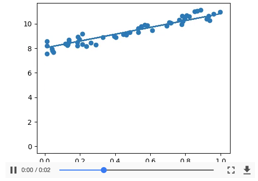

提示：Fast.ai AMI没有附带`ffmpeg` 。 所以如果你看到`KeyError: 'ffmpeg'`

*   运行`print(animation.writers.list())`并打印出可用的MovieWriters列表
*   如果`ffmpeg`就在其中。 否则[安装它](https://github.com/adaptlearning/adapt_authoring/wiki/Installing-FFmpeg) 。

### [递归神经网络 - RNN](https://github.com/fastai/fastai/blob/master/courses/dl1/lesson6-rnn.ipynb)  [[1:09:16](https://youtu.be/sHcLkfRrgoQ%3Ft%3D1h9m16s)] 

让我们学习如何写尼采这样的哲学。 这类似于我们在第4课中学到的语言模型，但这一次，我们将一次完成一个角色。 RNN与我们已经学到的没什么不同。

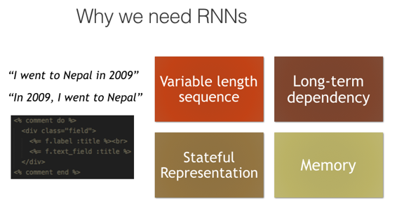

#### 一些例子：

*   [SwiftKey](https://blog.swiftkey.com/neural-networks-a-meaningful-leap-for-mobile-typing/)
*   [Andrej Karpathy LaTex发电机](http://karpathy.github.io/2015/05/21/rnn-effectiveness/)

#### 具有单个隐藏层的基本NN

所有形状都是激活（激活是由relu，矩阵产品等计算的数字）。 箭头是层操作（可能不止一个）。 查看机器学习课程9-11，从头开始创建。

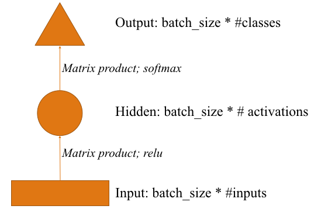

#### 图像CNN具有单密集隐藏层

我们将介绍如何在下周更多地压平层，但主要方法称为“自适应最大池” - 我们在高度和宽度上进行平均并将其转换为向量。

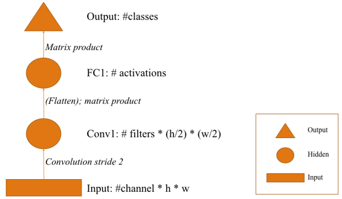

`batch_size`维度和激活函数（例如relu，softmax）未在此处显示


#### 使用字符1和2  [[1:18:04](https://youtu.be/sHcLkfRrgoQ%3Ft%3D1h18m4s)] 预测字符3

我们将为NLP实现这一个。

*   输入可以是单热编码字符（向量的长度=唯一字符的数量）或单个整数，并假设它是使用嵌入层进行一次热编码。
*   与CNN的不同之处在于添加了char 2输入。

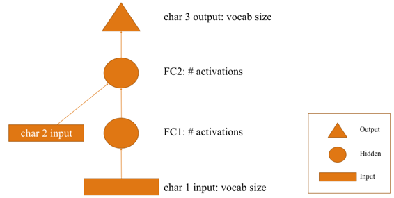

层图操作未显示; 记住箭头代表层操作


让我们在没有torchtext或fast.ai库的情况下实现这一点，以便我们可以看到。

*   `set`将返回所有唯一字符。

```py
text = open(f'{PATH}nietzsche.txt').read()
print(text[:400])

'PREFACE\n\n\nSUPPOSING that Truth is a woman--what then? Is there not ground\nfor suspecting that all philosophers, in so far as they have been\ndogmatists, have failed to understand women--that the terrible\nseriousness and clumsy importunity with which they have usually paid\ntheir addresses to Truth, have been unskilled and unseemly methods for\nwinning a woman? Certainly she has never allowed herself '

chars = sorted(list(set(text))) 
vocab_size = len(chars)+1 
print('total chars:', vocab_size)

# total chars: 85
```

*   总是很好地为填充添加null或空字符。

```py
chars.insert(0, "\0") 
```

将每个字符映射到唯一ID，以及字符的唯一ID

```py
char_indices = dict((c, i) for i, c in enumerate(chars))
indices_char = dict((i, c) for i, c in enumerate(chars))
```

现在我们可以使用其ID来表示文本：

```py
idx = [char_indices[c] for c in text]
idx[:10]

# [40, 42, 29, 30, 25, 27, 29, 1, 1, 1]
```

#### 问题：基于字符的模型与基于单词的模型 [[1:22:30](https://youtu.be/sHcLkfRrgoQ%3Ft%3D1h22m30s)] 

*   通常，你希望将字符级别模型和字级别模型组合在一起（例如，用于翻译）。
*   当词汇表包含不常用的单词时，字符级别模型很有用 - 单词级别模型将仅视为“未知”。 当你看到之前没有见过的单词时，可以使用字符级模型。
*   在它们之间还有一种称为字节对编码（BPE）的东西，它查看n-gram字符。

#### 创建输入 [[1:23:48](https://youtu.be/sHcLkfRrgoQ%3Ft%3D1h23m48s)] 

```py
cs = 3 
c1_dat = [idx[i]   for i in range(0, len(idx)-cs, cs)]
c2_dat = [idx[i+1] for i in range(0, len(idx)-cs, cs)]
c3_dat = [idx[i+2] for i in range(0, len(idx)-cs, cs)]
c4_dat = [idx[i+3] for i in range(0, len(idx)-cs, cs)]
```

注意`c1_dat[n+1] == c4_dat[n]`因为我们跳过3（ `range`的第三个参数）

```py
x1 = np.stack(c1_dat) 
x2 = np.stack(c2_dat) 
x3 = np.stack(c3_dat) 
y = np.stack(c4_dat)
```

`x`是我们的输入， `y`是我们的目标值。

#### 建立模型 [[1:26:08](https://youtu.be/sHcLkfRrgoQ%3Ft%3D1h26m8s)] 

```py
n_hidden = 256 
n_fac = 42
```

*   `n_hiddein` - 图中的“ `n_hiddein` ”。
*   `n_fac` - 嵌入矩阵的大小。

这是上图的更新版本。 请注意，现在箭头已着色。 具有相同颜色的所有箭头将使用相同的权重矩阵。 这里的想法是，角色不具有不同的含义（语义上或概念上），这取决于它是序列中的第一个，第二个还是第三个项目，因此对它们的处理方式相同。

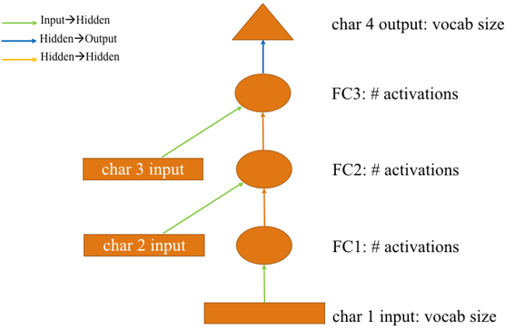

```py
class Char3Model(nn.Module):
     def __init__(self, vocab_size, n_fac):
         super().__init__()
         
         self.e = nn.Embedding(vocab_size, n_fac)
         
         self.l_in = nn.Linear(n_fac, n_hidden)
          
         self.l_hidden = nn.Linear(n_hidden, n_hidden)
         
         self.l_out = nn.Linear(n_hidden, vocab_size)              
         
def forward(self, c1, c2, c3):
         in1 = F.relu(self.l_in(self.e(c1)))
         in2 = F.relu(self.l_in(self.e(c2)))
         in3 = F.relu(self.l_in(self.e(c3)))

         h = V(torch.zeros(in1.size()).cuda())
         h = F.tanh(self.l_hidden(h+in1))
         h = F.tanh(self.l_hidden(h+in2))
         h = F.tanh(self.l_hidden(h+in3))
         
         return F.log_softmax(self.l_out(h))
```

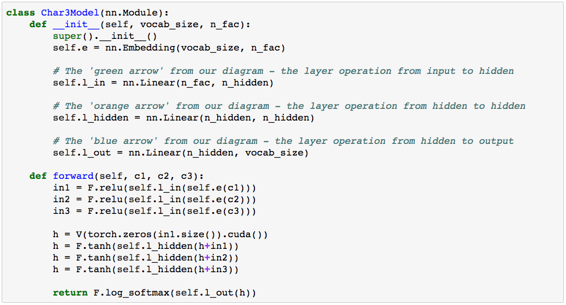

[视频[1:27:57]](https://youtu.be/sHcLkfRrgoQ%3Ft%3D1h27m57s)


*    [[1:29:58](https://youtu.be/sHcLkfRrgoQ%3Ft%3D1h29m58s)] 重要的是，这个`l_hidden`使用一个方形权重矩阵，其大小与`l_in`的输出相匹配。 然后`h`和`in2`将是相同的形状，允许我们在`self.l_hidden(h+in2)`看到它们的总和
*   `V(torch.zeros(in1.size()).cuda())`只是使三条线相同，以便以后更容易放入for循环。

```py
md = ColumnarModelData.from_arrays('.', [-1], np.stack([x1,x2,x3], axis=1), y, bs=512)
```

我们将复用[ColumnarModelData](https://youtu.be/sHcLkfRrgoQ%3Ft%3D1h32m20s)  [[1:32:20](https://youtu.be/sHcLkfRrgoQ%3Ft%3D1h32m20s)] 。 如果我们堆栈`x1` ， `x2`和`x3` ，我们将在`forward`方法中得到`c1` ， `c2` ， `c3` 。 当你想用原始方法训练模型时， `ColumnarModelData.from_arrays`会派上用场，你放入`[x1, x2, x3]` ，你将在`**def** **forward** (self, c1, c2, c3)`返回`**def** **forward** (self, c1, c2, c3)`

```py
m = Char3Model(vocab_size, n_fac).cuda() 
```

*   我们创建了一个标准的PyTorch模型（不是`Learner` ）
*   因为它是标准的PyTorch模型，所以不要忘记`.cuda`

```py
it = iter(md.trn_dl)
*xs,yt = next(it)
t = m(*V(xs) 
```

*   它抓住了一个迭代器
*   `next`返回一个小批量
*   “变量” `xs`张量，并通过模型 - 这将给我们512x85张量包含预测（批量大小*唯一字符）

```py
opt = optim.Adam(m.parameters(), 1e-2) 
```

*   创建一个标准的PyTorch优化器 - 你需要传递一个要优化的东西列表，由`m.parameters()`返回

```py
fit(m, md, 1, opt, F.nll_loss)
set_lrs(opt, 0.001)
fit(m, md, 1, opt, F.nll_loss)
```

*   我们没有找到学习率查找器和SGDR，因为我们没有使用`Learner` ，所以我们需要手动进行学习率退火（将LR设置得稍低）

#### 测试模型 [[1:35:58](https://youtu.be/sHcLkfRrgoQ%3Ft%3D1h35m58s)] 

```py
def get_next(inp):
     idxs = T(np.array([char_indices[c] for c in inp]))
     p = m(*VV(idxs))
     i = np.argmax(to_np(p))
     return chars[i]
```

此函数需要三个字符并返回模型预测的第四个字符。 注意： `np.argmax`返回最大值的索引。

```py
get_next('y. ')
# 'T'
get_next('ppl')
# 'e'
get_next(' th')
# 'e'
get_next('and')
# ' '
```

#### 让我们创建我们的第一个RNN  [[1:37:45](https://youtu.be/sHcLkfRrgoQ%3Ft%3D1h37m45s)] 

我们可以简化上面的图表如下：

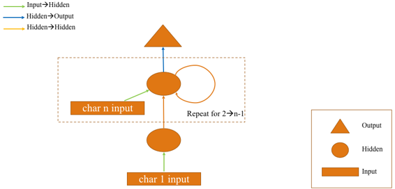

使用字符1到n-1预测字符


让我们实现这一点。 这次，我们将使用前8个字符来预测第9个字符。 以下是我们如何创建输入和输出，就像上次一样：

```py
cs = 8

c_in_dat = [[idx[i+j] for i in range(cs)] for j in range(len(idx)-cs)]

c_out_dat = [idx[j+cs] for j in range(len(idx)-cs)]

xs = np.stack(c_in_dat, axis=0)

y = np.stack(c_out_dat)

xs[:cs,:cs]

'''
array([[40, 42, 29, 30, 25, 27, 29,  1],
       [42, 29, 30, 25, 27, 29,  1,  1],
       [29, 30, 25, 27, 29,  1,  1,  1],
       [30, 25, 27, 29,  1,  1,  1, 43],
       [25, 27, 29,  1,  1,  1, 43, 45],
       [27, 29,  1,  1,  1, 43, 45, 40],
       [29,  1,  1,  1, 43, 45, 40, 40],
       [ 1,  1,  1, 43, 45, 40, 40, 39]])
'''

y[:cs]

# array([ 1,  1, 43, 45, 40, 40, 39, 43])
```

请注意它们是重叠的（即0-7预测8,1-8预测9）。

```py
val_idx = get_cv_idxs(len(idx)-cs-1)
md = ColumnarModelData.from_arrays('.', val_idx, xs, y, bs=512)
```

#### 创建模型 [[1:43:03](https://youtu.be/sHcLkfRrgoQ%3Ft%3D1h43m3s)] 

```py
class CharLoopModel(nn.Module):
    # This is an RNN!
    def __init__(self, vocab_size, n_fac):
        super().__init__()
        self.e = nn.Embedding(vocab_size, n_fac)
        self.l_in = nn.Linear(n_fac, n_hidden)
        self.l_hidden = nn.Linear(n_hidden, n_hidden)
        self.l_out = nn.Linear(n_hidden, vocab_size)
        
    def forward(self, *cs):
        bs = cs[0].size(0)
        h = V(torch.zeros(bs, n_hidden).cuda())
        for c in cs:
            inp = F.relu(self.l_in(self.e(c)))
            h = F.tanh(self.l_hidden(h+inp))
        
        return F.log_softmax(self.l_out(h), dim=-1)
```

大多数代码与以前相同。 你会注意到`forward`功能中有一个`for`循环。

> 双曲正切（Tanh） [[1:43:43](https://youtu.be/sHcLkfRrgoQ%3Ft%3D1h43m43s)] 

> 这是一个偏移的sigmoid。 通常在隐藏状态下使用双曲线tanh来隐藏状态转换，因为它会阻止它飞得太高或太低。 出于其他目的，relu更常见。

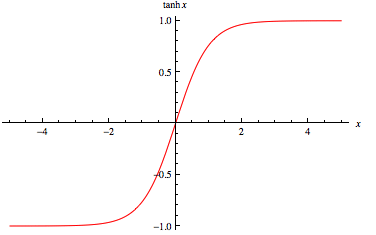

现在这是一个非常深的网络，因为它使用8个字符而不是2个。随着网络越来越深入，它们变得越来越难以训练。

```py
m = CharLoopModel(vocab_size, n_fac).cuda() 
opt = optim.Adam(m.parameters(), 1e-2)
fit(m, md, 1, opt, F.nll_loss)
set_lrs(opt, 0.001)
fit(m, md, 1, opt, F.nll_loss)
```

#### 添加与连续

我们现在将为`self.l_hidden( **h+inp** )` [inp](https://youtu.be/sHcLkfRrgoQ%3Ft%3D1h46m4s) `self.l_hidden( **h+inp** )`  [[1:46:04](https://youtu.be/sHcLkfRrgoQ%3Ft%3D1h46m4s)] 尝试别的东西。 原因是输入状态和隐藏状态在质量上是不同的。 输入是字符的编码，h是一系列字符的编码。 所以将它们加在一起，我们可能会丢失信息。 让我们将它们连接起来。 不要忘记更改输入以匹配形状（ `n_fac+n_hidden`而不是`n_fac` ）。

```py
class CharLoopConcatModel(nn.Module):
    def __init__(self, vocab_size, n_fac):
        super().__init__()
        self.e = nn.Embedding(vocab_size, n_fac)
        self.l_in = nn.Linear(n_fac+n_hidden, n_hidden)
        self.l_hidden = nn.Linear(n_hidden, n_hidden)
        self.l_out = nn.Linear(n_hidden, vocab_size)
        
    def forward(self, *cs):
        bs = cs[0].size(0)
        h = V(torch.zeros(bs, n_hidden).cuda())
        for c in cs:
            inp = torch.cat((h, self.e(c)), 1)
            inp = F.relu(self.l_in(inp))
            h = F.tanh(self.l_hidden(inp))
        
        return F.log_softmax(self.l_out(h), dim=-1)
```

这提供了一些改进。

#### RNT与PyTorch  [[1:48:47](https://youtu.be/sHcLkfRrgoQ%3Ft%3D1h48m47s)] 

PyTorch将自动为我们和线性输入层编写`for`循环。

```py
class CharRnn(nn.Module):
    def __init__(self, vocab_size, n_fac):
        super().__init__()
        self.e = nn.Embedding(vocab_size, n_fac)
        self.rnn = nn.RNN(n_fac, n_hidden)
        self.l_out = nn.Linear(n_hidden, vocab_size)
        
    def forward(self, *cs):
        bs = cs[0].size(0)
        h = V(torch.zeros(1, bs, n_hidden))
        inp = self.e(torch.stack(cs))
        outp,h = self.rnn(inp, h)
        
        return F.log_softmax(self.l_out(outp[-1]), dim=-1)
```

*   由于稍后会变得明显的原因， `self.rnn`会返回输出，还会返回隐藏状态。
*   PyTorch的细微差别在于`self.rnn`会将一个新的隐藏状态附加到张量而不是替换（换句话说，它将返回图中的所有椭圆）。 我们只想要最后一个，所以我们做`outp[-1]`

```py
m = CharRnn(vocab_size, n_fac).cuda() 
opt = optim.Adam(m.parameters(), 1e-3)

ht = V(torch.zeros(1, 512,n_hidden)) 
outp, hn = m.rnn(t, ht) 
outp.size(), hn.size()

'''
(torch.Size([8, 512, 256]), torch.Size([1, 512, 256]))
'''
```

在PyTorch版本中，隐藏状态是等级3张量`h = V(torch.zeros(1, bs, n_hidden))` （在我们的版本中，它是等级2张量） [[1:51:58](https://youtu.be/sHcLkfRrgoQ%3Ft%3D1h51m58s)] 。 我们稍后会详细了解这一点，但事实证明你可以拥有倒退的第二个RNN。 我们的想法是找到倒退的关系会更好 - 它被称为“双向RNN”。 你也可以向RNN提供RNN馈送，称为“多层RNN”。 对于这些RNN，你将需要张量中的附加轴来跟踪隐藏状态的其他层。 现在，我们只有1，然后回来1。

#### 测试模型

```py
def get_next(inp):
    idxs = T(np.array([char_indices[c] for c in inp]))
    p = m(*VV(idxs))
    i = np.argmax(to_np(p))
    return chars[i]
    
def get_next_n(inp, n):
    res = inp
    for i in range(n):
        c = get_next(inp)
        res += c
        inp = inp[1:]+c
    return res
    
get_next_n('for thos', 40)

# 'for those the same the same the same the same th' 
```

这一次，我们每次循环`n`次调用`get_next` ，每次我们将通过删除第一个字符并添加我们刚预测的字符来替换输入。

对于一个有趣的家庭作业，尝试编写自己的`nn.RNN` “ `JeremysRNN` ”而不需要查看PyTorch源代码。

#### 多输出 [[1:55:31](https://youtu.be/sHcLkfRrgoQ%3Ft%3D1h55m31s)] 

从上一个图中，我们可以通过将char 1与char 2相同地处理为n-1来进一步简化。 你注意到三角形（输出）也在循环内移动，换句话说，我们在每个字符后创建一个预测。

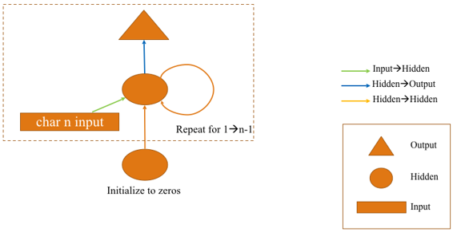

使用字符1到n-1预测字符2到n


我们可能希望这样做的原因之一是我们之前看到的冗余：

```py
array([[40, 42, 29, 30, 25, 27, 29, 1],  [42, 29, 30, 25, 27, 29, 1, 1],  [29, 30, 25, 27, 29, 1, 1, 1],  [30, 25, 27, 29, 1, 1, 1, 43],  [25, 27, 29, 1, 1, 1, 43, 45],  [27, 29, 1, 1, 1, 43, 45, 40],  [29, 1, 1, 1, 43, 45, 40, 40],  [ 1, 1, 1, 43, 45, 40, 40, 39]]) 
```

我们可以通过这次采用**不重叠**的角色来提高效率。 因为我们正在进行多输出，对于输入字符0到7，输出将是char 1到8的预测。

```py
xs[:cs,:cs]

'''
array([[40, 42, 29, 30, 25, 27, 29,  1],
       [ 1,  1, 43, 45, 40, 40, 39, 43],
       [33, 38, 31,  2, 73, 61, 54, 73],
       [ 2, 44, 71, 74, 73, 61,  2, 62],
       [72,  2, 54,  2, 76, 68, 66, 54],
       [67,  9,  9, 76, 61, 54, 73,  2],
       [73, 61, 58, 67, 24,  2, 33, 72],
       [ 2, 73, 61, 58, 71, 58,  2, 67]])
'''

ys[:cs,:cs]

'''
array([[42, 29, 30, 25, 27, 29,  1,  1],
       [ 1, 43, 45, 40, 40, 39, 43, 33],
       [38, 31,  2, 73, 61, 54, 73,  2],
       [44, 71, 74, 73, 61,  2, 62, 72],
       [ 2, 54,  2, 76, 68, 66, 54, 67],
       [ 9,  9, 76, 61, 54, 73,  2, 73],
       [61, 58, 67, 24,  2, 33, 72,  2],
       [73, 61, 58, 71, 58,  2, 67, 68]])
'''
```

这不会使我们的模型更准确，但我们可以更有效地训练它。

```py
class CharSeqRnn(nn.Module):
    def __init__(self, vocab_size, n_fac):
        super().__init__()
        self.e = nn.Embedding(vocab_size, n_fac)
        self.rnn = nn.RNN(n_fac, n_hidden)
        self.l_out = nn.Linear(n_hidden, vocab_size)
        
    def forward(self, *cs):
        bs = cs[0].size(0)
        h = V(torch.zeros(1, bs, n_hidden))
        inp = self.e(torch.stack(cs))
        outp,h = self.rnn(inp, h)
        return F.log_softmax(self.l_out(outp), dim=-1)
```

请注意，我们不再执行`outp[-1]`因为我们想保留所有这些。 但其他一切都是一样的。 一个复杂性 [[2:00:37](https://youtu.be/sHcLkfRrgoQ%3Ft%3D2h37s)] 是我们想要像以前一样使用负对数似然丢失函数，但它期望两个等级2张量（两个小批量向量）。 但在这里，我们有3级张量：

*   8个字符（时间步长）
*   84个概率
*   为512 minibatch

#### 让我们写一个自定义的损失函数 [[2:02:10](https://youtu.be/sHcLkfRrgoQ%3Ft%3D2h2m10s)] ：

```py
def nll_loss_seq(inp, targ):
    sl,bs,nh = inp.size()
    targ = targ.transpose(0,1).contiguous().view(-1)
    return F.nll_loss(inp.view(-1,nh), targ)
```

*   `F.nll_loss`是PyTorch损失函数。
*   展平我们的投入和目标。
*   转置前两个轴，因为PyTorch期望1.序列长度（多少时间步长），2。批量大小，3。隐藏状态本身。 `yt.size()`是512乘8，而`sl, bs`是8乘512。
*   当你执行“转置”之类的操作时，PyTorch通常不会实际调整内存顺序，而是保留一些内部元数据来将其视为转置。 当你转置矩阵时，PyTorch只会更新元数据。 如果你看到一个错误“此张量不连续”，请在其后添加`.contiguous()`并且错误消失。
*   `.view`与`np.reshape`相同。 `-1`表示只要它需要。

```py
fit(m, md, 4, opt, null_loss_seq) 
```

请记住， `fit(...)`是实现训练循环的最低级别fast.ai抽象。 所以所有参数都是标准的PyTorch，除了`md` ，它是我们的模型数据对象，它包装了测试集，训练集和验证集。

问题 [[2:06:04](https://youtu.be/sHcLkfRrgoQ%3Ft%3D2h6m4s)] ：既然我们在循环中放了一个三角形，我们需要更大的序列大小吗？

*   如果我们有一个像8这样的短序列，那么第一个字符就没有任何意义了。 它以空的隐藏状态零开始。
*   我们将在下周学习如何避免这个问题。
*   基本思想是“为什么我们每次都要将隐藏状态重置为零？”（参见下面的代码）。 如果我们能够以某种方式排列这些迷你批次，以便下一个小批量正确连接代表Nietsche作品中的下一个字母，那么我们可以将`h = V(torch.zeros(1, bs, n_hidden))`到构造函数中。

```py
class CharSeqRnn(nn.Module):
    def __init__(self, vocab_size, n_fac):
        super().__init__()
        self.e = nn.Embedding(vocab_size, n_fac)
        self.rnn = nn.RNN(n_fac, n_hidden)
        self.l_out = nn.Linear(n_hidden, vocab_size)
        
    def forward(self, *cs):
        bs = cs[0].size(0)
        h = V(torch.zeros(1, bs, n_hidden))
        inp = self.e(torch.stack(cs))
        outp,h = self.rnn(inp, h)
        return F.log_softmax(self.l_out(outp), dim=-1)
```

#### 渐变爆炸 [[2:08:21](https://youtu.be/sHcLkfRrgoQ%3Ft%3D2h8m21s)] 

`self.rnn(inp, h)`是一个循环，一次又一次地应用相同的矩阵。 如果这个矩阵乘以每次都会增加激活次数，那么我们实际上就是以8的幂为例 - 我们称之为梯度爆炸。 我们希望确保初始`l_hidden`不会导致我们的激活平均增加或减少。

一个很好的矩阵就是这样称为单位矩阵：

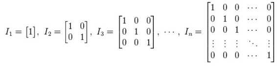

我们可以使用单位矩阵覆盖随机初始化的隐藏隐藏权重：

```py
m.rnn.weight_hh_l0.data.copy_(torch.eye(n_hidden)) 
```

这是由Geoffrey Hinton等人介绍的。 人。 in 2015 ( [A Simple Way to Initialize Recurrent Networks of Rectified Linear Units](https://arxiv.org/abs/1504.00941) ) — after RNN has been around for decades. It works very well, and you can use higher learning rate since it is well behaved.
