# 深度学习：第一部分第七课

### [第7课](http://forums.fast.ai/t/wiki-lesson-7/9405)

第1部分的主题是：

*   深度学习的分类和回归
*   识别和学习最佳和既定的实践
*   重点是分类和回归，它预测“一件事”（例如一个数字，少数标签）

课程的第2部分：

*   重点是生成建模，这意味着预测“很多事情” - 例如，创建一个句子，如在神经翻译，图像字幕或问题回答中创建图像，如风格转移，超分辨率，分割等。
*   不是最好的做法，而是从最近可能没有经过全面测试的论文中获得更多的推测。

#### 审查Char3Model  [[02:49](https://youtu.be/H3g26EVADgY%3Ft%3D2m49s)] 

提醒：RNN没有任何不同或异常或神奇 - 只是一个标准的完全连接网络。


标准的全连接网络


*   箭头表示一个或多个层操作 - 一般来说是线性的，后跟非线性函数，在这种情况下，矩阵乘法后跟`relu`或`tanh`
*   相同颜色的箭头表示使用的完全相同的权重矩阵。
*   与之前的一个细微差别是第二和第三层有输入。 我们尝试了两种方法 - 将这些输入连接并添加到当前激活中。

```
 **class** **Char3Model** (nn.Module):  **def** __init__(self, vocab_size, n_fac):  super().__init__()  self.e = nn.Embedding(vocab_size, n_fac)  _# The 'green arrow' from our diagram_  self.l_in = nn.Linear(n_fac, n_hidden)  _# The 'orange arrow' from our diagram_  self.l_hidden = nn.Linear(n_hidden, n_hidden)  _# The 'blue arrow' from our diagram_  self.l_out = nn.Linear(n_hidden, vocab_size)  **def** forward(self, c1, c2, c3):  in1 = F.relu(self.l_in(self.e(c1)))  in2 = F.relu(self.l_in(self.e(c2)))  in3 = F.relu(self.l_in(self.e(c3)))  h = V(torch.zeros(in1.size()).cuda())  h = F.tanh(self.l_hidden(h+in1))  h = F.tanh(self.l_hidden(h+in2))  h = F.tanh(self.l_hidden(h+in3))  **return** F.log_softmax(self.l_out(h)) 
```

*   通过使用`nn.Linear`我们可以免费获得权重矩阵和偏置向量。
*   为了处理第一个椭圆没有橙色箭头的事实，我们发明了一个空矩阵

```
 **class** **CharLoopModel** (nn.Module):  _# This is an RNN!_  **def** __init__(self, vocab_size, n_fac):  super().__init__()  self.e = nn.Embedding(vocab_size, n_fac)  self.l_in = nn.Linear(n_fac, n_hidden)  self.l_hidden = nn.Linear(n_hidden, n_hidden)  self.l_out = nn.Linear(n_hidden, vocab_size)  **def** forward(self, *cs):  bs = cs[0].size(0)  h = V(torch.zeros(bs, n_hidden).cuda())  **for** c **in** cs:  inp = F.relu(self.l_in(self.e(c)))  h = F.tanh(self.l_hidden(h+inp))  **return** F.log_softmax(self.l_out(h), dim=-1) 
```

*   几乎相同，除了`for`循环

```
 **class** **CharRnn** (nn.Module):  **def** __init__(self, vocab_size, n_fac):  super().__init__()  self.e = nn.Embedding(vocab_size, n_fac)  self.rnn = nn.RNN(n_fac, n_hidden)  self.l_out = nn.Linear(n_hidden, vocab_size)  **def** forward(self, *cs):  bs = cs[0].size(0)  h = V(torch.zeros(1, bs, n_hidden))  inp = self.e(torch.stack(cs))  outp,h = self.rnn(inp, h)  **return** F.log_softmax(self.l_out(outp[-1]), dim=-1) 
```

*   PyTorch版本`nn.RNN`将创建循环并跟踪`h`跟踪。
*   我们使用白色部分来预测绿色字符 - 这看起来很浪费，因为下一部分主要与当前部分重叠。

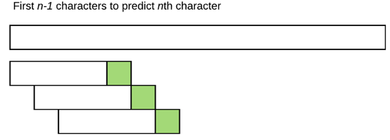

*   然后，我们尝试将其拆分为多输出模型中的非重叠部分：

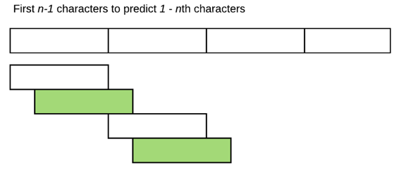

*   在这种方法中，我们在处理每个部分后开始抛弃我们的`h`激活并开始一个新的激活。 为了使用下一节中的第一个字符预测第二个字符，它没有任何内容可以继续，而是默认激活。 我们不要扔掉。

#### 有状态的RNN  [[08:52](https://youtu.be/H3g26EVADgY%3Ft%3D8m52s)] 

```
 **class** **CharSeqStatefulRnn** (nn.Module):  **def** __init__(self, vocab_size, n_fac, bs):  self.vocab_size = vocab_size  super().__init__()  self.e = nn.Embedding(vocab_size, n_fac)  self.rnn = nn.RNN(n_fac, n_hidden)  self.l_out = nn.Linear(n_hidden, vocab_size)  **self.init_hidden(bs)**  **def** forward(self, cs):  bs = cs[0].size(0)  **if** self.h.size(1) != bs: self.init_hidden(bs)  outp,h = self.rnn(self.e(cs), self.h)  **self.h = repackage_var(h)**  **return** F.log_softmax(self.l_out(outp), dim=-1).view(-1, self.vocab_size)  **def** init_hidden(self, bs): self.h = V(torch.zeros(1, bs, n_hidden)) 
```

*   构造函数中的另一行。 `self.init_hidden(bs)`将`self.h`设置为一堆零。
*   **Wrinkle＃1**  [[10:51](https://youtu.be/H3g26EVADgY%3Ft%3D10m51s)]  - 如果我们只是做`self.h = h` ，并且我们训练了一个长度为一百万字符的文档，那么RNN的展开版本的大小有一百万层（省略号） 。 一百万层完全连接的网络将占用大量内存，因为为了实现链规则，我们必须增加一百万个层，同时记住每批100万个梯度。
*   为避免这种情况，我们会不时地忘记它的历史。 我们仍然可以记住状态（隐藏矩阵中的值）而不记得我们如何到达那里的一切。

```
 def repackage_var(h):  return Variable(h.data) if type(h) == Variable else tuple(repackage_var(v) for v in h) 
```

*   从`Variable` `h`取出张量（记住，张量本身没有任何历史概念），并从中创建一个新的`Variable` 。 新变量具有相同的值但没有操作历史记录，因此当它尝试反向传播时，它将停在那里。
*   `forward`将处理8个字符，然后返回传播通过8个层，跟踪隐藏状态中的值，但它将丢弃其操作历史。 这称为**反向支撑通过时间（bptt）** 。
*   换句话说，在`for`循环之后，只需丢弃操作历史并重新开始。 所以我们保持隐藏的状态，但我们没有保持隐藏的状态历史。
*   不通过太多层反向传播的另一个好理由是，如果你有任何类型的梯度不稳定性（例如梯度爆炸或梯度消失），你拥有的层数越多，网络训练越难（速度越慢，弹性越小） 。
*   另一方面，较长的`bptt`意味着你可以显式捕获更长的内存和更多的状态。
*   **Wrinkle＃2**  [[16:00](https://youtu.be/H3g26EVADgY%3Ft%3D16m)]  - 如何创建迷你批次。 我们不希望一次处理一个部分，而是一次并行处理一个部分。
*   当我们第一次开始关注TorchText时，我们谈到了它如何创建这些迷你批次。
*   Jeremy说我们整整一份长文件，包括Nietzsche的整个作品或所有IMDB评论连在一起，我们把它分成64个相同大小的块（不是64块大小的块）。

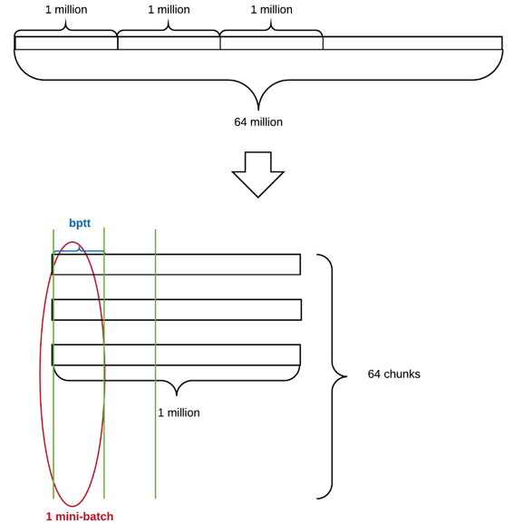

*   对于长度为6400万个字符的文档，每个“块”将是100万个字符。 我们将它们堆叠在一起，现在用`bptt`分割它们 - 1个mini-bach由64个`bptt`矩阵组成。
*   第二个块（第1,000,001个字符）的第一个字符可能位于句子的中间。 但它没关系，因为它每百万个字符只发生一次。

#### 问题：此类数据集的数据增强？  [[20:34](https://youtu.be/H3g26EVADgY%3Ft%3D20m34s)] 

没有已知的好方法。 有人最近通过数据增强赢得了Kaggle比赛，随机插入了不同行的部分 - 这样的东西可能会有用。 但是，最近没有任何最新的NLP论文正在进行这种数据增强。

#### 问题：我们如何选择bptt的大小？  [[21:36](https://youtu.be/H3g26EVADgY%3Ft%3D21m36s)] 

有几件事要考虑：

*   首先，迷你批量矩阵的大小为`bptt` （块数＃），因此你的GPU RAM必须能够通过嵌入矩阵拟合。 因此，如果你得到CUDA内存不足错误，你需要减少其中一个。
*   如果你的训练不稳定（例如你的`bptt`突然向NaN射击），那么你可以尝试减少你的`bptt`因为你有更少的层来梯度爆炸。
*   如果它太慢 [[22:44](https://youtu.be/H3g26EVADgY%3Ft%3D22m44s)] ，请尝试减少你的`bptt`因为它会一次执行其中一个步骤。 `for`循环无法并行化（对于当前版本）。 最近有一种称为QRNN（准递归神经网络）的东西，它将它并行化，我们希望在第2部分中介绍。
*   所以选择满足所有这些的最高数字。

#### 有状态的RNN和TorchText  [[23:23](https://youtu.be/H3g26EVADgY%3Ft%3D23m23s)] 

当使用希望数据为特定格式的现有API时，你可以更改数据以适合该格式，也可以编写自己的数据集子类来处理数据已经存在的格式。要么很好，要么在这种情况下，我们将以TorchText格式提供我们的数据。 围绕TorchText的Fast.ai包装器已经具有可以具有训练路径和验证路径的东西，并且每个路径中的一个或多个文本文件包含为你的语言模型连接在一起的一堆文本。

```
 **from** **torchtext** **import** vocab, data 
```

```
 **from** **fastai.nlp** **import** *  **from** **fastai.lm_rnn** **import** * 
```

```
 PATH='data/nietzsche/' 
```

```
 TRN_PATH = 'trn/'  VAL_PATH = 'val/'  TRN = f' **{PATH}{TRN_PATH}** '  VAL = f' **{PATH}{VAL_PATH}** ' 
```

```
 %ls {PATH}  _models/ nietzsche.txt trn/ val/_ 
```

```
 %ls {PATH}trn  _trn.txt_ 
```

*   制作了Nietzsche文件的副本，粘贴到训练和验证目录中。 然后从训练集中删除了最后20％的行，并删除了验证集 [[25:15](https://youtu.be/H3g26EVADgY%3Ft%3D25m15s)] 中除最后20％之外的所有行。
*   这样做的另一个好处是，拥有一个不是随机混乱的文本行集的验证集似乎更为现实，但它完全是语料库的一部分。
*   在进行语言模型时，实际上并不需要单独的文件。 你可以拥有多个文件，但无论如何它们只是连在一起。

```
 TEXT = data.Field(lower= **True** , tokenize=list)  bs=64; bptt=8; n_fac=42; n_hidden=256  FILES = dict(train=TRN_PATH, validation=VAL_PATH, test=VAL_PATH)  md = LanguageModelData.from_text_files(PATH, TEXT, **FILES, bs=bs, bptt=bptt, min_freq=3)  len(md.trn_dl), md.nt, len(md.trn_ds), len(md.trn_ds[0].text)  _(963, 56, 1, 493747)_ 
```

*   在TorchText中，我们将这个东西称为`Field` ，最初`Field`只是描述如何预处理文本。
*   `lower` - 我们告诉它要小写文本
*   `tokenize` - 上次，我们使用了一个在空格上分割的函数，它给了我们一个单词模型。 这次，我们需要一个字符模型，所以使用`list`函数来标记字符串。 请记住，在Python中， `list('abc')`将返回`['a', 'b', 'c']` 。
*   `bs` ：批量大小， `bptt` ：我们重命名为`cs` ， `n_fac` ：嵌入的大小， `n_hidden` ：隐藏状态的大小
*   我们没有单独的测试集，所以我们只使用验证集进行测试
*   TorchText每次将bptt的长度随机化一点。 它并不总能给我们准确的8个字符; 5％的时间，它会将它减少一半并加上一个小的标准偏差，使其略大于或小于8.我们无法对数据进行混洗，因为它需要连续，所以这是一种引入一些随机性的方法。
*   问题 [[31:46](https://youtu.be/H3g26EVADgY%3Ft%3D31m46s)] ：每个小批量的尺寸是否保持不变？ 是的，我们需要使用`h`权重矩阵进行矩阵乘法，因此小批量大小必须保持不变。 但序列长度可以改变没有问题。
*   `len(md.trn_dl)` ：数据加载器的长度（即多少`md.nt`批量）， `md.nt` ：标记数量（即词汇表中有多少独特的东西）
*   一旦运行`LanguageModelData.from_text_files` ， `TEXT`将包含一个名为`vocab`的额外属性。 `TEXT.vocab.itos`词汇表中的唯一项目列表， `TEXT.vocab.stoi`是从每个项目到数字的反向映射。

```
 **class** **CharSeqStatefulRnn** (nn.Module):  **def** __init__(self, vocab_size, n_fac, bs):  self.vocab_size = vocab_size  super().__init__()  self.e = nn.Embedding(vocab_size, n_fac)  self.rnn = nn.RNN(n_fac, n_hidden)  self.l_out = nn.Linear(n_hidden, vocab_size)  self.init_hidden(bs)  **def** forward(self, cs):  bs = cs[0].size(0)  **if self.h.size(1) != bs: self.init_hidden(bs)**  outp,h = self.rnn(self.e(cs), self.h)  self.h = repackage_var(h)  **return** **F.log_softmax(self.l_out(outp), dim=-1).view(-1, self.vocab_size)**  **def** init_hidden(self, bs): self.h = V(torch.zeros(1, bs, n_hidden)) 
```

*   **皱纹＃3**  [[33:51](https://youtu.be/H3g26EVADgY%3Ft%3D33m51s)] ：Jeremy说他们说小批量的尺寸保持不变。 除非数据集完全被`bptt`乘以`bs`整除，否则最后一个小批量很可能比其他小批量短。 这就是为什么我们检查`self.h`的第二个维度是否与输入的`bs`相同。 如果不相同，请使用输入的`bs`将其设置为零。 这发生在迭代的末尾和迭代的开始（设置回完整的批量大小）。
*   **Wrinkle＃4**  [[35:44](https://youtu.be/H3g26EVADgY%3Ft%3D35m44s)] ：最后的皱纹对于PyTorch来说有点糟糕，也许有人可以用PR来修复它。 损失函数不满意接收秩3张量（即三维阵列）。 没有特别的原因他们应该不乐意接受等级3张量（按结果的批量大小的序列长度 - 所以你可以只计算两个初始轴中每一个的损失）。 适用于等级2或4，但不适用于3。
*   `.view`将通过`vocab_size`将等级3张量重塑为`-1`等级2（无论多么大）。 TorchText会自动更改**目标**以使其变平，因此我们不需要为实际值执行此操作（当我们在第4课中查看小批量时，我们注意到它已被展平。杰里米说我们将了解为什么以后，所以后来现在。）
*   PyTorch（截至0.3）， `log_softmax`要求我们指定我们想要在哪个轴上执行softmax（即我们想要总和为哪个轴）。 在这种情况下，我们希望在最后一个轴上进行`dim = -1` 。

```
 m = CharSeqStatefulRnn(md.nt, n_fac, 512).cuda()  opt = optim.Adam(m.parameters(), 1e-3) 
```

```
 fit(m, md, 4, opt, F.nll_loss) 
```

#### 让我们通过拆包RNN获得更多洞察力 [[42:48](https://youtu.be/H3g26EVADgY%3Ft%3D42m48s)] 

我们删除了`nn.RNN`的使用并用`nn.RNNCell`替换它。 PyTorch源代码如下所示。 你应该能够阅读和理解（注意：它们不会连接输入和隐藏状态，但是它们将它们加在一起 ​​- 这是我们的第一种方法）：

```
 **def** RNNCell(input, hidden, w_ih, w_hh, b_ih, b_hh):  **return** F.tanh(F.linear(input, w_ih, b_ih) + F.linear(hidden, w_hh, b_hh)) 
```

关于`tanh`问题 [[44:06](https://youtu.be/H3g26EVADgY%3Ft%3D44m6s)] ：正如我们上周看到的那样， `tanh`强迫值在-1和1之间。由于我们一次又一次地乘以这个权重矩阵，我们会担心`relu` （因为它是无界）可能有更多的梯度爆炸问题。 话虽如此，你可以指定`RNNCell`使用默认为`tanh`不同`nonlineality` ，并要求它使用`relu`如果你愿意）。

```
 **class** **CharSeqStatefulRnn2** (nn.Module):  **def** __init__(self, vocab_size, n_fac, bs):  super().__init__()  self.vocab_size = vocab_size  self.e = nn.Embedding(vocab_size, n_fac)  self.rnn = **nn.RNNCell** (n_fac, n_hidden)  self.l_out = nn.Linear(n_hidden, vocab_size)  self.init_hidden(bs)  **def** forward(self, cs):  bs = cs[0].size(0)  **if** self.h.size(1) != bs: self.init_hidden(bs)  outp = []  o = self.h  **for** c **in** cs:  o = self.rnn(self.e(c), o)  outp.append(o)  outp = self.l_out(torch.stack(outp))  self.h = repackage_var(o)  **return** F.log_softmax(outp, dim=-1).view(-1, self.vocab_size)  **def** init_hidden(self, bs): self.h = V(torch.zeros(1, bs, n_hidden)) 
```

*   `for`循环返回并将线性函数的结果附加到列表中 - 最终将它们堆叠在一起。
*   fast.ai库实际上正是为了使用PyTorch不支持的正则化方法。

#### 门控经常性单位（GRU） [[46:44](https://youtu.be/H3g26EVADgY%3Ft%3D46m44s)] 

在实践中，没有人真正使用`RNNCell`因为即使是`tanh` ，梯度爆炸仍然是一个问题，我们需要使用低学习率和小`bptt`来让他们训练。 所以我们要做的是用`RNNCell`替换`GRUCell` 。

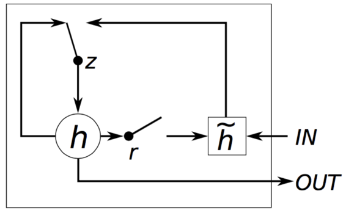

[http://www.wildml.com/2015/10/recurrent-neural-network-tutorial-part-4-implementing-a-grulstm-rnn-with-python-and-theano/](http://www.wildml.com/2015/10/recurrent-neural-network-tutorial-part-4-implementing-a-grulstm-rnn-with-python-and-theano/)


*   通常，输入乘以权重矩阵以创建新的激活`h`并立即添加到现有激活中。 那不是发生在这里。
*   输入进入`h˜`并且它不仅仅被添加到先前的激活中，而是先前的激活乘以`r` （重置门），其值为0或1。
*   `r`计算如下 - 一些权重矩阵的矩阵乘法和我们先前的隐藏状态和新输入的串联。 换句话说，这是一个隐藏层神经网络。 它也通过sigmoid函数。 这个迷你神经网络学会确定要记住多少隐藏状态（当它看到一个完整停止字符时可能会忘记它 - 新句子的开头）。
*   `z` gate（更新门）确定使用`h˜` ~的程度（隐藏状态的新输入版本）以及隐藏状态与以前相同的程度。

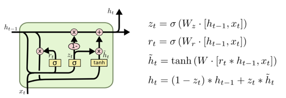

[http://colah.github.io/posts/2015-08-Understanding-LSTMs/](http://colah.github.io/posts/2015-08-Understanding-LSTMs/)


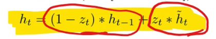

*   线性插值

```
 **def** GRUCell(input, hidden, w_ih, w_hh, b_ih, b_hh):  gi = F.linear(input, w_ih, b_ih)  gh = F.linear(hidden, w_hh, b_hh)  i_r, i_i, i_n = gi.chunk(3, 1)  h_r, h_i, h_n = gh.chunk(3, 1)  resetgate = F.sigmoid(i_r + h_r)  inputgate = F.sigmoid(i_i + h_i)  newgate = F.tanh(i_n + resetgate * h_n)  **return** newgate + inputgate * (hidden - newgate) 
```

以上是`GRUCell`代码的样子，我们使用它的新模型如下：

```
 **class** **CharSeqStatefulGRU** (nn.Module):  **def** __init__(self, vocab_size, n_fac, bs):  super().__init__()  self.vocab_size = vocab_size  self.e = nn.Embedding(vocab_size, n_fac)  self.rnn = nn.GRU(n_fac, n_hidden)  self.l_out = nn.Linear(n_hidden, vocab_size)  self.init_hidden(bs)  **def** forward(self, cs):  bs = cs[0].size(0)  **if** self.h.size(1) != bs: self.init_hidden(bs)  outp,h = self.rnn(self.e(cs), self.h)  self.h = repackage_var(h)  **return** F.log_softmax(self.l_out(outp), dim=-1).view(-1, self.vocab_size)  **def** init_hidden(self, bs): self.h = V(torch.zeros(1, bs, n_hidden)) 
```

结果，我们可以将损失降低到1.36（ `RNNCell`一个是1.54）。 在实践中，GRU和LSTM是人们使用的。

#### 把它们放在一起：长期短期记忆 [[54:09](https://youtu.be/H3g26EVADgY%3Ft%3D54m9s)] 

LSTM还有一个状态称为“单元状态”（不仅仅是隐藏状态），所以如果你使用LSTM，你必须在`init_hidden`返回一个矩阵元组（与隐藏状态完全相同）：

```
 **from** **fastai** **import** sgdr  n_hidden=512 
```

```
 **class** **CharSeqStatefulLSTM** (nn.Module):  **def** __init__(self, vocab_size, n_fac, bs, nl):  super().__init__()  self.vocab_size,self.nl = vocab_size,nl  self.e = nn.Embedding(vocab_size, n_fac)  self.rnn = nn.LSTM(n_fac, n_hidden, nl, **dropout** =0.5)  self.l_out = nn.Linear(n_hidden, vocab_size)  self.init_hidden(bs)  **def** forward(self, cs):  bs = cs[0].size(0)  **if** self.h[0].size(1) != bs: self.init_hidden(bs)  outp,h = self.rnn(self.e(cs), self.h)  self.h = repackage_var(h)  **return** F.log_softmax(self.l_out(outp), dim=-1).view(-1, self.vocab_size)  **def** init_hidden(self, bs):  **self.h = (V(torch.zeros(self.nl, bs, n_hidden)),**  **V(torch.zeros(self.nl, bs, n_hidden)))** 
```

代码与GRU代码相同。 添加的一件事是`dropout` ，它在每个时间步骤后都会 Dropout 并将隐藏层加倍 - 希望它能够学到更多并且能够保持弹性。

#### 没有学习器课程的回调（特别是SGDR） [[55:23](https://youtu.be/H3g26EVADgY%3Ft%3D55m23s)] 

```
 m = CharSeqStatefulLSTM(md.nt, n_fac, 512, 2).cuda()  lo = LayerOptimizer(optim.Adam, m, 1e-2, 1e-5) 
```

*   在创建标准PyTorch模型之后，我们通常会执行类似`opt = optim.Adam(m.parameters(), 1e-3)` 。 相反，我们将使用fast.ai `LayerOptimizer` ，它采用优化器`optim.Adam` ，我们的模型`m` ，学习率`1e-2` ，以及可选的权重衰减`1e-5` 。
*   `LayerOptimizer`存在的一个关键原因是差异学习率和差`LayerOptimizer`重衰减。 我们需要使用它的原因是fast.ai中的所有机制假设你有其中一个。 如果你想在代码中使用回调或SGDR而不使用Learner类，则需要使用它。
*   `lo.opt`返回优化器。

```
 on_end = **lambda** sched, cycle: save_model(m, f' **{PATH}** models/cyc_ **{cycle}** ') 
```

```
 cb = [CosAnneal(lo, len(md.trn_dl), cycle_mult=2, on_cycle_end=on_end)] 
```

```
 fit(m, md, 2**4-1, lo.opt, F.nll_loss, callbacks=cb) 
```

*   当我们调用`fit` ，我们现在可以传递`LayerOptimizer`以及`callbacks` 。
*   在这里，我们使用余弦退火回调 - 这需要一个`LayerOptimizer`对象。 它通过改变`lo`对象的学习率来进行余弦退火。
*   概念：创建一个余弦退火回调，它将更新层优化器中的学习率。 一个迭代的长度等于`len(md.trn_dl)` - 一个迭代中有多少`len(md.trn_dl)`批量是数据加载器的长度。 由于它正在进行余弦退火，因此需要知道复位的频率。 你可以用通常的方式传递`cycle_mult` 。 我们甚至可以像在`Learner.fit`使用`cycle_save_name`一样自动保存模型。
*   我们可以在训练，迭代或批次开始时，或在训练，迭代或批次结束时进行回调。
*   它已被用于`CosAnneal` （SGDR），去耦权重衰减（AdamW），时间损失图等。

#### 测试 [[59:55](https://youtu.be/H3g26EVADgY%3Ft%3D59m55s)] 

```
 **def** get_next(inp):  idxs = TEXT.numericalize(inp)  p = m(VV(idxs.transpose(0,1)))  r = **torch.multinomial(p[-1].exp(), 1)**  **return** TEXT.vocab.itos[to_np(r)[0]] 
```

```
 **def** get_next_n(inp, n):  res = inp  **for** i **in** range(n):  c = get_next(inp)  res += c  inp = inp[1:]+c  **return** res 
```

```
 print(get_next_n('for thos', 400)) 
```

```
 _for those the skemps), or imaginates, though they deceives._ _it should so each ourselvess and new present, step absolutely for the science." the contradity and measuring, the whole!_ 
```

```
 _293\. perhaps, that every life a values of blood of intercourse when it senses there is unscrupulus, his very rights, and still impulse, love?_ _just after that thereby how made with the way anything, and set for harmless philos_ 
```

*   在第6课中，当我们测试`CharRnn`模型时，我们注意到它一遍又一遍地重复。 在这个新版本中使用的`torch.multinomial`处理这个问题。 `p[-1]`得到最终输出（三角形）， `exp`将log概率转换为概率。 然后我们使用`torch.multinomial`函数，它将使用给定的概率给我们一个样本。 如果概率是[0,1,0,0]并要求它给我们一个样本，它将始终返回第二个项目。 如果是[0.5,0,0.5]，它将给出第一项50％的时间，第二项。 50％的时间（ [多项分布审查](http://onlinestatbook.com/2/probability/multinomial.html) ）
*   要使用像这样训练基于角色的语言模型，尝试在不同的损失级别运行`get_next_n` ，以了解它的外观。 上面的例子是在1.25，但在1.3，它看起来像一个完全垃圾。
*   当你在玩NLP时，特别是这样的生成模型，结果有点好但不是很好，不要灰心，因为这意味着你实际上非常非常接近！

### [回到计算机视觉：CIFAR 10](https://github.com/fastai/fastai/blob/master/courses/dl1/lesson7-cifar10.ipynb)  [[1:01:58](https://youtu.be/H3g26EVADgY%3Ft%3D1h1m58s)] 

CIFAR 10是学术界一个古老且众所周知的数据集 - 在ImageNet之前，有CIFAR 10.它在图像数量和图像大小方面都很小，这使它变得有趣和具有挑战性。 你可能会使用数千张图片而不是一百五十万张图片。 我们在医学成像中看到的很多东西，我们正在寻找有肺结节的特定区域，你可能最多看32×32像素。

它也运行得很快，所以测试我们的算法要好得多。 正如Ali Rahini在2017年NIPS中所提到的，Jeremy担心许多人没有仔细调整和深入学习实验，而是他们抛出大量的GPU和TPU或大量数据并考虑一天。 在CIFAR 10等数据集上测试算法的许多版本非常重要，而不是需要数周的ImageNet。 即使人们倾向于抱怨，MNIST也有利于研究和实验。

[此处](http://pjreddie.com/media/files/cifar.tgz)提供图像格式的CIFAR 10数据

```
 **from** **fastai.conv_learner** **import** *  PATH = "data/cifar10/"  os.makedirs(PATH,exist_ok= **True** ) 
```

```
 classes = ('plane', 'car', 'bird', 'cat', 'deer', 'dog', 'frog', 'horse', 'ship', 'truck')  stats = (np.array([ 0.4914 , 0.48216, 0.44653]), np.array([ 0.24703, 0.24349, 0.26159])) 
```

```
 **def** get_data(sz,bs):  tfms = **tfms_from_stats** (stats, sz, aug_tfms=[RandomFlipXY()], pad=sz//8)  **return** ImageClassifierData.from_paths(PATH, val_name='test', tfms=tfms, bs=bs) 
```

```
 bs=256 
```

*   `classes` - 图像标签
*   `stats` - 当我们使用预先训练的模型时，你可以调用`tfms_from_model`来创建必要的变换，以根据训练过的原始模型中每个通道的均值和标准偏差将我们的数据集转换为标准化数据集。由于我们是从头开始训练模型，我们需要告诉它我们的数据的均值和标准偏差来规范它。 确保你可以计算每个通道的平均值和标准偏差。
*   `tfms` - 对于CIFAR 10数据增强，人们通常在边缘周围进行水平翻转和黑色填充，并在填充图像中随机选择32×32区域。

```
 data = get_data(32,bs)  lr=1e-2 
```

来自我们的学生Kerem Turgutlu的[这本笔记本](https://github.com/KeremTurgutlu/deeplearning/blob/master/Exploring%2520Optimizers.ipynb) ：

```
 **class** **SimpleNet** (nn.Module):  **def** __init__(self, layers):  super().__init__()  self.layers = **nn.ModuleList** ([  nn.Linear(layers[i], layers[i + 1]) **for** i **in** range(len(layers) - 1)])  **def** forward(self, x):  x = x.view(x.size(0), -1)  **for** l **in** self.layers:  l_x = l(x)  x = F.relu(l_x)  **return** F.log_softmax(l_x, dim=-1) 
```

*   `nn.ModuleList` - 每当你在PyTorch中创建一个层列表时，你必须将它包装在`ModuleList`以将这些作为属性注册。

```
 learn = ConvLearner.from_model_data(SimpleNet([32*32*3, 40,10]), data) 
```

*   现在我们提高了一级API - 而不是调用`fit`函数，我们_从自定义模型_创建一个`learn`对象。 `ConfLearner.from_model_data`采用标准的PyTorch模型和模型数据对象。

```
 learn, [o.numel() **for** o **in** learn.model.parameters()] 
```

```
 _(SimpleNet(_  _(layers): ModuleList(_  _(0): Linear(in_features=3072, out_features=40)_  _(1): Linear(in_features=40, out_features=10)_  _)_  _), [122880, 40, 400, 10])_ 
```

```
 learn.summary() 
```

```
 _OrderedDict([('Linear-1',_  _OrderedDict([('input_shape', [-1, 3072]),_  _('output_shape', [-1, 40]),_  _('trainable', True),_  _('nb_params', 122920)])),_  _('Linear-2',_  _OrderedDict([('input_shape', [-1, 40]),_  _('output_shape', [-1, 10]),_  _('trainable', True),_  _('nb_params', 410)]))])_ 
```

```
 learn.lr_find() 
```

```
 learn.sched.plot() 
```

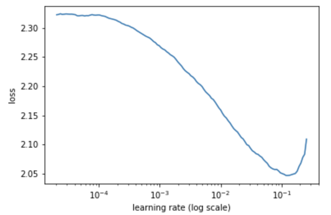

```
 %time learn.fit(lr, 2) 
```

```
 A Jupyter Widget 
```

```
 [ 0\. 1.7658 1.64148 0.42129]  [ 1\. 1.68074 1.57897 0.44131]  CPU times: user 1min 11s, sys: 32.3 s, total: 1min 44s  Wall time: 55.1 s 
```

```
 %time learn.fit(lr, 2, cycle_len=1) 
```

```
 A Jupyter Widget 
```

```
 [ 0\. 1.60857 1.51711 0.46631]  [ 1\. 1.59361 1.50341 0.46924]  CPU times: user 1min 12s, sys: 31.8 s, total: 1min 44s  Wall time: 55.3 s 
```

通过一个简单的隐藏层模型，122,880个参数，我们达到了46.9％的准确率。 让我们改进这一点，逐步建立一个基本的ResNet架构。

#### CNN  [[01:12:30](https://youtu.be/H3g26EVADgY%3Ft%3D1h12m30s)] 

*   让我们用卷积模型替换完全连接的模型。 全连接层只是做一个点积。 这就是权重矩阵很大的原因（3072输入* 40 = 122880）。 我们没有非常有效地使用这些参数，因为输入中的每个像素都具有不同的权重。 我们想要做的是一组3乘3像素，它们具有特定的模式（即卷积）。
*   我们将使用具有三乘三内核的过滤器。 如果有多个过滤器，则输出将具有其他维度。

```
 **class** **ConvNet** (nn.Module):  **def** __init__(self, layers, c):  super().__init__()  self.layers = nn.ModuleList([  **nn.Conv2d(layers[i], layers[i + 1], kernel_size=3, stride=2)**  **for** i **in** range(len(layers) - 1)])  self.pool = nn.AdaptiveMaxPool2d(1)  self.out = nn.Linear(layers[-1], c)  **def** forward(self, x):  **for** l **in** self.layers: x = F.relu(l(x))  x = self.pool(x)  x = x.view(x.size(0), -1)  **return** F.log_softmax(self.out(x), dim=-1) 
```

*   用`nn.Linear`替换`nn.Conv2d`
*   前两个参数与`nn.Linear` - 进入的`nn.Linear`数量以及出现的`nn.Linear`数量
*   `kernel_size=3` ，过滤器的大小
*   `stride=2`将使用每隔3乘3的区域，这将使每个维度的输出分辨率减半（即它具有与2乘2最大池相同的效果）

```
 learn = ConvLearner.from_model_data(ConvNet([3, 20, 40, 80], 10), data) 
```

```
 learn.summary() 
```

```
 _OrderedDict([('Conv2d-1',_  _OrderedDict([('input_shape', [-1, 3, 32, 32]),_  _('output_shape', [-1, 20, 15, 15]),_  _('trainable', True),_  _('nb_params', 560)])),_  _('Conv2d-2',_  _OrderedDict([('input_shape', [-1, 20, 15, 15]),_  _('output_shape', [-1, 40, 7, 7]),_  _('trainable', True),_  _('nb_params', 7240)])),_  _('Conv2d-3',_  _OrderedDict([('input_shape', [-1, 40, 7, 7]),_  _('output_shape', [-1, 80, 3, 3]),_  _('trainable', True),_  _('nb_params', 28880)])),_  _('AdaptiveMaxPool2d-4',_  _OrderedDict([('input_shape', [-1, 80, 3, 3]),_  _('output_shape', [-1, 80, 1, 1]),_  _('nb_params', 0)])),_  _('Linear-5',_  _OrderedDict([('input_shape', [-1, 80]),_  _('output_shape', [-1, 10]),_  _('trainable', True),_  _('nb_params', 810)]))])_ 
```

*   `ConvNet([3, 20, 40, 80], 10)` - 它以3个RGB通道， `ConvNet([3, 20, 40, 80], 10)`个特征开始，然后是10个类来预测。
*   `AdaptiveMaxPool2d` - 接下来是一个线性层，是从3乘3到预测10个类中的一个的方法，现在是最先进算法的标准。 最后一层，我们执行一种特殊的max-pooling，你可以为其指定输出激活分辨率，而不是要调查的区域大小。 换句话说，这里我们做3乘3 max-pool，相当于1乘1 _自适应_ max-pool。
*   `x = x.view(x.size(0), -1)` - `x`的特征形状为1乘1，因此它将删除最后两层。
*   这个模型被称为“完全卷积网络” - 每个层都是卷积的，除了最后一层。

```
 learn.lr_find( **end_lr=100** )  learn.sched.plot() 
```

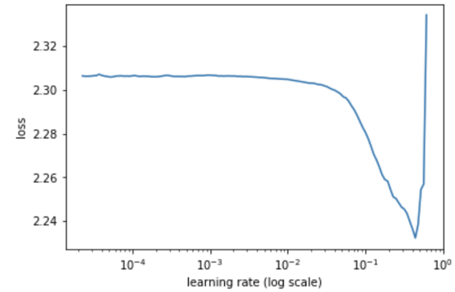

*   `lr_find`尝试的默认最终学习率为10.如果此时丢失仍然越来越好，则可以通过指定`end_lr`来覆盖。

```
 %time learn.fit(1e-1, 2) 
```

```
 _A Jupyter Widget_ 
```

```
 _[ 0\. 1.72594 1.63399 0.41338]_  _[ 1\. 1.51599 1.49687 0.45723]_  _CPU times: user 1min 14s, sys: 32.3 s, total: 1min 46s_  _Wall time: 56.5 s_ 
```

```
 %time learn.fit(1e-1, 4, cycle_len=1) 
```

```
 _A Jupyter Widget_ 
```

```
 _[ 0\. 1.36734 1.28901 0.53418]_  _[ 1\. 1.28854 1.21991 0.56143]_  _[ 2\. 1.22854 1.15514 0.58398]_  _[ 3\. 1.17904 1.12523 0.59922]_  _CPU times: user 2min 21s, sys: 1min 3s, total: 3min 24s_  _Wall time: 1min 46s_ 
```

*   它平衡了约60％的准确度。 考虑到它使用了大约30,000个参数（相比之下，参数为122k，为47％）
*   每个时期的时间大致相同，因为它们的架构既简单又大部分时间花在进行内存传输上。

#### 重构 [[01:21:57](https://youtu.be/H3g26EVADgY%3Ft%3D1h21m57s)] 

通过创建`ConvLayer` （我们的第一个自定义层！）简化`forward`功能。 在PyTorch中，层定义和神经网络定义是相同的。 任何时候你有一个层，你可以将它用作神经网络，当你有神经网络时，你可以将它用作层。

```
 **class** **ConvLayer** (nn.Module):  **def** __init__(self, ni, nf):  super().__init__()  self.conv = nn.Conv2d(ni, nf, kernel_size=3, stride=2, padding=1)  **def** forward(self, x): **return** F.relu(self.conv(x)) 
```

*   `padding=1` - 当你进行卷积时，图像每边缩小1个像素。 因此它不会从32乘32到16乘16但实际上是15乘15\. `padding`将添加边框，以便我们可以保留边缘像素信息。 对于一个大图像来说，这并不是什么大不了的事情，但是当它降到4比4时，你真的不想丢掉一整块。

```
 **class** **ConvNet2** (nn.Module):  **def** __init__(self, layers, c):  super().__init__()  self.layers = nn.ModuleList([ConvLayer(layers[i], layers[i + 1])  **for** i **in** range(len(layers) - 1)])  self.out = nn.Linear(layers[-1], c)  **def** forward(self, x):  **for** l **in** self.layers: x = l(x)  x = **F.adaptive_max_pool2d(x, 1)**  x = x.view(x.size(0), -1)  **return** F.log_softmax(self.out(x), dim=-1) 
```

*   与上一个模型的另一个区别是`nn.AdaptiveMaxPool2d`没有任何状态（即没有权重）。 所以我们可以将它称为函数`F.adaptive_max_pool2d` 。

#### BatchNorm  [[1:25:10](https://youtu.be/H3g26EVADgY%3Ft%3D1h25m10s)] 

*   最后一个模型，当我们尝试添加更多层时，我们在训练时遇到了麻烦。 我们训练有困难的原因是，如果我们使用较大的学习率，那么它将用于NaN，如果我们使用较小的学习率，则需要永远并且没有机会正确探索 - 因此它没有弹性。
*   为了使其具有弹性，我们将使用称为批量规范化的东西。 BatchNorm大约两年前推出，它具有很大的变革性，因为它突然使得培养更深层的网络变得非常容易。
*   我们可以简单地使用`nn.BatchNorm`但要了解它，我们将从头开始编写它。
*   It is unlikely that the weight matrices on average are not going to cause your activations to keep getting smaller and smaller or keep getting bigger and bigger. It is important to keep them at reasonable scale. So we start things off with zero-mean standard deviation one by normalizing the input. What we really want to do is to do this for all layers, not just the inputs.

```
 class BnLayer (nn.Module):  def __init__(self, ni, nf, stride=2, kernel_size=3):  super().__init__()  self.conv = nn.Conv2d(ni, nf, kernel_size=kernel_size,  stride=stride, bias= False , padding=1)  self.a = nn.Parameter(torch.zeros(nf,1,1))  self.m = nn.Parameter(torch.ones(nf,1,1))  def forward(self, x):  x = F.relu(self.conv(x))  x_chan = x.transpose(0,1).contiguous().view(x.size(1), -1)  if self.training:  self.means = x_chan.mean(1)[:,None,None]   self.stds = x_chan.std (1)[:,None,None]  return (x-self.means) / self.stds *self.m + self.a 
```

*   计算每个通道或每个过滤器的平均值以及每个通道或每个过滤器的标准偏差。 然后减去均值并除以标准差。
*   我们不再需要对输入进行标准化，因为它会对每个通道进行标准化，或者对于以后的层，它按照过滤器进行标准化。
*   原来这还不够，因为SGD是血腥的 [[01:29:20](https://youtu.be/H3g26EVADgY%3Ft%3D1h29m20s)] 。 如果SGD决定它希望矩阵整体更大/更小，那么做`(x=self.means) / self.stds`是不够的，因为SGD将撤消它并尝试在下一个小批量中再次执行。 因此，我们将为每个通道添加两个参数： `a` - 加法器（初始值零）和`m` - 乘数（初始值1）。
*   `Parameter`告诉PyTorch允许将它们作为权重学习。
*   为什么这样做？ 如果要扩展层，则不必扩展矩阵中的每个值。 它可以扩展这个单独的三个数字`self.m` ，如果它想要将它全部向上或向下移动一点，它不必移动整个权重矩阵，它们可以将这三个数字`self.a`为`self.a` 直觉：我们正在对数据进行标准化，然后我们说你可以转移它并使用比实际移位和缩放整个卷积滤波器组所需的参数少得多的参数来缩放它。 在实践中，它允许我们提高我们的学习率，增加训练的弹性，并且它允许我们添加更多层并且仍然有效地训练。
*   批量规范所做的另一件事是它规则化，换句话说，你可以经常减少或消除 Dropout 或权重衰减。 原因是每个小批量将与先前的小批量具有不同的平均值和不同的标准偏差。 因此，它们不断变化，并以微妙的方式改变滤波器的含义，作为噪声（即正则化）。
*   在实际版本中，它不使用此批次的均值和标准差，而是采用指数加权移动平均标准差和均值。
*   `**if** self.training` - 这很重要，因为当你通过验证集时，你不想改变模型的含义。 有些类型的层实际上对网络模式敏感，无论是处于训练模式还是评估/测试模式。 当我们为MovieLens实现迷你网时出现了一个错误，即在验证过程中应用了dropout - 这是固定的。 在PyTorch中，有两个这样的层：dropout和batch norm。 `nn.Dropout`已经进行了检查。
*    [[01:37:01](https://youtu.be/H3g26EVADgY%3Ft%3D1h37m1s)]  [fast.ai](https://youtu.be/H3g26EVADgY%3Ft%3D1h37m1s)的关键区别在于，无论其他库做什么，只要你基本上说我正在训练，这些手段和标准偏差都会在其他库的训练模式中更新，无论该层是否是否可以训练。 有了预先训练好的网络，这是一个糟糕的主意。 如果你有一个预先训练好的网络，用于批量标准中的那些均值和标准偏差的特定值，如果你更改它们，它将改变那些预先训练的层的含义。 在fast.ai中，始终默认情况下，如果你的层被冻结，它将不会触及那些均值和标准偏差。 一旦你取消冻结它，除非你设置`learn.bn_freeze=True` ，否则它将开始更新它们。 在实践中，对于预训练的模型，这似乎通常效果更好，特别是如果你使用的数据与预训练模型的训练非常相似。
*   你在哪里放置批量标准层？ 我们稍后会谈谈更多，但就目前来说，经过`relu`

#### 消融研究 [[01:39:41](https://youtu.be/H3g26EVADgY%3Ft%3D1h39m41s)] 

在这种情况下，你可以尝试打开和关闭模型的不同部分，以查看哪些部位产生了哪些影响，而原始批次规范文件中未执行的操作之一是任何有效的消融。 因此缺少的一件事就是这个问题刚才被问到 - 在哪里提出批量规范。 这种疏忽造成了很多问题，因为事实证明原始论文并没有真正把它放在最佳位置。 从那时起，其他人现在已经想到了这一点，当Jeremy向人们展示实际上在现场更好的代码时，人们说他的批量规范是在错误的位置。

*   如果可以，请尝试并始终在每个层上使用批量规范
*   不要停止对数据进行规范化，以便使用你的数据的人知道你如何规范化数据。 其他库可能无法正确处理预训练模型的批量规范，因此当人们开始重新训练时，可能会导致问题。

```
 **class** **ConvBnNet** (nn.Module):  **def** __init__(self, layers, c):  super().__init__()  **self.conv1 = nn.Conv2d(3, 10, kernel_size=5, stride=1, padding=2)**  self.layers = nn.ModuleList([ **BnLayer** (layers[i], layers[i + 1])  **for** i **in** range(len(layers) - 1)])  self.out = nn.Linear(layers[-1], c)  **def** forward(self, x):  x = self.conv1(x)  **for** l **in** self.layers: x = l(x)  x = F.adaptive_max_pool2d(x, 1)  x = x.view(x.size(0), -1)  **return** F.log_softmax(self.out(x), dim=-1) 
```

*   其余代码类似 - 使用`BnLayer`而不是`ConvLayer`
*   在开始时添加了单个卷积层，试图更接近现代方法。 它具有更大的内核大小和1的步幅。基本思想是我们希望第一层具有更丰富的输入。 它使用5×5区域进行卷积，这允许它尝试在5×5区域内找到更有趣的更丰富的特征，然后输出更大的输出（在这种情况下，它是10乘5乘5个滤波器）。 通常它是5乘5或7乘7，或甚至11乘11卷积，并且有相当多的滤波器出来（例如32个滤波器）。
*   由于`padding = kernel_size — 1 / 2`并且`stride=1` ，输入大小与输出大小相同 - 只是更多的过滤器。
*   这是尝试创造更丰富起点的好方法。

#### Deep BatchNorm  [[01:50:52](https://youtu.be/H3g26EVADgY%3Ft%3D1h50m52s)] 

让我们增加模型的深度。 我们不能只添加更多的步幅2层，因为它每次将图像的大小减半。 相反，在每个步幅2层之后，我们插入步幅1层。

```
 **class** **ConvBnNet2** (nn.Module):  **def** __init__(self, layers, c):  super().__init__()  self.conv1 = nn.Conv2d(3, 10, kernel_size=5, stride=1, padding=2)  self.layers = nn.ModuleList([BnLayer(layers[i], layers[i+1])  **for** i **in** range(len(layers) - 1)])  self.layers2 = nn.ModuleList([BnLayer(layers[i+1], layers[i + 1], 1)  **for** i **in** range(len(layers) - 1)])  self.out = nn.Linear(layers[-1], c)  **def** forward(self, x):  x = self.conv1(x)  **for** l,l2 **in** zip(self.layers, self.layers2):  x = l(x)  x = l2(x)  x = F.adaptive_max_pool2d(x, 1)  x = x.view(x.size(0), -1)  **return** F.log_softmax(self.out(x), dim=-1) 
```

```
 learn = ConvLearner.from_model_data((ConvBnNet2([10, 20, 40, 80, 160], 10), data) 
```

```
 %time learn.fit(1e-2, 2) 
```

```
 _A Jupyter Widget_ 
```

```
 _[ 0\. 1.53499 1.43782 0.47588]_  _[ 1\. 1.28867 1.22616 0.55537]_  _CPU times: user 1min 22s, sys: 34.5 s, total: 1min 56s_  _Wall time: 58.2 s_ 
```

```
 %time learn.fit(1e-2, 2, cycle_len=1) 
```

```
 _A Jupyter Widget_ 
```

```
 _[ 0\. 1.10933 1.06439 0.61582]_  _[ 1\. 1.04663 0.98608 0.64609]_  _CPU times: user 1min 21s, sys: 32.9 s, total: 1min 54s_  _Wall time: 57.6 s_ 
```

准确性与以前一样。 现在这是12层深，即使批量规范也要处理太深。 可以训练12层深度转换网但它开始变得困难。 如果有的话，它似乎没有多大帮助。

#### ResNet  [[01:52:43](https://youtu.be/H3g26EVADgY%3Ft%3D1h52m43s)] 

```
 **class** **ResnetLayer** (BnLayer):  **def** forward(self, x): **return** **x + super().forward(x)** 
```

```
 **class** **Resnet** (nn.Module):  **def** __init__(self, layers, c):  super().__init__()  self.conv1 = nn.Conv2d(3, 10, kernel_size=5, stride=1, padding=2)  self.layers = nn.ModuleList([BnLayer(layers[i], layers[i+1])  **for** i **in** range(len(layers) - 1)])  self.layers2 = nn.ModuleList([ResnetLayer(layers[i+1], layers[i + 1], 1)  **for** i **in** range(len(layers) - 1)])  self.layers3 = nn.ModuleList([ResnetLayer(layers[i+1], layers[i + 1], 1)  **for** i **in** range(len(layers) - 1)])  self.out = nn.Linear(layers[-1], c)  **def** forward(self, x):  x = self.conv1(x)  **for** l,l2,l3 **in** zip(self.layers, self.layers2, self.layers3):  x = l3(l2(l(x)))  x = F.adaptive_max_pool2d(x, 1)  x = x.view(x.size(0), -1)  **return** F.log_softmax(self.out(x), dim=-1) 
```

*   `ResnetLayer`继承自`BnLayer`并覆盖`forward` 。
*   然后添加一堆层并使它更深3倍，因为`x + super().forward(x)` ，它仍然训练得很漂亮。

```
 learn = ConvLearner.from_model_data(Resnet([10, 20, 40, 80, 160], 10), data) 
```

```
 wd=1e-5 
```

```
 %time learn.fit(1e-2, 2, wds=wd) 
```

```
 _A Jupyter Widget_ 
```

```
 _[ 0\. 1.58191 1.40258 0.49131]_  _[ 1\. 1.33134 1.21739 0.55625]_  _CPU times: user 1min 27s, sys: 34.3 s, total: 2min 1s_  _Wall time: 1min 3s_ 
```

```
 %time learn.fit(1e-2, 3, cycle_len=1, cycle_mult=2, wds=wd) 
```

```
 _A Jupyter Widget_ 
```

```
 _[ 0\. 1.11534 1.05117 0.62549]_  _[ 1\. 1.06272 0.97874 0.65185]_  _[ 2\. 0.92913 0.90472 0.68154]_  _[ 3\. 0.97932 0.94404 0.67227]_  _[ 4\. 0.88057 0.84372 0.70654]_  _[ 5\. 0.77817 0.77815 0.73018]_  _[ 6\. 0.73235 0.76302 0.73633]_  _CPU times: user 5min 2s, sys: 1min 59s, total: 7min 1s_  _Wall time: 3min 39s_ 
```

```
 %time learn.fit(1e-2, 8, cycle_len=4, wds=wd) 
```

```
 _A Jupyter Widget_ 
```

```
 _[ 0\. 0.8307 0.83635 0.7126 ]_  _[ 1\. 0.74295 0.73682 0.74189]_  _[ 2\. 0.66492 0.69554 0.75996]_  _[ 3\. 0.62392 0.67166 0.7625 ]_  _[ 4\. 0.73479 0.80425 0.72861]_  _[ 5\. 0.65423 0.68876 0.76318]_  _[ 6\. 0.58608 0.64105 0.77783]_  _[ 7\. 0.55738 0.62641 0.78721]_  _[ 8\. 0.66163 0.74154 0.7501 ]_  _[ 9\. 0.59444 0.64253 0.78106]_  _[ 10\. 0.53 0.61772 0.79385]_  _[ 11\. 0.49747 0.65968 0.77832]_  _[ 12\. 0.59463 0.67915 0.77422]_  _[ 13\. 0.55023 0.65815 0.78106]_  _[ 14\. 0.48959 0.59035 0.80273]_  _[ 15\. 0.4459 0.61823 0.79336]_  _[ 16\. 0.55848 0.64115 0.78018]_  _[ 17\. 0.50268 0.61795 0.79541]_  _[ 18\. 0.45084 0.57577 0.80654]_  _[ 19\. 0.40726 0.5708 0.80947]_  _[ 20\. 0.51177 0.66771 0.78232]_  _[ 21\. 0.46516 0.6116 0.79932]_  _[ 22\. 0.40966 0.56865 0.81172]_  _[ 23\. 0.3852 0.58161 0.80967]_  _[ 24\. 0.48268 0.59944 0.79551]_  _[ 25\. 0.43282 0.56429 0.81182]_  _[ 26\. 0.37634 0.54724 0.81797]_  _[ 27\. 0.34953 0.54169 0.82129]_  _[ 28\. 0.46053 0.58128 0.80342]_  _[ 29\. 0.4041 0.55185 0.82295]_  _[ 30\. 0.3599 0.53953 0.82861]_  _[ 31\. 0.32937 0.55605 0.82227]_  _CPU times: user 22min 52s, sys: 8min 58s, total: 31min 51s_  _Wall time: 16min 38s_ 
```

**ResNet块**  [[01:53:18](https://youtu.be/H3g26EVADgY%3Ft%3D1h53m18s)] 

`**return** **x + super().forward(x)**`

_y = x + f（x）_

其中_x_是来自前一层的预测， _y_是来自当前层的预测。围绕公式进行预测，我们得到：公式shuffle

_f（x）= y - x_

差值_y - x_是**残差** 。 残差是我们到目前为止计算的误差。 这就是说，试图找到一组卷积权重，试图填补我们所关闭的数量。 换句话说，我们有一个输入，我们有一个功能，试图预测错误（即我们有多少关闭）。 然后我们添加一个对输入错误的预测，然后添加另一个我们错误的预测，并在层之后重复该层 - 缩放到正确的答案。 这是基于一种称为**助推**的理论。

*   完整的ResNet在将其添加回原始输入之前会进行两次卷积（我们在这里只做了一次）。
*   在每个块`x = l3(l2(l(x)))` ，其中一个层不是`ResnetLayer`而是`stride=2`的标准卷积 - 这称为“瓶颈层”。 ResNet不是卷积层，而是一种不同形式的瓶颈块，我们将在第2部分中介绍。

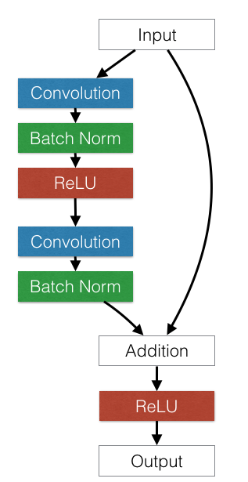

#### ResNet 2  [[01:59:33](https://youtu.be/H3g26EVADgY%3Ft%3D1h59m33s)] 

在这里，我们增加了功能的大小并增加了丢失。

```
 **class** **Resnet2** (nn.Module):  **def** __init__(self, layers, c, p=0.5):  super().__init__()  self.conv1 = BnLayer(3, 16, stride=1, kernel_size=7)  self.layers = nn.ModuleList([BnLayer(layers[i], layers[i+1])  **for** i **in** range(len(layers) - 1)])  self.layers2 = nn.ModuleList([ResnetLayer(layers[i+1], layers[i + 1], 1)  **for** i **in** range(len(layers) - 1)])  self.layers3 = nn.ModuleList([ResnetLayer(layers[i+1], layers[i + 1], 1)  **for** i **in** range(len(layers) - 1)])  self.out = nn.Linear(layers[-1], c)  self.drop = nn.Dropout(p)  **def** forward(self, x):  x = self.conv1(x)  **for** l,l2,l3 **in** zip(self.layers, self.layers2, self.layers3):  x = l3(l2(l(x)))  x = F.adaptive_max_pool2d(x, 1)  x = x.view(x.size(0), -1)  x = self.drop(x)  **return** F.log_softmax(self.out(x), dim=-1) 
```

```
 learn = ConvLearner.from_model_data(Resnet2([ **16, 32, 64, 128, 256** ], 10, 0.2), data) 
```

```
 wd=1e-6 
```

```
 %time learn.fit(1e-2, 2, wds=wd)  %time learn.fit(1e-2, 3, cycle_len=1, cycle_mult=2, wds=wd)  %time learn.fit(1e-2, 8, cycle_len=4, wds=wd) 
```

```
 log_preds,y = learn.TTA()  preds = np.mean(np.exp(log_preds),0) 
```

```
 metrics.log_loss(y,preds), accuracy(preds,y)  _(0.44507397166057938, 0.84909999999999997)_ 
```

对于CIFAR 10来说，85％是2012年或2013年的最先进的背部。如今，它高达97％，因此有改进的余地，但都基于这些技术：

*   更好的数据增强方法
*   更好的正则化方法
*   ResNet上的一些调整

问题 [[02:01:07](https://youtu.be/H3g26EVADgY%3Ft%3D2h1m7s)] ：我们可以对非图像问题应用“剩余训练”方法吗？ 是! 但它在其他任何地方都被忽视了。 在NLP中，“变形结构”最近出现并被证明是最先进的翻译技术，它有一个简单的ResNet结构。 这种通用的方法被称为“跳过连接”（即跳过一层的想法）并且在计算机视觉中出现了很多，但是即使没有任何关于它的计算机视觉，也没有其他人似乎使用它。 良机！

### [狗与猫](https://github.com/fastai/fastai/blob/master/courses/dl1/lesson7-CAM.ipynb)  [[02:02:03](https://youtu.be/H3g26EVADgY%3Ft%3D2h2m3s)] 

回去的狗和猫。 我们将创建resnet34（如果你对尾随数字的含义感兴趣， [请参阅此处](https://github.com/pytorch/vision/blob/master/torchvision/models/resnet.py) - 只是不同的参数）。

```
 PATH = "data/dogscats/"  sz = 224  arch = resnet34 # <-- Name of the function  bs = 64 
```

```
 m = arch(pretrained=True) # Get a model w/ pre-trained weight loaded  m 
```

```
 _ResNet(_  _(conv1): Conv2d (3, 64,_ **_kernel_size=(7, 7)_** _, stride=(2, 2), padding=(3, 3), bias=False)_  _(bn1): BatchNorm2d(64, eps=1e-05, momentum=0.1, affine=True)_  _(relu): ReLU(inplace)_  _(maxpool): MaxPool2d(kernel_size=(3, 3), stride=(2, 2), padding=(1, 1), dilation=(1, 1))_  _(_ **_layer1_** _): Sequential(_  _(0): BasicBlock(_  _(conv1): Conv2d (64, 64, kernel_size=(3, 3), stride=(1, 1), padding=(1, 1), bias=False)_  _(bn1): BatchNorm2d(64, eps=1e-05, momentum=0.1, affine=True)_  _(relu): ReLU(inplace)_  _(conv2): Conv2d (64, 64, kernel_size=(3, 3), stride=(1, 1), padding=(1, 1), bias=False)_  _(bn2): BatchNorm2d(64, eps=1e-05, momentum=0.1, affine=True)_  _)_  _(1): BasicBlock(_  _(conv1): Conv2d (64, 64, kernel_size=(3, 3), stride=(1, 1), padding=(1, 1), bias=False)_  _(bn1): BatchNorm2d(64, eps=1e-05, momentum=0.1, affine=True)_  _(relu): ReLU(inplace)_  _(conv2): Conv2d (64, 64, kernel_size=(3, 3), stride=(1, 1), padding=(1, 1), bias=False)_  _(bn2): BatchNorm2d(64, eps=1e-05, momentum=0.1, affine=True)_  _)_  _(2): BasicBlock(_  _(conv1): Conv2d (64, 64, kernel_size=(3, 3), stride=(1, 1), padding=(1, 1), bias=False)_  _(bn1): BatchNorm2d(64, eps=1e-05, momentum=0.1, affine=True)_  _(relu): ReLU(inplace)_  _(conv2): Conv2d (64, 64, kernel_size=(3, 3), stride=(1, 1), padding=(1, 1), bias=False)_  _(bn2): BatchNorm2d(64, eps=1e-05, momentum=0.1, affine=True)_  _)_  _)_  _(_ **_layer2_** _): Sequential(_  _(0): BasicBlock(_  _(conv1): Conv2d (64, 128, kernel_size=(3, 3),_ **_stride=(2, 2)_** _, padding=(1, 1), bias=False)_  _(bn1): BatchNorm2d(128, eps=1e-05, momentum=0.1, affine=True)_  _(relu): ReLU(inplace)_  _(conv2): Conv2d (128, 128, kernel_size=(3, 3), stride=(1, 1), padding=(1, 1), bias=False)_  _(bn2): BatchNorm2d(128, eps=1e-05, momentum=0.1, affine=True)_  _(downsample): Sequential(_  _(0): Conv2d (64, 128, kernel_size=(1, 1), stride=(2, 2), bias=False)_  _(1): BatchNorm2d(128, eps=1e-05, momentum=0.1, affine=True)_  _)_  _)_  _(1): BasicBlock(_  _(conv1): Conv2d (128, 128, kernel_size=(3, 3), stride=(1, 1), padding=(1, 1), bias=False)_  _(bn1): BatchNorm2d(128, eps=1e-05, momentum=0.1, affine=True)_  _(relu): ReLU(inplace)_  _(conv2): Conv2d (128, 128, kernel_size=(3, 3), stride=(1, 1), padding=(1, 1), bias=False)_  _(bn2): BatchNorm2d(128, eps=1e-05, momentum=0.1, affine=True)_  _)_  _(2): BasicBlock(_  _(conv1): Conv2d (128, 128, kernel_size=(3, 3), stride=(1, 1), padding=(1, 1), bias=False)_  _(bn1): BatchNorm2d(128, eps=1e-05, momentum=0.1, affine=True)_  _(relu): ReLU(inplace)_  _(conv2): Conv2d (128, 128, kernel_size=(3, 3), stride=(1, 1), padding=(1, 1), bias=False)_  _(bn2): BatchNorm2d(128, eps=1e-05, momentum=0.1, affine=True)_  _)_  _(3): BasicBlock(_  _(conv1): Conv2d (128, 128, kernel_size=(3, 3), stride=(1, 1), padding=(1, 1), bias=False)_  _(bn1): BatchNorm2d(128, eps=1e-05, momentum=0.1, affine=True)_  _(relu): ReLU(inplace)_  _(conv2): Conv2d (128, 128, kernel_size=(3, 3), stride=(1, 1), padding=(1, 1), bias=False)_  _(bn2): BatchNorm2d(128, eps=1e-05, momentum=0.1, affine=True)_  _)_  _)_ 
```

```
 _..._ 
```

```
 _(avgpool): AvgPool2d(kernel_size=7, stride=7, padding=0, ceil_mode=False, count_include_pad=True)_  _(fc): Linear(in_features=512, out_features=1000)_  _)_ 
```

我们的ResNet模型有Relu→BatchNorm。 TorchVision执行BatchNorm→Relu。 有三种不同版本的ResNet浮动，最好的版本是PreAct（ [https://arxiv.org/pdf/1603.05027.pdf](https://arxiv.org/pdf/1603.05027.pdf) ）。

*   目前，最后一层有数千个功能，因为ImageNet有1000个功能，所以我们需要摆脱它。
*   当你使用fast.ai的`ConvLearner` ，它会为你删除最后两层。 fast.ai将AvgPool2d替换为Adaptive Average Pooling和Adaptive Max Pooling，并将两者连接在一起。
*   在本练习中，我们将做一个简单的版本。

```
 m = nn.Sequential(*children(m)[:-2],  nn.Conv2d(512, 2, 3, padding=1),  nn.AdaptiveAvgPool2d(1), Flatten(),  nn.LogSoftmax()) 
```

*   删除最后两层
*   添加一个只有2个输出的卷积。
*   平均汇集然后softmax
*   最后没有线性层。 这是产生两个数字的另一种方式 - 这使我们可以做CAM！

```
 tfms = tfms_from_model(arch, sz, aug_tfms=transforms_side_on, max_zoom=1.1)  data = ImageClassifierData.from_paths(PATH, tfms=tfms, bs=bs) 
```

```
 learn = **ConvLearner.from_model_data** (m, data) 
```

```
 learn.freeze_to(-4) 
```

```
 learn.fit(0.01, 1)  learn.fit(0.01, 1, cycle_len=1) 
```

*   `ConvLearner.from_model`是我们之前学到的 - 允许我们使用自定义模型创建一个Learner对象。
*   然后冻结除我们刚添加的层之外的层。

#### 类激活图（CAM） [[02:08:55](https://youtu.be/H3g26EVADgY%3Ft%3D2h8m55s)] 

我们选择一个特定的图像，并使用一种名为CAM的技术，我们在这里采用一个模型，然后我们会问它图像的哪些部分变得很重要。

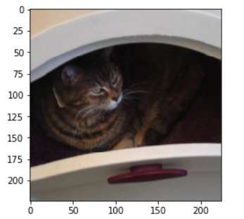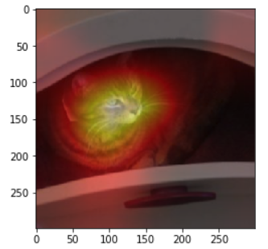

它是怎么做到的？ 让我们倒退吧。 它的方式是通过生成这个矩阵：

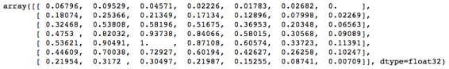

大数字对应猫。 那么这个矩阵是什么？ 该矩阵简单地等于特征矩阵特征`py`向量的值：

```
 f2=np.dot(np.rollaxis( **feat** ,0,3), **py** )  f2-=f2.min()  f2/=f2.max()  f2 
```

`py` vector是预测，“我100％确信它是一只猫。” `feat`是从最终卷积层（我们添加的`Conv2d`层）出来的值（2×7×7）。 如果我们将`feat`乘以`py` ，我们得到所有第一个通道而不是第二个通道。 因此，它将返回与猫对齐的部分的最后卷积层的值。 换句话说，如果我们将`feat`乘以`[0, 1]` ，它就会成为一只狗。

```
 sf = SaveFeatures(m[-4])  py = m(Variable(x.cuda()))  sf.remove()  py = np.exp(to_np(py)[0]); py 
```

```
 _array([ 1., 0.], dtype=float32)_ 
```

```
 feat = np.maximum(0, sf.features[0])  feat.shape 
```

换句话说，在模型中，卷积层之后发生的唯一事情是平均池层。 平均汇集层花了7乘7的网格，并平均每个部分是“猫似的”多少。 然后我们采用“cattyness”矩阵，将其大小调整为与原始猫图像相同的大小，并将其覆盖在顶部，然后获得热图。

你在家里使用这种技术的方法是

1.  当你有一个大图像时，你可以在一个快速的小卷积网上计算这个矩阵
2.  放大具有最高值的区域
3.  在那部分重新运行它

由于时间不多，我们很快就跳过了这个问题，但我们将在第2部分中详细了解这些方法。

“钩子”是让我们让模型返回矩阵的机制。 `register_forward_hook`要求PyTorch每次计算一个层时都会运行给定的函数 - 有点像每次计算层时发生的回调。 在下面的例子中，它保存了我们感兴趣的特定层的值：

```
 **class** **SaveFeatures** ():  features= **None**  **def** __init__(self, m):  self.hook = m.register_forward_hook(self.hook_fn)  **def** hook_fn(self, module, input, output):  self.features = to_np(output)  **def** remove(self): self.hook.remove() 
```

#### 对杰里米的问题 [[02:14:27](https://youtu.be/H3g26EVADgY%3Ft%3D2h14m27s)] ：“你的深度学习之旅”和“如何跟上从业者的重要研究”

“如果你打算参加第2部分，你应该掌握在第1部分中学到的所有技巧”。 你可以执行以下操作：

1.  观看每个视频至少3次。
2.  确保你可以在不观看视频的情况下重新创建笔记本电脑 - 也许可以使用不同的数据集来创建笔记本电脑以使其更有趣。
3.  密切关注最近的论文，最近的进展论坛。
4.  要顽强，继续努力吧！
