# 深度学习：第二部分第八课

### 物体检测

[**论坛**](http://forums.fast.ai/t/part-2-lesson-8-in-class/13556/1) **/** [**视频**](https://youtu.be/Z0ssNAbe81M) **/** [**笔记本**](https://github.com/fastai/fastai/blob/master/courses/dl2/pascal.ipynb) **/** [**幻灯片**](https://github.com/fastai/fastai/blob/master/courses/dl2/ppt/lesson8.pptx)

#### **我们在第1部分[** [**02:00**](https://youtu.be/Z0ssNAbe81M%3Ft%3D2m) **]中介绍的内容**


**可区分层[** [**02:11**](https://youtu.be/Z0ssNAbe81M%3Ft%3D2m11s) **]**

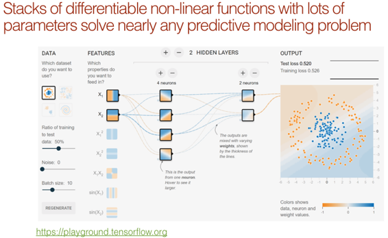

Yann LeCun一直在宣传我们并不称之为“深度学习”，而是称之为“差异化编程”。 我们在第1部分中所做的只是设置一个可微分函数和一个描述参数有多好的损失函数，然后按下go并使其工作。 如果你可以配置一个损失函数来评估你的任务有多好，那么你就拥有了一个相当灵活的神经网络架构，你就完成了。

> 是的，可分辨编程只不过是对现代集合深度学习技术的重塑，就像深度学习是对具有两层以上神经网络的现代化身的重塑一样。

> 重要的是，人们现在正在通过组装参数化功能块的网络来构建一种新型软件，并通过使用某种形式的基于梯度的优化来训练它们。它实际上非常像常规程序，除了它的参数化，自动区分，可训练/可优化。

> - [FAIR主任Yann LeCun](https://www.facebook.com/yann.lecun/posts/10155003011462143)

**2.转学习[** [**03:23**](https://youtu.be/Z0ssNAbe81M%3Ft%3D3m23s) **]**

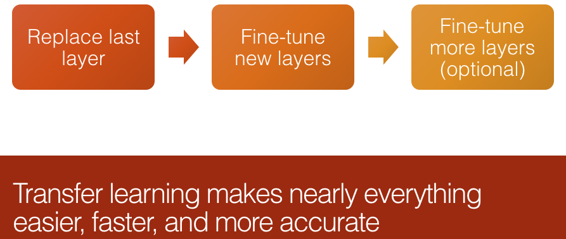

转移学习是有效使用深度学习能够做的最重要的事情。 你几乎永远不会想要或者不需要从随机权重开始，除非没有人曾经在模糊的类似数据集上训练模型，甚至远程连接的问题要像你正在做的那样解决 - 这几乎从未发生过。 Fastai库专注于转移学习，这使其与其他库不同。 转学习的基本思想是：

*   给定一个做事物A的网络，删除最后一层。
*   最后用几个随机层替换它
*   在利用原始网络学习的功能的同时，微调这些层以执行事物B.
*   然后可选择地对整个事物进行端到端微调，你现在可能会使用数量级更少的数据，更准确，并且训练速度更快。

**3.建筑设计[** [**05:17**](https://youtu.be/Z0ssNAbe81M%3Ft%3D5m17s) **]**

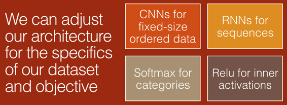

有一小部分架构通常在很多时候都能很好地运行。 我们一直专注于将CNN用于通​​常固定大小的有序数据，RNN用于具有某种状态的序列。 我们还通过激活函数摆弄了一小部分 - 如果你有单一的分类结果，则为softmax;如果你有多个结果，则为sigmoid。 我们将在第2部分中学习的一些架构设计变得更有趣。 特别是关于对象检测的第一个会话。 但总的来说，我们花在讨论架构设计上的时间可能比大多数课程或论文少，因为它通常不是很难。

**4.处理过度贴合[** [**06:26**](https://youtu.be/Z0ssNAbe81M%3Ft%3D6m26s) **]**

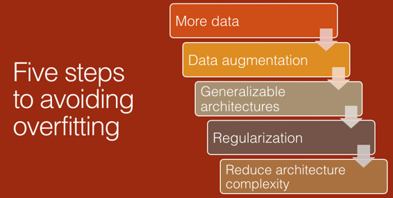

Jeremy喜欢建立模型的方式：

*   创造一些绝对非常过度参数化的东西，它肯定会大量过度装备，训练它并确保它过度适应。 那时，你有一个能够反映训练集的模型。 然后就像做这些事情一样简单，以减少过拟合。

如果你没有从过拟合的东西开始，你就会迷失方向。 所以你先从过拟合的东西开始，然后减少过度装备，你可以：

*   添加更多数据
*   添加更多数据增强
*   做更多批处理规范层，密集网络或可以处理更少数据的各种事情。
*   添加正规化，如权重衰减和 Dropout 
*   终于（这通常是人们先做的事情，但这应该是你最后做的事情）降低架构的复杂性。 具有较少的层数或较少的激活。

**5.嵌入[** [**07:46**](https://youtu.be/Z0ssNAbe81M%3Ft%3D7m46s) **]**

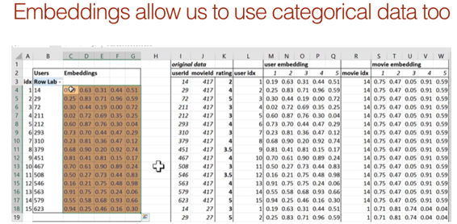

我们已经谈了很多关于嵌入的内容 - 对于NLP和任何类型的分类数据的一般概念，你现在可以使用神经网络进行建模。 就在今年早些时候，几乎没有关于在深度学习中使用表格数据的例子，但是使用神经网络进行时间序列和表格数据分析正变得越来越流行。

#### **第1部分至第2部分[** [**08:54**](https://youtu.be/Z0ssNAbe81M%3Ft%3D8m54s) **]**

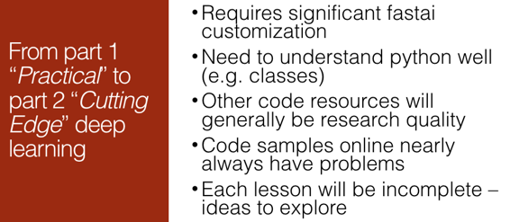

第1部分真的是关于引入深度学习的最佳实践。 我们看到了足够成熟的技术，它们确实可以合理可靠地解决实际的现实问题。 Jeremy在相当长的一段时间内进行了充分的研究和调整，提出了一系列步骤，架构等，并以我们能够快速轻松地完成的方式将它们放入fastai库中。

第2部分是编码员的尖端深度学习，这意味着Jeremy通常不知道确切的最佳参数，架构细节等等来解决特定问题。 我们不一定知道它是否能够很好地解决问题，实际上是有用的。 它几乎肯定不会很好地集成到fastai或任何其他库中，你可以按几个按钮，它将开始工作。 Jeremy不会教它，除非他非常确信它现在或将很快是非常实用的技术。 但它需要经常进行大量调整并尝试使其能够解决你的特定问题，因为我们不了解细节以了解如何使其适用于每个数据集或每个示例。

这意味着而不是Fastai和PyTorch是你只知道这些食谱的晦涩的黑盒子，你将很好地了解它们的细节，你可以按照你想要的方式自定义它们，你可以调试它们，你可以阅读他们的源代码，看看发生了什么。 如果你对面向对象的Python没有信心，那么你希望在本课程中专注于学习，因为我们不会在课堂上介绍它。 但Jeremy将介绍一些他认为特别有用的工具，如Python调试器，如何使用编辑器跳过代码。 总的来说，将会有更详细和具体的代码演练，编码技术讨论，以及更详细的论文演练。

请注意示例代码 [[13:20](https://youtu.be/Z0ssNAbe81M%3Ft%3D13m20s)] ！ 代码学者已经提出了与其他人在github上编写的论文或示例代码，Jeremy几乎总是发现存在一些巨大的关键缺陷，所以要小心从在线资源中获取代码并准备好进行一些调试。

**如何使用笔记本[** [**14:17**](https://youtu.be/Z0ssNAbe81M%3Ft%3D14m17s) **]**

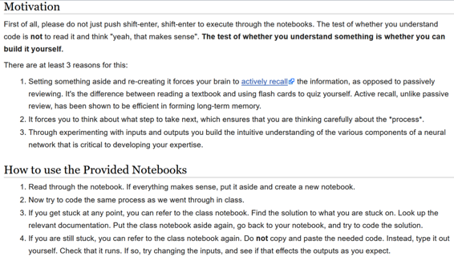


建立自己的盒子 [[16:50](https://youtu.be/Z0ssNAbe81M%3Ft%3D16m50s)] 


阅读论文 [[21:37](https://youtu.be/Z0ssNAbe81M%3Ft%3D21m37s)] 


每周，我们将实施一两篇论文。 左边是实现adam的纸张摘录（你还在电子表格中看到adam是一个excel公式）。 在学术论文中，人们喜欢使用希腊字母。 他们也讨厌重构，所以你经常会看到一个页面长的公式，当你仔细观察它时，你会发现相同的子方程出现了8次。 学术论文有点奇怪，但最终，它是研究界传达他们的发现的方式，所以我们需要学习阅读它们。 一件好事是拿一篇论文，努力去理解它，然后写一个博客，用代码和普通英语解释它。 许多这样做的人最终获得了相当多的关注，最终获得了一些相当不错的工作机会等等，因为这是一项非常有用的技能，能够表明你可以理解这些论文，在代码中实现它们并解释他们用英语。 很难阅读或理解你无法发声的东西。 所以学习希腊字母！


更多机会 [[25:29](https://youtu.be/Z0ssNAbe81M%3Ft%3D25m29s)] 


第2部分的主题 [[30:12](https://youtu.be/Z0ssNAbe81M%3Ft%3D30m12s)] 


**生成模型**

在第1部分中，我们的神经网络的输出通常是一个数字或类别，在其他地方，第2部分中很多东西的输出将是很多东西，如：

*   图像中每个对象的左上角和右下角位置以及该对象的位置
*   完整的图片，包含该图片中每个像素的类别
*   增强的输入图像的超分辨率版本
*   将整个原始输入段翻译成法语

我们将要查看的大部分数据将是文本或图像数据。

我们将根据数据集中的对象数量和每个对象的大小来查看一些较大的数据集。 对于那些使用有限计算资源的人，请不要让它让你失望。 随意用更小更简单的东西替换它。 杰里米实际上写了大量的课程，没有互联网（在狮子座点）15英寸的表面书。 几乎所有这些课程都适用于笔记本电脑上的Windows。 你始终可以使用较小的批量大小，数据集的缩减版本。 但是，如果你拥有这些资源，那么当数据集可用时，你将获得更好的结果。

* * *

#### 物体检测 [[35:32](https://youtu.be/Z0ssNAbe81M%3Ft%3D35m32s)] 

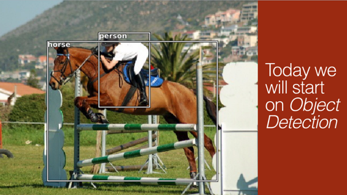

与我们习惯的两个主要区别：

**我们有很多东西要分类。**

这不是闻所未闻的 - 我们在第1部分的行星卫星数据中做到了这一点。

**2.围绕我们分类的边界框。**

边界框有一个非常具体的定义，它是一个矩形，矩形的对象完全适合它，但它不比它必须大。

我们的工作是获取以这种方式标记的数据和未标记的数据，以生成对象的类和每个对象的边界框。 需要注意的一点是，标记此类数据通常更为昂贵 [[37:09](https://youtu.be/Z0ssNAbe81M%3Ft%3D37m09s)] 。 对于对象检测数据集，给注释器一个对象类列表，并要求它们查找图片中任何类型的每一个以及它们的位置。 在这种情况下，为什么没有标记树或跳跃？ 这是因为对于这个特定的数据集，它们不是要求注释者找到的类之一，因此不是这个特定问题的一部分。

#### 阶段 [[38:33](https://youtu.be/Z0ssNAbe81M%3Ft%3D38m33s)] ：

1.  对每个图像中的最大对象进行分类。
2.  找到每个图像的最大对象的位置。
3.  最后，我们将同时尝试两者（即标记它是什么以及图片中最大对象的位置）。

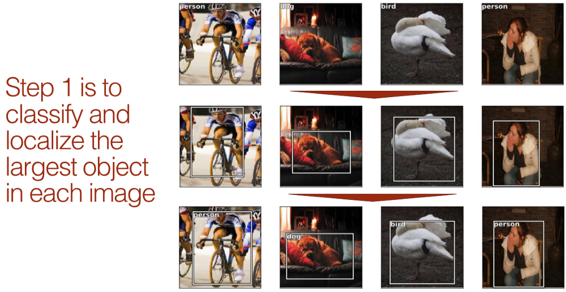

#### [帕斯卡笔记本](https://github.com/fastai/fastai/blob/master/courses/dl2/pascal.ipynb)  [[40:06](https://youtu.be/Z0ssNAbe81M%3Ft%3D40m06s)] 

```
 %matplotlib inline  %reload_ext autoreload  %autoreload 2 
```

```
 from fastai.conv_learner import *  from fastai.dataset import * 
```

```
 from pathlib import Path  import json  from PIL import ImageDraw, ImageFont  from matplotlib import patches, patheffects  # torch.cuda.set_device(1) 
```

你可能会发现留下一行`torch.cuda.set_device(1)` ，如果你只有一个GPU，则会出现错误。 这是你在拥有多个GPU时选择GPU的方式，因此只需将其设置为零或完全取出该行即可。

有许多标准物体检测数据集，就像ImageNet是标准物体分类数据集 [[41:12](https://youtu.be/Z0ssNAbe81M%3Ft%3D41m12s)] 。 经典的ImageNet等效物是Pascal VOC。

#### 帕斯卡VOC

我们将查看[Pascal VOC](http://host.robots.ox.ac.uk/pascal/VOC/)数据集。 这很慢，所以你可能更喜欢从[这个镜像](https://pjreddie.com/projects/pascal-voc-dataset-mirror/)下载。 从2007年到2012年，有两个不同的竞争/研究数据集。我们将使用2007版本。 你可以使用更大的2012来获得更好的结果，甚至可以将它们组合起来 [[42:25](https://youtu.be/Z0ssNAbe81M%3Ft%3D42m25s)] （但是如果这样做，请注意避免验证集之间的数据泄漏）。

与之前的课程不同，我们使用python 3标准库`pathlib`来实现路径和文件访问。 请注意，它返回特定于操作系统的类（在Linux上， `PosixPath` ），因此你的输出可能看起来有点不同 [[44:50](https://youtu.be/Z0ssNAbe81M%3Ft%3D44m50s)] 。 将路径作为输入的大多数库可以采用pathlib对象 - 尽管有些（如`cv2` ）不能，在这种情况下，你可以使用`str()`将其转换为字符串。

[Pathlib备忘单](http://pbpython.com/pathlib-intro.html)

```
 PATH = Path('data/pascal')  list(PATH.iterdir()) 
```

```
 _[PosixPath('data/pascal/PASCAL_VOC.zip'),_  _PosixPath('data/pascal/VOCdevkit'),_  _PosixPath('data/pascal/VOCtrainval_06-Nov-2007.tar'),_  _PosixPath('data/pascal/pascal_train2012.json'),_  _PosixPath('data/pascal/pascal_val2012.json'),_  _PosixPath('data/pascal/pascal_val2007.json'),_  _PosixPath('data/pascal/pascal_train2007.json'),_  _PosixPath('data/pascal/pascal_test2007.json')]_ 
```

**关于发电机[** [**43:23**](https://youtu.be/Z0ssNAbe81M%3Ft%3D43m23s) **]：**

生成器是Python 3中可以迭代的东西。

*   `for i in PATH.iterdir(): print(i)`
*   `[i for i in PATH.iterdir()]` （列表理解）
*   `list(PATH.iterdir())` （将生成器转换为列表）

事物通常返回生成器的原因是，如果目录中有1000万个项目，则不一定需要1000万个列表。 Generator让你“懒洋洋地”做事。

#### 加载注释

除了图像之外，还有_注释_ - 显示每个对象所在位置的_边界框_ 。 这些是手工贴上的。 原始版本采用XML  [[47:59](https://youtu.be/Z0ssNAbe81M%3Ft%3D47m59s)] ，现在有点[难以使用](https://youtu.be/Z0ssNAbe81M%3Ft%3D47m59s) ，因此我们使用了最新的JSON版本，你可以从此[链接](https://storage.googleapis.com/coco-dataset/external/PASCAL_VOC.zip)下载。

你可以在此处看到`pathlib`如何包含打开文件的功能（以及许多其他功能）。

```
 trn_j = json.load((PATH/'pascal_train2007.json').open())  trn_j.keys() 
```

```
 _dict_keys(['images', 'type', 'annotations', 'categories'])_ 
```

这里`/`不是除以它是路径斜线 [[45:55](https://youtu.be/Z0ssNAbe81M%3Ft%3D45m55s)] 。 `PATH/`让你的孩子走在那条路上。 `PATH/'pascal_train2007.json'`返回一个具有`open`方法的`pathlib`对象。 此JSON文件不包含图像，而是包含边界框和对象的类。

```
 IMAGES,ANNOTATIONS,CATEGORIES = ['images', 'annotations',  'categories'] 
```

```
 **trn_j[IMAGES]** [:5] 
```

```
 _[{'file_name': '000012.jpg', 'height': 333, 'id': 12, 'width': 500}, {'file_name': '000017.jpg', 'height': 364, 'id': 17, 'width': 480}, {'file_name': '000023.jpg', 'height': 500, 'id': 23, 'width': 334}, {'file_name': '000026.jpg', 'height': 333, 'id': 26, 'width': 500}, {'file_name': '000032.jpg', 'height': 281, 'id': 32, 'width': 500}]_ 
```

#### 注释 [[49:16](https://youtu.be/Z0ssNAbe81M%3Ft%3D49m16s)] 

*   `bbox` ：列，行（左上角），高度，宽度
*   `image_id` ：你可以用`trn_j[IMAGES]` （上面）加入这个来查找`file_name`等。
*   `category_id` ：见`trn_j[CATEGORIES]` （下）
*   `segmentation` ：多边形分割（我们将使用它们）
*   `ignore` ：我们将忽略忽略标志
*   `iscrowd` ：指定它是该对象的一群，而不仅仅是其中一个

```
 **trn_j[ANNOTATIONS]** [:2] 
```

```
 _[{'area': 34104,_  _'bbox': [155, 96, 196, 174],_  _'category_id': 7,_  _'id': 1,_  _'ignore': 0,_  _'image_id': 12,_  _'iscrowd': 0,_  _'segmentation': [[155, 96, 155, 270, 351, 270, 351, 96]]},_  _{'area': 13110,_  _'bbox': [184, 61, 95, 138],_  _'category_id': 15,_  _'id': 2,_  _'ignore': 0,_  _'image_id': 17,_  _'iscrowd': 0,_  _'segmentation': [[184, 61, 184, 199, 279, 199, 279, 61]]}]_ 
```

#### 分类 [[50:15](https://youtu.be/Z0ssNAbe81M%3Ft%3D50m15s)] 

```
 **trn_j[CATEGORIES]** [:4] 
```

```
 _[{'id': 1, 'name': 'aeroplane', 'supercategory': 'none'},_  _{'id': 2, 'name': 'bicycle', 'supercategory': 'none'},_  _{'id': 3, 'name': 'bird', 'supercategory': 'none'},_  _{'id': 4, 'name': 'boat', 'supercategory': 'none'}]_ 
```

使用常量而不是字符串是有帮助的，因为我们得到制表符并且不会输错。

```
 FILE_NAME,ID,IMG_ID,CAT_ID,BBOX =  'file_name','id','image_id','category_id','bbox' 
```

```
 cats = dict((o[ID], o['name']) for o in trn_j[CATEGORIES])  trn_fns = dict((o[ID], o[FILE_NAME]) for o in trn_j[IMAGES])  trn_ids = [o[ID] for o in trn_j[IMAGES]] 
```

[**旁注**](https://youtu.be/Z0ssNAbe81M%3Ft%3D51m21s) **：** **当人们看到杰里米在看过他的班级时实时工作时，人们最评论的是什么[** [**51:21**](https://youtu.be/Z0ssNAbe81M%3Ft%3D51m21s) **]：**

“哇，你其实不知道你在做什么，对吗”。 他所做的99％的事情都不起作用，而有效的事情的一小部分最终会在这里结束。 他之所以提到这一点，是因为机器学习，特别是深度学习令人难以置信的沮丧 [[51:45](https://youtu.be/Z0ssNAbe81M%3Ft%3D51m45s)] 。 从理论上讲，你只需定义正确的损失函数和足够灵活的架构，然后按下列车即可完成。 但如果真的那么多，那么任何事情都不会花费任何时间。 问题是沿途的所有步骤直到它工作，它不起作用。 就像它直接进入无限，崩溃时张力大小不正确等等。他会努力向你展示一些调试技巧，但它是最难教的东西之一。 它需要的主要是坚韧。 超级有效的人和那些似乎没有走得太远的人之间的区别从来都不是智力。 它始终是坚持它 - 基本上永不放弃。 这种深度学习尤为重要，因为你没有得到连续的奖励周期 [[53:04](https://youtu.be/Z0ssNAbe81M%3Ft%3D53m04s)] 。 这是一个不变的工作，不起作用，不起作用，直到最终它这样做它有点烦人。

#### 我们来看看图像 [[53:45](https://youtu.be/Z0ssNAbe81M%3Ft%3D53m45s)] 

```
 list((PATH/'VOCdevkit'/'VOC2007').iterdir()) 
```

```
 _[PosixPath('data/pascal/VOCdevkit/VOC2007/JPEGImages'),_  _PosixPath('data/pascal/VOCdevkit/VOC2007/SegmentationObject'),_  _PosixPath('data/pascal/VOCdevkit/VOC2007/ImageSets'),_  _PosixPath('data/pascal/VOCdevkit/VOC2007/SegmentationClass'),_  _PosixPath('data/pascal/VOCdevkit/VOC2007/Annotations')]_ 
```

```
 JPEGS = 'VOCdevkit/VOC2007/JPEGImages' 
```

```
 IMG_PATH = PATH/JPEGS  list(IMG_PATH.iterdir())[:5] 
```

```
 _[PosixPath('data/pascal/VOCdevkit/VOC2007/JPEGImages/007594.jpg'),_  _PosixPath('data/pascal/VOCdevkit/VOC2007/JPEGImages/005682.jpg'),_  _PosixPath('data/pascal/VOCdevkit/VOC2007/JPEGImages/005016.jpg'),_  _PosixPath('data/pascal/VOCdevkit/VOC2007/JPEGImages/001930.jpg'),_  _PosixPath('data/pascal/VOCdevkit/VOC2007/JPEGImages/007666.jpg')]_ 
```

#### 创建字典（关键字：图像ID，值：注释） [[54:16](https://youtu.be/Z0ssNAbe81M%3Ft%3D54m16s)] 

每张图片都有一个唯一的ID。

```
 im0_d = trn_j[IMAGES][0]  im0_d[FILE_NAME],im0_d[ID] 
```

```
 ('000012.jpg', 12) 
```

只要你想拥有新密钥的默认字典条目 [[55:05](https://youtu.be/Z0ssNAbe81M%3Ft%3D55m05s)] ， [defaultdict就很有用](https://youtu.be/Z0ssNAbe81M%3Ft%3D55m05s) 。 如果你尝试访问不存在的键，它会神奇地使其自身存在，并且它将自身设置为等于你指定的函数的返回值（在本例中为`lambda:[]` ）。

在这里，我们创建一个从图像ID到注释列表的dict（边界框和类ID的元组）。

我们将VOC的高度/宽度转换为左上/右下，并将x / y坐标切换为与numpy一致。 如果给定的数据集是蹩脚的格式，请花一些时间使事情保持一致，并按照你希望的方式制作它们 [[1:01:24](https://youtu.be/Z0ssNAbe81M%3Ft%3D1h1m24s)] 

```
 trn_anno = **collections.defaultdict** (lambda:[])  for o in trn_j[ANNOTATIONS]:  if not o['ignore']:  bb = o[BBOX]  bb = np.array([bb[1], bb[0], bb[3]+bb[1]-1, bb[2]+bb[0]-1])  trn_anno[o[IMG_ID]] **.append** ((bb,o[CAT_ID]))  len(trn_anno) 
```

```
 _2501_ 
```

**变量命名，编码风格哲学等[** [**56:15**](https://youtu.be/Z0ssNAbe81M%3Ft%3D56m15s) **-** [**59:33**](https://youtu.be/Z0ssNAbe81M%3Ft%3D59m33s) **]**

**例1**

*   `[ 96, 155, 269, 350]` [96,155,269,350](https://youtu.be/Z0ssNAbe81M%3Ft%3D59m53s)] ：一个边界框 [[59:53](https://youtu.be/Z0ssNAbe81M%3Ft%3D59m53s)] 。 如上所述，当我们创建边界框时，我们做了几件事。 首先是我们切换x和y坐标。 其原因在于计算机视觉领域，当你说“我的屏幕是640×480”时，它是高度的宽度。 或者，数学世界，当你说“我的数组是640乘480”时，它是逐列的。 所以枕头图像库倾向于按宽度或逐行逐行进行处理，而numpy则是相反的方式。 第二个是我们要通过描述左上角xy坐标和右下角xy坐标来做事情 - 而不是x，y，高度，宽度。
*   `7` ：班级标签/类别

```
 im0_a = im_a[0]; im0_a 
```

```
 _[(array(_ **_[ 96, 155, 269, 350]_** _),_ **_7_** _)]_ 
```

```
 im0_a = im_a[0]; im0_a 
```

```
 _(array([ 96, 155, 269, 350]), 7)_ 
```

```
 cats[7] 
```

```
 _'car'_ 
```

**例2**

```
 trn_anno[17] 
```

```
 _[(array([61, 184, 198, 278]), 15), (array([77, 89, 335, 402]), 13)]_ 
```

```
 cats[15],cats[13] 
```

```
 _('person', 'horse')_ 
```

有些lib采用VOC格式的边界框，所以这让我们在需要时转换回来 [[1:02:23](https://youtu.be/Z0ssNAbe81M%3Ft%3D1h2m23s)] ：

```
 def bb_hw(a): return np.array([a[1],a[0],a[3]-a[1],a[2]-a[0]]) 
```

我们将使用fast.ai的`open_image`来显示它：

```
 im = open_image(IMG_PATH/im0_d[FILE_NAME]) 
```

#### **集成开发环境（IDE）简介[** [**1:03:13**](https://youtu.be/Z0ssNAbe81M%3Ft%3D1h3m13s) **]**

你可以使用[Visual Studio Code](https://code.visualstudio.com/) （vscode - 最新版本的Anaconda附带的开源编辑器，或者可以单独安装），或者大多数编辑器和IDE，来查找有关`open_image`函数的所有信息。 vscode要知道的事情：

*   命令调色板（ `Ctrl-shift-p` ）
*   选择口译员（适用于fastai env）
*   选择终端shell
*   转到符号（ `Ctrl-t` ）
*   查找参考文献（ `Shift-F12` ）
*   转到定义（ `F12` ）
*   回去（ `alt-left` ）
*   查看文档
*   隐藏侧边栏（ `Ctrl-b` ）
*   禅模式（ `Ctrl-k,z` ）

如果你像我一样在Mac上使用PyCharm专业版：

*   命令调色板（ `Shift-command-a` ）
*   选择解释器（用于fastai env）（ `Shift-command-a`然后查找“interpreter”）
*   选择终端外壳（ `Option-F12` ）
*   转到符号（ `Option-command-shift-n`并键入类，函数等的名称。如果它在camelcase或下划线中分隔，则可以键入每个位的前几个字母）
*   查找引用（ `Option-F7` `Option-command-⬇︎` ），下一次出现（ `Option-command-⬇︎` ），上一次出现（ `Option-command-⬆︎` ）
*   转到定义（ `Command-b` ）
*   返回（ `Option-command-⬅︎` ）
*   查看文档
*   Zen模式（ `Control-`-4–2`或搜索“distraction free mode”）

#### 我们来谈谈open_image  [[1:10:52](https://youtu.be/Z0ssNAbe81M%3Ft%3D1h10m52s)] 

Fastai使用OpenCV。 TorchVision使用PyTorch张量进行数据增强等。许多人使用Pillow `PIL` 。 Jeremy对所有这些进行了大量测试，他发现OpenCV比TorchVision快5到10倍。 对于[行星卫星图像竞争](https://www.kaggle.com/c/planet-understanding-the-amazon-from-space)  [[1:11:55](https://youtu.be/Z0ssNAbe81M%3Ft%3D1h11m55s)] ，TorchVision速度[太快](https://youtu.be/Z0ssNAbe81M%3Ft%3D1h11m55s) ，因为他们只进行了大量的数据增强，因此只能获得25％的GPU利用率。 Profiler显示它全部在TorchVision中。

枕头速度要快得多，但它不如OpenCV快，而且也不像线程安全 [[1:12:19](https://youtu.be/Z0ssNAbe81M%3Ft%3D1h12m19s)] 。 Python有这个称为全局解释器锁（GIL）的东西，这意味着两个线程不能同时做pythonic事情 - 这使得Python成为现代编程的一种糟糕的语言，但我们坚持使用它。 OpenCV发布了GIL。 fast.ai库如此之快的原因之一是因为它不像其他库那样使用多个处理器来进行数据增强 - 它实际上是多线程的。 它可以做多线程的原因是因为它使用OpenCV。 不幸的是，OpenCV有一个难以理解的API，文档有点迟钝。 这就是杰里米试图做到这一点的原因，以至于没有人使用fast.ai需要知道它正在使用OpenCV。 你无需知道要打开图像的标志。 你不需要知道如果读取失败，则不会显示异常 - 它会以静默方式返回`None` 。

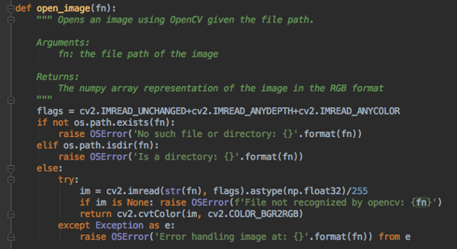

不要开始使用PyTorch进行数据增强或开始引入Pillow - 你会发现突然发生的事情变得非常缓慢或多线程不再起作用。 你应该坚持使用OpenCV进行处理 [[1:14:10](https://youtu.be/Z0ssNAbe81M%3Ft%3D1h14m10s)] 

#### 更好地使用Matplotlib  [[1:14:45](https://youtu.be/Z0ssNAbe81M%3Ft%3D1h14m45s)] 

Matplotlib之所以如此命名是因为它最初是Matlab绘图库的克隆。 不幸的是，Matlab的绘图库并不是很好，但当时，这是每个人都知道的。 在某些时候，matplotlib人员意识到并添加了第二个API，这是一个面向对象的API。 不幸的是，因为最初学习matplotlib的人没有学过OO API，所以他们教会了下一代人的旧Matlab风格的API。 现在没有很多示例或教程使用更好，更容易理解和更简单的OO API。 因为绘图在深度学习中非常重要，所以我们将在本课程中学习的内容之一是如何使用此API。

**技巧1：plt.subplots [** [**1:16:00**](https://youtu.be/Z0ssNAbe81M%3Ft%3D1h16m) **]**

无论你是否有多`plt.subplots`图，Matplotlib的`plt.subplots`都是创建图的非常有用的包装器。 请注意，Matplotlib有一个可选的面向对象的API，我认为它更容易理解和使用（尽管很少有在线使用它的例子！）

```
 def show_img(im, figsize=None, ax=None):  if not ax: fig,ax = plt.subplots(figsize=figsize)  ax.imshow(im)  ax.get_xaxis().set_visible(False)  ax.get_yaxis().set_visible(False)  return ax 
```

它返回两件事 - 你可能不关心第一件事（图对象），第二件是Axes对象（或者它们的数组）。 基本上你曾经说过`plt.`任何地方`plt.` 什么，你现在说`ax.` 什么，它现在将绘制到特定的子图。 当你想要绘制多个绘图以便可以相互比较时，这非常有用。

**技巧2：无论背景颜色如何都可见文字[** [**1:17:59**](https://youtu.be/Z0ssNAbe81M%3Ft%3D1h17m59s) **]**

无论背景如何，使文本可见的简单但很少使用的技巧是使用带有黑色轮廓的白色文本，反之亦然。 这是在matplotlib中如何做到这一点。

```
 def draw_outline(o, lw):  o.set_path_effects([patheffects.Stroke(  linewidth=lw, foreground='black'), patheffects.Normal()]) 
```

请注意，参数列表中的`*`是[splat运算符](https://stackoverflow.com/questions/5239856/foggy-on-asterisk-in-python) 。 在这种情况下，与写出`b[-2],b[-1]`相比，这是一个小捷径。

```
 def draw_rect(ax, b):  patch = ax.add_patch(patches.Rectangle(b[:2], *b[-2:],  fill=False, edgecolor='white', lw=2))  draw_outline(patch, 4) 
```

```
 def draw_text(ax, xy, txt, sz=14):  text = ax.text(*xy, txt, verticalalignment='top', color='white',  fontsize=sz, weight='bold')  draw_outline(text, 1) 
```

```
 ax = show_img(im)  b = bb_hw(im0_a[0])  draw_rect(ax, b)  draw_text(ax, b[:2], cats[im0_a[1]]) 
```

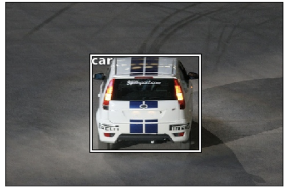

**打包它[** [**1:21:20**](https://youtu.be/Z0ssNAbe81M%3Ft%3D1h21m20s) **]**

```
 **def** draw_im(im, ann):  ax = show_img(im, figsize=(16,8))  **for** b,c **in** ann:  b = bb_hw(b)  draw_rect(ax, b)  draw_text(ax, b[:2], cats[c], sz=16) 
```

```
 **def** draw_idx(i):  im_a = trn_anno[i]  im = open_image(IMG_PATH/trn_fns[i])  print(im.shape)  draw_im(im, im_a) 
```

```
 draw_idx(17) 
```

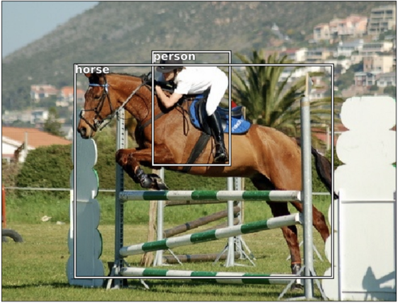

当你使用新数据集时，达到可以快速探索它的点是值得的。

### 最大的物品分类 [[1:22:57](https://youtu.be/Z0ssNAbe81M%3Ft%3D1h22m57s)] 

不要试图一下子解决所有问题，而是让我们不断进步。 我们知道如何找到每个图像中最大的对象并对其进行分类，所以让我们从那里开始。 Jeremy每天参加Kaggle比赛的时间是半小时 [[1:24:00](https://youtu.be/Z0ssNAbe81M%3Ft%3D1h24m)] 。 在那个半小时结束时，提交一些东西并尝试使它比昨天好一点。

我们需要做的第一件事是遍历图像中的每个边界框并获得最大的边界框。 _lambda函数_只是一种定义内联匿名函数的方法。 在这里，我们用它来描述如何为每个图像排序注释 - 通过限制框大小（降序）。

我们从右下角减去左上角并乘以（ `np.product` ）值得到一个区域`lambda x: np.product(x[0][-2:]-x[0][:2])` 。

```
 **def** get_lrg(b):  if not b: raise Exception()  b = sorted(b, key=lambda x: np.product(x[0][-2:]-x[0][:2]),  reverse=True)  **return** b[0] 
```

**字典理解[** [**1:27:04**](https://youtu.be/Z0ssNAbe81M%3Ft%3D1h27m04s) **]**

```
 trn_lrg_anno = {a: get_lrg(b) for a,b in trn_anno.items()} 
```

现在我们有一个从图像id到单个边界框的字典 - 这个图像的最大值。

```
 b,c = trn_lrg_anno[23]  b = bb_hw(b)  ax = show_img(open_image(IMG_PATH/trn_fns[23]), figsize=(5,10))  draw_rect(ax, b)  draw_text(ax, b[:2], cats[c], sz=16) 
```

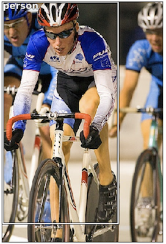

当你有任何处理管道 [[1:28:01](https://youtu.be/Z0ssNAbe81M%3Ft%3D1h28m1s)] 时，你需要查看每个阶段。 假设你第一次做的一切都是错的。

```
 (PATH/'tmp').mkdir(exist_ok=True)  CSV = PATH/'tmp/lrg.csv' 
```

通常，最简单的方法是简单地创建要建模的数据的CSV，而不是尝试创建自定义数据集 [[1:29:06](https://youtu.be/Z0ssNAbe81M%3Ft%3D1h29m06s)] 。 在这里，我们使用Pandas来帮助我们创建图像文件名和类的CSV。 `columns=['fn','cat']`因为字典没有订单而且列的顺序很重要。

```
 df = pd.DataFrame({'fn': [trn_fns[o] for o in trn_ids],  'cat': [cats[trn_lrg_anno[o][1]] for o in trn_ids]},  columns=['fn','cat'])  df.to_csv(CSV, index=False) 
```

```
 f_model = resnet34  sz=224  bs=64 
```

从这里开始就像Dogs vs Cats！

```
 tfms = tfms_from_model(f_model, sz, aug_tfms=transforms_side_on,  crop_type= **CropType.NO** )  md = ImageClassifierData.from_csv(PATH, JPEGS, CSV, tfms=tfms) 
```

#### **我们来看看[** [**1:30:48**](https://youtu.be/Z0ssNAbe81M%3Ft%3D1h30m48s) **]**

有一点不同的是`crop_type` 。 在fast.ai中创建224 x 224图像的默认策略是首先调整它的大小，使最小边为224.然后在训练期间采用随机平方裁剪。 在验证期间，除非我们使用数据增强，否则我们采用中心作物。

对于边界框，我们不希望这样做，因为与图像网不同，我们关心的东西几乎在中间并且非常大，对象检测中的很多东西都很小并且接近边缘。 通过将`crop_type`设置为`CropType.NO` ，它将不会裁剪，因此，为了使其成为正方形，它会使它 [[1:32:09](https://youtu.be/Z0ssNAbe81M%3Ft%3D1h32m9s)] 。 一般来说，如果你裁剪而不是挤压，许多计算机视觉模型的效果会好一点，但是如果你压扁它们仍然可以很好地工作。 在这种情况下，我们绝对不想裁剪，所以这完全没问题。

```
 x,y=next(iter(md.val_dl))  show_img(md.val_ds.denorm(to_np(x))[0]); 
```


#### 数据加载器 [[1:33:04](https://youtu.be/Z0ssNAbe81M%3Ft%3D1h33m4s)] 

你已经知道在模型数据对象内部，我们有很多东西，包括训练数据加载器和训练数据集。 关于数据加载器的主要知识是它是一个迭代器，每次你从中获取下一个东西的迭代时，你得到一个迷你批处理。 你获得的迷你批量是你要求的任何大小，默认情况下批量大小为64.在Python中，你从迭代器中获取下一个东西的方式是下`next(md.trn_dl)`但你不能只做那。 你不能说这是因为你需要说“现在开始一个新迭代”。 通常，不仅在PyTorch中，而且对于任何Python迭代器，你都需要说“请从序列的开始处开始”。 你这么说就是使用`iter(md.trn_dl)`来获取`iter(md.trn_dl)`一个迭代器 - 特别是我们稍后会学到的，这意味着这个类必须定义一个`__iter__`方法，它返回一些不同的对象，然后有一个`__next__`方法。

如果你想只抓一个批处理，你就是这样做的（ `x` ：自变量， `y` ：因变量）：

```
 x,y=next(iter(md.val_dl)) 
```

我们不能直接发送到`show_image`  [[1:35:30](https://youtu.be/Z0ssNAbe81M%3Ft%3D1h35m30s)] 。 例如， `x`不是一个numpy数组，不是在CPU上，并且形状都是错误的（ `3x224x224` ）。 此外，它们不是介于0和1之间的数字，因为所有标准的ImageNet预训练模型都希望我们的数据被归一化为零均值和1个标准差。

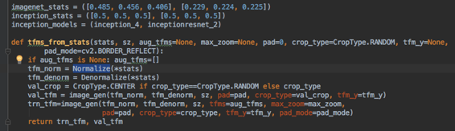

如你所见，已经对输入做了大量事情，以便将其传递给预先训练的模型。 因此我们有一个名为`denorm` for denormalize的函数，并且还修复了维度顺序等等。因为非规范化取决于变换 [[1:37:52](https://youtu.be/Z0ssNAbe81M%3Ft%3D1h37m52s)] ，并且数据集知道使用什么变换来创建它，所以这就是你必须要做的事情`md.val_ds.denorm`并将其转换为numpy数组后传递小批量：

```
 show_img(md.val_ds.denorm(to_np(x))[0]); 
```

#### 使用ResNet34进行训练 [[1:38:36](https://youtu.be/Z0ssNAbe81M%3Ft%3D1h38m36s)] 

```
 learn = ConvLearner.pretrained(f_model, md, metrics=[accuracy])  learn.opt_fn = optim.Adam 
```

```
 lrf=learn.lr_find(1e-5,100)  learn.sched.plot() 
```

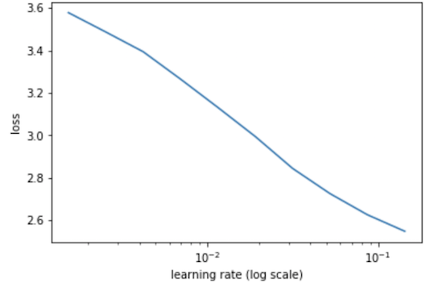

我们故意删除前几个点和最后几个点 [[1:38:54](https://youtu.be/Z0ssNAbe81M%3Ft%3D1h38m54s)] ，因为通常最后几个点向无限远射高，你看不到任何东西，所以这通常是一个好主意。 但是当你的迷你批次非常少时，这不是一个好主意。 当你的LR查找器图形如上所示时，你可以在每一端要求更多点（你也可以使批量大小非常小）：

```
 learn.sched.plot(n_skip=5, n_skip_end=1) 
```

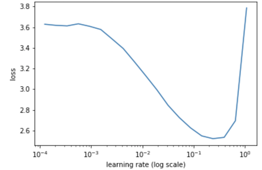

```
 lr = 2e-2  learn.fit(lr, 1, cycle_len=1) 
```

```
 _epoch trn_loss val_loss accuracy_  _0 1.280753 0.604127 0.806941_ 
```

解冻几层：

```
 lrs = np.array([lr/1000,lr/100,lr])  learn.freeze_to(-2)  learn.fit(lrs/5, 1, cycle_len=1) 
```

```
 _epoch trn_loss val_loss accuracy_  _0 0.780925 0.575539 0.821064_ 
```

解冻整个事情：

```
 learn.unfreeze()  learn.fit(lrs/5, 1, cycle_len=2) 
```

```
 epoch trn_loss val_loss accuracy  0 0.676254 0.546998 0.834285  1 0.460609 0.533741 0.833233 
```

精度没有太大提高 - 因为许多图像有多个不同的对象，所以不可能准确。

#### 让我们来看看结果 [[1:40:48](https://youtu.be/Z0ssNAbe81M%3Ft%3D1h40m48s)] 

```
 fig, axes = plt.subplots(3, 4, figsize=(12, 8))  for i,ax in enumerate(axes.flat):  ima=md.val_ds.denorm(x)[i]  b = md.classes[preds[i]]  ax = show_img(ima, ax=ax)  draw_text(ax, (0,0), b)  plt.tight_layout() 
```

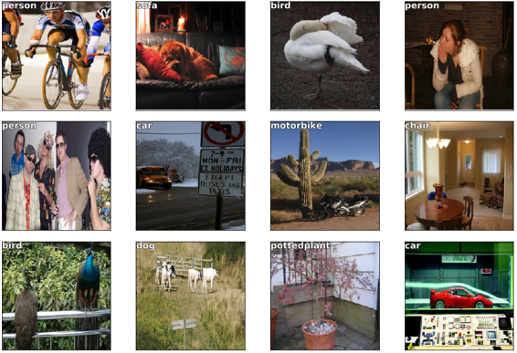

如何理解不熟悉的代码：

*   逐步运行每行代码，打印输入和输出。

**方法1**  [[1:42:28](https://youtu.be/Z0ssNAbe81M%3Ft%3D1h42m28s)] ：你可以获取循环的内容，复制它，在它上面创建一个单元格，粘贴它，取消缩进它，设置`i=0`并将它们全部放在不同的单元格中。

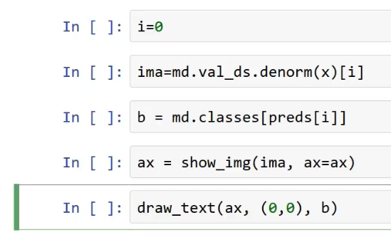

**方法2**  [[1:43:04](https://youtu.be/Z0ssNAbe81M%3Ft%3D1h43m4s)] ：使用Python调试器

你可以使用python调试器`pdb`来逐步执行代码。

*   `pdb.set_trace()`设置断点
*   `%debug` magic跟踪错误（发生异常后）

你需要知道的命令：

*   `h` （帮助）
*   `s` （步入）
*   `n` （下一行/步骤 - 你也可以点击输入）
*   `c` （继续下一个断点）
*   `u` （调用堆栈）
*   `d` （调用堆栈下）
*   `p` （打印） - 当有单个字母变量同时也是命令时强制打印。
*   `l` （列表） - 显示它上面和下面的行
*   `q` （退出） - 非常重要

**评论[** [**1:49:10**](https://youtu.be/Z0ssNAbe81M%3Ft%3D1h49m10s) **]：** `[IPython.core.debugger](http://ipython.readthedocs.io/en/stable/api/generated/IPython.core.debugger.html)` （在右下方）使它非常漂亮：

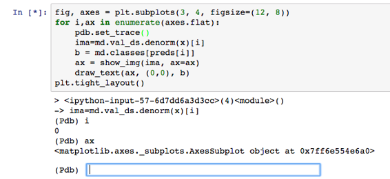

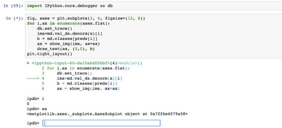

#### 创建边界框 [[1:52:51](https://youtu.be/Z0ssNAbe81M%3Ft%3D1h52m51s)] 

在最大的对象周围创建一个边界框可能看起来像你之前没有做过的事情，但实际上它完全是你以前做过的事情。 我们可以创建回归而不是分类神经网络。 分类神经网络是具有sigmoid或softmax输出的网络，我们使用交叉熵，二进制交叉熵或负对数似然丢失函数。 这基本上是什么使它成为分类器。 如果我们最后没有softmax或sigmoid并且我们使用均方误差作为损失函数，它现在是一个回归模型，它预测连续数而不是类别。 我们也知道我们可以像行星竞赛那样有多个输出（多重分类）。 如果我们结合这两个想法并进行多列回归怎么办？

这就是你在考虑差异化编程的地方。 它不像“我如何创建边界框模型？”但它更像是：

*   我们需要四个数字，因此，我们需要一个具有4个激活的神经网络
*   对于损失函数，什么是函数，当它较低时意味着四个数字更好？ 均方损失函数！

而已。 我们来试试吧。

#### 仅限Bbox  [[1:55:27](https://youtu.be/Z0ssNAbe81M%3Ft%3D1h55m27s)] 

现在我们将尝试找到最大对象的边界框。 这只是一个带有4个输出的回归。 因此，我们可以使用具有多个“标签”的CSV。 如果你记得第1部分要进行多标签分类，则多个标签必须以空格分隔，并且文件名以逗号分隔。

```
 BB_CSV = PATH/'tmp/bb.csv'  bb = np.array([trn_lrg_anno[o][0] for o in trn_ids])  bbs = [' '.join(str(p) for p in o) for o in bb] 
```

```
 df = pd.DataFrame({'fn': [trn_fns[o] for o in trn_ids],  'bbox': bbs}, columns=['fn','bbox'])  df.to_csv(BB_CSV, index=False) 
```

```
 BB_CSV.open().readlines()[:5] 
```

```
 _['fn,bbox\n',_  _'000012.jpg,96 155 269 350\n',_  _'000017.jpg,77 89 335 402\n',_  _'000023.jpg,1 2 461 242\n',_  _'000026.jpg,124 89 211 336\n']_ 
```

#### 训练 [[1:56:11](https://youtu.be/Z0ssNAbe81M%3Ft%3D1h56m11s)] 

```
 f_model=resnet34  sz=224  bs=64 
```

设置`continuous=True`告诉fastai这是一个回归问题，这意味着它不会对标签进行单热编码，并将使用MSE作为默认暴击。

请注意，我们必须告诉变换构造函数我们的标签是坐标，以便它可以正确处理变换。

此外，我们使用CropType.NO，因为我们想要将矩形图像“挤压”成正方形而不是中心裁剪，这样我们就不会意外地裁掉一些对象。 （这在像imagenet这样的问题上不是一个问题，因为有一个对象可以分类，而且它通常很大且位于中心位置）。

```
 tfms = tfms_from_model(f_model, sz, crop_type=CropType.NO,  **tfm_y=TfmType.COORD** )  md = ImageClassifierData.from_csv(PATH, JPEGS, BB_CSV, tfms=tfms,  **continuous=True** ) 
```

下周我们将看看`TfmType.COORD` ，但是现在，我们才意识到当我们进行缩放和数据增强时，需要在边界框中进行，而不仅仅是图像。

```
 x,y=next(iter(md.val_dl)) 
```

```
 ima=md.val_ds.denorm(to_np(x))[0]  b = bb_hw(to_np(y[0])); b 
```

```
 _array([ 49., 0., 131., 205.], dtype=float32)_ 
```

```
 ax = show_img(ima)  draw_rect(ax, b)  draw_text(ax, b[:2], 'label') 
```


#### 让我们根据ResNet34  [[1:56:57](https://youtu.be/Z0ssNAbe81M%3Ft%3D1h56m57s)] 创建一个卷积网：

fastai允许你使用`custom_head`在`custom_head`上添加自己的模块，而不是默认添加的自适应池和完全连接的网络。 在这种情况下，我们不想进行任何池化，因为我们需要知道每个网格单元的激活。

最后一层有4次激活，每个边界框坐标一次。 我们的目标是连续的，而不是分类的，因此使用的MSE损失函数不对模块输出执行任何sigmoid或softmax。

```
 head_reg4 = nn.Sequential(Flatten(), nn.Linear(25088,4))  learn = ConvLearner.pretrained(f_model, md, **custom_head** =head_reg4)  learn.opt_fn = optim.Adam  learn.crit = nn.L1Loss() 
```

*   `Flatten()` ：通常前一层在`7x7x512`中有7x7x512，因此将其展平为长度为2508的单个向量
*   `L1Loss`  [[1:58:22](https://youtu.be/Z0ssNAbe81M%3Ft%3D1h58m22s)] ：不是将平方误差相加，而是将误差的绝对值相加。 这通常是你想要的，因为加上平方误差确实会对过多的错误进行惩罚。 所以L1Loss通常更适合使用。

```
 learn.lr_find(1e-5,100)  learn.sched.plot(5) 
```

```
 78%|███████▊ | 25/32 [00:04<00:01, 6.16it/s, loss=395] 
```

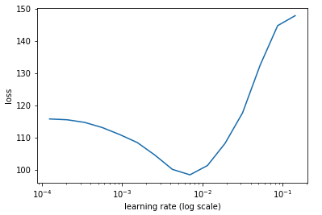

```
 lr = 2e-3  learn.fit(lr, 2, cycle_len=1, cycle_mult=2) 
```

```
 _epoch trn_loss val_loss_  _0 49.523444 34.764141_  _1 36.864003 28.007317_  _2 30.925234 27.230705_ 
```

```
 lrs = np.array([lr/100,lr/10,lr])  learn.freeze_to(-2)  lrf=learn.lr_find(lrs/1000)  learn.sched.plot(1) 
```

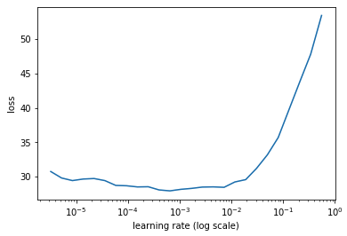

```
 learn.fit(lrs, 2, cycle_len=1, cycle_mult=2) 
```

```
 _epoch trn_loss val_loss_  _0 25.616161 22.83597_  _1 21.812624 21.387115_  _2 17.867176 20.335539_ 
```

```
 learn.freeze_to(-3)  learn.fit(lrs, 1, cycle_len=2) 
```

```
 _epoch trn_loss val_loss_  _0 16.571885 20.948696_  _1 15.072718 19.925312_ 
```

验证损失是绝对值的平均值，像素被关闭。

```
 learn.save('reg4') 
```

#### 看看结果 [[1:59:18](https://youtu.be/Z0ssNAbe81M%3Ft%3D1h59m18s)] 

```
 x,y = next(iter(md.val_dl))  learn.model.eval()  preds = to_np(learn.model(VV(x))) 
```

```
 fig, axes = plt.subplots(3, 4, figsize=(12, 8))  **for** i,ax **in** enumerate(axes.flat):  ima=md.val_ds.denorm(to_np(x))[i]  b = bb_hw(preds[i])  ax = show_img(ima, ax=ax)  draw_rect(ax, b)  plt.tight_layout() 
```


我们将在下周对此进行更多修改。 在本课之前，如果你被问到“你知道如何创建一个边界框模型吗？”，你可能会说“不，没有人教过我”。 但问题实际上是：

*   你能创建一个有4个连续输出的模型吗？ 是。
*   如果这4个输出接近4个其他数字，你能创建一个更低的损失函数吗？ 是

然后你就完成了。

当你向下看时，它开始看起来有点蹩脚 - 任何时候我们有多个对象。 这并不奇怪。 总的来说，它做得非常好。
